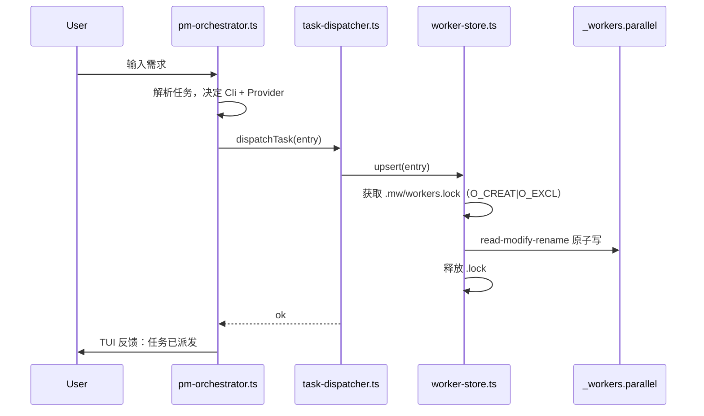
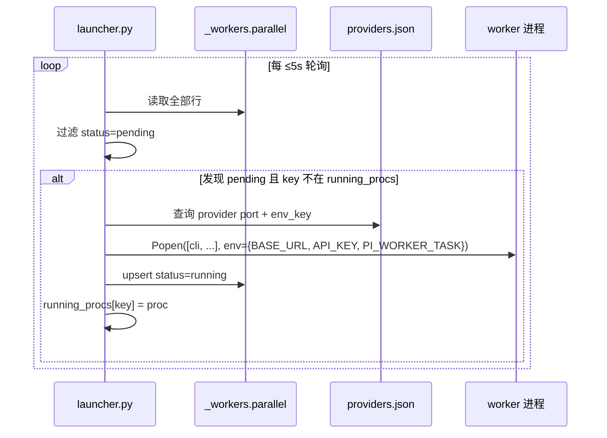
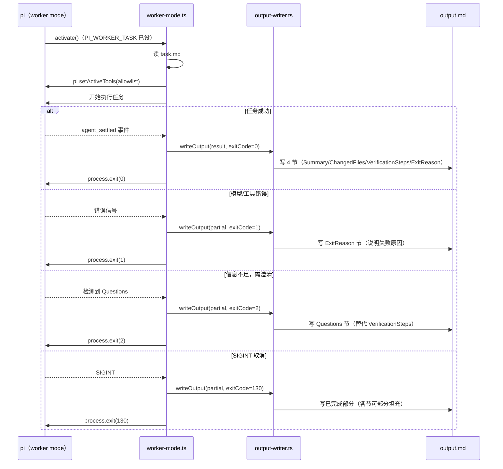
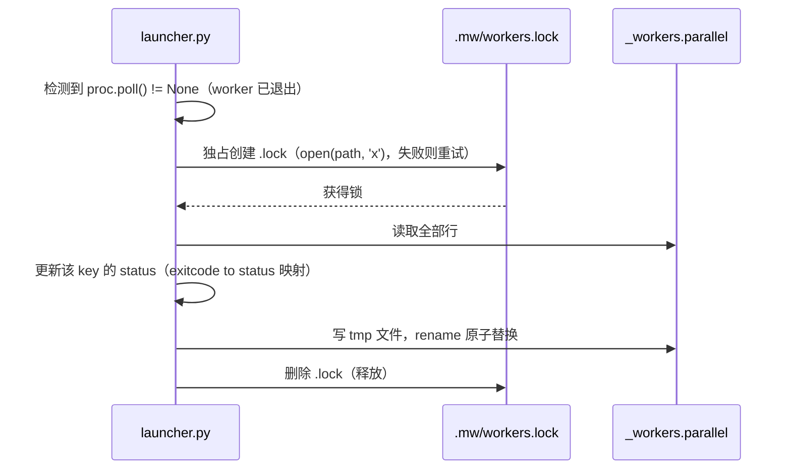
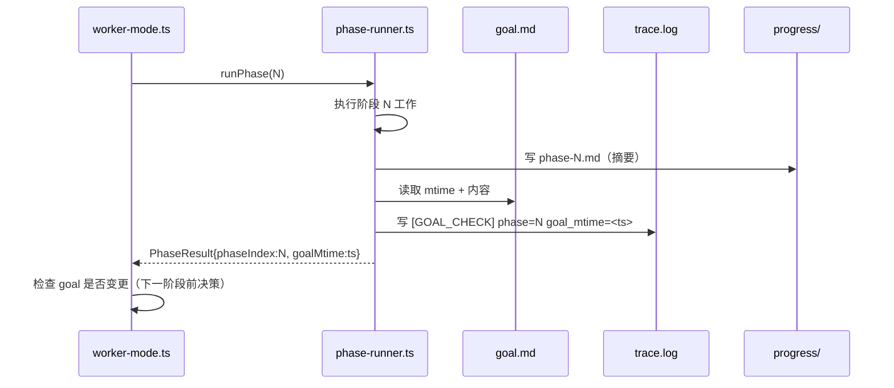
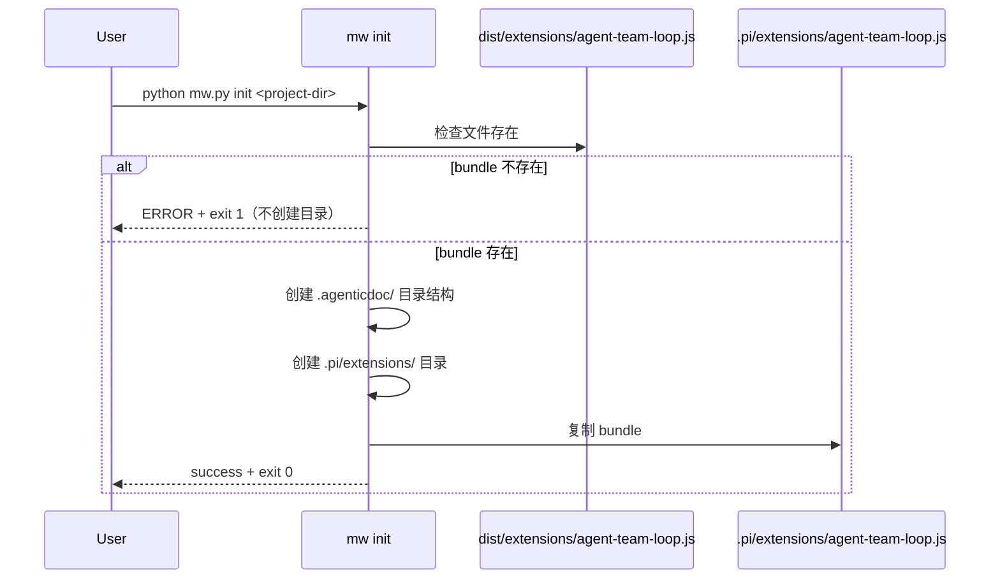
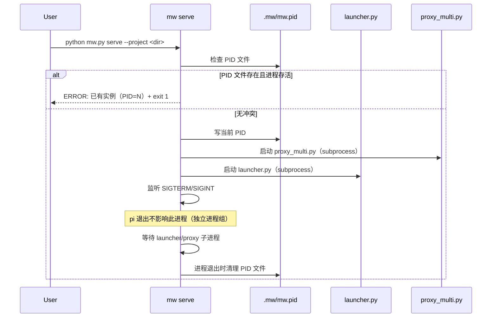

# Design: agent-team-loop

> Key: agent-team-loop
> Phase: DESIGN
> 生成时间: 2026-08-11

---

## §1 设计目标

将 spec.md AC-001~036 转化为可实施的模块边界、接口合约和数据流，
确保每个 AC 能通过 §7 验证计划中的 VC 得到覆盖。

---

## §2 模块结构图

```
packages/coding-agent/src/extensions/agent-team-loop/
├── index.ts                  ← Extension 入口，activate() 按环境选择模式
├── pm/
│   ├── pm-orchestrator.ts    ← PM Agent 主协调器（goal elicitation + task lifecycle）
│   ├── state-manager.ts      ← pm-state.md 读写 + Phase 枚举校验
│   ├── task-dispatcher.ts    ← 写 _workers.parallel（派发任务）
│   ├── goal-reader.ts        ← goal.md 读取 + 多轮对话 elicitation
│   └── ui-bridge.ts          ← pi TUI 命令注册（/pm-key）+ 结果展示
├── worker/
│   ├── worker-mode.ts        ← Worker mode 主协调器
│   ├── phase-runner.ts       ← 多阶段执行 + progress/phase-N.md 写入
│   └── output-writer.ts      ← output.md 四节写入 + exit code 映射
└── shared/
    ├── index-store.ts        ← _index.parallel 读写（AgenticTask 格式兼容）
    ├── worker-store.ts       ← _workers.parallel 读写（7 列格式，含 .lock 文件锁）
    └── file-lock.ts          ← 跨平台文件锁（O_CREAT|O_EXCL 独占创建）

packages/coding-agent/src/extensions/agent-team-loop/ → build →
dist/extensions/agent-team-loop.js (单文件预编译 bundle，无外部 npm 依赖)

mw.py（项目根）
├── 子命令: init / serve / start / stop / status
└── 委托给 packages/multi-workers/
    ├── launcher.py           ← 轮询 _workers.parallel + spawn worker + status 更新
    └── proxy_multi.py        ← 多端口 LLM 路由（timi-proxy-cli）
```

---

## §3 组件职责

### 3.1 mw.py（Python CLI）

正确包路径：`packages/coding-agent/src/extensions/agent-team-loop/`

| 子命令 | 职责 |
|--------|------|
| `mw init <project-dir>` | 创建目录结构；从 `dist/extensions/agent-team-loop.js` 复制到 `.pi/extensions/`；引导 goal.md 对话（AC-020, AC-036） |
| `mw serve --project <dir>` | 前台启动后台服务（管理 launcher.py + proxy_multi.py）；写 PID 文件；防重复实例（AC-034, AC-035） |
| `mw start --project <dir>` | 后台 detach 模式启动（等同于 `mw serve &`） |
| `mw stop --project <dir>` | 读 PID 文件，发 SIGTERM，清理 PID |
| `mw status --project <dir>` | 读 PID 文件，检查进程存活，输出状态 |

### 3.2 launcher.py（由 mw serve 管理）

- 轮询 `_workers.parallel`，间隔 ≤ 5 秒（AC-001）
- 从 `providers.json` 查询端口 + env var 名称（AC-024）
- spawn worker 子进程（subprocess.Popen，禁止 shell=True，AC-003/023）
- 维护 `running_procs`，防重复 spawn（AC-008），支持 `--max-workers`（AC-007）
- worker 退出后更新 `_workers.parallel` status（AC-005, AC-006）
- `--dry-run` 模式：输出命令不 spawn（AC-009, AC-025）

### 3.3 proxy_multi.py（由 mw serve 管理）

- 三端口 `LocalProxyServer`（7001/7002/7003）（AC-013）
- 通过 `StableRelay` / `ProxyWatchdog` 管理上游连接

### 3.4 index.ts（Pi Extension 入口）

- `activate()` 检查 `process.env.PI_WORKER_TASK`：
  - 已设 → 调用 `workerModeActivate(pi)` （worker-mode.ts 顶层 import）
  - 未设 → 调用 `pmActivate(pi)` （pm-orchestrator.ts 顶层 import）
- 两者均为**顶层 import**，activate() 仅做分支调用（AC-026，AGENTS.md 规则）

### 3.5 pm-orchestrator.ts

- goal elicitation（`goal.md` 不存在时，AC-021）
- 读写 `_index.parallel`（AgenticTask 格式，AC-027）
- 调用 `task-dispatcher.ts` 写 `_workers.parallel`（AC-001/032）
- 通过 `ui-bridge.ts` 注册 `/pm-key` TUI 命令（AC-028）
- 轮询 `_workers.parallel` status=done/failed，展示 output.md（AC-030）

### 3.6 worker-mode.ts

- 读取 `PI_WORKER_TASK` 路径下的 task.md
- 调用 `pi.setActiveTools(allowlist)`（AC-010）
- 监听 `agent_settled` 事件（AC-011，注：不使用 `agent_end`）
- 无 phases → 单阶段模式（AC-019）
- 有 phases → 调用 phase-runner.ts（AC-016/017/018）
- 通过 output-writer.ts 写 output.md + trace.log

### 3.7 worker-store.ts（共享模块）

- 读写 `_workers.parallel`（7 列格式）
- 写操作：先获取 `.mw/workers.lock` 文件锁 → read-modify-rename（AC-029/032）
- 提供 `WorkerEntry` 接口、`WorkerStatus` 枚举

---

## §4 关键接口定义

### 4.1 WorkerEntry / WorkerStore（`_workers.parallel`）

```typescript
type WorkerStatus = 'pending' | 'running' | 'done' | 'failed' | 'needs-clarification';

interface WorkerEntry {
  taskKey: string;       // Task-Key 列
  status: WorkerStatus;  // Status 列
  cli: string;           // Cli 列（pi / codex / claude）
  provider: string;      // Provider 列（可空）
  taskPath: string;      // TaskPath 列（绝对路径）
  dispatchedAt: string;  // DispatchedAt 列（ISO 8601）
  updatedAt: string;     // UpdatedAt 列（ISO 8601）
}

interface WorkerStore {
  readAll(): Promise<WorkerEntry[]>;
  upsert(entry: WorkerEntry): Promise<void>;  // 须持锁执行
  findByKey(taskKey: string): Promise<WorkerEntry | undefined>;
}
```

### 4.2 IndexEntry / IndexStore（`_index.parallel`，AgenticTask 格式）

```typescript
type IndexStatus = 'active' | 'idle' | 'done';

interface IndexEntry {
  key: string;       // Key 列
  status: IndexStatus;
  phase: string;     // Phase 列
  claimId: string;   // ClaimId 列
  deps: string;      // Deps 列（逗号分隔）
  desc: string;      // Desc 列
  updated: string;   // Updated 列（ISO 8601）
}

interface IndexStore {
  readAll(): Promise<IndexEntry[]>;
  upsert(entry: IndexEntry): Promise<void>;
  findByKey(key: string): Promise<IndexEntry | undefined>;
}
```

### 4.3 PhaseResult（task.md phases 字段）

```typescript
interface TaskPhase {
  name: string;
  description: string;
}

interface PhaseResult {
  phaseIndex: number;   // 1-indexed
  summary: string;      // 写入 progress/phase-N.md
  goalMtime: number;    // goal.md mtime 时间戳（AC-017/018）
}
```

### 4.4 文件协议（分离说明）

| 文件 | 格式 | 列数 | 写入方 | 读取方 |
|------|------|------|--------|--------|
| `_workers.parallel` | 管道分隔 7 列 | `Task-Key\|Status\|Cli\|Provider\|TaskPath\|DispatchedAt\|UpdatedAt` | task-dispatcher.ts（TS） + launcher.py（Py） | pm-orchestrator.ts（轮询） + launcher.py（spawn） |
| `_index.parallel` | 管道分隔 7 列（AgenticTask 格式） | `Key\|Status\|Phase\|ClaimId\|Deps\|Desc\|Updated` | pm-orchestrator.ts（via index-store.ts） | update_index.py（AgenticTask） |

两文件格式独立，不共用，不互相写入。

---

## §5 关键数据流

### Flow 1：PM 派发任务（`_workers.parallel` 写入）



### Flow 2：launcher.py 检测并 spawn worker



### Flow 3：worker 执行（含失败出口）



### Flow 4：launcher.py 回写 status（含 .lock 文件锁）



### Flow 5：Goal-Anchored 检查点



### Flow 6：mw init Extension 安装



### Flow 7：mw serve 生命周期（防重复实例）



---

## §6 文件路径约定

| 标识 | 解析规则 |
|------|---------|
| `<project-dir>` | `mw serve/init` 的 `--project` 参数（绝对路径） |
| `<project-dir>/.agenticdoc/` | 所有 AgenticTask 和 worker 文件的根目录 |
| `<project-dir>/.agenticdoc/_workers.parallel` | worker 任务队列（7 列） |
| `<project-dir>/.agenticdoc/_index.parallel` | AgenticTask PM claim 状态（7 列，AgenticTask 格式） |
| `<project-dir>/.mw/mw.pid` | mw serve PID 文件 |
| `<project-dir>/.mw/workers.lock` | _workers.parallel 写操作文件锁 |
| `<project-dir>/.pi/extensions/agent-team-loop.js` | mw init 安装的预编译 Extension bundle |
| `<project-dir>/.agenticdoc/<key>/task.md` | 单个任务描述 |
| `<project-dir>/.agenticdoc/<key>/output.md` | worker 输出（4 节 / 含 Exit Reason） |
| `<project-dir>/.agenticdoc/<key>/progress/phase-N.md` | 多阶段检查点摘要（N=1-indexed） |
| `<project-dir>/.agenticdoc/<key>/trace.log` | worker trace 记录（[FLOW] / [GOAL_CHECK]） |

---

## §7 验证计划（VC）

### VC-001（AC-001）：launcher 轮询间隔 ≤ 5s

```python
# 检查 launcher.py
assert DEFAULT_POLL_INTERVAL <= 5
```

**类型**：L0 静态检查 | **触发条件**：AC-001

---

### VC-002（AC-002）：pi worker env var ANTHROPIC_BASE_URL

```python
result = launcher._build_env(task_entry, providers)
assert result['ANTHROPIC_BASE_URL'] == f'http://localhost:{pi_port}'
```

**类型**：L1 | **触发条件**：AC-002

---

### VC-003（AC-002）：pi worker env var PI_WORKER_TASK

```python
result = launcher._build_env(task_entry, providers)
assert os.path.isabs(result['PI_WORKER_TASK'])
```

**类型**：L1 | **触发条件**：AC-002

---

### VC-004（AC-003）：codex worker env var OPENAI_BASE_URL

```python
result = launcher._build_env(codex_entry, providers)
assert result['OPENAI_BASE_URL'] == f'http://localhost:{codex_port}'
```

**类型**：L1 | **触发条件**：AC-003

---

### VC-005（AC-003）：codex worker env var OPENAI_API_KEY

```python
result = launcher._build_env(codex_entry, providers)
assert result['OPENAI_API_KEY'] != ''
```

**类型**：L1 | **触发条件**：AC-003

---

### VC-006（AC-004）：claude worker env var ANTHROPIC_BASE_URL

```python
result = launcher._build_env(claude_entry, providers)
assert result['ANTHROPIC_BASE_URL'] == f'http://localhost:{claude_port}'
```

**类型**：L1 | **触发条件**：AC-004

---

### VC-007（AC-004）：claude worker env var ANTHROPIC_AUTH_TOKEN

```python
result = launcher._build_env(claude_entry, providers)
assert result['ANTHROPIC_AUTH_TOKEN'] != ''
```

**类型**：L1 | **触发条件**：AC-004

---

### VC-008（AC-005）：exit 0 → done ≤ 3s

```python
start = time.time()
proc.wait()  # exit 0
launcher._update_status(entry)
assert (time.time() - start) <= 3.0
status = read_worker_store(key)
assert status == 'done'
```

**类型**：L1 | **触发条件**：AC-005

---

### VC-009（AC-006）：exit 1 → failed

```python
status = launcher._exit_to_status(1)
assert status == 'failed'
```

**类型**：L1 | **触发条件**：AC-006

---

### VC-010（AC-006）：exit 2 → needs-clarification

```python
status = launcher._exit_to_status(2)
assert status == 'needs-clarification'
```

**类型**：L1 | **触发条件**：AC-006

---

### VC-011（AC-006）：exit 99 → failed（兜底）

```python
status = launcher._exit_to_status(99)
assert status == 'failed'
```

**类型**：L1 | **触发条件**：AC-006

---

### VC-012（AC-007）：max-workers 队列等待

```python
launcher = Launcher(max_workers=2)
# 已有 2 个 running
launcher.process_pending(new_task)
assert len(launcher.queue) == 1
assert len(launcher.running_procs) == 2
```

**类型**：L1 | **触发条件**：AC-007

---

### VC-013（AC-008）：不重复 spawn 同一 key

```python
launcher.process_pending(task_already_running)
assert task_key not in [p.args for p in new_procs_spawned]
```

**类型**：L1 | **触发条件**：AC-008

---

### VC-014（AC-009）：--dry-run 输出含命令和路径

```bash
output=$(python launcher.py --dry-run --project <dir>)
echo "$output" | grep -q "codex\|pi\|claude"
echo "$output" | grep -q ".agenticdoc"
```

**类型**：L1 | **触发条件**：AC-009

---

### VC-015（AC-009）：--dry-run 无子进程

```python
procs_before = len(psutil.pids())
run_dry_run_mode()
assert len(new_procs) == 0
```

**类型**：L1 | **触发条件**：AC-009

---

### VC-016（AC-010）：tool allowlist 生效（仅含允许工具）

```typescript
const spy = jest.spyOn(pi, 'setActiveTools');
await workerModeActivate(pi);
expect(spy).toHaveBeenCalledWith(expect.arrayContaining(allowedTools));
```

**类型**：L1 | **触发条件**：AC-010

---

### VC-017（AC-010）：allowlist 外工具不可用

```typescript
const calledWith = setActiveToolsSpy.mock.calls[0][0];
expect(calledWith).not.toContain('banned_tool');
```

**类型**：L1 | **触发条件**：AC-010

---

### VC-018（AC-011）：output.md 4 节完整（agent_settled 触发）

```typescript
const output = readOutputMd(taskKey);
expect(output).toMatch(/## Summary/);
expect(output).toMatch(/## Changed Files/);
expect(output).toMatch(/## Verification Steps/);
expect(output).toMatch(/## Exit Reason/);
```

**类型**：L1 | **触发条件**：AC-011（注：使用 agent_settled 事件，不使用 agent_end）

---

### VC-019（AC-011）：output.md > 50 bytes + exit 0

```typescript
const stat = fs.statSync(outputPath);
expect(stat.size).toBeGreaterThan(50);
expect(exitCode).toBe(0);
```

**类型**：L1 | **触发条件**：AC-011

---

### VC-020（AC-012）：trace.log 含 [FLOW] 记录

```bash
grep -c '^\[FLOW\]' evidence/runs/<key>/trace.log
# 期望 >= 1
```

**类型**：L1 | **触发条件**：AC-012

---

### VC-021（AC-013）：proxy 三端口 LISTENING

```bash
netstat -an | grep -E '7001|7002|7003' | grep LISTENING | wc -l
# 期望 == 3
```

**类型**：L2 E2E | **触发条件**：AC-013

---

### VC-022（AC-014）：dispatch-table.md grep 计数

```bash
grep -c '| pi |' dispatch-table.md    # >= 2
grep -c '| codex |' dispatch-table.md # >= 1
grep -c '| claude |' dispatch-table.md # >= 2
```

**类型**：L0 静态检查 | **触发条件**：AC-014

---

### VC-023（AC-015）：含空格路径正确解析

```python
path = pathlib.Path("C:/Users/test user/project/task.md")
entry = launcher._build_env_from_path(str(path), providers)
assert entry['PI_WORKER_TASK'] == str(path)
```

**类型**：L1 | **触发条件**：AC-015

---

### VC-024（AC-016）：phases 非空 → progress/phase-1.md > 20 bytes

```typescript
await phaseRunner.run(taskWithPhases);
const stat = fs.statSync('progress/phase-1.md');
expect(stat.size).toBeGreaterThan(20);
```

**类型**：L1（每 phase 一次）| **触发条件**：AC-016

---

### VC-025（AC-017）：trace.log 含 [GOAL_CHECK]

```bash
grep '\[GOAL_CHECK\] phase=1' trace.log
# 含 goal_mtime=<timestamp>
```

**类型**：L1 | **触发条件**：AC-017

---

### VC-026（AC-018）：goal.md mtime 感知（误差 < 1s）

```typescript
fs.writeFileSync(goalPath, newContent);
const writtenMtime = fs.statSync(goalPath).mtimeMs;
await phaseRunner.runNextPhase();
const loggedMtime = parseGoalMtimeFromTrace(trace);
expect(Math.abs(loggedMtime - writtenMtime)).toBeLessThan(1000);
```

**类型**：L1 | **触发条件**：AC-018

---

### VC-027（AC-019）：无 phases → 不创建 progress/

```typescript
await workerModeActivate(pi);  // task 无 phases 字段
expect(fs.existsSync('progress/')).toBe(false);
```

**类型**：L1 | **触发条件**：AC-019

---

### VC-028（AC-020）：mw init 目录结构 + extension bundle

```bash
python mw.py init /tmp/test-project
test -f /tmp/test-project/.agenticdoc/_index.md && echo PASS
test -f /tmp/test-project/.pi/extensions/agent-team-loop.js && echo PASS
echo $?  # 期望 0
```

**类型**：L1 | **触发条件**：AC-020

---

### VC-029（AC-021）：goal elicitation 产出 3 节非空

```bash
grep '## Goal' .agenticdoc/goal.md
grep '## Context' .agenticdoc/goal.md
grep '## Key Constraints' .agenticdoc/goal.md
# 期望各节内容非空（行数 > 1）
```

**类型**：L2 E2E | **触发条件**：AC-021

---

### VC-030（AC-022）：sync 后 update_index.py 存在

```bash
python mw.py init --sync-agentictask <source> /tmp/proj
test -f /tmp/proj/.claude/scripts/update_index.py && echo PASS
```

**类型**：L1 | **触发条件**：AC-022

---

### VC-031（AC-022）：sync 不覆盖用户文件

```bash
echo "user_content" > /tmp/proj/.claude/user_custom.md
python mw.py init --sync-agentictask <source> /tmp/proj
test -f /tmp/proj/.claude/user_custom.md && echo PRESERVED
```

**类型**：L1 | **触发条件**：AC-022

---

### VC-032（AC-023）：--project path 前缀正确

```python
args = launcher._build_args(entry, project_dir='/C/tmp/proj')
task_path = args['PI_WORKER_TASK']
assert task_path.startswith('/C/tmp/proj/.agenticdoc/')
```

**类型**：L1 | **触发条件**：AC-023

---

### VC-033（AC-024）：provider=deepseek → DEEPSEEK_BASE_URL，无 ANTHROPIC_BASE_URL

```python
env = launcher._build_env(deepseek_entry, providers)
assert 'DEEPSEEK_BASE_URL' in env
assert 'ANTHROPIC_BASE_URL' not in env
```

**类型**：L1 | **触发条件**：AC-024

---

### VC-034（AC-025）：dry-run 输出含 DEEPSEEK_BASE_URL

```bash
output=$(python launcher.py --dry-run ...)
echo "$output" | grep -q 'DEEPSEEK_BASE_URL'
echo "$output" | grep -vq 'ANTHROPIC_BASE_URL'
```

**类型**：L1 | **触发条件**：AC-025

---

### VC-035（AC-026）：PM/Worker 互斥加载

```typescript
delete process.env.PI_WORKER_TASK;
await activate(pi);
expect(pmActivateSpy).toHaveBeenCalledTimes(1);
expect(workerActivateSpy).not.toHaveBeenCalled();

process.env.PI_WORKER_TASK = '/path/to/task.md';
await activate(pi);
expect(workerActivateSpy).toHaveBeenCalledTimes(1);
expect(pmActivateSpy).not.toHaveBeenCalled();
```

**类型**：L1 | **触发条件**：AC-026

---

### VC-036（AC-027）：_index.parallel 格式兼容 AgenticTask

```bash
python update_index.py list
# 期望 exit 0，输出含 key 行
```

**类型**：L1 | **触发条件**：AC-027

---

### VC-037（AC-028）：/pm-key TUI 命令

```bash
# E2E: pi 内输入 /pm-key list
# 期望 TUI 输出 _index.parallel 全表
```

**类型**：L2 E2E | **触发条件**：AC-028

---

### VC-038（AC-029）：并发写入无丢失 + 无半写行

```python
import concurrent.futures
def write_key(key):
    worker_store.upsert(WorkerEntry(taskKey=key, status='done', ...))

with concurrent.futures.ProcessPoolExecutor(max_workers=2) as ex:
    list(ex.map(write_key, ['key-a', 'key-b']))

lines = read_all_workers()
assert any(l.startswith('key-a') for l in lines)
assert any(l.startswith('key-b') for l in lines)
for l in lines:
    assert len(l.split('|')) == 7
```

**类型**：L1 | **触发条件**：AC-029

---

### VC-039（AC-030）：done 后 TUI 展示 Summary

```bash
# E2E: worker 完成后，pi TUI 展示非空 Summary
```

**类型**：L2 E2E | **触发条件**：AC-030

---

### VC-040（AC-031）：非法 Phase 枚举被拒绝

```typescript
const sm = new StateManager(pmStatePath);
await expect(sm.write({ phase: 'UNKNOWN' as Phase })).rejects.toThrow();
const content = fs.readFileSync(pmStatePath, 'utf8');
expect(content).not.toContain('UNKNOWN');
```

**类型**：L0 静态检查 + L1 | **触发条件**：AC-031

---

### VC-041（AC-032）：_workers.parallel 7 列格式验证

```python
worker_store.upsert(entry)
lines = open('_workers.parallel').readlines()
for line in lines:
    cols = line.strip().split('|')
    assert len(cols) == 7
```

**类型**：L1 | **触发条件**：AC-032

---

### VC-042（AC-033）：exit 1 → output.md 含 Exit Reason

```typescript
await workerModeRun(exitCode1Task);
const output = readOutputMd(taskKey);
expect(output).toMatch(/## Exit Reason/);
const exitReasonContent = output.split('## Exit Reason')[1].trim();
expect(exitReasonContent.length).toBeGreaterThan(0);
```

**类型**：L1 | **触发条件**：AC-033

---

### VC-043（AC-033）：exit 2 → output.md 含 Questions

```typescript
await workerModeRun(needsClarificationTask);
const output = readOutputMd(taskKey);
expect(output).toMatch(/## Questions/);
expect(output).not.toMatch(/## Verification Steps/);
```

**类型**：L1 | **触发条件**：AC-033

---

### VC-044（AC-033）：exit 130 → output.md 存在

```typescript
await workerModeRun(cancelledTask);
expect(fs.existsSync(outputPath)).toBe(true);
```

**类型**：L1 | **触发条件**：AC-033

---

### VC-045（AC-034）：mw serve PID 文件 + 防重复

```python
assert os.path.exists('.mw/mw.pid')
pid = int(open('.mw/mw.pid').read())
assert psutil.pid_exists(pid)

result = subprocess.run(['python', 'mw.py', 'serve', '--project', proj])
assert result.returncode == 1
```

**类型**：L1 | **触发条件**：AC-034

---

### VC-046（AC-035）：pi 退出不中止 mw serve

```bash
kill -0 $SERVE_PID && echo STILL_RUNNING
```

**类型**：L1 | **触发条件**：AC-035

---

### VC-047（AC-036）：mw init bundle 缺失 → exit 1 + 无目录

```python
result = subprocess.run(['python', 'mw.py', 'init', '/tmp/newproj'])
assert result.returncode == 1
assert not os.path.exists('/tmp/newproj/.pi/extensions/')
```

**类型**：L1 | **触发条件**：AC-036

---

## §8 AC→VC 映射表

| AC | VC（含所有覆盖该 AC 的 VC） |
|----|--------------------------|
| AC-001 | VC-001 |
| AC-002 | VC-002, VC-003 |
| AC-003 | VC-004, VC-005 |
| AC-004 | VC-006, VC-007 |
| AC-005 | VC-008 |
| AC-006 | VC-009, VC-010, VC-011 |
| AC-007 | VC-012 |
| AC-008 | VC-013 |
| AC-009 | VC-014, VC-015 |
| AC-010 | VC-016, VC-017 |
| AC-011 | VC-018, VC-019 |
| AC-012 | VC-020 |
| AC-013 | VC-021 |
| AC-014 | VC-022 |
| AC-015 | VC-023 |
| AC-016 | VC-024 |
| AC-017 | VC-025 |
| AC-018 | VC-026 |
| AC-019 | VC-027 |
| AC-020 | VC-028 |
| AC-021 | VC-029 |
| AC-022 | VC-030, VC-031 |
| AC-023 | VC-032 |
| AC-024 | VC-033 |
| AC-025 | VC-034 |
| AC-026 | VC-035 |
| AC-027 | VC-036 |
| AC-028 | VC-037 |
| AC-029 | VC-038 |
| AC-030 | VC-039 |
| AC-031 | VC-040 |
| AC-032 | VC-041 |
| AC-033 | VC-042, VC-043, VC-044 |
| AC-034 | VC-045 |
| AC-035 | VC-046 |
| AC-036 | VC-047 |
