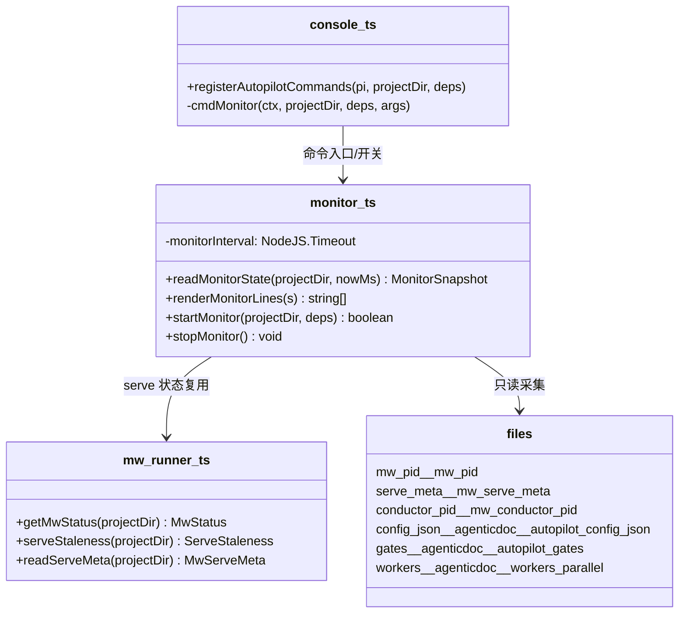
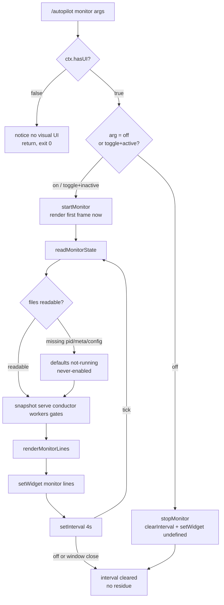

# Design: autopilot-monitor

## §0 设计前提锚定

- spec_path: `.agenticdoc/autopilot-monitor/spec.md`
- spec_locked_at: 2026-09-11T17:30:00+08:00
- ac_count: 9
- ac_ids: AC-001, AC-002, AC-003, AC-004, AC-005, AC-006, AC-007, AC-008, AC-009

## §1 架构选型

### D-001 轮询归属
- 选择：独立 interval（monitor 模块自持 `setInterval`，命令驱动 start/stop，开启时立即渲染首帧）
- 否决：复用 startWorkerPollLoop（理由：该循环是 key-scoped——`if (watch.key)` 才渲染；monitor 是 system-scoped，且复用需 console→pm-orchestrator 跨模块状态共享，watch.key 为空时 monitor 仍须工作）
- 调研：`evidence/research/design-poll-and-module-2026-09-11.md`（发现 1）

### D-002 模块落点
- 选择：新文件 `autopilot/monitor.ts`（采集 `readMonitorState` + 渲染 `renderMonitorLines` + interval 管理），`console.ts` 只加 `/autopilot monitor` 子命令入口（deps 注入 readMonitorState/clock/intervalMs，照搬 ensureMwRunning seam 模式）
- 否决：塞 console.ts（已 800+ 行，混杂采集/渲染/命令三层）；pm/ui-bridge.ts（pm 域，monitor 是 autopilot 域）
- 调研：同上（发现 2）

### D-003 widget id 与叠放
- 选择：独立 widget id `agent-team-loop-monitor`，`placement: "belowEditor"`，与 watch widget 并存
- 否决：合并进 watch widget 单渲染（理由：watch 是 key-scoped 生命周期（随 key watch 状态开关），monitor 是命令开关——合并会把两套开关语义搅在一起；叠放顺序未经实机验证，风险低（行数克制：无 workers 时 ≤6 行），L2 实机验证点 VC-011，若叠放不可接受再走合并 fallback）
- 调研：`evidence/research/spec-widget-api-data-sources-2026-09-11.md`（发现 2）

### D-004 gates 解析
- 选择：轻量 frontmatter 行扫描（readFile + 匹配 `id:`/`kind:`/`stage:`/`status:` 行），仅取 `status: pending`
- 否决：复用 gate-writer.ts 解析（理由：其逻辑绑在写路径 answer 流程，非独立可复用函数）
- 调研：design 调研（发现 4）

### D-005 UI 模式降级
- 选择：`ctx.hasUI === false`（print 模式）→ 返回降级提示文本，不启动 interval 不抛错；RPC 模式 hasUI=true 正常开启（setWidget 属 fire-and-forget，文档确认 RPC 可用）
- 否决：无（无竞争方案；goal-nudge 修复 8a063f4d9 确立的 hasUI 守卫惯例）
- 调研：spec 调研（发现 1）

### D-006 命令 UX 与文案风格
- 选择：`/autopilot monitor`（无参 = toggle）、`on`/`off` 显式；off 同步清 widget；开启立即渲染首帧（不等首个 tick，AC-001 实际即时达标）；行风格沿用 watch widget（英文标签 + glyph + 110 列截断）
- 否决：无参仅显示状态不切换（多一次交互才开，违背「一键打开」场景 1）
- 调研：design 调研（发现 6）

### D-007 时钟与时长计算
- 选择：时钟源 `Date.now()` 经 deps 注入（`nowMs`）；worker elapsed = now - Date.parse(dispatchedAt)，分钟 `Math.ceil(ms/60000)`；serve uptime 优先 serve.meta.started_at_ms，无 meta 用 mw.pid mtime
- 否决：直接散落 Date.now() 调用（不可测）

## §2 核心结构



## §3 模块划分

```
packages/coding-agent/src/extensions/agent-team-loop/autopilot/
├── monitor.ts        # 新增：MonitorSnapshot 采集（readMonitorState）+ 渲染（renderMonitorLines）
│                     #       + interval 生命周期（startMonitor/stopMonitor，模块级单例状态=每窗口一个）
└── console.ts        # 修改：switch 加 "monitor" case；deps 加 monitor 采集/时钟/intervalMs 注入缝
```

- `monitor.ts` 三段职责：采集（纯函数，输入 projectDir+nowMs，输出快照）、渲染（纯函数，快照→行数组）、生命周期（start/stop + interval，模块级变量）。**无任何写操作**（AC-008）。
- `console.ts` 仅做参数解析 + hasUI 守卫 + 调 start/stop + 通知。

## §4 接口与集成

### 4.1 对外接口清单

```typescript
// monitor.ts
export interface MonitorServe { running: boolean; pid: number | null; stale: boolean; staleDetail: string; upMs: number | null }
export interface MonitorConductor { pid: number | null; alive: boolean; enabled: boolean; paused: boolean; everEnabled: boolean }
export interface MonitorWorker { taskKey: string; elapsedMs: number }
export interface MonitorGate { id: string; kind: string; stage: number | null }
export interface MonitorSnapshot { serve: MonitorServe; conductor: MonitorConductor; workers: MonitorWorker[]; gates: MonitorGate[] }

export function readMonitorState(projectDir: string, nowMs: number): MonitorSnapshot
export function renderMonitorLines(s: MonitorSnapshot): string[]
export function startMonitor(projectDir: string, deps?: MonitorStartDeps): boolean   // 幂等：已开启返回 true
export function stopMonitor(): boolean                                              // 幂等：未开启返回 false
export function isMonitorActive(): boolean
```

```typescript
// console.ts（deps 扩展，向后兼容可选项）
interface AutopilotConsoleDeps {
  ...
  readMonitorState?: (projectDir: string, nowMs: number) => MonitorSnapshot;  // 测试缝
  monitorIntervalMs?: number;                                                  // 测试缝（默认 4000）
}
```

### 4.2 外部依赖集成

- `mw-runner.ts`：getMwStatus/serveStaleness/readServeMeta（serve 行全部数据）
- `worker-store.ts`：WorkerStore.readAll()（跨 key running 行 + dispatchedAt）
- 文件：`.mw/conductor.pid`（signal-0 存活）、`.agenticdoc/_autopilot/config.json`（enabled/paused，缺文件 = everEnabled=false）、`gates/*.md`（frontmatter 行扫描）
- pi Extension API：`ctx.ui.setWidget("agent-team-loop-monitor", lines, { placement: "belowEditor" })` / `setWidget(id, undefined)`；`ctx.hasUI` 守卫

## §5 Function Flow



## §6 Coverage Matrix

| ID | 功能点 | 正常路径 | 边界测试 | 异常路径 | 验证层级 |
|----|--------|---------|---------|---------|---------|
| F1 | 命令入口/toggle/hasUI 守卫 | on/off/toggle | 无参、重复 on、重复 off | print 模式降级 | L1 |
| F2 | serve 行采集+渲染 | PID+fresh+uptime | 无 serve.meta（pid mtime 回退） | serve 挂（pid 死）、stale、无 pid 文件 | L1 |
| F3 | conductor 行采集+渲染 | alive+enabled | paused、everEnabled=false | conductor.pid 死进程（残留） | L1 |
| F4 | workers 区 | running 行+分钟数 | 0 running（区头折叠）、跨 key 混合 | dispatchedAt 空串/非法（行剔除） | L1 |
| F5 | gates 行 | pending id+kind | 全清空后归零 | gates 目录缺失、非法 frontmatter（跳过该文件） | L1 |
| F6 | 生命周期 | 首帧即时+4s tick | 幂等 start/stop | 窗口关闭 interval 随进程消亡 | L1 |
| F7 | 只读性 | 全链路无写调用 | — | （设计保证：模块无 fs.write API） | L0+L1 |
| F8 | 双 widget 并存 | monitor+watch 同屏 | watch.key 为空 | 叠放顺序异常（fallback 合并） | L2 |

## §7 Verification Contract

```
VC-001: 当 serve 运行（mw.pid 存活）且开启 monitor 后，renderMonitorLines 首帧 serve 行包含 PID 数字与 "fresh"/"stale" 之一；首帧在 startMonitor 同步返回前产生（0 个 tick）
       Layer: L1
       Output: [VERIFY] VC-001: serve_line_contains=<pid,fresh|stale>, first_frame_ticks=0
       Source: AC-001

VC-002: 当 conductor 进程被终止（signal-0 失败）后，第 2 个 tick（≤8s）渲染的 conductor 行包含 "dead"
       Layer: L1
       Output: [VERIFY] VC-002: conductor_line_contains=dead, ticks<=2
       Source: AC-002

VC-003: 当 _workers.parallel 含 2 行 running（不同 key）且 dispatchedAt 为 now-90s 时，workers 区含 2 个 taskKey 行且分钟数=2（ceil(90/60)）；非 running 行不出现
       Layer: L1
       Output: [VERIFY] VC-003: worker_rows=2, elapsed_min=2, nonrunning_shown=0
       Source: AC-003

VC-004: 当 gates 目录含 1 个 status: pending 文件时，gates 行含其 id 与 kind；将该文件 status 改为 approved 后下一 tick 行归零或消失
       Layer: L1
       Output: [VERIFY] VC-004: pending_shown=1, after_approve_pending=0
       Source: AC-004

VC-005: 当 monitor 开启后执行 off，setWidget(monitor_id, undefined) 被调用且后续 tick 不再产生 setWidget 行内容（interval 已清）
       Layer: L1
       Output: [VERIFY] VC-005: cleared=true, post_off_ticks=0
       Source: AC-005

VC-006: 当 ctx.hasUI=false（print 模式）执行 monitor on，命令返回含 "no visual UI" 的提示，startMonitor 未被调用，无异常抛出
       Layer: L1
       Output: [VERIFY] VC-006: notice_contains=no visual UI, started=false, thrown=0
       Source: AC-006

VC-007: 当 mw.pid 缺失（serve not running）时，serve 行含 "not running" 与 "/mw restart" 指引，其余行照常渲染
       Layer: L1
       Output: [VERIFY] VC-007: serve_line_contains=not running|/mw restart, other_lines_present=true
       Source: AC-007

VC-008: 当 monitor 开启并连续 3 个 tick，.mw/ 与 .agenticdoc/_autopilot/ 下所有文件内容哈希不变（mtime 除外）
       Layer: L1
       Output: [VERIFY] VC-008: content_hash_changed=0, ticks=3
       Source: AC-008

VC-009: monitor.ts 与 console.ts 的 monitor 路径无 fs.writeFile/writeSync/appendFile 调用（静态扫描），且开关状态仅存在于模块内存变量（无 config.json 写入）
       Layer: L0
       Output: [VERIFY] VC-009: write_api_calls=0, persist_writes=0
       Source: AC-009

VC-010: 当 monitor 与 watch 同时开启（watch.key 非空），两个 widget id（agent-team-loop-monitor / agent-team-loop-watch）的 setWidget 调用互不覆盖（各自最后一次调用的 id 不同）
       Layer: L2（实机/RPC 会话）
       Output: [VERIFY] VC-010: distinct_widget_ids=2
       Source: AC-001, AC-009

VC-011: 开启 monitor 的窗口 A 与未开启的窗口 B 各自渲染状态独立（A 的 setWidget 不影响 B 的 widget 集合）
       Layer: L0（架构证明：widget 状态为进程内 ExtensionAPI 实例私有）+ L1（单测中两个 fake pi 实例隔离）
       Output: [VERIFY] VC-011: cross_window_leak=0
       Source: AC-009
```

## §8 AC → VC 映射表

| AC ID | AC 摘要 | 对应 VC | 路径分类 |
|-------|---------|---------|---------|
| AC-001 | 开启 ≤1 周期出面板，serve 行含 PID+fresh/stale | VC-001, VC-010 | 正常 |
| AC-002 | conductor 死亡 ≤2 周期变 dead | VC-002 | 异常 |
| AC-003 | running workers 行+分钟数 | VC-003 | 正常 |
| AC-004 | pending gates 行+归零 | VC-004 | 边界 |
| AC-005 | off 清面板不重建 | VC-005 | 正常 |
| AC-006 | print 模式降级 | VC-006 | 异常 |
| AC-007 | serve down 显示指引 | VC-007 | 异常 |
| AC-008 | 纯只读无副作用 | VC-008, VC-009 | 非功能 |
| AC-009 | 单窗口内存态 | VC-009, VC-010, VC-011 | 非功能 |

## §9 非功能实现方案

- **性能**：单 tick 全数据源 < 100ms（pid/meta/config 各 <1KB；workers 表按行读；gates 个位数文件行扫描）；setWidget 幂等（同内容重复设置无视觉闪烁——行数组确定性生成）
- **安全**：只读承诺由结构保证（monitor.ts 不 import 写 API）；面板零敏感信息（PID/文件派生状态）
- **可观测性**：面板本身即观测端点；异常路径静默降级到 "not running"/"dead" 状态词，不抛错不弹 toast

## §10 决策记录

| D-ID | 决策点 | 选择 | 否决 | 理由 |
|------|--------|------|------|------|
| D-001 | 轮询归属 | 独立 interval 命令驱动 | 复用 watch 轮询循环 | watch 是 key-scoped，monitor 是 system-scoped；避免跨模块状态共享 |
| D-002 | 模块落点 | autopilot/monitor.ts 新文件 | 塞 console.ts / pm 域 ui-bridge.ts | 单一职责 + deps 注入可测；域归属 autopilot |
| D-003 | widget id | 独立 id 并存 | 合并 watch 单渲染 | 两套开关语义不同；叠放风险 L2 验证，fallback 合并 |
| D-004 | gates 解析 | 行扫描 | 复用 gate-writer 解析 | gate-writer 绑写路径，行扫描足够（个位数文件） |
| D-005 | UI 模式降级 | hasUI 守卫 + 提示 | — | goal-nudge 修复确立的惯例 |
| D-006 | 命令 UX | toggle + 首帧即时 | 无参仅显状态 | 场景 1 一键打开；AC-001 即时达标 |
| D-007 | 时钟 | nowMs deps 注入 | 散落 Date.now() | 可测性 |
