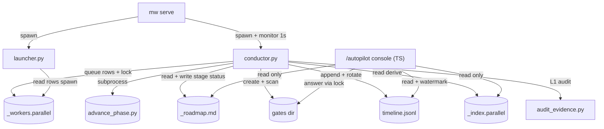
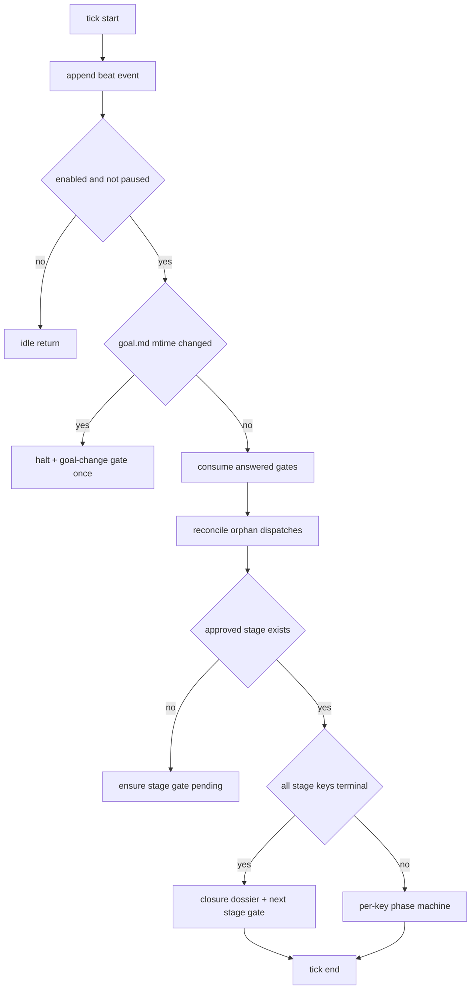
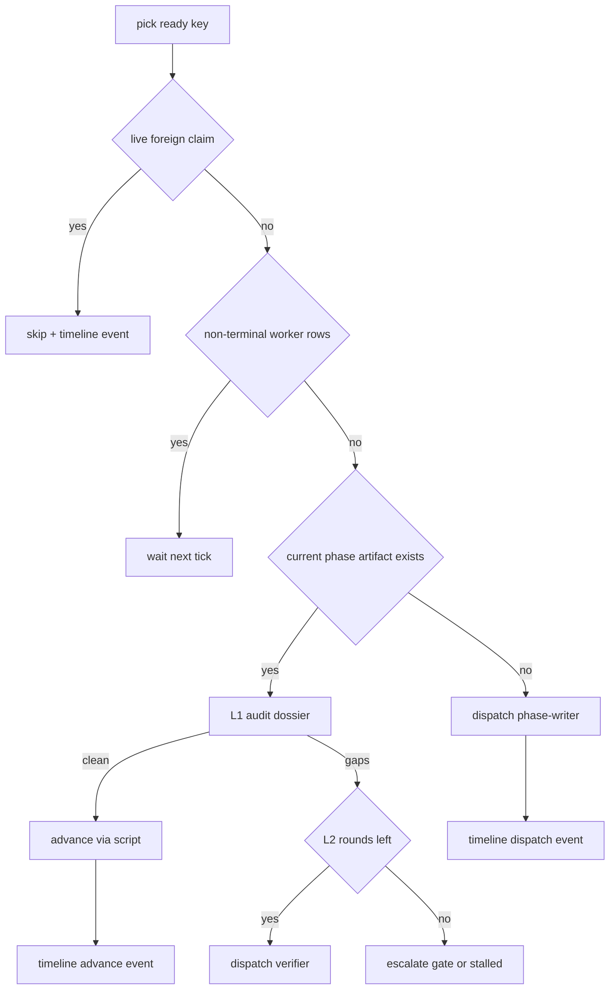
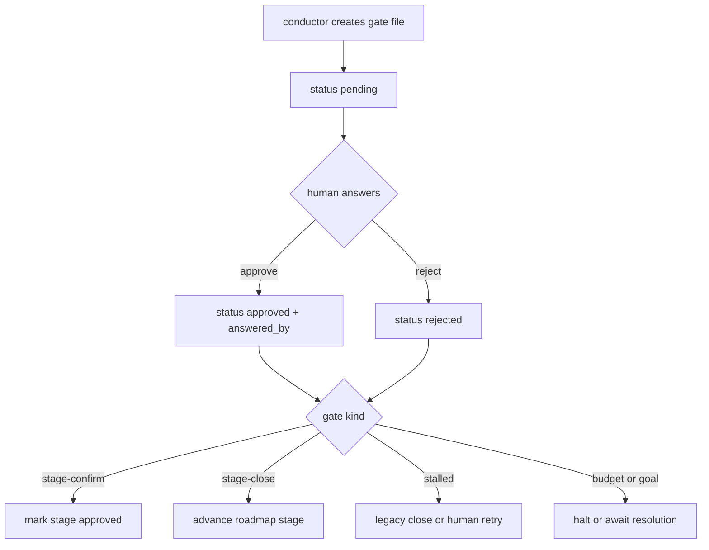
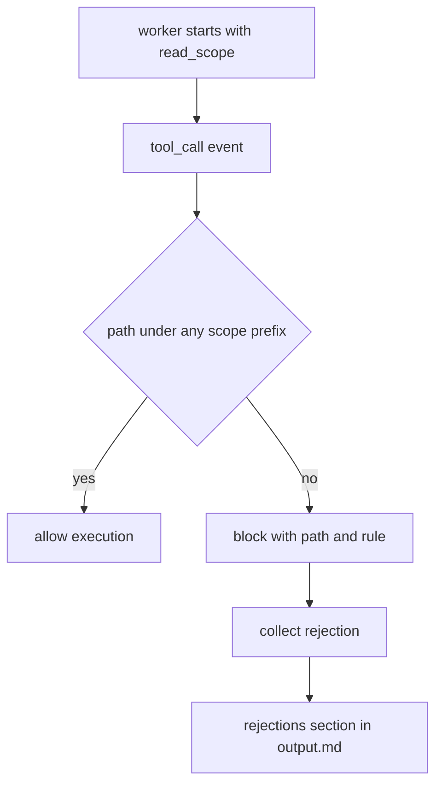

# Design: goal-autopilot

## §0 设计前提锚定

- spec_path: `.agenticdoc/goal-autopilot/spec.md`
- spec_locked_at: 2026-09-08T20:31:02Z
- ac_count: 25
- ac_ids: AC-001, AC-002, AC-003, AC-004, AC-005, AC-006, AC-007, AC-008, AC-009, AC-010, AC-011, AC-012, AC-013, AC-014, AC-015, AC-016, AC-017, AC-018, AC-019, AC-020, AC-021, AC-022, AC-023, AC-024, AC-025

## §1 架构选型

### D-101 conductor 进程模型

**需求摘要**：conductor 常驻 mw 服务、随服务启停、按项目隔离、可独立崩溃恢复（GC-3 精神，AC-022/025）。

| 方案 | Pros | Cons |
|------|------|------|
| A. mw serve 第三个 Popen 子进程 | 与 launcher 同构的 spawn/stop/terminate 生命周期；独立崩溃域；可单独 CLI 测试（--once 单 tick） | 多一个子进程与 PID 文件管理；serve 需新增 respawn 逻辑（现状不自动重启子进程） |
| B. mw serve 进程内线程 | 无进程开销 | serve 崩溃连带 conductor；无法独立重启测试；与「服务生命周期」耦合过紧 |
| C. 独立守护进程（脱离 mw serve） | 完全独立 | 重复造监护/停止/PID 机制；违背「conductor 挂载 mw 服务」的 spec §1.2 定位 |

**推荐**：`A`
**理由**：mw.py cmd_serve 已有子进程 spawn/stop 请求/finally terminate 模式，conductor 以 `python autopilot/conductor.py --project=...` 成为第三子进程，`.mw/conductor.pid` 由 serve 维护，`mw status` 增加 conductor 行。**崩溃域非对称（勘正 review N4）**：conductor 崩溃不杀 serve；serve 退出则 finally 主动终止 conductor（无孤儿）。**新增 respawn（勘正 review B10）**：mw serve 现状是子进程退出→整体退出，不自动重启；serve 主循环增 conductor 专属监护——config enabled 且 conductor 意外退出 → respawn（快速失败保护：退出后 <5s 再退出连续 2 次 → 30s 退避并记 launcher.log 级警告）。调研：`evidence/research/design-conductor-mounting-and-state-2026-09-08.md`（发现 1 + 修正段）

### D-102 状态推导：零私有状态文件

**需求摘要**：GC-1 要求 conductor 无独立状态存储、崩溃重启零成本恢复；回合预算计数（AC-011/018）与恢复（AC-022）需要持久事实源。

| 方案 | Pros | Cons |
|------|------|------|
| A. 全部从共享文件推导（roadmap / gates / _index.parallel / workers task 目录 loop+attempt 标签 / timeline） | 无第二事实源；重启即恢复；console 读同源天然一致（AC-018） | 每 tick 推导成本（stage keys ≤ 10 时可忽略）；需孤儿和解与 goal 基线规则 |
| B. conductor 私有 state.json | 推导 O(1) | 违反 GC-1 字面语义；与共享文件漂移风险；console 需理解第二格式 |

**推荐**：`A`
**理由**：派发历史天然持久在 `{key}/workers/*/task.md` frontmatter（`loop:`/`attempt:` 标签），`count(loop==L)` 即已用回合数；key phase 在 `_index.parallel` 第 3 列；gate/roadmap/时间线是本设计新增的共享文件。conductor 重启对运行中 worker 零影响（进程所有权在 launcher）。调研：同上（发现 3/5/6）。

**增补（review B2 处置）——派发事务与孤儿和解**：task.md 创建与队列行写入非原子，规则：
- **孤儿定义**：task.md 带 `origin: conductor` 且无队列行。行只会因 stale-archive（要求 task.md 不存在）被移除，故无行 ⟹ 从未被 launcher spawn
- **和解动作**：每 tick 扫描孤儿 task 目录 → 重插 pending 行（同 loop 同 attempt，不新耗预算；无 worker 跑过，无重复工作）
- **goal 基线**：conductor 首 tick（或 enable 后首 tick）读 goal.md mtime 记 timeline `goal-snapshot` 事件；每 tick 比对，变更 → halt + goal-change gate（一次）；重启从 timeline 最后 goal-snapshot 恢复基线（从文件尾反向扫描，beat 事件过滤后量小）

### D-103 claimId 互操作

**需求摘要**：AC-013 所有权互斥要求 conductor 与人工窗口双向 held-live 判定。

| 方案 | Pros | Cons |
|------|------|------|
| A. conductor 用真实 `host:pid` 认领 key | TS parseClaim 直接识别；人工 --force 接管路径复用；conductor 侧用同格式反查人工窗口存活 | 无 |
| B. 自定义 claimId 前缀（如 conductor-xxx） | 可读性好 | parseClaim 失败 → 被当 stale 强占，互斥失效 |

**推荐**：`A`
**理由**：`{hostname}:{os.getpid()}` 满足 `^([^:]+):(\d+)$`；conductor 每 tick 反查 key 的 claimId，若为存活的外部进程则 skip 并记时间线；人工 force 接管后下一 tick conductor 即转 skip（AC-013 后半）。调研：同上（发现 4）

### D-104 派发竞态：origin 标记，按构造消除（review B2/B4 处置后改写）

**需求摘要**：conductor 写 `{key}/workers/<task>/task.md` 与队列行之间存在被 TS `dispatchNewTasks` 扫描抢先进 upsert 的窗口；TS 重插 pending 还可能在 launcher 重启后导致重复 spawn（内存去重丢失）。

| 方案 | Pros | Cons |
|------|------|------|
| A. `origin: conductor` frontmatter 标记 + TS `dispatchNewTasks` 跳过带标记的 task.md | 竞态按构造消除（TS 永不碰 conductor 任务）；双向安全（含 launcher 重启场景）；手动任务无标记零影响 | TS 侧一行扫描逻辑增量 |
| B. 接受良性竞态 + 测试覆盖（原方案） | 零 TS 改动 | pending 重置 + launcher 重启后内存去重消失 → 可能双 spawn（review B2 证实不安全） |
| C. 跨语言「派发意图锁」协议 | 理论严格 | TS 扫描路径无锁改造侵入大；为毫秒级窗口引入永久协议复杂度 |

**推荐**：`A`
**理由**：dispatchNewTasks 逐行读 task.md 内容（pickWorkerRoute 已按行解析），识别 `origin: conductor` 跳过是同构增量；conductor 任务永远只由 conductor 入队，孤儿和解（D-102）成为唯一修复方，重复 spawn 路径被彻底关闭。手动/旧任务无标记 → 行为不变（AC-012 零回归）

### D-105 人工门禁文件协议

**需求摘要**：stage 确认/闭环、stalled、预算耗尽、goal 变更五类人工门禁需要可审计、可手改、低争用的载体（AC-002/003/016/024）；roadmap/stage/stalled 状态需要稳定 schema 供三方（conductor/console/validator）消费（review B5 处置）。

| 方案 | Pros | Cons |
|------|------|------|
| A. per-gate Markdown 文件 + frontmatter（`.agenticdoc/_autopilot/gates/gate-{seq:04d}.md`） | 人可读可手改；锁粒度小；目录扫描即队列；frontmatter 字段机读 | 多文件 |
| B. 单 JSON 队列文件 | 机读简单 | 人工手改危险；争用集中在单文件 |
| C. 复用 pm-state.md 节 | 无新文件 | pm-state.md 是框架文件，conductor 写它语义混乱（AC-005 红线邻近） |

**推荐**：`A`
**理由**：创建走 conductor、回答走 TS `/autopilot gate`（`.mw/gates.lock` O_CREAT|O_EXCL 下重写 frontmatter status/answered_at/answered_by/note）、消费走 tick 扫描；answered_by 记窗口 claimId 审计。调研：`evidence/research/design-gate-l2-worker-protocol-2026-09-08.md`（发现 5/6）

**增补（review B5 处置）——完整状态 schema**：

**`_roadmap.md` schema**（roadmap-writer 产出提案；conductor 只改 status/key-status 行，在 `.mw/roadmap.lock` 下原子重写；人可手改全文，conductor 每 tick 重解析，解析失败 → 跳过 tick + timeline 记 config 事件）：
```markdown
# Roadmap
> generated_at: <iso>
> goal_mtime: <ms>
## Stage 1: <标题>
> goal: <阶段目标（必填非空）>
> status: pending | approved | running | closed | closed-human | halted
> key-status: <key>=<running|done|stalled|closed-legacy>, ...
### Keys
| key | role | depends_on |
|-----|------|-----------|
| k1 | <作用> | - |
```
roadmap_check.py 校验：每 stage 含 ≥1 key 行、goal 非空、依赖声明合法（指向同 stage 内或前序 stage 的 key）；key-status 行的 key 集与 Keys 表一致。

**stage 生命周期顺序（锁定）**：全部 key 终态 → conductor 写闭环 dossier `.agenticdoc/_autopilot/stages/stage-{N}-close.md`（schema：stage id/goal/每 key {final phase, L3 裁决 meets|below|none + 报告路径, 证据引用}/generated_at）→ 创建 stage-close gate → approve → conductor 标 stage=closed + 创建下一 stage-confirm gate → approve → stage=running。**stage-close reject**：stage 标 halted，conductor 暂停派发，等人工编辑 roadmap 或 `/autopilot resume`（自主性暂停优于错误推进，spec §4 风险接受）。

**stalled 持久化**：key-status 行（`k3=stalled`）；stalled gate reject 后改 `k3=closed-legacy`（遗留关闭，achieved.md 草稿保留）。

**gate seq 分配**：conductor 是唯一 gate 创建者（TS 只回答）；gates.lock 下 seq = max(现存 gate id)+1，重启重扫目录取 max，无并发冲突。

**roadmap-writer 输入清单**：goal.md + 记忆三件套（存在时）+ _index.parallel 现存 key 清单 + roadmap schema 模板（内嵌 task.md）；read_scope 限 `.agenticdoc`（读），写目标仅 `_roadmap.md`；type=roadmap-writer。

### D-106 L2 定点读取强制

**需求摘要**：AC-009 要求 L2 worker 文件读取限于 dossier 指针 + 白名单路径，越界拒绝且留记录；安全边界必须是精确算法而非字符串前缀（review B3 处置）。

| 方案 | Pros | Cons |
|------|------|------|
| A. task.md `read_scope:` + worker-mode 订阅 `tool_call` 返回 block + output.md 拒绝记录节 | 纯扩展层；跨平台一致；拒绝原因含路径与命中规则 | 拦截在 worker 进程内（信任 worker-mode 代码，非 OS 沙箱） |
| B. OS 级沙箱（chroot/容器） | 强隔离 | 跨平台复杂度爆炸；违背「不修改 pi 核心/复用 worker 协议」 |
| C. 仅靠 dossier 内容内联（不授权读取） | 零机制 | AC-009 明确要求机械拒绝 + 记录，不可靠自觉 |

**推荐**：`A`
**理由**：ExtensionAPI `tool_call` 事件原生支持 `{block: true, reason}`（core/extensions/types.ts ToolCallEventResult）；worker-mode 已有按 frontmatter 解析与 output.md 统一写出点，拦截器是同构增量。文件数/字节上限（l2_read_file_cap / l2_read_byte_cap）同一拦截器实施。调研：同上（发现 1）

**增补（review B3 处置）——containment 算法（实现锁定）**：
1. **基准**：scope 条目与请求路径均相对 worker cwd（= 项目根，launcher 保证）
2. **归一化**：`path.resolve(projectRoot, p)` 先词法消解 `..`/`.`，再 `fs.realpathSync` 消解 symlink/junction（不存在路径：对最深存在祖先 realpath 后拼回剩余段；读取本身会失败，但归一化不可被绕过）
3. **比对**：`realpath(请求)` 必须等于某 `realpath(scope)` 或以其 `+ path.sep` 开头（**段边界**，杜绝 `goal-autopilot-evil` 匹配 `goal-autopilot`）；win32 双侧 lower-case 比对（盘符归一）
4. **各工具参数字段**：`read.path` / `ls.path` / `find.path` / `grep.path` 同一套 containment；grep 的 glob 匹配结果不单独校验（根已在界内）
5. **cap 语义**：文件数 cap = worker 生命周期内放行的 read/ls/find/grep 调用累计；字节 cap = read 实际读取字节累计；超限 block（rule=cap-file/cap-byte）
6. **拒绝记录**：`{tool, path, rule, ts}` 内存累积 → 退出时写 output.md `## Read Scope Rejections` 节 + trace.log 逐条 `[READ_SCOPE] blocked path=... rule=...`
7. **scope 授权语义**：read_scope = dossier 指针集合 + 白名单路径（AC-009 原文），白名单含 key 目录（grep/find 需目录根）与 goal.md

### D-107 typed 派发注册表（GC-8/AC-021，review B4 处置后改写）

**需求摘要**：autopilot 派发路径的工具白名单必须显式，未知 type 拒绝派发；手动路径 fallback 保持不变；stale bundle / 非 conductor 队列路径不可绕过。

| 方案 | Pros | Cons |
|------|------|------|
| A. 双侧注册表 + 奇偶测试 + origin fail-closed：conductor 侧 Python 表（type→工具集→cli/provider）派发前查表，未注册 type → 0 行 + 时间线；worker 侧 TOOL_ALLOWLISTS 增同名显式条目，且 `origin: conductor` 且 type 未注册 → **fail-closed exit 1**（output.md 写明原因，计入 loop 预算升级人工）；L0 测试断言两侧每类型工具集**精确相等** | 各语言原生；conductor 拒绝 + worker 兑底双保险；stale bundle 场景由 fail-closed 封闭 | 两处维护（测试锁定） |
| B. 单一来源文件（如 JSON）双侧读取 | 单源 | 给 worker 打包/全局安装路径引入新文件依赖，脆弱 |
| C. 仅 conductor 侧拒绝（原方案） | 最小改动 | TS 扫描/手工/stale bundle 可让未注册 type 落入 fallback 全集（review B4 证实不充分） |

**推荐**：`A`
**理由**：TS bundle 与 Python 包无法共享模块；奇偶测试是防漂移唯一可靠手段。手动路径 fallback 保留（GC-8 明文）；conductor 任务唯一入队方是 conductor（D-104 origin 标记后 TS 扫描跳过），再加 worker 侧 fail-closed，未注册 type 到达 worker 且拿到全量工具的路径不存在。conductor 侧类型表：`roadmap-writer`（read/write/edit/find/grep/ls）、`phase-writer`（coding 级全集）、`verifier`（review 级 + 强制 read_scope）、`reviewer`（review 级）、`repair`（coding 级）。调研：同上（发现 2/3）

### D-108 L3 产物机械落盘

**需求摘要**：L3 reviewer 锁定 review 级（AC-021，无 write），但 done 门禁需要 quality-gate-report 与 achieved.md（advance_phase.py GATES["done"]，三项：achieved ≥200B / pm-state 含 PASS / QG 报告 ≥1）。

| 方案 | Pros | Cons |
|------|------|------|
| A. L3 在 output.md 输出结构化报告节，conductor 机械复制落盘两文件 | AC-021 工具级不动摇；产物内容仍出自 LLM 判断；conductor 只做文件写入非判断 | conductor 写 key 目录文件（AC-005 只禁 Phase 直写与 goal.md 写，合规） |
| B. 给 L3 临时 write 权限 | 简单 | 直接违反 AC-021 锁定 |

**推荐**：`A`
**理由**：L3 output.md 必含 `## Quality Gate Report`（VC 断言表逐条 PASS/FAIL）与 `## Achieved` 两节；conductor 落盘 `evidence/quality-gate-report-{date}.md` 与 `achieved.md` 草稿，并在 pm-state.md §3 追加 PASS 证据行（满足 done 门禁 content_match）。调研：同上（发现 4）

**增补（review B6 处置）——done 三件套事务与后验**：
1. **顺序**：L3 meets 裁决解析 → conductor 写 QG 报告（命名 `quality-gate-report-YYYYMMDD-HHMMSS.md`，时间戳唯一不覆盖）→ 写 achieved.md 草稿 → **后验 ≥200B**（不足 = L3 产出质量问题 → 按 below 走修复回路，不硬凑字数）→ pm-state §3 追加 PASS 行（在 per-key 锁 `.mw/key-{key}.lock` 下原子重写）→ 调 advance_phase.py done（门禁重验三件套）
2. **advance 后验 index**：advance exit 0 后回读 `_index.parallel` phase 列；失配（脚本内 set-phase 非致命失败）→ conductor 重跑 `update_index.py set-phase` → 再失败 → 人工 gate + timeline 留痕（消除双事实源分叉）
3. **L3 输出缺陷**：缺 `## Quality Gate Report` 或 `## Achieved` 节 → 按 below 裁决处理（修复回路）

### D-109 时间线与节拍

**需求摘要**：AC-017 状态转移留痕 + AC-019 存活节拍（60s 窗 ≥12 事件）+ AC-015 console 回放。

| 方案 | Pros | Cons |
|------|------|------|
| A. 单 `timeline.jsonl`（事件含 beat 类型，默认视图过滤）+ 10MB 轮转保 2 代 | 单文件水位/回放逻辑简单；beat 与转移事件统一 schema | beat 噪声（由过滤解决） |
| B. beat 与转移事件分两文件 | 转移文件干净 | 两个水位、回放合并逻辑；AC-019 措辞含「时间线/日志」双语义但单文件更简单 |

**推荐**：`A`
**理由**：每行 `{"ts","ev","key","stage","detail"}`；beat 每 tick 一条；轮转文件只追加不回写，console 回放按 last-seen 水位扫描当前 + 轮转文件。默认轮询间隔 4s（≤5s 满足 §2.2，60s 窗 15 beats ≥ 12 有余量，规避 5s 整点抖动导致的 11 事件边界）。

**增补（review B9/N6 处置）——seq / watermark / 轮转协议**：
1. **事件标识**：每行增加单调递增 `seq` 字段（conductor 唯一写者，启动时从文件尾行恢复计数；同 ts 多事件靠 seq 去重排序）；`key` 字段取值哨兵化（key 级事件填 key；stage 级/全局事件填 stage 编号或 `-`，**不为 null**，对齐 AC-017 erratum）
2. **watermark**：console 每次视图（status/timeline）把 `{seq, ts}` 持久化到 session entry（`agent-team-loop:autopilot-seen`，与 WATCH_ENTRY_TYPE 同机制）——「console 无状态」原则不破（session 文件属 pi，非 console 私有状态）；新会话默认水位 = 0（全量回放）或 `--since` 显式指定
3. **回放顺序**：轮转文件（旧→新）→ 当前文件，过滤 `seq > watermark`，按 seq 升序；重命名原子 + conductor 只追加当前文件，无重叠窗口
4. **超代离线**：watermark 对应 seq 早于最旧保留行 → 视图显式提示「N events pruned（超 2 代轮转）」，不静默缺失

### D-110 配置位置与 schema

**推荐**：`.agenticdoc/_autopilot/config.json`（与 gate/timeline 同目录，任务状态邻接，人可见可改）；`.mw/` 只放锁与 PID（运行时产物）。字段：`enabled`、`poll_interval_sec`（默认 4）、`max_parallel_keys`（默认 2，下限 2 由 AC-004 锁定）、`round_budget`（默认 2，三类回路共用）、`worker_timeout_min`（默认 30，继承看门狗）、`l2_read_file_cap`（默认 8）、`l2_read_byte_cap`（默认 65536）。AC-011 测试改 `round_budget=1` 即改此单处。

### D-111 EXECUTE 任务执行状态推导（review B7 处置后改写）

**推荐**：
- **task 身份**：task id = `{key}/tasks/` 文件名 stem（如 `T-01-task-protocol`）——文件系统保证 key 内唯一（实测存在重复 T-NN 前缀，前缀不可作 id；见调研发现 8 修正段）；队列 taskKey = `ap-{key}-{stem}`（`ap-` 前缀保留，全局唯一，手动任务不可能撞名）
- **权威源**：`tasks/` 目录是执行契约（advance execute 门禁检查的就是它）；plan.md 仅作排序/stage 参考。plan 列出但 tasks/ 缺失 → L1 审计捕为缺口 → L2 → 升级 stalled 类 gate；tasks/ 有 plan 没有的孤儿任务 → 照常派发 + timeline 注记
- **每 key 串行**：同一 key 一次只有一个在飞 exec 任务（避免同 key 任务并行改文件互踩）；跨 key 并行由 max_parallel_keys 承担；任务顺序 = plan 执行顺序可解析时邽循，否则按 stem 字典序
- **loop 标签**：`loop: exec:{key}:{stem}`；完成判定 = 该 loop 队列行 status=done；失败（exit≠0/看门狗/spawn 失败，AC-023）计入该 loop 回合预算，超限走 stalled；孤儿和解见 D-102

调研：`evidence/research/design-conductor-mounting-and-state-2026-09-08.md`（发现 8 + 修正段）

### D-112 L3 证据记录制

**推荐**：L3 reviewer（review 级，无 bash）审查 execute 期 repair worker 在 output.md / evidence 中记录的 [VERIFY] 输出，不重跑命令（AC-021 锁定 review 级的直接推论）；需要重跑的验证命令在 QG 报告中标记 `needs-rerun` 并计入遗留问题，供人工或下一 key 处理。

### D-113 stale lock 窃取（review B2 处置）

**推荐**：conductor 侧统一 lock 包装（workers.lock / gates.lock / roadmap.lock / key-{key}.lock）：acquire 重试耗尽后检查锁文件 mtime，age > 30s → 删除后重取（timeline 记 config 事件）。依据：conductor 持锁均为毫秒级，>30s 年龄 ⟹ 持有者已死（崩溃时未清理）。TS 侧锁协议不动（预存在行为，AC-012 零回归）；此为 conductor 自恢复能力，非全局协议变更。

### D-114 act-then-sleep 循环语义（review B10 处置）

**推荐**：conductor 主循环 = 先 act 后 sleep——进程启动立即执行首个 tick，不等第一个间隔。AC-025 链路时延 = serve 1s tick 检测 + spawn ≈ 0.5s + 首 tick 派发 ≈ 2s < 1 个轮询间隔（4s 默认，≤5s 上限）。AC-002/004/016 的时延同样受益（回答消费与派发都在 tick 内完成，时延上限 = 1 interval 而非 1~2）。

### D-115 worker 进程级观测点（review B2/VC-024 处置）

**推荐**：worker-mode 启动时（首 agent turn 前）向 trace.log 追加 `[START] pid=<pid>` 纯代码行（每次 spawn 恰一条；trace.log 追加不重置，区别于 launcher 每 spawn 截断的 worker.log）。进程唯一性验证口径 = task 目录内 `[START]` 行数与 pid 活性（VC-024），不再以「行数 ≤1」代替「进程数 ≤1」。

### D-116 agenticdocRoot 语义拆分（review B8 处置，存量 bug 修复）

**事实**：`parseTaskMd` 现算 `agenticdocRoot = dirname(dirname(taskPath))` = `.agenticdoc/{key}/workers`——对 outputDir(taskKey, root) 是正确路径契约，但对 `goalMtime(root)` 错误（stat `{key}/workers/goal.md` 恒 miss → [GOAL_CHECK] 记 0）；全仓 trace.log 无一条 GOAL_CHECK（潜在未触发，无 phased worker 跑过）。

**推荐**：本 key EXECUTE 范围内修 worker-mode/phase-runner：拆分语义——输出路径继续用现行 root（outputDir 契约不变），goalMtime/appendGoalCheck 改收真 agenticdoc 根（task.md 向上 4 级）。conductor 的 goal 基线（D-102）不依赖此修复，独立成立。

## §2 核心结构 / 类图



职责边界：conductor 只写 D（队列行）、F（stage 状态）、G（创建）、H（追加）与 D-108 的机械落盘；phase 推进唯一通道 E；J 全部只读除 gate 回答。

## §3 模块划分

```
packages/multi-workers/
├── mw.py                        # 改：serve 循环按 config 监护 conductor；status/doctor 增 conductor 行
├── autopilot/
│   ├── __init__.py
│   ├── conductor.py             # 主循环 + per-key phase 机（tick 可测：--once / --poll-interval）
│   ├── config.py                # config.json 读写 + 默认值 + 校验
│   ├── roadmap.py               # _roadmap.md 解析（供 conductor 与 roadmap_check）
│   ├── roadmap_check.py         # AC-001 独立校验 CLI（exit 0/1）
│   ├── audit_evidence.py        # L1 审计：AC 清单/决策→证据映射/缺口 → JSON dossier（独立 CLI）
│   ├── gates.py                 # gate 创建/解析/枚举
│   ├── timeline.py              # jsonl 追加 + 查询 + 轮转
│   ├── dispatch.py              # typed 注册表 + task.md 模板 + 队列行写入（mw_common 锁）
│   ├── state.py                 # phase/claim 存活/loop 回合计数推导
│   └── advance.py               # advance_phase.py 定位与子进程封装（框架脚本缺失 → 拒绝启动）
└── test_autopilot_*.py          # L1：conductor tick、gates、timeline、audit、dispatch、并发

packages/coding-agent/src/extensions/agent-team-loop/
├── autopilot/
│   ├── console.ts               # /autopilot 命令集注册（status/gates/gate/timeline/enable/disable/pause/resume/roadmap）
│   ├── status-model.ts          # 状态推导（roadmap+gates+timeline+workers → 视图模型 / --json）
│   └── gate-writer.ts           # gate 回答写入（.mw/gates.lock）
├── worker/worker-mode.ts        # 改：read_scope 拦截 + 拒绝记录 + TOOL_ALLOWLISTS 新条目
└── pm/pm-orchestrator.ts        # 改：pmActivate 注册 autopilot 命令集
```

依赖方向：conductor → mw_common（锁/行序列化）+ 框架脚本（advance）；console → 既有 shared（paths/index-store/worker-store）；worker-mode 改动不依赖 conductor（协议经 task.md frontmatter 解耦）。

## §4 接口与集成

### 4.1 对外接口清单

**Conductor CLI**：`python autopilot/conductor.py --project <dir> [--poll-interval S] [--once]`
**L1 审计 CLI**：`python autopilot/audit_evidence.py --key <key> [--project <dir>]` → stdout JSON dossier，exit 0=齐全 / 1=有缺口；dossier：`{key, phase_edge, ac_list[], decision_map[{decision, evidence_files[]}], gaps[{item, rule, severity}], generated_at}`
**Roadmap 校验 CLI**：`python autopilot/roadmap_check.py [--project <dir>]` → exit 0/1 + stderr 缺失项
**TS 命令集**：
- `/autopilot status [--json]` — stage 进度 / gate 队列 / 时间线水位 / 每 key 回合预算（AC-015/018）
- `/autopilot gates` — 未决 gate 列表
- `/autopilot gate <id> approve|reject [--note <text>]` — 写回答（AC-016）
- `/autopilot timeline [--since <iso>] [--all]` — 离线回放（默认 last-seen 水位，beat 过滤）
- `/autopilot enable|disable` — 写 config（enable 时若 mw 未运行则启动，AC-025）
- `/autopilot pause|resume` — 写 config paused 字段（进程存活，暂停派发）
- `/autopilot roadmap` — roadmap 摘要视图

**task.md frontmatter 扩展**（worker 协议增量，向后兼容；origin/loop/attempt 为 conductor 派发必带）：
```
type: verifier          # 现有字段，新类型见 D-107
model: <id>             # 现有字段
origin: conductor       # conductor 派发标记：TS dispatchNewTasks 跳过；worker 侧 fail-closed 依据
loop: l2:<key>:spec-to-design   # 回路标识（conductor 派发必带）
attempt: 1              # 本回路第几回合
read_scope:             # verifier 必带；YAML 列表，项目根相对前缀（containment 算法见 D-106）
  - .agenticdoc/goal-autopilot
  - .agenticdoc/goal.md
```

**round 计数单位（review N7 处置，全回路统一定义）**：

| 回路 | loop 标识 | 一回合 = | 备注 |
|------|----------|---------|------|
| L1↔L2 | `l2:{key}:{edge}` | 一次 verifier 派发 | 修复派发（phase-writer 补证）属同回合的修复动作，不另计；L1 重审后有缺口才开下一回合 |
| L3 收敛 | `l3:{key}` | 一次 reviewer 派发 | repair 派发走独立 `repair:{key}` 回路；复评 = 下一 L3 回合 |
| 任务执行 | `exec:{key}:{stem}` | 一次派发达终态（done/failed/needs-clarification）或 spawn 失败 | 孤儿和解（D-102）同 attempt 重插不新计 |
| 修复 | `repair:{key}` | 一次派发达终态或 spawn 失败 | 与 exec 同构，供 L3 below 后的修复动作 |
| roadmap | `roadmap:stage-{N}` | 一次 roadmap-writer 派发 | budget=2 时：初提案 + 首拒后重提案 = 2 回合，二拒停（AC-024） |

**gate 文件 schema**（`.agenticdoc/_autopilot/gates/gate-{seq:04d}.md`）：
frontmatter：`id / kind(stage-confirm|stage-close|stalled|budget-exhausted|goal-change) / stage / key / created_at / created_by(conductor) / question / context_refs[] / status(pending|approved|rejected) / answered_at / answered_by(窗口 claimId) / note`；正文 = 人可读问题 + 上下文摘要。

**timeline 事件 schema**：`{"ts": iso8601, "seq": int, "ev": "beat|dispatch|worker-terminal|advance|gate-created|gate-answered|stalled|skip|stage-close|config|goal-halt|goal-snapshot|type-rejected|reconcile", "key": str（哨兵 `-`，不为 null）, "stage": int|null, "detail": str}`（seq 单调递增，见 D-109）

**`/autopilot status --json` schema（版本化，review N8 处置）**：
```json
{
  "schema": "autopilot-status/1",
  "stage": {"current": 2, "status": "running", "keys": [
    {"key": "k1", "phase": "EXECUTE", "state": "running",
     "rounds": {"l2": {"used": 1, "max": 2}, "l3": {"used": 0, "max": 2},
                "retry": {"used": 0, "max": 2}}}
  ]},
  "gates": [{"id": "gate-0007", "kind": "stage-confirm", "status": "pending"}],
  "timeline": {"seq": 1234, "ts": "2026-09-08T12:00:00Z"},
  "config": {"enabled": true, "poll_interval_sec": 4, "round_budget": 2,
             "max_parallel_keys": 2}
}
```
（rounds 的 used 从 task 目录 loop 标签推导、max 从 config，与视图同源同值，AC-018/VC-020）

**config.json**：见 D-110。

### 4.2 外部依赖集成

- **mw serve**：1s 主循环检查 config（mtime 缓存）→ enabled 且 conductor.pid 无存活进程则 spawn；disabled 则 terminate；finally 终止集合加入 conductor（复用 launcher 的 terminate/wait 逻辑）
- **advance_phase.py**：conductor 经 advance.py 子进程调用（`sys.executable <framework>/scripts/advance_phase.py <key> <phase>`）；框架缺失（install 未装）→ conductor 启动即拒绝（stderr + exit 1，serve 记日志）
- **TS 扫描互操作**：`dispatchNewTasks` 增加 `origin: conductor` 识别（逐行解析已有，同构增量），跳过 conductor 任务——D-104 竞态按构造消除；手动/旧任务无标记，行为不变（AC-012 零回归）
- **_workers.parallel**：dispatch.py 在 workers.lock 内写行（复用 mw_common.serialize_entry，8 列含 model 空串）；队列 taskKey 命名空间 `ap-{key}-{stem}`（D-111）
- **ClaimId**：state.py 复刻 TS parseClaim/claimState 语义（host:pid + 平台存活检查，Python 侧用 mw_common._is_alive）
- **worker 协议**：判断/执行 worker 全部经 launcher spawn（conductor 不 spawn 进程）；worker-mode 增量为 origin 识别 / read_scope 拦截 / 新类型白名单 / [START] 行；旧 bundle 忽略新 frontmatter 的风险由 worker 侧 fail-closed（D-107）与 conductor 側拒绝双保险封闭，doctor 的 bundle 新旧提示仅为辅助诊断

## §5 Function Flow

### 5.1 Conductor 主循环（每 tick）



### 5.2 Per-key phase 机



phase artifact 映射：SPEC→spec.md；DESIGN→design.md；PLAN→plan.md；TASKS→tasks/*.md；EXECUTE→全部 exec loop 终态；VERIFY→QG 报告 + achieved.md；done→终态。EXECUTE 期缺口走 retry 回合（D-111），VERIFY 期缺口走 L3 回合（AC-010）。

### 5.3 Gate 生命周期



stage-confirm reject → roadmap-writer 重提案一次（`loop: roadmap:stage-N` 回合计 1）；再 reject → 停止自动提案等人工编辑（AC-024）。stalled reject → key 按遗留问题路径关闭（achieved.md 草稿保留），不阻塞闭环。

### 5.4 L2 定点读取拦截（worker 进程内）



## §6 Coverage Matrix

| ID | 功能点 | 正常路径 | 边界测试 | 异常路径 | 验证层级 |
|----|--------|---------|---------|---------|---------|
| F1 | roadmap 生成与校验 | 全 stage 三要素齐全 exit 0 | 单 key stage；依赖链 | 缺依赖/goal → exit 1 | L1 |
| F2 | stage 门禁阻塞与放行 | 未答 0 派发；答后 2 间隔内首派发 | gate 手改文件回答 | 回答文件损坏 → 跳过并记 config 事件 | L1/L2 |
| F3 | stage 闭环 | dossier + 下 stage gate ≤1 tick | 空依赖 stage | 下 stage 未答前 0 派发 | L1 |
| F4 | key phase 推进（L1/L2） | L1 干净直推 | L2 1 轮修复后干净 | L2 超限 → 人工 gate | L1 |
| F5 | EXECUTE 任务循环 | 任务逐个 done | 任务失败 retry 1 轮成功 | retry 超限 → stalled | L1 |
| F6 | L3 终局裁决 | meets → 机械落盘 + advance done | below → repair → 复评 | 2 轮不收敛 → stalled 全链路 | L1 |
| F7 | stalled 处置 | 标记 + gate + 遗留草稿 + pattern | 依赖 key 阻塞、独立 key 继续 | stalled gate reject → 遗留关闭 | L1 |
| F8 | 回合预算 | 默认 2 各回路计数 | budget=1 全回路生效 | 超限一律升级 | L1 |
| F9 | 所有权互斥 | conductor claim + 人工 skip | 人工 force 接管后停派发 | claimId 无法解析 → 视 stale | L1 |
| F10 | console | status/--json/gate/timeline | 重开 ≤10s 重建；last-seen 回放 | --json 与视图一致 | L1 |
| F11 | 时间线/节拍 | 每转移 ≥1 行；60s 窗 ≥12 beat | 轮转后回放 | 追加失败不中断 tick | L1/L2 |
| F12 | 并发写 | 双方写入不丢失 | 高频交替写 | 半写行校验失败 → 计数暴露 | L1 |
| F13 | 崩溃恢复 | 重启 2 tick 内续推 | 同 key 同 phase 单行 | 预算计数/artifact mtime 不变 | L1 |
| F14 | 启用隔离 | 未启用零足迹 | enable 后 1 间隔内提案启动 | 框架缺失拒绝启动 | L2 |
| F15 | typed 派发安全 | 5 类型显式白名单 | 双侧注册表奇偶 | 未知 type → 0 行 + 时间线 | L0/L1 |

## §7 Verification Contract

VC-001: 当 roadmap_check.py 校验三要素齐全的 _roadmap.md 时，exit code 必须等于 0；校验缺失依赖/goal 的样例时 exit 1 且 stderr 含缺失项
       Layer: L1
       Output: [VERIFY] VC-001: roadmap_check_exit=0
       Source: AC-001

VC-002: 当 roadmap-writer 产出 _roadmap.md 后，每个 stage 节含 key 清单（≥1）、依赖声明、阶段目标（roadmap_check 全过）
       Layer: L1
       Output: [VERIFY] VC-002: stages_valid=all
       Source: AC-001

VC-003: 当 stage-confirm gate 未回答时，conductor 运行 ≥3 tick 后该 stage key 的 _workers.parallel 派发行数必须等于 0
       Layer: L1
       Output: [VERIFY] VC-003: dispatch_rows=0
       Source: AC-002

VC-004: 当 stage-confirm 回答文件落盘后，该 stage 首个派发行出现时刻距回答时刻必须不大于 2 倍配置轮询间隔（输出 interval 与 delay 两值，断言 delay <= 2*interval）
       Layer: L2
       Output: [VERIFY] VC-004: first_dispatch_delay_ms=<d> interval_ms=<i> pass=true
       Source: AC-002

VC-005: 当 stage 内全部 key 终态后，1 个轮询间隔内 stage 闭环 dossier 文件存在且下一 stage gate 为 pending，且回答前下一 stage 派发行数为 0
       Layer: L1
       Output: [VERIFY] VC-005: dossier=1 next_gate=pending next_rows=0
       Source: AC-003

VC-006: 当 stage 激活且两个无依赖 key 就绪时，两 key 首派发行均须在 10s 内出现且并存（并行度 ≥2）
       Layer: L2
       Output: [VERIFY] VC-006: parallel_dispatch=2 max_delay_ms<10000
       Source: AC-004

VC-007: 静态检查 conductor 源码对 pm-state.md 的 Phase 字段直写调用为 0 且对 goal.md 的写调用为 0；运行期全部推进经 advance_phase.py（timeline 中 advance 事件带脚本 exit code）
       Layer: L0
       Output: [VERIFY] VC-007: phase_direct_writes=0 goal_writes=0 advance_via_script=all
       Source: AC-005

VC-008: 当某 key L3 连续 2 轮 below 时，1 个轮询间隔内 stalled 标记 + 人工 gate + achieved.md 遗留条目草稿 + pattern 文件四项齐备；依赖 key 派发行数为 0，无依赖 key 派发行数 ≥1
       Layer: L1
       Output: [VERIFY] VC-008: stalled_artifacts=4 dep_rows=0 indep_rows>=1
       Source: AC-006

VC-009: 当 audit_evidence.py 输入证据齐全样例时 exit 0 且 JSON 含 ac_list/decision_map/gaps 三键；输入缺 research 留底样例时 exit 1 且 gaps 非空
       Layer: L1
       Output: [VERIFY] VC-009: audit_complete=0 audit_missing=1 gaps_nonempty=true
       Source: AC-007

VC-010: 当 L1↔L2 回路达配置上限（默认 2）时，第 3 轮 verifier 派发行数为 0 且 1 个轮询间隔内人工 gate 文件存在
       Layer: L1
       Output: [VERIFY] VC-010: third_l2_rows=0 gate_created=1
       Source: AC-008

VC-011: 当 verifier task 带 read_scope 时，scope 外 read/grep/find/ls 调用被 block（reason 含路径与规则）且 output.md 拒绝记录节含该条目；scope 内调用放行
       Layer: L1
       Output: [VERIFY] VC-011: blocked=1 logged=1 allowed=1
       Source: AC-009

VC-012: 当 quality gate 材料就绪时 L3 output 裁决为 meets/below 二值；below 时 repair 派发后复评，复评总轮数 ≤2；meets 时 QG 报告与 achieved.md 由 conductor 落盘
       Layer: L1
       Output: [VERIFY] VC-012: verdict=binary review_rounds<=2 artifacts_written=2
       Source: AC-010

VC-013: 当 config round_budget=1 时，L1↔L2、L3 收敛、task retry 三类回路均在 1 轮后升级（gate 或 stalled），第 2 轮派发数为 0
       Layer: L1
       Output: [VERIFY] VC-013: budget1_second_round_rows=0 escalations=3
       Source: AC-011

VC-014: 当 autopilot 未启用时，conductor 进程不存在（无 .mw/conductor.pid 且 mw status 无 conductor 行）、.agenticdoc 无 _autopilot 写入、现有手动工作流测试套件结果与引入前一致
       Layer: L2
       Output: [VERIFY] VC-014: conductor_alive=0 autopilot_writes=0 legacy_suites=green
       Source: AC-012

VC-015: 当某 key 被存活人工窗口 claim 时，conductor 该 key 派发行数为 0 且 timeline 有 skip 事件；人工 force 接管后 1 个轮询间隔内新增派发行数为 0
       Layer: L1
       Output: [VERIFY] VC-015: skip_rows=0 skip_events>=1 post_takeover_rows=0
       Source: AC-013

VC-016: 当某 key 手动推进至 EXECUTE 后交 autopilot 时，conductor 从 _index.parallel 恢复 phase 续推，已完成 phase artifact 文件 mtime 不变
       Layer: L1
       Output: [VERIFY] VC-016: resumed_phase=EXECUTE artifact_mtimes_unchanged=true
       Source: AC-014

VC-017: 当 console 重开后，/autopilot status --json 输出 stage 进度/gate 队列/时间线水位三组状态且仅凭文件在 10s 内完成；--json 与人读视图数值一致
       Layer: L1
       Output: [VERIFY] VC-017: json_fields=3 rebuild_ms<10000 view_parity=true
       Source: AC-015

VC-018: 当 /autopilot gate 回答落盘后，conductor 在首个后续 tick 内读取并推进对应流程（erratum 2026-09-10：回答可能落在 tick 睡眠期，gate-answered 与后续动作事件时差 ≤ interval + tick 处理开销（e2e 断言 slack=250ms），原「≤ interval」字面阈值在竞态下不可达；AC-002 主合同 ≤2×interval 不变）
       Layer: L2
       Output: [VERIFY] VC-018: consume_delay_ms=<d> interval_ms=<i> slack_ms=<s> pass=true
       Source: AC-016

VC-019: 当 conductor 发生任一状态转移（advance/dispatch/worker-terminal/gate/stalled/skip/stage-close/type-rejected/reconcile）时，timeline 对应事件追加 ≥1 行且含 ts 与 key 标识（key 级事件填 key，stage/全局事件填 stage 编号或 - 哨兵，不为 null），追加与 console 开关无关
       Layer: L1
       Output: [VERIFY] VC-019: event_lines>=1 per_transition=all key_field_no_null=true
       Source: AC-017

VC-020: 当 console stage 视图展示某 key 各回路已用/剩余回合时，数值必须等于 /autopilot status --json 的 rounds 字段（同一 task 目录推导源）
       Layer: L1
       Output: [VERIFY] VC-020: rounds_parity=true
       Source: AC-018

VC-021: 当 conductor 存活时，任意 60s 观测窗内 timeline beat 事件数 ≥12（默认间隔 4s → 15）
       Layer: L2
       Output: [VERIFY] VC-021: beats_per_60s>=12
       Source: AC-019

VC-022: 当 conductor 与模拟人工写入方并发写 _workers.parallel 与 _index.parallel 60s 后，全部行按各文件列数完整性解析通过（_workers 7|8 列容错解析、_index 7 列）且双方最终行集无丢失（并集相等；对齐 spec AC-020 erratum）
       Layer: L1
       Output: [VERIFY] VC-022: parse_failures=0 lost_rows=0
       Source: AC-020

VC-023: 当 conductor 收到未注册 type 的派发请求时，派发行数为 0 且 timeline 有 type-rejected 事件；注册表覆盖 5 类型且与 worker TOOL_ALLOWLISTS 每类型工具集精确相等（含 verifier 条目）；worker 侧对 origin=conductor 且未注册 type 的任务 fail-closed exit 1
       Layer: L0
       Output: [VERIFY] VC-023: unknown_rows=0 registry_parity=per-type-exact verifier_entry=explicit worker_fail_closed=1
       Source: AC-021

VC-024: 当 conductor 于 stage 执行中被杀死并重启时，2 个轮询间隔内恢复推进；每个 task 目录 [START] 行数 =1（进程级唯一，非行数代理）、loop 回合计数与重启前一致、已完成 artifact mtime 不变
       Layer: L1
       Output: [VERIFY] VC-024: start_lines_per_task=1 budget_counts_equal=true mtimes_unchanged=true
       Source: AC-022

VC-025: 当 autopilot 派发的 worker 以任意方式失败（exit 1/看门狗/spawn 失败）时，失败计入所属 loop 的 retry 预算并按 AC-011 升级，且同 stage 其他 key 派发行数 ≥1
       Layer: L1
       Output: [VERIFY] VC-025: retry_counted=1 other_key_rows>=1
       Source: AC-023

VC-026: 当 stage-confirm gate 被 reject 时，roadmap-writer 重提案恰好 1 次；再次 reject 后自动提案派发数为 0；stalled gate reject 时 key 走遗留关闭且 stage 闭环不被阻塞
       Layer: L1
       Output: [VERIFY] VC-026: repropose=1 post_second_reject_rows=0 stalled_close=legacy
       Source: AC-024

VC-027: 当未启用项目执行 enable 后，mw status 显示 conductor 运行中且 roadmap-writer 派发行在 1 个配置轮询间隔内出现（act-then-sleep：时延 = serve 检测 + spawn + 首 tick 派发；输出 interval 与 delay，断言 delay <= interval）
       Layer: L2
       Output: [VERIFY] VC-027: conductor_shown=1 proposal_delay_ms=<d> interval_ms=<i> pass=true
       Source: AC-025

## §8 AC → VC 映射表

| AC ID | AC 摘要 | 对应 VC | 路径分类 |
|-------|---------|---------|---------|
| AC-001 | roadmap 三要素 + 校验 exit 0 | VC-001, VC-002 | 正常 |
| AC-002 | stage 门禁阻塞 + 答后 2 间隔首派发 | VC-003, VC-004 | 边界 |
| AC-003 | stage 闭环 dossier + 下 stage 门禁 | VC-005 | 正常 |
| AC-004 | 就绪 key 10s 内首派发 + 并行 ≥2 | VC-006 | 正常 |
| AC-005 | 零 Phase 直写 / 零 goal 写 / 推进全走脚本 | VC-007 | 异常 |
| AC-006 | L3 两轮不收敛 → stalled 全链路 | VC-008 | 异常 |
| AC-007 | L1 dossier 结构 + exit 码 | VC-009 | 正常/异常 |
| AC-008 | L1↔L2 上限后 0 派发 + gate | VC-010 | 边界 |
| AC-009 | L2 定点读取拒绝 + 留痕 | VC-011 | 异常 |
| AC-010 | L3 二值裁决 + 复评 ≤2 | VC-012 | 正常/异常 |
| AC-011 | budget=1 三回路一致升级 | VC-013 | 边界 |
| AC-012 | 未启用零足迹 + 手动套件全绿 | VC-014 | 边界 |
| AC-013 | live-claim skip + force 接管停派发 | VC-015 | 异常 |
| AC-014 | EXECUTE 中途接手不重做 | VC-016 | 边界 |
| AC-015 | console 文件重建 + --json 校验面 | VC-017 | 正常 |
| AC-016 | gate 回答首个 tick 内消费（erratum：≤ interval + tick 开销） | VC-018 | 正常 |
| AC-017 | 转移事件时间线全覆盖 | VC-019 | 正常 |
| AC-018 | 回合数值视图与 --json 一致 | VC-020 | 边界 |
| AC-019 | 60s 窗 ≥12 节拍 | VC-021 | 正常 |
| AC-020 | 并发写完整性 | VC-022 | 异常 |
| AC-021 | 类型白名单显式 + 未知拒绝 | VC-023 | 异常 |
| AC-022 | conductor 崩溃恢复 | VC-024 | 异常 |
| AC-023 | worker 失败入预算 + 不阻塞他 key | VC-025 | 异常 |
| AC-024 | reject 语义（重提案一次/遗留关闭） | VC-026 | 边界 |
| AC-025 | enable 流程启动链路 | VC-027 | 正常 |

## §9 非功能实现方案

**性能**：tick 默认 4s；每 tick 推导成本 = stage keys（≤10）×（index 读 + workers 目录扫描 + gates 目录扫描），全部小文本文件，实测目标 < 200ms；timeline 追加 O(1)，轮转阈值 10MB 保 2 代；dossier 生成仅在有 artifact 的 phase 边界触发（非每 tick）。
**安全**：凭证隔离继承 launcher _build_env（GC-7，conductor 不触碰凭证）；L2 read_scope + 文件/字节上限（D-106）；conductor 只写 §2 列举的文件集合；gate 回答审计（answered_by claimId）。
**可观测性**：timeline 全转移留痕 + beat 节拍；mw status/doctor 增 conductor 行（PID、存活、最近 tick 水位）；conductor.log 由 serve 重定向（与 launcher.log 同模式）。
**跨平台**：锁/原子替换/CRLF 全部复用 mw_common 与 file-lock.ts 既有实现；新增文件一律 UTF-8 + newline 对称读写（坑点 §5）；Windows CREATE_NO_WINDOW spawn。
**崩溃语义**：conductor 任何未捕获异常 → tick 级捕获 + timeline config 事件 + 下一 tick 继续（单 tick 失败不终止循环，与 launcher 容错一致）；serve 死 → finally terminate conductor（无孤儿）；conductor 死 → serve 1s 内重启（AC-022 之外的存活自愈，仍满足恢复语义）。

## §10 决策记录

| D-ID | 决策点 | 选择 | 否决 | 理由 |
|------|--------|------|------|------|
| D-101 | conductor 进程模型 | mw serve 第三 Popen 子进程 + respawn | 线程 / 独立守护 | 崩溃域非对称；serve 新增 conductor 专属监护 |
| D-102 | 状态存储 | 零私有文件全推导 + 孤儿和解 + goal 基线 | state.json | GC-1 + console 同源一致 |
| D-103 | claimId 互操作 | 真实 host:pid | 自定义前缀 | parseClaim 兼容，互斥有效 |
| D-104 | 派发竞态 | origin: conductor 标记，TS 扫描跳过 | 接受良性 / 跨语言锁 | 竞态按构造消除 |
| D-105 | gate 协议 | per-gate md + frontmatter + 完整 schema | 单 JSON / pm-state 节 | 人可改、锁粒度小、三方同 schema |
| D-106 | L2 定点读取 | read_scope + tool_call block + containment 算法 | OS 沙箱 / 自觉 | 扩展层原生能力；段边界+realpath |
| D-107 | typed 注册表 | 双侧表 + per-type 精确奇偶 + worker fail-closed | 单源文件 / 仅 conductor 拒绝 | 双保险封闭 stale bundle 与非 conductor 路径 |
| D-108 | L3 产物 | output 结构化节 + 机械落盘 + done 三件套后验 | 给 L3 write | AC-021 锁定不动摇；事务闭环 |
| D-109 | 时间线 | 单 jsonl + beat + 轮转 + seq/watermark 协议 | 双文件 | 水位/回放/去重/超代语义闭环 |
| D-110 | 配置 | _autopilot/config.json | .mw/ | 任务状态邻接、人可见 |
| D-111 | EXECUTE 状态 | 文件名 stem 身份 + ap- 前缀队列键 + 每 key 串行 | 任务清单文件 / T-NN 前缀 | 文件系统唯一性；跨 key 不撞名 |
| D-112 | L3 验证方式 | 证据记录制（不重跑） | 重跑命令 | review 级无 bash 的直接推论 |
| D-113 | stale lock | conductor 侧 age>30s 窃取 | 全局锁协议改造 | 自恢复不侵入 TS 侧 |
| D-114 | 循环节律 | act-then-sleep 首 tick 即动作 | sleep-first | AC-025 时延 ≈2s < 1 间隔 |
| D-115 | 进程观测 | [START] pid 行入 trace.log | 行数代理 | VC-024 进程级口径 |
| D-116 | agenticdocRoot | 语义拆分（输出 root vs 真 root） | 改 outputDir 契约 | 存量 bug，goalMtime 恒 0 修复 |
