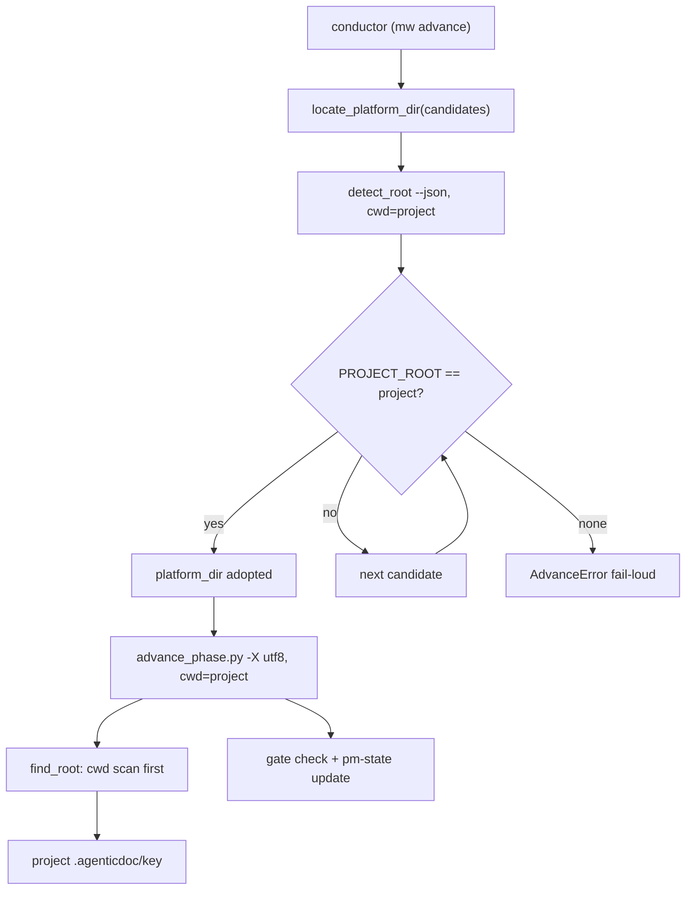

# Design: mw-autopilot-advance-root

> Key: mw-autopilot-advance-root
> 依据：spec.md（AC-001..008）、`evidence/research/spec-root-cause-2026-09-22.md`

## 1. 现状与约束

三份 framework 副本 + 三处调用方：

| 调用方 | 执行的脚本 | 现在的 root 判定 | 结果 |
|--------|-----------|-----------------|------|
| autopilot conductor（mw Python） | marker clone `…/Multi-Workers/.agents/skills/agentic-task/scripts/advance_phase.py` | `find_root()` = `Path(__file__)` 向上 | 命中 mw 仓库 `.agenticdoc`（错） |
| pi `advance_phase` 工具（TS 扩展） | `<project>/.claude/scripts/advance_phase.py` | 同上 | 命中项目 `.agenticdoc`（对，但脆弱） |
| PM 手工/代码 | `<project>/.agents/skills/agentic-task/scripts/advance_phase.py` | 同上 | 命中项目 `.agenticdoc`（对，但脆弱） |

`detect_root.py` 自身的 `PROJECT_ROOT` 同样以 `platform_dir` 为锚（`agenticdoc:platform_dir`），在 framework 位于项目外时也报错根。

## 2. 设计决策

### D-101 framework root 定位语义统一（AC-001）

四份同构脚本（`advance_phase.py` / `update_index.py` / `migrate_patterns.py` / `verify_project_memory.py`）统一为：

```
优先级：显式 root（调用方给）> cwd 向上专扫 .agenticdoc > __file__ 向上专扫（回退）
```

- 「专扫」= 只找 `.agenticdoc` 一个 marker，中途不被 `.git` / 其它通用 marker 截停（沿用 `detect_root._scan_specific_markers` 的语义）。
- `__file__` 回退保留：framework repo 自身即项目（mw 仓库场景）时，cwd 与 `__file__` 结论一致。
- 抽成每文件一个最小 `find_root()` 本地实现（不跨文件 import，避免脚本被单独拷贝后 import 失败）。

### D-102 `detect_root.detect_project_root` 优先级调整（AC-002）

把「cwd 向上专扫 `.agenticdoc`」提到最前，其后保留 `platform_dir` 专扫 → 本地 marker → IDE → 通用 marker → CI → fallback。`detect_platform_dir()`（PLATFORM_DIR）不动——脚本自身位置仍是 PLATFORM_DIR 的唯一正确来源。

理由：`PROJECT_ROOT` 是「当前项目」的事实，cwd 是调用方的项目上下文（工具链恒 `cwd=项目根`）；`PLATFORM_DIR` 是「框架装在哪」，两件事必须解耦。

### D-103 mw 候选一致性校验 + fail-loud（AC-003 / AC-006）

`locate_platform_dir(project_root)` 改为：

1. 组成候选（marker repo 一份、`<project>/.agents/skills/agentic-task` 一份，去重）。
2. 对每个含 `scripts/detect_root.py` 的候选：`python -X utf8 detect_root.py --json`（`cwd=project_root`），解析 `PLATFORM_DIR` / `PROJECT_ROOT`。
3. `Path(PROJECT_ROOT).resolve() == Path(project_root).resolve()` 且 `PLATFORM_DIR/scripts/advance_phase.py` 存在 → 采用该 `PLATFORM_DIR`。
4. 无候选通过 → `AdvanceError`，消息列出每个候选的实测 `PROJECT_ROOT`（可读、fail-loud）。

不做「首个存在的 detect_root.py 即用」——这正是本次静默写错仓库的原因。

### D-104 UTF-8 子进程输出（AC-004）

- mw `advance.py`：`locate_platform_dir` 的 detect_root 调用与 `advance()` 的脚本调用 argv 前缀 `-X utf8`（CPython 强制 UTF-8 stdio，与 wrapper 的 `encoding="utf-8"` 对齐）。
- pi 扩展 `shared/agent-scripts.ts::runAgenticScript`：同型缺陷（spawnSync encoding utf8 + 子进程 cp936），一并加 `-X utf8`，保持两侧诊断一致。
- 不用 `PYTHONUTF8=1` 环境变量：环境变量会被子进程继承影响其内部行为面更大；`-X utf8` 只约束该解释器进程。

### D-105 不重排候选优先级

实测 E2Feature 项目内副本 `a06b4a2` 落后 marker clone `e9360db`；「项目内优先」= 跑旧框架。候选选择完全由 D-103 的一致性判定决定，不由顺序决定（顺序只影响命中哪个合格候选；本项目两候选在 D-102 落地后都合格，取 marker clone = 最新框架）。

### D-106 测试策略

- framework 侧（`scripts/test_detect_root.py`、`scripts/test_advance_phase.py`、`scripts/test_update_index.py`）：cwd 专扫优先 / `__file__` 回退 的双用例。
- mw 侧（`packages/multi-workers/test_autopilot_conductor.py`）：fake framework 候选（一个 PROJECT_ROOT 不符、一个相符）→ 断言选相符者；全不符 → `AdvanceError`；argv 含 `-X utf8`。
- e2e（hermetic）：临时项目 + 真实 `advance_phase.py`（cwd=临时项目）→ spec→design exit 0；断言脚本所在仓库 `.agenticdoc` 无新目录。

### D-107 发布顺序

framework 上游 push + 各项目同步（install.py）先落地，再上 mw 的 fail-loud（AC-003），避免同步滞后窗口里合规项目被误拒。

## 3. 目标状态



## 4. 影响面

- framework：`scripts/` 四个脚本 + `detect_root.py` + 测试；镜像 `claude/scripts`、`core/scripts` 由 `install.py::sync_script_mirrors` 同步。
- mw：`packages/multi-workers/autopilot/advance.py` + 测试 + CHANGELOG。
- coding-agent：`src/extensions/agent-team-loop/shared/agent-scripts.ts`（一行）+ 既有测试；dist bundle 需重构建。
- 项目副本：`H:\git\E2Feature\{.agentic-framework 指向的 mw clone, .agents/skills/agentic-task, .claude/scripts}`。

## 5. 回滚

- framework 单个 commit，`git revert` 即回。
- mw 改动独立 commit；`advance.py` 主路径失败时 conductor 本就 fail-closed（拒绝启动/推进），无静默降级。
