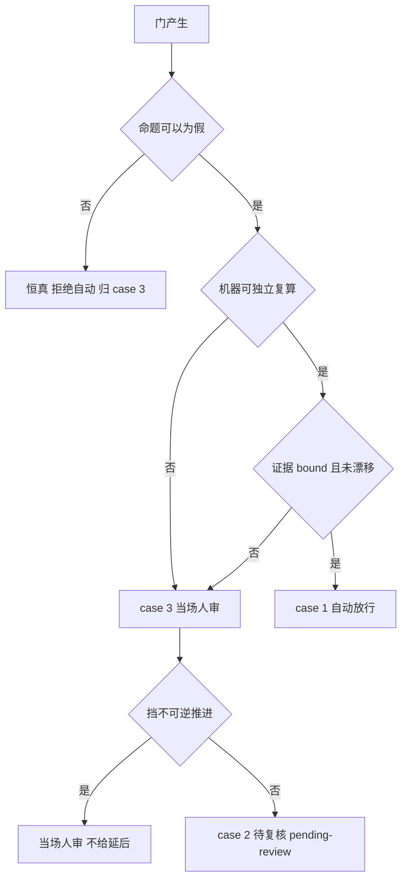
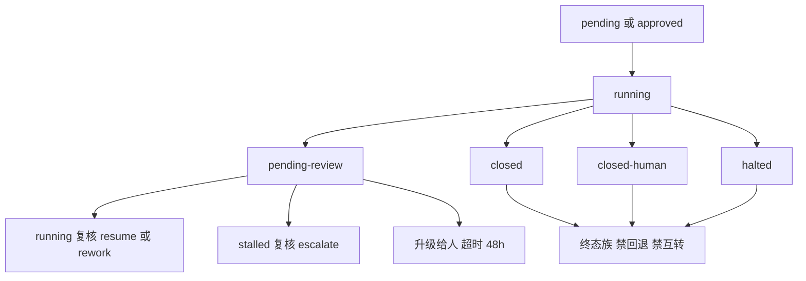
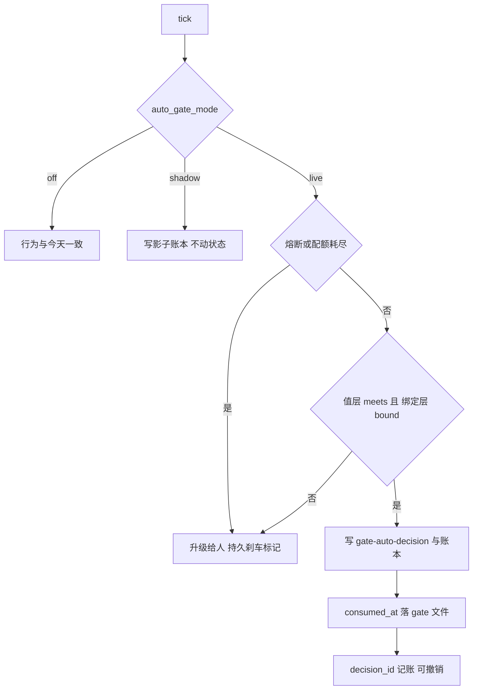
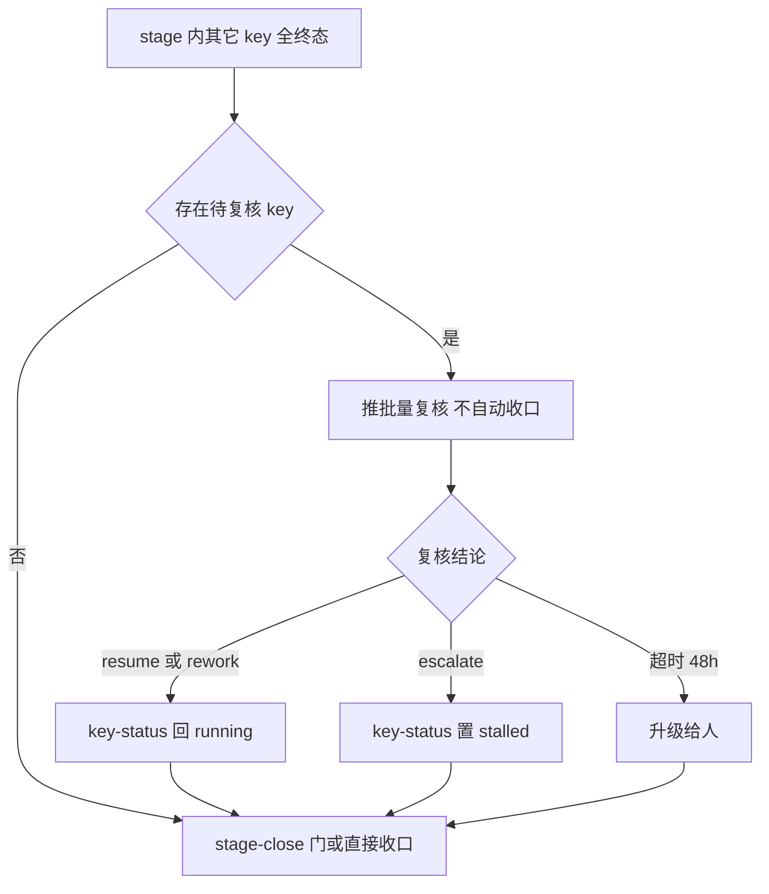

# Design: mw-autopilot-slot-capacity（gate 命题重设计 + 三分处置 + 护栏）

## §0 设计前提锚定

| 字段 | 值 |
|---|---|
| spec_path | `.agenticdoc/mw-autopilot-slot-capacity/spec.md` |
| spec_locked_at | 2026-09-26 |
| ac_count | 31 |
| ac_ids | AC-001 … AC-031（全列见 §8 映射表） |
| risks | 27（含 6 条由 `[REVISED]` 追加记录矫正的旧结论） |
| 设计输入 | `evidence/research/design-*.md` × 7（D1 命题 / D2 待复核 / D3 消费记录 / D4 取证源 / D5 自动决策控制 / D6 字段与呈现 / D7 看门狗与串行）+ `spec-*.md` × 14（RQ-1…RQ-14）+ 3 篇 PM 自采 |
| 代码基线 | `H:\git\Multi-Workers` HEAD `191a069a4`（D6 实测与 `4ef71e053` 之间零代码差异） |
| 定位（用户已确认） | **A**：主交付 = gate 命题重设计 + 三分处置 + 硬前置修复 + 护栏；次级 = (c2) 与 (d)；`max_parallel_keys` 只出"不改"结论 |

**本设计的性质**：这是一次**机制矫正**，不是加功能。核心判断来自 RQ-12/D1：**门的"命题选错了层"**——6/6 类门现有命题都是建门条件的同义反复，机器复算恒真、零信息量。所以要动的是"门问什么问题"，而不是"谁来答"。

---

## §1 架构选型

### D-001 命题模型：事实面 / 政策面两分 + 四判据

- **选择**：每类门的判断劈成两层 —— **事实面**（可自举、可证伪，进 case 1/2 判定）与**政策面**（授权/取舍，永远 case 3 人审）。事实面命题必须同时过四判据：**F1 可证伪（带 disk witness）/ F2 有信息量（`trigger ⊬ P`，即"可以为假"）/ F3 可独立复算 / F4 防伪（sha+mtime 快照 + 取证源优先级 + 来源闭集）**。
- **否决**：单层命题（现状）——它使 `stage-close` 的命题主语"全部 key 已终态"等于建门条件本身（`conductor.py:629-631` vs `:650-656`），**机器复算恒真**，自动化会退化成"自动盖章"；"按历史答案分布定白名单"（RQ-10 口径）——被 22 条 stalled approve 中 ≥16 条带带外修复、0 条裸 y/n 证伪。
- **调研**：`design-gate-propositions-20260926.md`（D1，6 门新命题 + 反例）；`spec-gate-selfverifiable-20260926.md`（RQ-12）。

重写后的事实面命题（每条附真实或构造反例，详见 D1）：

| 门 | 事实面命题（可为假） | 反例来源 |
|---|---|---|
| `stage-confirm` | `structural_validation == []` ∧ `goal_sha256` 匹配 | JC `gate-0001` 在 goal 变更后被应答 |
| `stage-close` | 每 key verdict `meets` 或 `closed-legacy` ∧ `open_items == []` | E2 Stage 2 correction `below` 而已 closed；FM `C-09`/`NRR-1/2` 只在散文；JC 实机段未做；FM 文件 `meets`/复算 `below` |
| `stalled` | `reason_code` == 复算 `cause_class` ∧ 计数一致 ∧ `false_negative_class != undecidable` | FM `gui-shell-spike` 陈旧 verdict；JC `gate-0004` `2/2` vs `3/3` |
| `budget-exhausted` | `used == limit + credits` ∧ blocking gaps 非空 | 0 生产样本（JC 计数漂移作同族） |
| `goal-change` | `sha_before != sha_after` ∧ **仅规范面变更才起门** | JC `gate-0002` 只删非规范面节 |
| `xkey-authorize` | `red_after == 0 ∧ rc == 0` ∧ `test_id` 绑定 ∧ `blast_radius ⊆ write_scope` | 构造假绿；FM 绕门散文授权 |

**边界（必须写进实现注释）**：`stage-confirm` / `stage-close` 的事实面**只够当守卫**（必要不充分）——过了守卫**不等于**可以放行，仍归 case 3。

### D-002 三分处置映射

- **选择**：**case 1（可自举自动）** = `budget-exhausted` 全域 + `stalled` 的 `proven-false-negative` 窄子集 + `xkey` 的 S4 验证步 + `goal-change` 的"仅规范面才起门"（**减少起门**，不是"答门"）；**case 2（非阻塞延后复核）** = `stalled` 的 `real-defect`/`undecidable` + `budget-exhausted`；**case 3（当场人审）** = 全部政策面 + `stage-close` 的政策面（目标是否达成 / 假阴 vs 真缺陷 / 是否越出写面）+ `goal-change` 的政策面 + `xkey` 的 P3/P5。
- **否决**：把 `stage-close` 整体归 case 1（RQ-10 原判）—— 其前置被 4 个实测反例否定，且命题恒真（D-001）。
- **调研**：`design-gate-propositions-20260926.md`、`spec-auto-gate-boundary-20260926.md`（RQ-10）、`spec-gate-selfverifiable-20260926.md`（RQ-12）。

### D-003 硬前置修复包（顺序不可换）

- **选择**：先修四个守卫缺陷，再谈自动决策。**第 0 波** = D3（TS 事件集合对齐）+ D1（`gate-\d{4}` → `gate-\d+`）；**第 1 波** = 消费记录载体 + D2（reject 对称守卫）+ D4（stage 单调性）。
- **否决**："先上自动决策再补护栏"——`_consumed_gate_ids` 的失效点（`conductor.py:310`）与 6684 门洪泛事故**共用同一段守卫**（事故注释 `:2320-2329`），FM 最大 id 已 `gate-6687`、洪泛 585.8 门/h，无上界的自动 approve 是灾难路径。
- **调研**：`design-consumption-record-20260926.md`（D3）、`spec-auto-gate-guardrails-20260926.md`（RQ-11）。

| 缺陷 | 现状锚点 | 修法 |
|---|---|---|
| D1 | `conductor.py:310` `r"(gate-\d{4})\b"` | `r"(gate-\d+)\b"`（已实测：`gate-10000` 前 `None` → 后 match） |
| D2 | `conductor.py:2363-2394` 无消费守卫 | 补与 approve（`:2315`/`:2319`）对称的守卫；可达性来源 `mark_stalled:3958` 允许 `closed-legacy → stalled` |
| D3 | `status-model.ts:779-796` 16 类 | 补 `target-config-rejected`，判据 = 与 `timeline.py:67-84` **集合相等** |
| D4 | `conductor.py:380-405`（`:392` 只判"是否不同"） | 纯函数单调判据 `pending/approved < running < {closed, closed-human, halted}`；终态族禁回退/互转/降级；拒绝留痕且去重 |

### D-004 消费记录载体

- **选择**：写在 **gate 文件**（新增 `consumed_at` / `consumed_seq`），timeline 反推**降级为只读回退**。四维判据（跨轮转持久 / 抗 id 重用 / 抗被审方伪造 / 读取代价）唯一全过：gate 目录已被 `xkey-gate-guard.ts:46-51` 封堵、`gates.enumerate` 每 tick 已读全部门文件、`gate-writer.ts:99-131` 只重写 4 个应答字段（其余行逐字保留 ⇒ 新字段不会被应答抹掉）。
- **否决**：独立 ledger（**id 跨归档重用**，实测 FM `gates/` max=10 而归档有 `gate-0004..6687` ⇒ 下次 create 得已用过的 `gate-0011`，必须改用复合键 `(id, created_at)`；留作退路）；roadmap 侧栏（roadmap-writer 一次整文件重写即全丢）；扩大 timeline 保留（**无法恢复已剪记录**，对 JC 回退零作用）。
- **调研**：`design-consumption-record-20260926.md`（D3）。

### D-005 待复核状态（case 2 的落地形态）

- **选择**：新增 key-status 值 **`pending-review`**；它**不计入 stage 终态**（`_stage_closure:629-631` 不变），复核是**收口前置** —— 触发 =「同 stage 其它 key 全终态 ∧ 该 key 无 in-flight 行」（落点 `conductor.py:266-271`）；时间兜底 **T = 48h** → 到点**升级给人**（不自动裁决）。
- **否决**：把 `pending-review` 算终态（会导致"未审即收口 → 打回 → 回退已 closed 的 stage"，即 D4 那类事故的合法版本）；把状态只放旁挂文件（两个平面会互相矛盾）；复用 `stalled` + 标记（与"尚未判定"不可区分）。
- **红线**：`_DEP_SATISFIED:56` **不含** `pending-review`（**不解锁依赖**）。
- **调研**：`design-deferred-review-state-20260926.md`（D2；27 个读点穷举 + 12 条 VC）。

### D-006 合法重开与 stage 单调性

- **选择**：重开只走 `review-decided{outcome=resume|rework|escalate}` → 一步改 key-status（resume/rework → `running`；escalate → `stalled`），**无 `done` 出口、无 `closed-legacy` 出口**；**conductor 永不主动重开 stage**，重开只由人工改 `_roadmap.md`；`_set_stage_status` 加单调判据，拒绝时写去重事件。
- **否决**：允许 conductor 自动重开（正是 JC `gate-0008` 的意外回退）。
- **调研**：D2、D3。

### D-007 证据源与快照绑定

- **选择**：**不存在单一线性优先级** —— 证据源回答三个不同命题（记录了什么 / 末轮复算是什么 / 项目声明记录错）；verdict-producing 源**取最小**（fail-closed）+ correction 为**单向 dispute**；**自动放行 = 值层 `meets` ∧ 绑定层 `bound`**。快照载体 = **每门 sidecar** `<gates>/gate-NNNN.evidence.json`（schema `gate-evidence/1`），在 `_create_gate`（`conductor.py:2159`）与门被消费时各写一份 `(path, sha256, mtime_ns, bytes)`，差集 `changed[]` 即"应答窗口内证据被改写"。
- **否决**：单一优先级链表（三命题不可比）；就地改写历史（O3）；只靠 `l3-verdict.txt`（内容只有 `meets`/`below`，**零绑定**，而 dossier 只是它的副本却是 `stage-close` 的唯一证据面）。
- **调研**：`design-evidence-provenance-20260926.md`（D4；10 源表 + 6 条 VC + 口径更正）。

### D-008 对账与拦截面

- **选择**：`claimed_done ∧ ¬bound_meets` ⇒ 告警 `evidence-reconciliation` + **拦截新的 stage-close 转换**（`_stage_closure:628-630` 之前加前置）；**历史只 warn、绝不回退**。
- **否决**：自动把 `done` 改回（回退历史）；只告警不拦（新收口会继续制造不一致）。
- **调研**：D4。

### D-009 自动决策留痕

- **选择**：新事件 **`gate-auto-decision`** + **独立 append-only 账本** `<root>/.agenticdoc/_autopilot/auto-decisions.jsonl`（timeline 只留 2 代，会被轮转吃掉 —— JC `gate-0008` 的教训）。timeline 行新增可选 `data` 载荷；**权威字段全部由 conductor 派生**：`decided_at`（conductor 时钟 + `seq`）、`evidence[]`（`{path,sha256,mtime_ns}` 快照）、`rule_id`/`rule_version`（代码常量）、`switch`（`load_effective` 结果 + `config_sha256`）。门文件的 `answered_by`/`answered_at` **降级为展示字段、非权威**。
- **否决**：把来源塞进 `gate-answered.detail`（会污染 `_consumed_gate_ids` 的 `re.match` 解析面）；只写 timeline（2 代轮转）。
- **调研**：`design-auto-decision-controls-20260926.md`（D5）。

### D-010 开关（只停自动决策）

- **选择**：新键 **`auto_gate_mode`**（str，闭集 `off｜shadow｜live`，默认 `off`）。一个键同时覆盖"只停自动决策"（AC-018）与影子模式（AC-024），且无非法组合；**不加入** `EFFECTIVE_KEYS`（`effective_config.py:66-70` 维持 2 个 xkey 键）——策略开关不该被机器层静默改写。
- **否决**：两个 bool（非法组合）；扩 `paused` 为三态（混淆"软停整个 orchestrate"与"只停 auto"，正是要分开的两件事）；纯 env（撞 P-015，重启路径不同则 env 丢失）；门级刹车（会把刹车显示成一个待答门，误导人审队列）。
- **代价（必须计入 plan）**：两侧镜像 + parity 语料 **53 → 约 55** + `FROZEN_CORPUS_SHA256/COUNT` 重冻 + `13 → 14` 计数断言（`test_autopilot_config_parity.py:423-431`、`autopilot-config-parity.test.ts:356/359`）。
- **调研**：D5。

### D-011 配额、熔断与回滚

- **选择**：配额/熔断**复用既有原语** P1–P9（P5 消费一次 / P4 尝试上限 + 持久 exhausted + P3 `advance_stall_ticks` 1..50 / `gate.created_at` 冷却时钟 / P6 文件驱动刹车 / P9 kill switch）；**熔断状态必须落盘**（窗口扫描会被 2 代轮转吃掉）；熔断动作 = **升级给人 + 报告**（用户已确认 U-9 = B）。回滚三件套 = 按来源过滤 / 批量回看（`mw doctor` + `/autopilot`）/ 单条撤销（`gate-auto-revoke`，消费集合 = `answered − revoked` 按 `decision_id` key）。
- **否决**：自造状态机；内存态熔断；依赖 `_consumed_gate_ids` 逆操作（append-only 派生，不可逆）。
- **调研**：D5、`spec-auto-gate-guardrails-20260926.md`（RQ-11）。

### D-012 影子模式门槛

- **选择**：`mode=shadow` 只写账本、不动状态；上线门槛 = **≥5 夜 ∧ ≥20 条影子决策 ∧ 每条拟上线规则至少 1 个"命题为假"的反例**（否则规则恒真、零信息量，违反 D-001/F2）。收益量化直接用既有实测（过夜等待占比 FM 88.0% / E2 85.6%；门→收口视界 p50 24.48h / max 145.99h）。
- **否决**：直接 live；用"历史 100% 一致"当门槛（RQ-10 陷阱 + 选择偏差）。
- **调研**：D5、`spec-auto-gate-boundary-20260926.md`、`spec-unattended-stage-closure-20260926.md`（RQ-8）。

### D-013 守卫覆盖面（安全属性）

- **选择**：把 `_autopilot/**`（至少 `timeline.jsonl`、`config.json`、`auto-decisions.jsonl`）纳入 `xkey-gate-guard.ts` 的封堵面——现在它们**不在任何守卫内**，被审方可 append 伪造事件或自己翻转开关。自动决策**在 conductor（Python）侧实现**，**不放开** agent 写 gate 目录的权限。
- **残余风险（显式声明）**：同 uid 带外进程写入无法在应用层阻止；守卫只能让"经 agent 工具通道的伪造"**留下拒绝记录**。
- **调研**：D5。

### D-014 gate 字段 schema v2

- **选择**：**12 个已有字段（底座）+ 26 个新增**（RQ-12 的 23 条全保留 + `default_action`（承载 RQ-14 F13）、`out_of_band_actions`（承载 F10）、`gate_schema`（版本标记，缺省=1））。新字段**一律可选**、**不进** `_REQUIRED_FIELDS`（`gates.py:86-89`）⇒ 既有 34 个门文件照旧解析、缺字段 = 无自动资格 = case 3。**手写 YAML 子集不支持嵌套**、唯一列表字段是 `context_refs` ⇒ 结构化字段编码为**单行 JSON 子串**，并新增具名列表字段 `evidence_refs`。
- **否决**：就地扩 `_REQUIRED_FIELDS`（会让 34 个历史门解析失败）；嵌套 YAML（解析器不支持）。
- **调研**：D6、D1、`spec-gate-selfverifiable-20260926.md`。

### D-015 三层呈现契约

- **选择**：层 A 面板**每门 1 行 ≤110 列**（`monitor.ts:644-654`；`MonitorGate` 现无 `created_at` `:89-96`；截断**头保留** `:531-533`）；层 B `/autopilot gates` 门卡片**固定 13 行序**、**每条逻辑行恰好 1 物理行**（修正 RQ-14 的"≤N 行"矛盾）、行数 = `1+13N`（`console.ts:182-198`）；层 C 新增 `_doctor_gates`（邻 `mw_common.py:2022-2064`，JSON 出口 `mw.py:524-525`）。判据 **D1–D7**：白名单+来源三元组 / 逐字子串断言 / 头尾保留式截断 / **禁 LLM 自由生成**（源码级 + 唯一哨兵字面量 `unknown (no field)`）/ **DRIFT 标记**（`mtime > created_at`）/ `note` 不得作派生输入 / 数字带公式。
- **否决**：面板直接渲染自由文本摘要（不可机器校验，且 LLM 生成会漂移）。
- **调研**：D6、`spec-gate-review-material-20260926.md`（RQ-14）。

### D-016 (c2) idle 看门狗：心跳而非阈值

- **选择**：修法 **D（结构化 `[IDLE_KILL]` 证据）+ B（in-flight 工具分类判定 + `toolIdleMs`）+ C（无工具在飞分支的二次确认）**。根因是 **bash 的 update 是输出驱动**（`core/tools/bash.ts:200/371-373/392-401/411-414`），而 RAG 早已用 `withHeartbeat` 30s 续命（`rag/budget.ts:257-280`）⇒ **bash 缺的是同一套心跳**。
- **否决**：单独抬阈值（数据被阈值截尾，无法回答"抬多高"）；沿用文档里"长推理/无工具调用"的旧根因（**对 22/24 无效**）。
- **实测**：24 次判死（5 项目），`idle_s` 601–622、余量 1–22s、bash 23/24、22/24 "工具起→判死" == `idle_s`；6 次重试仍非 0（3 个任务连死两次）。
- **调研**：`design-watchdog-and-serial-20260926.md`（D7）。

### D-017 `worker_timeout_min` 接线（不改键集合）

- **选择**：**接线**——两侧同渲染 task.md 头的 `timeout:` 字段（`render_task_md` `dispatch.py:262-331` 现不渲染）。**不动键集合 ⇒ 不动 parity 语料**。
- **否决**：删键（fail-closed 会拒掉现存 13 键配置）。
- **调研**：D7。

### D-018 (d) per-key 串行：本 key **只做可观测与判据，不放开**

- **选择**：确认 `conductor.py:258-264` + `:287-288` + `_advance_key:908-1015` 构成**硬顺序**；本 key 只补拦截面设计与可检测信号（三个逃逸口：PM 手工通道无判定 / 行提前终态化（实测重叠 89.2s、6.4s）/ xkey 提案通道）。
- **否决**：本 key 放开 per-key 并发——硬前置"写面声明 → 机器可读 → 重叠拒绝"**机器判定为零**（11/248 只在散文），且夜跑主因是 gate 不是并发。
- **调研**：D7、`spec-worker-serialization-20260926.md`（RQ-5）。

### D-019 归属语义统一

- **选择**：行级新增 **`origin` 列**（写者路径填）+ 统一 `owner_key` 判据 + 旧行按 `path` 兜底；面板拆 `slotsUsed` / `manualRunning`。现状是**三套口径分歧**（`conductor.py:2135-2138` 前缀 OR path / `monitor.ts:509-513` 仅前缀 / `mw.py:1801-1820` 仅 path），且 **`ap-` 前缀是假信号**（6 行带前缀但无 `origin: conductor`）。
- **否决**：继续用前缀（假信号）；只用 path（丢 PM 行）。
- **调研**：D7、`spec-cap-breach-attribution-20260926.md`（RQ-9）、`spec-panel-semantics-divergence-20260926.md`（RQ-7）。

### D-020 槽位上限：**不改**（证据化结论）

- **选择**：`max_parallel_keys` 默认 2 保持不变。证据：cap gate **从未越界**（E2 的 `4/2` 全归因为 PM 行复用 `ap-` 前缀，RQ-9）；FM 的瓶颈是 gate 不是槽（门等待是槽位等待的 8.7 倍，FM 无槽位排队实例）；改默认对 FM/E2 是**空操作**（两项目已显式材料化 13 键）。
- **否决**：提默认值（空操作）；机器层覆盖 int 键（撞"空值即未决定"无 int 哨兵的语义缺口，且机器层 Python-only ⇒ 面板会撒谎）。
- **调研**：RQ-2/RQ-3/RQ-6/RQ-9、`spec-capacity-constraints-20260926.md`。

### D-021 `pending-review` 的两侧同波约束

- **选择**：key-status enum 是 **跨语言 fail-closed 契约**（`roadmap.py:352` 未知值 ⇒ `conductor.py:210-212` **跳过整个 tick**）⇒ Python + TS **必须同波**上线；`monitor.ts:505` 与 `_DEP_SATISFIED:56` 是**两份独立镜像字面量**，用 parity VC 锁定。
- **调研**：D2。

### D-022 实施波次（写进 plan）

| 波 | 内容 | 约束 |
|---|---|---|
| 0 | D3（TS 事件集合）+ D1（`gate-\d+`） | 无依赖，可并行 |
| 1 | 消费记录载体（D-004）+ D2（reject 守卫）+ D4（stage 单调性） | 载体先定 |
| 2 | 命题重写 + 字段 schema v2 + 呈现三层 + 开关/留痕/熔断/回滚 + 影子模式 | 依赖波 0/1 |
| 3 | `pending-review` + 收口前置 + 合法重开 | 依赖波 1 的单调性 |
| 4 | (c2) 心跳 + `worker_timeout_min` 接线 + 归属列 + 观测 | 与波 2/3 无写面冲突 |

---

## §2 核心结构

处置判定（设计骨架，用户已确认该顺序）：



状态机（key-status 与 stage）：



---

## §3 模块划分

| 模块 | 文件 | 职责（单一） |
|---|---|---|
| 门定义与解析 | `packages/multi-workers/autopilot/gates.py` | `GATE_KINDS`/`FRONTMATTER_FIELDS`（+26 可选字段）/`_REQUIRED_FIELDS`（**不动**）；fail-closed 解析 |
| 门呈现镜像 | `packages/coding-agent/src/extensions/agent-team-loop/autopilot/status-model.ts` | `EVENT_TYPES`（补 `target-config-rejected` + 新事件）/`GATE_FRONTMATTER_FIELDS`/`TIMELINE` 载荷白名单加 `data` |
| 编排与决策 | `packages/multi-workers/autopilot/conductor.py` | 守卫修复、命题谓词、收口前置、单调性、自动决策执行、留痕 |
| 消费记录 | `gates.py`（字段）+ `conductor.py`（6 写点 / 3 读点） | 门文件内持久化 + timeline 只读回退 |
| 证据快照 | `conductor.py`（`_create_gate:2159` + 消费点）+ `<gates>/gate-NNNN.evidence.json` | `(path,sha256,mtime_ns,bytes)` 两时点 + `changed[]` |
| 取证源解析 | 新增 helper（读 `l3-verdict.txt` / correction sidecar / provenance） | 三命题取最小 + correction 单向 dispute |
| 配置 | `autopilot/config.py` + TS `config` 镜像 | `auto_gate_mode`（off/shadow/live）+ 两侧 allowlist |
| 观测 | `monitor.ts`（层 A）/ `console.ts`（层 B）/ `mw_common._doctor_gates`（层 C） | 三层呈现契约 + DRIFT 标记 |
| 工作窗口 | `shared/xkey-gate-guard.ts` | 封堵面扩到 `_autopilot/**` |
| worker 心跳 | `core/tools/bash.ts` + `worker-mode.ts` | in-flight 分类判定 + 心跳 + `[IDLE_KILL]` 证据 |
| 归属 | `worker-store.ts` / `mw_common.parse_workers_file` | 行级 `origin` 列 + `owner_key` 判据 |

依赖方向：`gates.py` / `config.py`（无内部依赖）← `conductor.py` ← 观测层；TS 侧与之**同构镜像**，无跨语言运行时依赖（共享**冻结语料**做 parity）。

---

## §4 接口与集成

### 4.1 新增 timeline 事件（两侧同集合）

| 事件 | 载荷要点 | 触发 |
|---|---|---|
| `gate-auto-decision` | `data{decision_id, gate_id, gate_kind, mode, executed, decision, rule_id, rule_version, reason_code, decided_by, decided_at, evidence[], switch{}, budget{}, gate_file_sha256_before/after, counterfactual_human}` | 每次自动决策（影子与实动共用） |
| `gate-auto-revoke` | `data{decision_id, revoked_at, by}` | 人工撤销 |
| `review-decided` | `data{outcome: resume｜rework｜escalate, key, stage}` | 待复核结论 |
| `review-escalated` | `data{key, age_s, deadline_s}` | 48h 兜底 |
| `evidence-reconciliation` | `data{key, gate_id, claimed, bound, changed[]}` | 对账不一致 |
| `stage-reopen-refused` | `data{stage, from, to, reason}` | 单调性拒绝（去重） |

### 4.2 新增 gate 字段（26，全可选）

分组：**命题类**（`reason_code` / `machine_evidence` / `cause_class` / `false_negative_class` / `normative_changed` / `goal_sha256` / `test_id` / `blast_radius`）、**归属与来源**（`decided_by_system` / `credits_used` / `auto_decision_budget` / `origin`）、**时效与默认**（`expires_at` / `default_action` / `open_items` / `out_of_band_actions`）、**取证**（`evidence_refs`〔新列表字段〕/ `evidence_snapshot` / `consumed_at` / `consumed_seq`…）、**版本**（`gate_schema`）。结构化值一律**单行 JSON 子串**。

### 4.3 CLI / 观测出口

- `mw autopilot gates [--json]`：层 B 的机器出口（固定 13 行序）。
- `mw doctor`：新增 gate 段（6 类告警 I1–I6 + 修复串 + 2 条零扰动规则）。
- 面板：每门 1 行 ≤110 列；conductor 行追加 `auto=off｜shadow｜live`；slots 行拆 `slotsUsed`/`manualRunning`。

### 4.4 外部集成

FM / E2 / JC 通过**同一套机制**工作：`pending-review` 需两侧同波、`auto_gate_mode` 默认 `off`（opt-in，行为与今天一致）、历史数据**不回填不改写**（共存读取），`mw doctor` 只读零写（不建目录/文件，继承 `_doctor_autopilot:2023-2024` 契约）。

---

## §5 Function Flow

自动决策主链：



收口与待复核：



异常出口（全部 fail-closed，不静默）：解析失败 ⇒ `GateFormatError` / 未知 key-status 值 ⇒ 跳 tick + 告警 / 证据不一致 ⇒ 拦新 `stage-close` / 熔断 ⇒ 升级给人 / 单调性拒绝 ⇒ 去重事件。

---

## §6 Coverage Matrix

| ID | 功能点 | 正常路径 | 边界 | 异常路径 | 层级 |
|---|---|---|---|---|---|
| F1 | 上限事实与成因 | 三态标注齐全 | 无出处的结论 | 数据不足时声明 | L0 |
| F2 | 占槽判定 | 非终态占槽 | `done` 的残留行 | 孤儿行 | L1 |
| F3 | idle 看门狗 | 心跳续命 | 无工具在飞 | 真挂死仍被杀 | L1 |
| F4 | 门命题 | 4 判据全过 | 命题恒真 | 证据缺 ⇒ 拒自动 | L0 |
| F5 | 消费记录 | 门字段命中 | timeline 回退 | id 重用 | L1 |
| F6 | 守卫缺陷 D1–D4 | 修复后转绿 | `gate-10000` | reject 重放 / stage 回退 | L1 |
| F7 | 三分处置 | case1/2/3 各归其位 | 政策面永 case3 | 恒真 ⇒ 拒绝自动 | L0 |
| F8 | 待复核 | 触发式批量 | 48h 兜底 | 不解锁依赖 | L2 |
| F9 | 合法重开 | `review-decided` | 无 done 出口 | conductor 主动重开 ⇒ 拒 | L1 |
| F10 | 证据快照 | sidecar 两时点 | 差集 `changed[]` | 漂移 ⇒ 拦新收口 | L1 |
| F11 | 自动留痕 | `data` 字段完整 | 影子模式 | 丢字段 ⇒ 审计失败 | L1 |
| F12 | 开关 | `off` 行为不变 | `shadow` 无副作用 | 非法值 ⇒ fail-closed | L1 |
| F13 | 熔断 | 阈值触发 | 重启后仍熔断 | 熔断 ⇒ 升级给人 | L1 |
| F14 | 回滚 | `answered − revoked` | 批量回看 | 撤销后 stage 不回退 | L1 |
| F15 | 字段 schema v2 | 新字段可选 | 老文件缺字段 | 老代码读新文件 ⇒ fail-closed | L0 |
| F16 | 三层呈现 | 逐字子串 | 截断头保留 | LLM 生成 ⇒ 断言失败 | L1 |
| F17 | 守卫覆盖面 | `_autopilot/**` 被拦 | 带外进程 | 工具通道伪造留痕 | L0 |
| F18 | 归属 | `origin` 列 | 旧行 path 兜底 | 前缀假信号 | L1 |
| F19 | `worker_timeout_min` | 接线生效 | 缺 `timeout:` | 维持 60m | L1 |
| F20 | 跨语言 parity | 集合相等 | 语料重冻 | 单侧上线 ⇒ 拒 | L1 |

---

## §7 Verification Contract

> 每条：触发 → 断言 → Layer → `[VERIFY]` 输出 → Source(AC)。L0 静态/契约，L1 局部（单侧实现 + 单测），L2 端到端。

```
VC-001: 当审阅 spec 与 spec-*.md 时，三个并行度上限各带 file:line 出处且成因标注属于三态之一
       Layer: L0   Output: [VERIFY] VC-001: caps=3 annotated=3   Source: AC-001, AC-002
VC-002: 当复算占槽判定时，非终态行集合与 in_flight_keys 逐 key 相等（与 key-status 无关）
       Layer: L1   Output: [VERIFY] VC-002: rows_matched=true   Source: AC-004
VC-003: 当复算并发利用率时，输出打满率与 worker 数分布且样本量写明
       Layer: L0   Output: [VERIFY] VC-003: projects>=2   Source: AC-003
VC-004: 当 idle 判死时，事件含 [IDLE_KILL] 与 in-flight 工具名、工具已运行秒数、阈值
       Layer: L1   Output: [VERIFY] VC-004: idle_evidence=complete   Source: AC-005
VC-005: 当 bash 在飞且无输出超过 toolIdleMs 时，worker 不被判死（心跳续命）
       Layer: L1   Output: [VERIFY] VC-005: alive=true   Source: AC-005
VC-006: 当 worker 真挂死（无 in-flight 工具且无 token 增量）时，仍被判死
       Layer: L1   Output: [VERIFY] VC-006: killed=true   Source: AC-005
VC-007: 当枚举 6 类门时，每类给阻塞范围 key/stage/roadmap 且带 conductor 锚点
       Layer: L0   Output: [VERIFY] VC-007: kinds=6 anchors=6   Source: AC-006
VC-008: 当渲染任一 pending 门时，每条最小信息项来自机器抽取字段（非 LLM 生成）
       Layer: L1   Output: [VERIFY] VC-008: generated=false   Source: AC-007, AC-026
VC-009: 当检查 per-key 派发点时，同一 key 同一 tick 至多一个 in-flight 行
       Layer: L1   Output: [VERIFY] VC-009: per_key_max=1   Source: AC-008
VC-010: 当提交方案集时，含"不改"项且每项给取值域、校验与首个失败模式
       Layer: L0   Output: [VERIFY] VC-010: options>=3 includes_noop=true   Source: AC-009
VC-011: 当比对两侧 key-status 集合时，Python 与 TS 的 enum 逐值相等
       Layer: L1   Output: [VERIFY] VC-011: equal=true   Source: AC-010, AC-021
VC-012: 当比对两侧 EVENT_TYPES 时，排序集合相等（含 target-config-rejected）
       Layer: L1   Output: [VERIFY] VC-012: equal=true count=18   Source: AC-010, AC-022
VC-013: 当阅读结论时，每条回应 (c1)(c2)(c3)(c3′)(d) 并由 AC-002..AC-010 支撑
       Layer: L0   Output: [VERIFY] VC-013: answered=5   Source: AC-011
VC-014: 当面板渲染 slots 时，key 层槽位与 worker 层运行数分别可读且口径显式标注
       Layer: L1   Output: [VERIFY] VC-014: distinct=true manual_split=true   Source: AC-012, AC-021
VC-015: 当审计逃逸口时，三处各带 file:line 且"行提前终态化"给实测复算样本
       Layer: L0   Output: [VERIFY] VC-015: escapes=3 sample=true   Source: AC-013
VC-016: 当检查写面声明时，机器可读判据存在（非仅散文）；缺位时首个失败模式写明
       Layer: L0   Output: [VERIFY] VC-016: machine_check=true   Source: AC-014
VC-017: 当枚举自动决策反作用时，每条附配套机制或显式"本 key 不处理"
       Layer: L0   Output: [VERIFY] VC-017: effects<=>mitigations   Source: AC-015
VC-018: 当判定门可自动性时，命中 4 判据的门集合 == case 1 集合（其余归 case 2/3）
       Layer: L0   Output: [VERIFY] VC-018: case1=[budget-exhausted,stalled(FN-subset),xkey-S4]   Source: AC-016, AC-025
VC-019: 当每夜自动决策达到配额上界时，后续门一律不自动且写 escalate
       Layer: L1   Output: [VERIFY] VC-019: capped=true   Source: AC-017
VC-020: 当门量出现 burst（超过阈值）时，熔断触发且状态落盘（重启后仍熔断）
       Layer: L1   Output: [VERIFY] VC-020: breaker_persisted=true   Source: AC-017
VC-021: 当写入自动决策时，账本每行含 decision_id/rule_id/evidence[]/switch/budget
       Layer: L1   Output: [VERIFY] VC-021: fields=complete   Source: AC-018, AC-030
VC-022: 当把 auto_gate_mode 置 off 时，autopilot 其余功能不受影响且无自动动作
       Layer: L1   Output: [VERIFY] VC-022: others_running=true auto_actions=0   Source: AC-018
VC-023: 当撤销一条自动决策时，消费集合 = answered − revoked 且门回到 pending
       Layer: L1   Output: [VERIFY] VC-023: revoked_only_one=true   Source: AC-018
VC-024: 当某类门无声明式默认动作时，机器判定为告警而非隐式永久滞留
       Layer: L1   Output: [VERIFY] VC-024: alert=true   Source: AC-019
VC-025: 当尝试经 agent 工具通道写 gate 目录或 _autopilot/** 时，写入被拒并留痕
       Layer: L1   Output: [VERIFY] VC-025: blocked=true trace=true   Source: AC-020
VC-026: 当自动决策关闭时，agent 对 gate 目录的写权限与今天一致（未放开）
       Layer: L1   Output: [VERIFY] VC-026: agent_write=denied   Source: AC-020
VC-027: 当读取行归属时，conductor 派发行与 PM 手工行可机器区分（origin 列）
       Layer: L1   Output: [VERIFY] VC-027: distinguishable=true   Source: AC-021
VC-028: 当历史行无 origin 时，按 path 兜底且不误判为 conductor 行
       Layer: L1   Output: [VERIFY] VC-028: fallback=path   Source: AC-021
VC-029: 当 gate id 为 5 位时，已消费集合仍能命中（正则修复）
       Layer: L1   Output: [VERIFY] VC-029: gate-10000 matched=true   Source: AC-022
VC-030: 当已消费的 reject 门再次出现时，key-status 不被二次改写
       Layer: L1   Output: [VERIFY] VC-030: rewrites=1   Source: AC-022
VC-031: 当同一门被两个消费者读取时，消费判定按 (id, created_at) 复合键，不串代
       Layer: L1   Output: [VERIFY] VC-031: reuse_safe=true   Source: AC-022, AC-023
VC-032: 当统计历史答案分布时，按唯一门文件/id 去重且处理洪泛与重放（不产出幻觉比例）
       Layer: L0   Output: [VERIFY] VC-032: dedup=file_id flood_handled=true   Source: AC-023
VC-033: 当 shadow 模式运行时，账本新增影子行而 gate 文件与 key-status 零改动
       Layer: L1   Output: [VERIFY] VC-033: state_delta=0   Source: AC-024
VC-034: 当影子样本不足门槛时，live 不可开启（≥5 夜 ∧ ≥20 条 ∧ 每规则 ≥1 反例）
       Layer: L1   Output: [VERIFY] VC-034: gate_blocked=true   Source: AC-024
VC-035: 当某门的新命题可被构造为真时，该门不得进入 case 1（恒真自检）
       Layer: L0   Output: [VERIFY] VC-035: tautology_rejected=true   Source: AC-025
VC-036: 当门进入 case 1 时，其事实面命题含"可以为假"的反例与 disk witness
       Layer: L0   Output: [VERIFY] VC-036: falsifiable=6/6   Source: AC-025
VC-037: 当渲染门卡片时，行数 == 1+13N 且每逻辑行 1 物理行
       Layer: L1   Output: [VERIFY] VC-037: lines=1+13N   Source: AC-026
VC-038: 当某字段缺失时，渲染唯一哨兵 `unknown (no field)` 且仅 pending 门报 missing
       Layer: L1   Output: [VERIFY] VC-038: sentinel=true missing_scope=pending   Source: AC-026
VC-039: 当待复核 key 存在时，stage-close 门不建、不自动收口
       Layer: L2   Output: [VERIFY] VC-039: blocked=true   Source: AC-027
VC-040: 当 stage 内其它 key 全终态时，同 tick 触发全部待复核 key 的批量复核
       Layer: L1   Output: [VERIFY] VC-040: batched=true   Source: AC-027
VC-041: 当待复核超过 48h 时，写 review-escalated 且状态不变
       Layer: L1   Output: [VERIFY] VC-041: escalated=true state_unchanged=true   Source: AC-027
VC-042: 当 stage 状态将被写回退时，写入被拒且写一条去重的 stage-reopen-refused
       Layer: L1   Output: [VERIFY] VC-042: refused=1 dedup=true   Source: AC-028
VC-043: 当重放已答门（JC gate-0008 式 fixture）时，stage 保持 closed 且无新门
       Layer: L1   Output: [VERIFY] VC-043: stage=closed new_gates=0   Source: AC-028
VC-044: 当 correction 声明 corrected_value=below 时，该 key 不得同时是 roadmap done 且 stage closed
       Layer: L1   Output: [VERIFY] VC-044: inconsistent=0   Source: AC-029
VC-045: 当证据在应答后被改写时，changed[] 非空且按快照 sha256 检出
       Layer: L1   Output: [VERIFY] VC-045: drift_detected=true   Source: AC-029
VC-046: 当审计自动决策时，权威字段全部由 conductor 派生（不读 answered_by/answered_at）
       Layer: L1   Output: [VERIFY] VC-046: derived=true   Source: AC-030
VC-047: 当被审方改写 timeline/账本/开关文件时，经工具通道被拒并留拒绝记录
       Layer: L1   Output: [VERIFY] VC-047: forgery_blocked=true   Source: AC-030, AC-020
VC-048: 当跨 key 授权经散文通道发生时，机器判定为未授权（导门即未授权）
       Layer: L1   Output: [VERIFY] VC-048: unauthorized=true   Source: AC-031
VC-049: 当 roadmap 不合法时，校验被调用且问题可见（现状 validate_roadmap 未被调用）
       Layer: L1   Output: [VERIFY] VC-049: validated=true   Source: AC-031
```

---

## §8 AC → VC 映射表

| AC ID | AC 摘要 | 对应 VC | 路径分类 |
|---|---|---|---|
| AC-001 | 上限清单（key/worker 层）带锚点 | VC-001 | 正常 |
| AC-002 | 上限成因三态标注 | VC-001 | 正常 |
| AC-003 | 利用率与排队实测 | VC-003 | 正常 |
| AC-004 | 占槽判定规则 + 三类状态占槽表 | VC-002 | 边界 |
| AC-005 | (c2) idle 误杀证据链与修法 | VC-004, VC-005, VC-006 | 正常/边界/异常 |
| AC-006 | (c1) 门阻塞面全清单 | VC-007 | 正常 |
| AC-007 | 审核材料可判定性 | VC-008 | 正常 |
| AC-008 | (d) 串行化点清单 | VC-009 | 正常 |
| AC-009 | ≥3 候选方案（含不改） | VC-010 | 正常 |
| AC-010 | 两侧镜像一致性 | VC-011, VC-012 | 异常 |
| AC-011 | 结论由证据链支撑 | VC-013 | 正常 |
| AC-012 | 可观测性（两个量可区分） | VC-014 | 正常 |
| AC-013 | 逃逸口与双写源 | VC-015 | 边界 |
| AC-014 | 并发安全前置清单 | VC-016 | 边界 |
| AC-015 | 自动决策反作用清单 | VC-017 | 异常 |
| AC-016 | 自动决策边界与判据 | VC-018 | 正常 |
| AC-017 | 副作用防护机制 | VC-019, VC-020 | 边界/异常 |
| AC-018 | 审计与可回滚 | VC-021, VC-022, VC-023 | 正常/异常 |
| AC-019 | 默认动作显式声明 | VC-024 | 异常 |
| AC-020 | 实现面与安全属性 | VC-025, VC-026 | 异常 |
| AC-021 | 归属语义统一 | VC-027, VC-028 | 正常/边界 |
| AC-022 | 门消费守卫缺陷 D1–D3 | VC-029, VC-030, VC-031 | 异常 |
| AC-023 | 统计口径与陷阱 | VC-032 | 边界 |
| AC-024 | 影子模式门槛 | VC-033, VC-034 | 正常/异常 |
| AC-025 | 命题三分判定（含恒真自检） | VC-035, VC-036 | 正常/异常 |
| AC-026 | 最小信息契约与三层呈现 | VC-037, VC-038 | 正常/边界 |
| AC-027 | 非阻塞延后复核（收口前置） | VC-039, VC-040, VC-041 | 正常/边界/异常 |
| AC-028 | 消费记录持久化与 stage 单调性 | VC-042, VC-043 | 异常 |
| AC-029 | 取证源优先级与对账 | VC-044, VC-045 | 异常 |
| AC-030 | 不可伪造审计字段 | VC-046, VC-047 | 异常 |
| AC-031 | 门有效性审计 | VC-048, VC-049 | 异常 |

覆盖率：31/31 AC 均有 ≥1 条 VC（VC-001…VC-049）。

---

## §9 非功能实现方案

**fail-closed 全链**：解析失败（`GateFormatError`）、未知 key-status 值（跳 tick + 告警）、证据不 `bound`（拒自动）、配额/熔断（升级给人）、单调性冲突（拒绝 + 去重事件）、cwd/命令不可用（沿用 xkey 的 `cannot prove green` 范式）。**任何"无法证明"都不得变成"放行"。**

**并发与锁**：门文件写入继续走既有门锁；若采用 ledger 退路则用 `.mw/gate-consumption.lock`（与 `.mw/workers.lock` 不同名，避免与 worker 行锁互相阻塞）；账本与 timeline 单写者（conductor）。

**观测与可回看**：层 A/B/C 三层（§4.3）；DRIFT 标记（`mtime > created_at`）；批量回看按 `decision_id` 汇总昨夜自动决策；doctor 6 类告警带修复串。

**迁移零成本**：只读面零写、不建目录文件；历史门/历史 stage 不回填不改写；`gate_schema` 缺省=1 区分"老文件"与"被剥字段"；消费记录**共存读取**（新载体 ∪ timeline 反推），另给可选一次性 backfill（单调谓词可覆盖 JC `gate-0001`）。

**跨语言 parity**：EVENT_TYPES 集合相等、key-status enum 相等、配置键数与语料 sha/count 重冻（53 → 约 55）、`13 → 14` 断言；verify 期**两侧都跑**（P-021）。

**性能**：无新增每 tick 全扫（`gates.enumerate` 已是既读）；快照只在建门与消费两点写；证据源解析按需读取，不进入热路径。

---

## §10 决策记录

| D-ID | 决策点 | 选择 | 否决 | 理由 |
|---|---|---|---|---|
| D-001 | 命题模型 | 事实面/政策面两分 + 4 判据 | 单层命题 | 现状 6/6 命题恒真、零信息量 |
| D-002 | 三分处置映射 | case1 仅预算/假阴窄集/xkey-S4 | stage-close 整体自动 | 4 反例否定其前置 |
| D-003 | 硬前置修复顺序 | 波 0（D3+D1）→ 波 1（载体+D2+D4） | 先上自动再补护栏 | 无上界自动 approve 是灾难路径 |
| D-004 | 消费记录载体 | gate 文件字段 + timeline 回退 | 独立 ledger / roadmap 侧栏 / 扩轮转 | id 跨归档重用；roadmap 被整写；剪掉的记录不可恢复 |
| D-005 | 待复核形态 | 非终态 + 收口前置 + 48h 升级 | 算终态 / 旁挂状态 | 算终态会导致回退已 closed 的 stage |
| D-006 | 合法重开 | `review-decided` 只动 key-status | conductor 自动重开 | JC `gate-0008` 即意外回退 |
| D-007 | 证据源与快照 | 三命题 + 取最小 + 单向 dispute；每门 sidecar | 单一优先级 / 只靠 verdict.txt | `l3-verdict.txt` 零绑定且是唯一证据面 |
| D-008 | 对账 | 拦新 `stage-close`，历史只 warn | 自动改回 done / 只告警 | 不回退历史且不继续制造不一致 |
| D-009 | 自动留痕 | 新事件 + 独立账本 + conductor 派生字段 | 塞进 `gate-answered.detail` / 只写 timeline | 污染 `re.match` 解析面；2 代轮转 |
| D-010 | 开关 | `auto_gate_mode` off/shadow/live，不入 `EFFECTIVE_KEYS` | 两 bool / 扩 paused / env / 门级刹车 | 无非法组合；策略键不该被机器层改写 |
| D-011 | 配额熔断回滚 | 复用 P1–P9 + 熔断落盘 + `gate-auto-revoke` | 自造状态机 / 内存熔断 / 逆操作消费集 | 原语已足；重启后仍须熔断 |
| D-012 | 影子门槛 | ≥5 夜 ∧ ≥20 条 ∧ 每规则 ≥1 反例 | 直接 live / 历史一致率 | 防恒真规则与选择偏差 |
| D-013 | 守卫覆盖面 | `_autopilot/**` 纳入封堵 + conductor 侧实现 | 放开 agent 写 gate | 被审方当前可伪造事件与开关 |
| D-014 | 字段 schema | 12 + 26 全可选、单行 JSON、`gate_schema` | 扩 `_REQUIRED_FIELDS` / 嵌套 YAML | 34 个历史门须照旧解析；解析器不支持嵌套 |
| D-015 | 呈现三层 | 1 行 ≤110 列 / 1+13N / doctor 段 + D1–D7 | 自由文本摘要 | 不可机器校验、LLM 会漂移 |
| D-016 | (c2) 心跳 | D+B+C（分类判定 + 心跳 + 二次确认） | 单独抬阈值 | 真因是 bash 输出驱动；数据被截尾 |
| D-017 | 超时死键 | 接线 `timeout:`（不动键集合） | 删键 | fail-closed 会拒掉现存配置 |
| D-018 | (d) 并发 | 本 key 只做观测与判据 | 本 key 放开 | 写面机器判定为零；主因是 gate |
| D-019 | 归属 | 行级 `origin` + `owner_key` + path 兜底 | 继续用前缀 / 只用 path | 三套口径分歧且前缀是假信号 |
| D-020 | 槽位上限 | **不改** | 提默认值 / 机器层覆盖 int | cap 从未越界；改默认是空操作 |
| D-021 | enum 上线 | 两侧同波 | 单侧先行 | 未知值会跳整个 tick |
| D-022 | 实施波次 | 5 波（见 §1） | — | 依赖链决定 |
