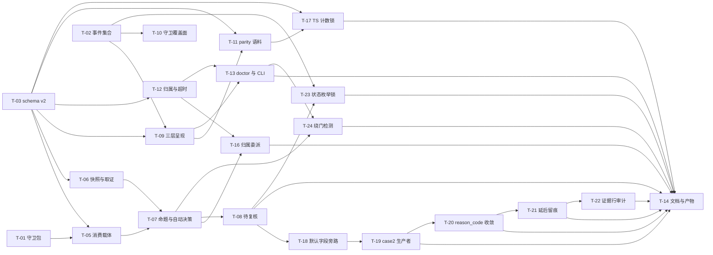

# Plan: mw-autopilot-slot-capacity

- key: `mw-autopilot-slot-capacity` · design 已定稿（D-001…D-022）· 31 AC / 49 VC
- 基线：`4a207ecfb`（design 波提交）；代码面与 `191a069a4` 同（本 key 至今零代码改动）
- 定位：**A** —— 主交付 = gate 命题重设计 + 三分处置 + 硬前置修复 + 护栏；次级 = (c2) idle 心跳；(d) 只做观测与判据；`max_parallel_keys` 只出"不改"结论

---

## 1. 并行度分析（按**文件边界**切写面）

### 1.1 写面清单（一个文件同一时刻只允许一个 worker）

| 文件 | 归属任务 | 备注 |
|---|---|---|
| `packages/multi-workers/autopilot/conductor.py` | T-01 → T-05 → T-07 → T-08 | **唯一热点**，四段串行；每段区域互不重叠（守卫 `:297-431` / 消费 `:316-379` / 命题与自动决策 `:2159+` / 收口 `:266-271`+`:616-656`） |
| `packages/multi-workers/autopilot/gates.py` | T-03 | schema v2 字段 + `_LIST_FIELDS` |
| `packages/multi-workers/autopilot/config.py` | T-03 | `auto_gate_mode` |
| `packages/multi-workers/autopilot/evidence.py` | T-06 | **新模块**：快照 sidecar + 取证源解析 |
| `packages/multi-workers/autopilot/dispatch.py` | T-12 | `timeout:` 渲染 |
| `packages/multi-workers/autopilot/roadmap.py` | T-08 | key-status enum（`pending-review`） |
| `packages/multi-workers/mw_common.py` | T-12 → T-13 | workers 解析段 / `_doctor_gates` 段（串行） |
| `packages/multi-workers/mw.py` | T-13 | autopilot 段 CLI |
| `.../agent-team-loop/autopilot/status-model.ts` | T-02 → T-09 → T-08 | EVENT_TYPES 段 / 字段镜像段 / key-status 段（串行） |
| `.../agent-team-loop/autopilot/monitor.ts` | T-09 | 层 A |
| `.../agent-team-loop/autopilot/console.ts` | T-09 | 层 B |
| `.../agent-team-loop/shared/xkey-gate-guard.ts` | T-10 | 封堵面 |
| `.../agent-team-loop/worker-store.ts` | T-12 | `origin` 列 |
| `packages/coding-agent/src/core/tools/bash.ts` | T-04 | 心跳 |
| `.../extensions/agent-team-loop/worker-mode.ts` | T-04 | 分类判定 + `[IDLE_KILL]` |

### 1.2 波次（波内文件边界互斥 ⇒ 可同时开工）

| 波 | 任务 | 独占写面 | 依赖 |
|---|---|---|---|
| **0** | T-01 conductor 守卫包 | `conductor.py`（守卫段） | — |
| | T-02 TS 事件集合对齐 | `status-model.ts`（EVENT_TYPES 段） | — |
| | T-03 gate schema v2 + 配置键 | `gates.py`、`config.py` | — |
| | T-04 idle 心跳 | `core/tools/bash.ts`、`worker-mode.ts` | — |
| **1** | T-05 消费记录载体 | `conductor.py`（消费段） | T-01, T-03 |
| | T-06 快照与取证源模块 | `autopilot/evidence.py`（新） | T-03 |
| | T-09 三层呈现（TS + doctor 契约） | `monitor.ts`、`console.ts`、`status-model.ts`（字段镜像段） | T-02, T-03 |
| | T-10 守卫覆盖面 | `xkey-gate-guard.ts` | T-02 |
| | T-12 归属与超时接线 | `dispatch.py`、`worker-store.ts`、`mw_common.py`（workers 段） | T-03 |
| | T-15 计数锁刷新（T-03 协调缺口） | 4 个 Python 测试文件 | T-03 |
| **3** | T-16 归属判据委派（T-12 缺口） | `conductor.py`（`reconcile_orphans`/`_row_belongs_to`）、`monitor.ts`（`:615/:623`） | T-07, T-12 |
| **2** | T-17 TS 计数锁刷新（T-11 缺口） | `autopilot-console.test.ts` | T-03, T-11 |
| **3** | T-18 时效默认字段旁路修补（T-08 缺口） | `conductor.py`（goal-change 建门点） | T-08 |
| **3** | T-19 case 2 生产者接线（T-08 缺口） | `conductor.py`（自动决策段） | T-07, T-08, T-18 |
| **3** | T-20 `reason_code` 必需集按 kind 收敛 + 闭集写入护栏 | `mw_common.py`、`conductor.py`、2 个测试 | T-07, T-13, T-18, T-19 |
| **3** | T-21 延后处置留台账行（影子与实动共用） | `conductor.py`（延后段）、(必要则) TS 镜像、1 个测试 | T-07, T-19, T-20 |
| **3** | T-22 证据行陈旧性审计（`[VERIFY]` 数值实测化） | 4 个测试文件（仅证据行） | T-19, T-21 |
| **2** | T-07 命题重写 + 自动决策核心 | `conductor.py`（命题/自动决策段） | T-05, T-06 |
| | T-11 parity 语料重冻 | `test_autopilot_config_parity.py`、`autopilot-config-corpus.json`、TS parity test | T-03, T-09 |
| | T-13 doctor gate 段 + CLI | `mw_common.py`（doctor 段）、`mw.py` | T-03, T-09, T-12 |
| **3** | T-08 待复核 + 合法重开 | `conductor.py`（收口段）、`roadmap.py`、`status-model.ts`（key-status 段） | T-07 |
| **4** | T-14 文档 + dist + 全量回归 | `CHANGELOG.md`×2、`UPDATE.md`、`dist/**` | 全部 |

最大并行度 = 5（波 1）；`conductor.py` 与 `status-model.ts` 是两条串行链，其余可插空。
**文档类 AC（AC-001…AC-003、AC-009、AC-011、AC-013/AC-014 中的分析部分、AC-015）不派编码卡**：其证据已在 spec/design 期落盘（14 张 spec 卡 + 7 张 design 卡 + 3 篇 PM 自采），verify 期由 PM 以文档证据核销（见 §5）。

---

## 2. 契约冻结（并行 worker 逐字遵守，不得重定义）

### 2.1 字段清单（**权威来源 = `design-gate-schema-presentation-20260926.md` §D1.0/§D1.1**）

- 底座 12（`gates.py:68-81` = `status-model.ts:572-587`，**不重排、不改语义**）：`id` / `kind` / `stage` / `key` / `created_at` / `created_by` / `question` / `context_refs` / `status` / `answered_at` / `answered_by` / `note`
- 新增 **26**（D6 §D1.1 逐条编号 1..26）：`reason_code` / `evidence_refs` / `loop` / `used_rounds` / `round_limit` / `credits_used` / `observed_at` / `verdicts_final` / `open_items` / `subject_sha256` / `roadmap_validation` / `proposal_sha256` / `goal_sha256` / `constraints` / `goal_sha256_before` / `goal_sha256_after` / `goal_diff` / `write_scope` / `blast_radius` / `answer_source` / `auto_policy_id` / `expires_at` / `evidence_anchor_mtime_ns` / `default_action` / `out_of_band_actions` / `gate_schema`
- **口径对账（本 plan 权威）**：D-004（消费记录载体）另加 **2** 个字段 `consumed_at` / `consumed_seq`，**不在 D6 的 26 条内** ⇒ 本 key 新增字段总数 = **28**，全部可选、全部不进 `_REQUIRED_FIELDS`。design.md §4.2 的"26"只计 D6 清单。
- **两种顺序必须分开（T-09 实测澄清，T-15 交叉印证）**：① `FRONTMATTER_FIELDS` = **允许集顺序**（`id, kind, stage, …`，`gate_schema` 在 **第 38 位**，随后 `consumed_at`/`consumed_seq`）⇒ 两侧 parity 断言锁的是这个顺序；② **新建门的落盘键序** = `id, gate_schema, kind, stage, …`（共 13 键，`gate_schema` 紧跟 `id`）⇒ 这是 D6 §D2.1 R4 的渲染顺序规则。本 plan 早先把两者混为一谈（"gate_schema 紧跟 id" 只对渲染顺序成立）。
- **物化口径（T-15 实测更正，本 plan 权威）**：`FRONTMATTER_FIELDS` = **允许集（40）**，而 `gates.create()` 实际落盘 **13 键**（底座 12 + `gate_schema: 2`，位置紧跟 `id`）—— 可选字段**未写就不物化**。故断言正确形态 = `len(FRONTMATTER_FIELDS) == 40` **且** 新建门的键序断言（13 键）。本 plan 早先写的"刷新到 40 顺序"是笔误：40 若被当作物化键数，就是一条假断言。
- 具名列表字段 = **`_LIST_FIELDS = {"context_refs", "evidence_refs"}`**（两侧把硬编码特判从"单名"改"集合"；`gates.py:354-364` / `status-model.ts:666`）。**其余结构化字段一律单行 JSON 子串**（`json-list`/`json-obj`），**不得**依赖 YAML 嵌套（`gates.py:38-45`）。
- 批次纪律（D6 §D1.3）：**P1 字段**（`reason_code`/`evidence_refs`/`loop`/`used_rounds`/`round_limit`/`credits_used`/`observed_at`/`verdicts_final`/`open_items`/`subject_sha256`/`expires_at`/`evidence_anchor_mtime_ns`/`default_action`/`gate_schema` + 消费 2 字段）在本 key 落；**P2 字段**（`constraints`/`write_scope`/`blast_radius`/`answer_source`/`auto_policy_id`/`goal_sha256_before|after`/`goal_diff`/`roadmap_validation`/`proposal_sha256`）**只在数据源到位时写**，否则一律渲染 `unknown (no field)`。

### 2.2 呈现契约（D6 §D3/§D4）

- 哨兵字面量（**全仓唯一**）：`unknown (no field)`。**禁止**从 `question`/`note` 散文或 LLM 猜测兜底。
- 层 A（`monitor.ts:644-654`）：每门 **1 行**，`len ≤ MONITOR_LINE_MAX = 110`（`:61`）；`MonitorGate` 需补 `created_at`（现缺 `:89-96`）；截断**头保留**（`:531-533`）。
- 层 B（`console.ts:182-198`）：每门**恰好 13 行**、序固定、每行 ≤110 列 ⇒ 总行数 **`1 + 13*N`**；L8 给同 scope 已答门（重放可见性）、L9 给 `expires_at`/`default_action`、L6 给证据含 `DRIFT(`、L12 给 `open_items`、L13 给 `answer_source`。
- 层 C（`_doctor_gates`，邻 `mw_common.py:2022-2064`；JSON 出口 `mw.py:524-525`）：段字段 9 个 `dir/exists/total/pending_count/schema_versions/parse_errors/pending[]/missing_fields[]/drift[]/replayed[]/error`；告警 **I1–I6** + 零扰动 **I7/I8**（`missing_fields` **仅 pending 门**；全绿项目文本层**不出行**）；`missing_fields` 不得对已答门报（34 个历史门，G-D6-1）。
- 禁 LLM：`monitor.ts` / `console.cmdGates` / `_doctor_gates` 三个渲染函数体内 `dispatch`/`model`/`provider` 零命中。

### 2.3 事件与配置

- **守卫覆盖面（T-10 实测确认）**：封堵面 = `_autopilot/**`，但**保留既有 `_autopilot/xkey/**` 豁免**（前 key `xkey-repair-mechanism` D-004/D-005 的有意设计：提案 worker 经工具通道往那里写提案，`conductor.py:3061-3165`）。AC-020/AC-030 只点名审计三件套 + gates，不含 xkey 子树。**残余风险**：被审方仍可往 `_autopilot/xkey/**` 写提案（其可利用性取决于前 key 的授权检查，超出本 key 范围）；bash 文本级启发式在片段缩短为 `_autopilot` 后假阳略增。

- 新增事件 **6**：`gate-auto-decision` / `gate-auto-revoke` / `review-decided` / `review-escalated` / `evidence-reconciliation` / `stage-reopen-refused`；TS 侧另补既有缺失项 **`target-config-rejected`** ⇒ 两侧 `EVENT_TYPES` **集合相等**（判据 = 排序后集合相等，不是数量相等）。**[T-02 实测更正]** `EVENT_TYPES` 是**读取侧 include-set（过滤用）**，写入侧**不校验**（`Timeline.append` 声明 "Never raises"）：集合不等的后果是**观测面静默隐藏**（`console.ts:261` 的 `nonBeatFilter()`），不是写入被拒。
- 账本：`<root>/.agenticdoc/_autopilot/auto-decisions.jsonl`（append-only）；timeline 行新增可选 `data` 载荷。
- 配置键：`auto_gate_mode`（str，闭集 `off|shadow|live`，默认 `off`）；**不加入** `EFFECTIVE_KEYS`（维持 2 个 xkey 键）。
- 权威字段（审计）：`decided_at` / `seq`（conductor 时钟）、`evidence[]`（`{path,sha256,mtime_ns}`）、`rule_id` / `rule_version`（代码常量）、`switch`（`load_effective` 结果 + `config_sha256`）、`decision_id`。**`answered_by`/`answered_at` 只作展示**。
- 错误前缀沿用既有：Python `GateFormatError`；worker 侧 `[IDLE_KILL]`。

### 2.4 不变量（禁止违反）

- `_REQUIRED_FIELDS`（`gates.py:86-89`）**一格不加**；34 个历史门文件必须照旧 `parse()` 成功。
- `_DEP_SATISFIED`（`conductor.py:56`）**不加** `pending-review`。
- `render_toolchain_command` 与既有 `xkey.run_verification` 语义零改动。
- 只读路径（doctor / 面板 / `show`）**不得创建**任何文件或目录（`_doctor_autopilot:2025-2034` 纪律）。
- 历史数据**不回填、不改写**；`l3-verdict.txt` 等既有证据文件**不就地改写**。
- 单调性：`pending/approved < running < {closed, closed-human, halted}`；终态族禁回退/互转/降级。

---

## 3. 任务表（落成 `tasks/T-*.md`）

| 任务 | 名称 | 波 | AC | VC | 核心交付 |
|---|---|---|---|---|---|
| T-01 | conductor 守卫包（D1+D2+D4） | 0 | AC-022, AC-028 | VC-029/030/031/042 | 正则 `gate-\d+`；reject 对称守卫；`_set_stage_status` 单调判据 + 去重留痕 |
| T-02 | TS 事件集合对齐（D3 守卫） | 0 | AC-010, AC-021, AC-022 | VC-012 | `EVENT_TYPES` 补 `target-config-rejected` + 集合相等判据 |
| T-03 | gate schema v2 + `auto_gate_mode` | 0 | AC-018, AC-019, AC-026 | VC-011/024/038 | 28 可选字段 + `_LIST_FIELDS` + 单行 JSON + 配置键 |
| T-04 | idle 看门狗（c2） | 0 | AC-005 | VC-004/005/006 | in-flight 分类判定 + 心跳 + `[IDLE_KILL]` 证据 + 二次确认 |
| T-05 | 消费记录载体 | 1 | AC-022, AC-023, AC-028 | VC-031/032/043 | 门文件 `consumed_at`/`consumed_seq` + 复合键 `(id, created_at)` + timeline 只读回退 |
| T-06 | 快照与取证源模块 | 1 | AC-029 | VC-044/045 | `autopilot/evidence.py`：sidecar `gate-evidence/1` + 三命题取最小 + 单向 dispute |
| T-09 | 三层呈现 | 1 | AC-007, AC-012, AC-021, AC-026 | VC-008/014/027/028/037/038 | 层 A/B（TS）+ 字段镜像 + DRIFT + 禁 LLM |
| T-10 | 守卫覆盖面 | 1 | AC-020, AC-030 | VC-025/026 | `xkey-gate-guard.ts` 封堵到 `_autopilot/**` |
| T-12 | 归属与超时接线 | 1 | AC-013, AC-021 | VC-015/027/028 | 行级 `origin` + `owner_key` 判据 + `timeout:` 渲染 |
| T-15 | 计数锁刷新（T-03 缺口） | 1 | AC-018, AC-026 | VC-011/024/038 | 4 个 Python 测试文件的 13→14 / 12→40 计数锁（**执行期新增**：T-03 实测该缺口不在 T-11 写面内） |
| T-16 | 归属判据委派（T-12 缺口） | 3 | AC-021 | VC-027/028 | `reconcile_orphans` 写 `origin`；`_row_belongs_to` 与 `monitor.ts` 委派给唯一权威判据（**执行期新增**：T-12 实测两消费点仍用旧规则，三口径未真正统一） |
| T-17 | TS 计数锁刷新（T-11 缺口） | 2 | AC-018, AC-026 | VC-011/024 | `autopilot-console.test.ts` 的 13→14 计数/形状锁 + TS 侧 `EFFECTIVE_KEYS` 负断言（**执行期新增**：T-11 实测同类缺口在 TS 侧） |
| T-18 | 时效默认字段旁路修补（T-08 缺口） | 3 | AC-019 | VC-024 | goal-change 门不走咽喉点 ⇒ 永远缺 `expires_at`/`default_action`、doctor 常报不健康（**执行期新增**：PM 用生产 API 复算发现；P-023 硬规则 4） |
| T-19 | case 2 生产者接线（T-08 缺口） | 3 | AC-027, AC-028 | VC-039..043 | `defer_key_to_review` 无生产调用者 ⇒ `pending-review` 不可达 ⇒ 三分处置的 case 2 是死代码（**执行期新增**：T-08 自报 + PM 复算确认） |
| T-20 | `reason_code` 必需集按 kind 收敛 + 闭集护栏 | 3 | AC-019, AC-026 | VC-024 | doctor 对 4/6 类门无条件误报（`reason_code` 被要求在不做机器判定的 kind 上）；且该过宽规则已诱发 T-18 自创契约外值 `goal-md-mtime-moved`（**执行期新增**：PM 逐 kind 实测发现） |
| T-21 | 延后处置留台账行（影子/实动共用） | 3 | AC-027, AC-028 | VC-039..043 | live 延后无台账行（审计断链）；影子记 `escalate` 而 live 实际 `defer`（**影子失真** ⇒ 用失真样本满足影子门槛）（**执行期新增**：T-19 自报 + PM 读码认定的更重后果） |
| T-22 | 证据行陈旧性审计 | 3 | AC-019, AC-027 | VC-024/039..043 | T-19 的 `_verify(... auto_decision_rows=0)` 是只打印不校验的**硬编码字面量**，T-21 改语义后成为假声明；审计本 key 全部证据行的同类风险（**执行期新增**：PM 复核 T-21 时发现，P-019 家族） |
| T-07 | 命题重写 + 自动决策核心 | 2 | AC-016…AC-020, AC-024, AC-025, AC-029 | VC-018…023/033…036/046/047 | 6 门事实面谓词 + 留痕账本 + 配额熔断 + 影子 + 对账拦截面 |
| T-11 | parity 语料重冻 | 2 | AC-010, AC-018 | VC-011/022 | 语料 53→55 + 计数断言 13→14（两侧） |
| T-13 | doctor gate 段 + CLI | 2 | AC-006, AC-012, AC-019, AC-031 | VC-007/014/024/049 | 9 段字段 + I1–I8 + `mw autopilot gates --json` |
| T-08 | 待复核 + 合法重开 | 3 | AC-027, AC-028 | VC-039/040/041/042/043 | `pending-review`（两侧同波）+ 收口前置 + 48h 升级 + `review-decided` |
| T-14 | 文档 + dist + 全量回归 | 4 | 全部 | 全部 | CHANGELOG/UPDATE/dist + 基线对照 |
| T-23 | `KEY_STATUSES` 跨语言机器锁（QG 欠债） | 5 | AC-010 | VC-011 | 新增 `autopilot-status-parity.test.ts`：真子进程 dump 取 Python 真值 + 保序相等 + `_DEP_SATISFIED` 内部一致性 + 镜像被消费证明；**收口期由 QG 判定 ⚠️ 后开出**（`evidence/quality-gate-report-20260926-194528.md` Q-VC-011/Q-AC-010），并需核实 T-08 回执里定位不到的 "machine-checked subset proof" 声称 |
| T-24 | 绕门散文授权的机器判定（QG 欠债） | 6 | AC-031 | VC-048 | 只读 doctor 扫描 `_autopilot/evidence/cross-key-repair-request-*.md`：有机器载体（关联已答 `xkey-authorize` 门）则不报，仅散文 `decision:` 行 ⇒ I 类 issue + fail-closed 视为未授权；**收口期由 QG 判定 ⚠️ 后开出**（同报告 Q-VC-048/Q-AC-031），判据锚点 = FM 真实文件 `:57` + 设计 `design-gate-propositions:373` |

依赖 mermaid（边标签无引号）：

---

## 4. 风险登记

| # | 风险 | 触发条件 | 缓解 |
|---|---|---|---|
| R1 | `conductor.py` 四段串行改动相互踩踏 | 并行派发 | 波次表把该文件锁为单链；每任务只碰其区域；开工前 `git diff` 确认他段未被改（P-020 家族） |
| R2 | 28 新字段漏进一侧 ⇒ 一侧停摆 | 跨语言不同步 | T-03/T-09 同波交付两侧；VC-011/VC-038 断言逐项同序；未知字段两侧都 fail-closed（`gates.py:345-347` / `status-model.ts:660-661`） |
| R3 | 历史 34 门被报 missing（假阳淹没） | doctor 范围失控 | `missing_fields` **仅 pending**；`gate_schema` 缺省=1；I7 零扰动；VC 用 fixture 断言"全绿项目文本无 `gates:` 行" |
| R4 | 自动决策恒真（等于自动盖章） | 命题未重写就上线 | T-07 先落命题谓词；VC-035 恒真自检 + VC-036 每门 ≥1 反例；`auto_gate_mode` 默认 `off` |
| R5 | 消费去重被 gate id 重用击穿 | 归档后 id 重用 | 复合键 `(id, created_at)`（T-05）；VC-031 专门覆盖重用 |
| R6 | `pending-review` 单侧上线 ⇒ 整 tick 跳过 | 两侧不同波 | T-08 同波交付两侧；VC-011 enum 相等；未知值 fail-closed 已有行为 |
| R7 | 单调判据误伤合法转换（人改 roadmap） | 过度收紧 | 判据为纯函数 + 只在 conductor 写路径生效；人工改 `_roadmap.md` 不禁；拒绝留痕去重 |
| R8 | 心跳改动误伤真挂死检测 | 判据过松 | VC-006 同时断言"真挂死仍被杀"（无 in-flight 工具 + 无 token 增量） |
| R9 | parity 语料重冻掩盖真实回归 | 只改 sha 不改语义 | 语料**新增**用例（非替换）；两侧都跑（P-021）；重冻前逐例 diff |
| R10 | 只读路径被写（doctor 建目录） | 实现图省事 | `_doctor_gates` 继承 `:2025-2034` 纪律；VC 断言零写（`_doctor_autopilot` 同款判据） |
| R11 | 34 门回放样本不足 | 无 pending 门 | T-13/T-07 用 fixture（JC `gate-0008` 真实字段值 + `gate-0001`/`gate-0005` 重放形态） |
| R12 | 测试空洞（只验字段写入） | 断言写成"存在即过" | 每张卡必须附**非空洞对照**：还原缺陷 ⇒ VC 变红（P-016 家族） |

---

## 5. 验收与收口顺序

1. **波内自检**：每张卡完成即跑该卡 `[VERIFY]` 命令 + 非空洞对照。
2. **波间**：`npm run check` 全量输出（不 tail）；Python 侧重点用例从包根跑。
3. **基线对照**：本 key 起点 = `2 failed, 1007 passed, 10 deselected`（spec 期实测）；两条既有红（`test_autopilot_readcap_injection.py::test_baseline_left_end_bound`、`test_autopilot_verdict_freshness.py::test_true_below_without_resume_stays_below`）**不属本 key 修复范围**，红集合保持不变即为通过。
4. **文档类 AC 核销**（不派卡）：AC-001/002/003/009/011/013/014/015 由 spec/design 落盘证据 + verify 期 PM 复核核销；核销证据写入 `evidence/runs/verify-*.md`。
5. **回归项**：`xkey-repair-mechanism` 的跨语言镜像用例、`mw-autopilot-verify-cli` 的 13 键 parity 用例（T-11 改计数后必须全绿）。
6. **收口**：`/quality-gate` 逐 AC/VC 核销 → `achieved.md`（含「## 系统行为变化」「## 遗留」）→ `advance_phase done`。
