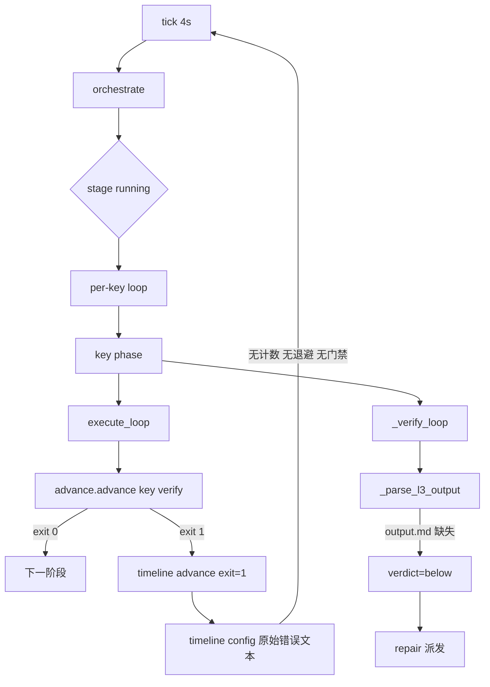
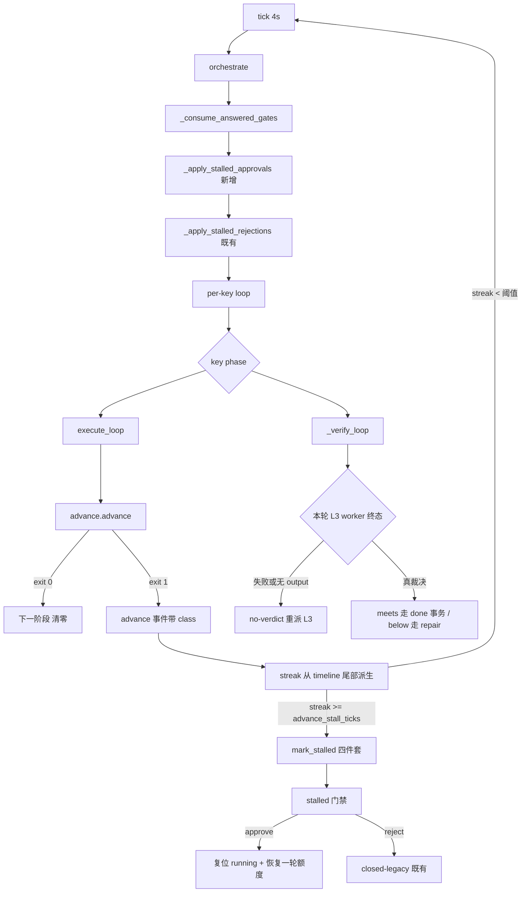

# Design: mw-autopilot-stall-feedback

> Key: mw-autopilot-stall-feedback · 阶段: design · 2026-09-22
> 上游: spec.md（AC-001..AC-013）· 证据: evidence/research/{spec-autopilot-stall,design-convergence-options}-20260922.md

## 1. 目标与不变量

把「非瞬时 advance 失败 → 无界重试」改为「有界重试 → 分类上报 → 既有 stalled 四件套升级 → 人工 approve 恢复一轮」，并把停滞状态暴露到 PM 窗口的底部监控面板。

不变量（不得破坏）：
- I-1 tick 契约：先 beat；任何异常只记 timeline，不杀循环（§9 容错）。
- I-2 零私有状态：每个决策每 tick 从文件重派生（D-102）；本 key 不新增状态文件。
- I-3 phase 只经 `advance_phase.py`；conductor 不写 `pm-state.md` 的 Phase 行，不写 `goal.md`。
- I-4 门禁协议不变：不新增 kind；`stalled` 由 conductor 创建、TS/人工回答。
- I-5 只读面：监控面板不写任何文件。

## 2. As-is 调用链（问题路径）



问题：`J/K` 之后没有任何收敛条件；`L/M` 把 worker 崩溃与 reviewer 裁决混为一谈。

## 3. To-be 架构



## 4. 决策

### D-1 连击派生自 timeline 尾部（无私有状态）
- 输入：`timeline.tail_events(path, max_bytes, limit)`（新 helper，读文件尾部字节 + 逐行容错）。
- 规则（自尾部向前扫描）：
  - `ev == "beat"` → 跳过（不与停滞相关）；
  - `ev == "advance"` 且 `key` 命中：解析 `"{edge} exit={n}"`；`n != 0` 且 `edge` 等于目标 edge → `count += 1`，继续；`n == 0` → 停止（成功打断连击）；
  - `ev == "advance"` 但 edge 不同 → 跳过（其他阶段的尝试不打断本 edge 的窗口，也不计入）；
  - `ev in ("config",)` 且 `key` 命中 → 跳过（失败文本，用于分类），继续扫描；
  - 该 key 的其它事件（`dispatch` / `stalled` / `gate-*` / `stage-*` / `skip` / `reconcile` / `worker-terminal`）→ 停止（有进展）。
- 返回 `(count, class_histogram, last_error_snippet)`；`last_error_snippet` 取自相邻 `config` 事件文本。
- 失败开放：读取异常/文件缺失 → `count = 0`（不误伤正常推进）。理由：误判停滞会中断健康推进，而漏判只退化为现状行为。

### D-2 升级复用 `stalled` 四件套（不新增 gate kind）
`mark_stalled(project_root, st, key, reason)`；`reason` 单行，模板：

```
advance {edge} 连续 {n} 次失败（class={主分类}/{分布}）: {最近错误摘要}
```

幂等性由既有实现保证（已 stalled 直接 return），且升级后 key 被 `orchestrate` 的 skip 规则冻结 → 不再调用 `advance_phase.py`（这就是「冻结」）。

### D-3 失败分类 `_classify_advance_failure(text) -> str`
纯函数，单测覆盖。规则（按序匹配，大小写不敏感）：

| 分类 | 触发特征 |
|------|---------|
| `interface-drift` | `unknown phase` / `has unknown phase` / `valid: spec, design` / `Phase:` 解析类错误 / 框架版本不匹配文案 |
| `gate-blocked` | `GATE BLOCKED` / `gate fail` / `缺少前置` / `missing` / `MISSING:` |
| `timeout-env` | `timeout` / `timed out` / `locate` / `AdvanceError` / `no such file`（框架不可定位） |
| `other` | 其余（含空文本） |

### D-4 advance 事件的机器可读载荷
- 成功：`detail = "{edge} exit=0"`（不变，兼容既有断言）。
- 失败：`detail = "{edge} exit={n} class={cls}"`（新增后缀；既有正则 `exit=\d+` 仍匹配）。
- 原始错误文本继续写 `config` 事件（人类可读），不删除。

### D-5 approve 恢复语义 `_apply_stalled_approvals`
对称于 `_apply_stalled_rejections`，在 `_consume_answered_gates` 之后、per-key 循环之前执行：

- 触发条件：`gate.kind == "stalled"` 且 `gate.status == "approved"` 且 `gate.key` 命中且 `status_of[key] == "stalled"`；
- 动作：`roadmap.update_key_status(text, stage, key, "running")`（roadmap 锁内）→ timeline `gate-answered`（`"{gate.id} approved → {key} running"`，与 `_consumed_gate_ids` 的消费记录协议一致）+ `resume` 事件 → 就地更新 `status_of[key] = "running"`（本 tick 即可继续推进）；
- 幂等：复位后 `status_of[key] != "stalled"`，再次扫描不再触发；重启后由 key-status 文件事实判定。

### D-6 恢复额度 `_resume_credits(project_root, key) -> int`
= 该 key 的 `kind == "stalled"` 且 `status == "approved"` 的门禁数。四个预算点统一加该项：

| 预算点 | 现状 | 改后 |
|--------|------|------|
| L2 回路上限 | `budget = cfg.round_budget` | `limit = budget + credits` |
| EXECUTE 单任务重试 | `used >= budget` | `used >= budget + credits` |
| L3 复评轮数 | `used >= l3_budget` | `used >= l3_budget + credits` |
| repair 次数 | `repair_used >= cfg.round_budget` | `repair_used >= cfg.round_budget + credits` |

语义：一次 approve = 四个受管回路**各**放宽一轮；**不可复用**——每个回路自己的 `used` 计数是单调的（由 append-only 的 dispatch 行派生），所以用掉那一轮后同一回路会再次到顶、需要新的人工决定（`test_one_credit_is_spent_by_one_round_per_loop` 固化；L3 复核反馈后由「恰好一轮」改写为这个精确语义）。再达上限 → 再次升级（人工驱动）。无批准门禁时 `credits == 0`，行为与现状逐字节一致（AC-013 的单测锚点）。

为什么不做「每回路各记录一次消费」：那需要新增私有状态（消费台账）与并发写入协议，而收益只是把「一次批准放宽四个回路」收窄为「放宽一个回路」；风险与收益不匹配（现已记录的偏差见 spec 修订记录 2）。

### D-7 L3 `no-verdict` 判定 `_l3_round_verdict(rows, key, attempt)`
- `meets`：output.md 存在且两节齐全、QG 表无 FAIL 行（现有逻辑）；
- `below`：output.md 存在且被判 FAIL/缺节（现有逻辑）；
- `no-verdict`：该轮 worker 行为终态失败（`status in {"failed","needs-clarification"}`）**或** output.md 缺失而该轮 row 已终态。
- 分支：`no-verdict` → 不派 repair，直接派下一轮 `l3-a{used+1}`；预算耗尽时 `mark_stalled` reason 写 `L3 无裁决（worker <status>: <task_key>）`；并记 timeline `l3-no-verdict`（key/attempt/status）。
- `l3-no-verdict` / `resume` 均加入 `timeline.EVENT_TYPES` 词表（仅用于过滤，未知也不拒绝）。

### D-8 面板停滞段（TS，只读）
`status-model.ts` 新增纯函数 `deriveAutopilotPanel(input) -> AutopilotPanel`，输入为已读取的数据（config/roadmap/index/workers/timeline 尾部/gates）+ `nowMs`（可注入，便于测试）；`monitor.ts` 的 `renderMonitorLines` 消费它并渲染：

```
autopilot: ON  tick seq 23357 (3s ago)  slots 0/2  gates 1 pending
keys: K2 feature-params-service VERIFY stalled | advance 12x interface-drift 2m -> /autopilot gate gate-0002 approve|reject
      K3 feature-gui-backend RUNNING idle (deps blocked by feature-params-service)
```

规则：
- tick 新鲜度：最近 `beat` 的 `seq` 与时间差；`age > max(30s, 5 × poll_interval)` → `STALE`（红）并给出「conductor 可能已死，检查 `mw doctor`」提示；
- 槽位：`in-flight keys / max_parallel_keys`；
- 每 key：`phase` / roadmap `key-status` / in-flight / 依赖阻塞原因；`stalled` 行高亮 `STUCK` + 门禁 id 与处置命令；
- 停滞连击：与 Python 同规则从 timeline 尾部派生（两条实现同一契约，注释互相指向）；**清除规则逐字对齐**：只有同一 edge 的成功才结束该连击（相邻边界的成功既不打断也不计入）。唯一允许的差异是尾部事件——面板保留 `stalled`/`gate-created` 之后仍显示该轮连击（守卫会在这些事件处停下因为它要决定是否冻结），此差异必须写在注释里（AC-014）。
- 固定分节（即使为空也占位），110 列截断沿用现状；无任何写 API。

### D-9 配置键 `advance_stall_ticks`
`DEFAULT_CONFIG["advance_stall_ticks"] = 5`，`_INT_RANGES` 加 `(1, 50)`；TS 读取器镜像默认值（`readConfig` 对未知键的处理需一并确认，见 T-06）。旧 config.json 缺该键 → 取默认。

## 5. 接口变更清单

| 文件 | 变更 |
|------|------|
| `autopilot/timeline.py` | 新增 `tail_events(path, *, max_bytes=524288, limit=400) -> list[dict]`；`EVENT_TYPES` 增 `resume`、`l3-no-verdict` |
| `autopilot/conductor.py` | 新增 `_classify_advance_failure`、`_advance_failure_streak`、`_ADVANCE_STALL_TICKS` 读取、`_resume_credits`、`_apply_stalled_approvals`、`_l3_round_verdict`；`execute_loop` / `_advance_key` / `_verify_loop` 接入阈值与额度 |
| `autopilot/config.py` | 新增 `advance_stall_ticks` 默认值 + 范围校验 |
| `autopilot/gates.py` | 不改（复用 `stalled`） |
| TS `autopilot/status-model.ts` | 新增 `deriveAutopilotPanel` + 类型 + 尾部事件读取复用 |
| TS `autopilot/monitor.ts` | `renderMonitorLines` 增加 autopilot 分节（tick/slots/keys/stalls） |
| TS `autopilot/console.ts` | autopilot enabled 时自动显示面板（AC-008） |
| 文档 | 两个 CHANGELOG、`packages/multi-workers/README.md`、`_pitfalls.md` |

## 6. 错误处理与降级

| 场景 | 行为 |
|------|------|
| timeline 尾部读取失败/缺失 | 连击=0（fail-open，不误判停滞），不记事件（避免刷屏） |
| timeline 行损坏 | 逐行跳过（沿用 `_read_events` 容错语义） |
| 阈值配置非法/缺失 | 取默认 5（`config.validate_config` 只校验存在且为 int 的字段） |
| roadmap 写失败/锁被占 | `mark_stalled` / 恢复已有行为：记 `config` 事件，下 tick 重试 |
| gates 目录损坏 | 既有策略：整 tick skip + `config` 事件（不改） |
| 面板数据缺失（无 config / 无 timeline / 无 roadmap） | 渲染占位行，不抛异常 |

## 7. 兼容与并发

- 门禁 schema、事件 schema（除新增类型）不变；失败事件 detail 追加 `class=` 后缀，兼容既有 `exit=\d+` 断言。
- 新增 config 键必须 Python/TS 同批次（`validate_config` 对未知键 fail-closed）；旧文件缺键取默认。
- 与并发 key `mw-rag-integration-fix` 的文件边界：本 key 不修改 `pm/ui-bridge.ts`、`pm/pm-orchestrator.ts`、`pm/task-dispatcher.ts`、`worker/worker-mode.ts`、`shared/*`、`rag/*`、`mw.py`、`mw_common.py`、`autopilot/{dispatch,launcher}.py`、`dist/`。`dist/` 重建与扩展加载验证在对方提交后执行（AC-011）。

## 8. 测试计划

| 层 | 用例 |
|----|------|
| 单元（Python） | 分类函数 4 类 + 未知；streak 派生（含插入 `dispatch` 打断、不同 edge 不合并、成功清零、beat 忽略、**100 beats/间隔的洪水不打断**））；`_resume_credits`（无/1/2 次 approve）；阈值读取（缺失→5，非法→默认） |
| 行为（Python，`test_autopilot_conductor_exec.py` harness） | 连续失败达阈值 → `mark_stalled` + 四件套 + 冻结（不再 advance）；未达阈值 → 继续重试；approve → 复位 + 各回路放宽一轮且验证「用掉即失效」（L2/exec/L3/repair，`test_one_credit_is_spent_by_one_round_per_loop`）；reject → closed-legacy 现状不变；L3 崩溃轮 → 不派 repair 且 reason 含 worker 状态 |
| 视图（TS） | `deriveAutopilotPanel` 对缺失/损坏输入的降级；tick STALE 判定；stalled key 行含门禁处置提示；跨 edge 成功不清除连击 / 同 edge 成功后更早失败不复活；110 列截断 |
| 端到端（现场） | E2Feature：approve gate-0002 → `l3-a3` → `verify->done exit=0` → key-status done → K3 派发（T-09 证据） |
| 门禁 | `npm run check` 0 error/warning/info；`./test.sh` 相关包无新增失败（对照 Windows 基线） |

## 9. 影响面

- 行为变化仅发生在「advance 连续失败」「stalled 门禁被 approve」「L3 worker 崩溃」三种情形；正常推进路径的判定顺序与预算上限不变（credits=0 时逐字节一致）。
- 新增可见面：面板 autopilot 分节（autopilot enabled 项目自动显示）、timeline 新事件类型、新配置键。
