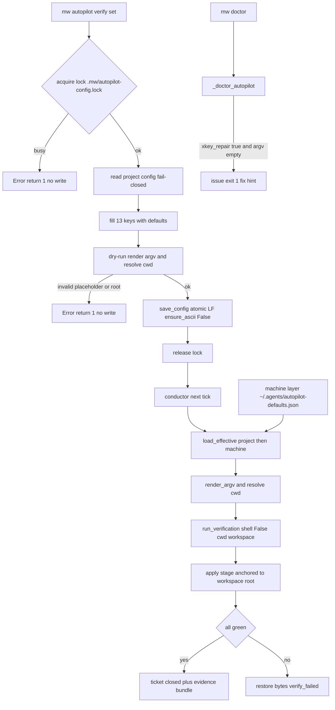

# Design: mw-autopilot-verify-cli

- key: `mw-autopilot-verify-cli` · 基线 `b0a30bc12`（spec 期提交）· spec 锁定 2026-09-26（14 AC）
- 证据：design 期 6 份 RQ —— `evidence/research/design-{cache-pickup,machine-layer,cwd-root-anchor,write-lock,dist-anchor-guard,crosslang-consistency}-20260926.md`；spec 期 5 份
- 关联前置：`xkey-repair-mechanism`（DONE，`181a75332`）、dist 重建（`d52694cc4`）

## §0 锚定（spec → design 的硬约束）

| 约束 | 来源 | design 落点 |
|---|---|---|
| 14 条 AC 全部可机械判定 | spec §3 | §7 VC-001…VC-016 逐条绑定 |
| 用户已确认 U-1…U-6（含"按建议"） | spec §4 | §1 D-002/D-003/D-005/D-006/D-011 |
| 主载体必须是持久化文件（env 只作覆盖） | P-015 | D-002（机器层 = JSON 文件） |
| 不引入全仓 `--write` 类命令 | P-017 | D-010（脏树护栏）、§3 写面清单 |
| 不得放宽校验、两侧必须同步 | spec §2.3 | D-007（reviver 判据）、D-012（镜像清单 + 机器判据） |
| `shell=False` 安全边界不回退 | spec §1.4 | D-008（逐元素展开，不做 shell 分词） |
| 未登记键/非法值一律 fail-closed | RQ-2 §5.3 | D-003（项目层 fail-closed / 机器层 fail-soft）、§4.3 |

**RQ 推翻 spec 首稿的 6 处**（spec v2 已吸收）：缓存判据不完备、通道现网全关、"逐字不变"与既有写者冲突、README/UPDATE 无测试、"重建一次"不修根因、E2 是退化用例。

## §1 设计决策（D-001…D-014）

### D-001 缓存：取消 stat 短路（`cached_load` = `load_config` + 深拷贝）

- 依据：RQ-D1 §1.3 实测——命中路径 `resolve()+stat()+deepcopy` 85–109 µs **慢于**无缓存全读 60–70 µs；缺文件 167 µs vs 15 µs（11×）；缓存唯一省下的是 `json.loads`（~6 µs）。同尺寸改写 stale **23.8%**（400 次实测），成因与"相邻写共享 `mtime_ns`"次数精确相等；Windows `st_ctime_ns` 是创建时间、内容改写后不变 ⇒ (d) 的 ctime 子案死路。
- 选型：**(a)**。失败面为零（每次真读必然最新），且是**唯一对三类写者（外部手改 / TS console / Python CLI）都成立**的读侧修复。
- 保留：函数名 `cached_load`、`invalidate_cache`（no-op）与**深拷贝契约**（`test_autopilot_config.py:130-133` 依赖）。
- 被否决：(b) 内容指纹——`sha256(read_bytes)` 35.8 µs vs `json.loads(read_bytes)` 40.1 µs，净收益 <6 µs；(c) 写侧推 mtime——治不了外部手改，且违反 AC-003 的"不用 os.utime"精神。
- 连带：AC-007 原句"缓存键必须包含机器层 (path, mtime_ns, size)"**作废**，改为行为判据"两层改动都在下一 tick 生效"。

### D-002 机器级层：JSON 文件 + 受限覆盖域 + fail-soft

- 格式 **JSON**（非 YAML）：复用项目层同一 `validate_config`/序列化字节契约（AC-006 才有意义）；零新增 PyYAML 依赖（`packages/multi-workers` 无依赖声明，PyYAML 是隐式依赖 `mw_common.py:51-55`）；TS 侧无需要读机器层，避免 `status-model.ts` 新增 `yaml` import（RQ-D2 §1.3）。
- 路径：`~/.agents/autopilot-defaults.json`；env 顺序照抄 RAG 形状——`MW_AUTOPILOT_FILE`（整文件硬覆盖，设定但缺失**不回落**）→ `MW_AUTOPILOT_HOME` → `HOME` → `USERPROFILE`；缺失 = 层空，**不建目录**（`mw_common.py:368-396`）。
- **覆盖域（2026-09-26 修订，用户确认选项 1）**：仅 `xkey_verify_cmd` + `xkey_verify_cwd`，规则 = **空值即未决定**（`[]` / `""` ⇒ 用机器层；非空 ⇒ 项目胜出；两层均空/缺失 ⇒ `default`）。**理由（实测）**：两侧写者（`save_config` 与 TS `saveConfig`，后者注释明写不变量 "saves normalize the file to the full canonical set"）都会把 13 键**材料化**写进项目文件 ⇒ “键存在即胜出”会被材料化出的空值永久挡住机器层，U-1 变死功能。`xkey_repair`（功能开关，机器层硬开会造成项目**无法关闭**该功能）与 `xkey_verify_timeout_s`（材料化后无法区分“显式默认 1800”与“未配置”）退出机器层域。覆盖 `enabled`/`paused` 仍禁止（会让全机项目被动启用 conductor，`mw.py:161/166-176`）。
- **错误即 fail-soft 逐字段**：未知键 → 告警 + 忽略；已知键类型/范围错 → 丢弃该字段 + 告警（下层胜出）；整份 JSON 坏 → 该层视为空 + 告警。**绝不整份作废**（RAG 的整份作废 `mw_common.py:782-796` 会让一个 typo poison 全机）。项目层仍 fail-closed。
- 被否决：YAML（把隐式依赖升级为必需 + TS 侧格式分裂）；机器层覆盖全部 12 键（运行态副作用）。

### D-003 层级解析落点：新建 `autopilot/effective_config.py`，不改 `load_config` 语义

- `load_effective(project_root, env=None) -> EffectiveConfig{values(13 键全量), origins, diagnostics, machine_path}`。
- **先**对项目层做 fail-closed 校验（防止机器层"救活"非法项目值），**再** merge；结果**必须补默认值成完整 13 键**——`load_config` 现状返回原始 dict，而 `mw.py:161`/`conductor.py:266/941/2037/3975` 都是硬下标（RQ-D6 §2）。
- origin 值域 `{project, machine, default}`。**层级规则（T-02 实测修订）**：键**存在**于项目层 ⇒ 项目胜出（**即使显式写成默认值**，也压过机器层——这正是“显式配置优先”的直觉语义，且是当前 schema 下唯一可实现的规则）；键**缺失** ⇒ 落到机器层（origin `machine`）；两层都缺 ⇒ `default`。
- **原设计的“project 侧 `null` = 显式回退内置默认”条款已废除**：T-01 的 `validate_config` 对 13 键均拒 `null`，故项目文件里的 `null` 在 merge 之前就 fail-closed（`ConfigError`）。为保留该语义而放宽 schema 会引入没人需要的特例 ⇒ 接受 fail-closed，`null` 就是类型错。机器层 `null` 仍是“空操作”（不覆盖下层）。
- 消费方切换：`mw.py:161`、`conductor.py:169/1874/2036/3975`、`dispatch.py:227-241`。**只读路径不得创建 `.mw/`**（零足迹语义）。
- 被否决：把机器层塞进 `load_config`（会让既有未隔离 env 的测试 `test_autopilot_config.py:28-38` 读真实 HOME）；AC 里的 "cli 层"（`set` 是写命令，落盘即 project；真实消费者是独立 conductor 进程，一次性 flag 到不了它 ⇒ 从 AC-004/AC-007 删除该层）。

### D-004 【已撤回】`load_config` **不**补默认键（执行期修订 2026-09-26）

- 原方案：`load_config` 返回 `{**default_config(), **data}`，让 partial 文件不再让 serve/conductor KeyError。
- **撤回原因（实测）**：该改动让 `test_autopilot_readcap_injection.py::test_vc008_missing_fields_byte_identical` 变红——那是 key `feature-l3-readcap-injection` 的**冻结 VC-008**：“配置未写 `l2_read_file_cap`/`l2_read_byte_cap` ⇒ caps = `(None, None)`，渲染与加该功能前**逐字节相同**”。合并默认值把“文件未写”变成了“文件写了默认值”，等于覆盖更早的冻结期望。按本仓“fail 方向不覆盖”的既定原则 ⇒ **撤回合并**（不新增 xkey 修复提案：需要改的是本 key 自己的改动，不是别的 key）。
- 现方案：`load_config` 仍 fail-closed 校验，但**返回文件里实际写的内容**；需要“13 键完整视图”的消费者走 `default_config()` 或 `autopilot.effective_config.load_effective()`（恒 13 键）。新增键的消费者一律不得假设键存在。
- 影响面：T-05/T-06 消费 `load_effective` ⇒ 不受影响；TS 侧 `readConfig` 仍填默认（既有行为，本 key 不动，避免无谓扩面）。
- 教训（收口进 `_pitfalls.md`）：给“共享读取函数”加兜底合并前，必须先查是否有更早 key 的冻结判据依赖“缺键 ≠ 默认值”这一区分。

### D-005 `clear` 永不删文件

- 只移除 xkey 四键；其它字段值不变；键本不存在 ⇒ 打印 `nothing configured` 且**不写文件**、退出码 0（照 `mw.py:3182-3184`）。
- 理由：`config.py:8-9` / `monitor.ts:79` 把"文件缺失"解释为"autopilot 从未启用"，删文件会改变该语义。

### D-006 并发写：专用锁 + 两侧同步加锁（锁在 RMW 站点，不在 save 内部）

- 锁文件 `<root>/.mw/autopilot-config.lock`（专用，不共用 `workers.lock`；`.mw/` 已 gitignore `.gitignore:53`）。
- **两侧同协议**：Python `mw_common.acquire_lock/release_lock`（`O_CREAT|O_EXCL`，`:1480-1499`）与 TS `shared/file-lock.ts:12 acquireLock`（`fs.openSync(path,"wx")`）实测互斥有效（RQ-D4 实测 D3：CLI 等 0.302 s，两侧改动都保留）。
- **参数必须显式**：`retries=6, base_delay=0.02`（最坏 ~1.26 s，实测 1.348 s）。既有默认 `retries=20, base_delay=0.05` 的最坏等待是 **14.56 h**（RQ-D4 实测 A2）⇒ 照默认复用会把"锁不可得即报错"退化成挂起。
- 失败语义：`[mw autopilot verify set] Error: ...` + `return 1`，**不覆盖**目标文件。
- 锁位置：在 RMW 站点（`mw.py` CLI 的 set/clear；`console.ts:287/339` 的四个 handler），**不在** `save_config`/`saveConfig` 内部（原语不可重入，嵌套即自锁）。
- 只加 CLI 侧锁**不够**：实测 console 在读后写会整份回滚 CLI 改动（30 轮测试：console 丢 28 次）⇒ TS 侧必须同步加锁。
- 只读（`show`/doctor/conductor）**不加锁、不建目录**（`acquire_lock:1482` 会 `mkdir`）。
- 补强（RQ-D4 实测）：两侧 **tmp 同名**⇒ 无锁并发不仅丢更新，还会 `PermissionError` 硬失败；**TS vs TS 两个窗口现在就已经在丢更新**（30 轮 4 次硬失败）——本 key 给 console 加锁同时修掉这个既有缺陷。TS 侧默认预算最坏 51.15 s，必须显式传 opts（与 Python 同参数：`retries=6, base_delay=0.02`）。
- 重试预算做成**可注入常量**（Python 模块常量 + 测试 monkeypatch；TS `lockOpts`），避免用例每次真等 1.26 s。
- 残锁策略：**不自动抢占**，报错提示人工删除（可选：锁龄 > 60 s 时提示疑似残留，仍不抢占）。
- 「写前重读校验」不作为 AC 判据（有 TOCTOU，只能单向兜底）；若实现为额外防御，断言形状 = `rc≠0` + 不写。
- 边界登记（不在本 AC 范围）：`mw model set/clear` 的 `_model_write`（`mw.py:3116-3126`）同样是无锁 RMW ⇒ 将来出现第二个写者时会踩同一类问题。

### D-007 两侧一致性：TS reviver 判整数字面量 + Python `ensure_ascii=False`

- `4.0` 可判性（RQ-D6 §1）：`JSON.parse` 单独不可判（归一为 `4`），但 Node ≥22 的 reviver 第三参 `context.source` 给出**原始字面量**，可精确判定；本仓 `engines.node >= 22.19.0`、CI pin node 22 ⇒ 该 API 有保证。TS 5.9 lib 无该重载 ⇒ 用**窄类型 + 一次 cast**（不引入 `any`）。
- 选 **Direction B**：TS 侧对 int 字段拒绝"原始字面量非纯整数"（`/^-?(?:0|[1-9]\d*)$/`），Python 侧零改动；实测 12 种字面量与 Python 结论逐条一致，误拒面 0。被否决：Direction A（Python 接受整值 float）——放松 schema owner 语义。
- Python `save_config` 改 `ensure_ascii=False`：实测两侧产物 sha256 **完全相同**（449 B，含中文/emoji/反斜杠/`</script>`/tab）。
- int 上界建议加 `2**53-1`（>2^53 时两侧值漂移，属 schema 值域外）。

### D-008 cwd 与占位符：新渲染器 + 枚举键 + 同族重锚

- 新增 `mw_common.render_argv(cmd: list[str], config: dict) -> list[str]`（放 `mw_common`：token 语义单一归属地；两个消费者都已 import 它）。**不抽替换循环**——toolchain 是整串 `str.replace` + dual/single 未定义占位静默透传，verify 要逐元素 whole-token + fail-closed，合并必然造成行为变更。`render_toolchain_command` 一行不改（由跨语言 parity fixture `test_common_target_config.py:92-103` 机械锁定）。
- 只抽"partition 已定义 token 名列表构造器"（从 `mw_common.py:2909` 的内联 `defined` 提出），保证两处 undefined 错误文本逐字一致。
- **whole-token 精确定义（消除歧义）**：元素 `fullmatch(_TOKEN_RE)` ⇒ 替换；含占位但非整元素（`{partition}/tests`、`a{b}`）⇒ **fail-closed**（"placeholder must occupy a whole argv element"）；否则字面量原样。
- token 集合：该 mode 的根 token + **新增 `{control}`**（仅限 verify argv，不进 toolchain 契约，避免动 TS parity）：partition = `{control}/{parent}/{partition}/{<root name>}`；dual = `{control}/{game}/{engine}/{uproject}`；single = `{control}/{game}/{uproject}`。`{python}` 明确不提供。
- **cwd 键 `xkey_verify_cwd`**：枚举（`""` = auto），缺省 = **worker cwd 规则**（partition→partition、**dual→game**、single→control，对齐 `launcher.py:894-906`）。此条**修订** spec AC-013 的"其它模式=control 根"括注（dual 应为 game）。非法值 fail-closed（kind 复用 `invalid-config`，不新增 `_TARGET_KINDS`）。
- **S3 同族必须一起改**：同族 control 根锚点 5 处（`conductor.py:2513/2576/2942/3408/3651`）。只改 verify cwd 会让 apply 落在 control 根 ⇒ 目标文件缺失/改错同名文件 ⇒ verify 必红回滚、工单永不闭环。**协调根（ledger/tickets/evidence）保持 control 根不变**，只重锚工作区相对文件。
- 写/消费一致：`set` 写前用**同一解析器** dry-run（argv + cwd），失败不落盘；`show` 打印展开后 argv + cwd；ticket 的 `verification` 并存展开值（`conductor.py:2579` 现状存未展开值）。
- schema 静态化：`xkey_verify_cwd` 在 schema 层只校验"是非空字符串或空串"，**根名合法性在解析时** fail-closed（根名集合依赖 target 配置，schema 无法静态枚举）——这是 AC-013"非法值 fail-closed"的落点。

### D-009 dist 防复发：内容锚点 + apply 真重建 + 判据口径

- 新增 **A1b「repo-bundle vs 源码」**锚点，插在 `mw.py:4344` 与 `4346` 之间，`layer="machine"`，`auto=True`；判据 = **kind 集合等价**（锚定 `GATE_KINDS = [` 赋值，零误报、免疫"注释里的路径字符串"）**+ guard 限定串**（`xkey-gate-guard: blocked` / `[XKEY_GATE]`；裸串会命中路径注释与 `MW_XKEY_GATE_ROOT`，实测计数 3/2）。
- 新增 **A2b**：`packages/coding-agent/dist/**/*.map` 内嵌 `sourcesContent`（`inlineSources: true`）⇒ 免费的内容级通用锚点（实测 236/237 覆盖、40 ms、0 mismatch，且在 `181a75332` 上确实为红）。
- `_apply_update_env` S1 改为：**无条件先 `_build_bundle()`，成功后才 `_deploy_bundle()`**；build 失败 ⇒ 不 deploy。现状只 copy ⇒ 把陈旧 bundle 装到全局、刷新 mtime、复查报 healthy（fail-open）。
- `_deploy_bundle` 内部顺序改为**先 `_rebuild_pi_dist()` 再 copy 全局副本**，消除"全局已新、dist 未换"的部分部署（RQ-3 R4）。
- 不用 manifest（M2 方案）：A2b 的 sourcemap 内容判据已覆盖"非 kind 改动"，避免新增产物与维护面。
- **AC-009(a) 判据口径**：`git -c core.fileMode=false diff --exit-code -- packages/multi-workers/dist packages/coding-agent/dist`。理由：`dist/cli.js`/`rpc-entry.js` 被 build 执行 `shx chmod +x`，在 `core.fileMode=true` 主机上裸 `git diff --exit-code` 会非空（本机 `core.filemode=false` 掩盖了这一点）。

### D-010 脏树护栏：硬拦 `src`，`--allow-dirty` 绕过

- 判据：`git status --porcelain --untracked-files=all -- <paths>`（`git diff --quiet` 会漏 staged/untracked）。
- 拦截面：`mw build --install` 硬拦 `packages/coding-agent/src`；`mw bootstrap`（走 repo 根 `npm run build`）扩到 `packages/*/src`。理由：tsgo 全量 emit，他人未提交 TS 会被静默编进 tracked dist（R1 污染）或让构建失败而"全局已换、dist 未换"（R2）。
- 非 git 仓库 ⇒ 跳过该检查（否则 bootstrap 测试全红）；`--allow-dirty` 显式绕过并在输出中声明"已按脏树构建，产物可能含未提交源码"。

### D-011 防呆告警：doctor 段落在 `mw_common`，判为 issue

- `_doctor_autopilot(project_dir) -> dict` 放 `mw_common`（`doctor_report` 里注册）⇒ **`mw doctor` 与 `mw bootstrap` 两条报告路径都看得到**（只放 `cmd_doctor` 则 bootstrap 漏）。
- 判定为 **issue**（翻 `healthy`、退出码 1）：`xkey_repair=true` 且有效 argv（层级解析 + 占位展开后）为空 ⇒ 显式启用后功能必然失效（工单全卡 `verify_failed`），属链路正确性而非便利配置（既有惯例把便利配置降为 suggestion，此处不适用）。
- 文本含修复命令 `mw autopilot verify set`（模板 = `mw update-env` 的 check dict `{id,layer,status,detail,fix,auto}`，`mw.py:4322-4323`）。
- timeline：首次满足条件时追加一条事件，**状态未变不重复**；`xkey_repair=false` 或命令非空 ⇒ 无事件（防误报）。

### D-012 新键镜像：13 键 + 机器判据

- `xkey_verify_cwd` 使 config 从 12 → **13 键**。两侧同步清单：Python `config.py`（docstring 字段表/DEFAULT_CONFIG/类型登记/消费点）+ TS `status-model.ts`（头注释 `12 fields`/interface/DEFAULT_CONFIG/登记表/`readConfig` 联合+`merged`/`saveConfig` `ordered`）。
- **机器判据**：TS vitest 起 python 子进程 dump `DEFAULT_CONFIG/_BOOL_FIELDS/_LIST_FIELDS/_INT_RANGES`，与 TS 镜像表逐字比较（键集/顺序/默认值/类型/范围）。前置：把 `status-model.ts:112/115/118` 三个私有常量 `export`。

### D-013 跨语言一致性判据与落点

- 主判据放 **TS 侧 vitest**（CI 跑 `npm test`；`packages/multi-workers` 无 package.json ⇒ 不在 CI），用 `spawnSync(resolveRagPython())` 做差分；语料 = 共享 JSON 文件（先例 `active-mode-table.json` 双跑、`rag-parity.test.ts:147-169`）。Python 侧放镜像半表。
- 6 条判据：P1 差分结论一致 / P2 跨侧字节 sha256 / P3 互读幂等 / P4 语料完整性（冻结 sha256 + 用例数 + D1–D6 覆盖）/ P5 新键镜像 / P6 partial 读取语义。
- **全 fail-closed**：对端解释器缺失 ⇒ 硬失败，**不用 `skipIf`**（P-016：不产出空洞用例）。CI 建议补 `actions/setup-python`（ubuntu runner 自带 Python 3.12.3，但 `ci.yml` 未声明）。
- D5（错误文案）只断言违规字段名集合，值渲染差异（`'yes'` vs `"yes"`）不进判据。

### D-014 CLI 形状与契约

- `mw autopilot` 组 → `verify` 二级组 → `set|show|clear`（照 `mw model`：`dest="autopilot_action"`/`"verify_action"` + `required=True`；`--project` 必填 option，与 19/20 既有命令一致）。
- 命令形状定死：`mw autopilot verify set --project <dir> -- <argv...>`，`--project` 必须在 `--` **之前**（REMAINDER 会吞其后选项，`mw.py:983-985` 自记此坑）；`--` 之后的 token 逐字入 argv。
- 输出/错误/退出码：`[mw autopilot verify <action>] ...`；错误走 `print(..., file=sys.stderr)` + `return 1`；argparse 自身错误 exit 2。
- 写入：锁内 RMW → `{**default_config(), **existing}` 补全 → dry-run 解析（argv+cwd）→ `save_config`；非法既有配置 ⇒ 拒绝写（照 `mw model set` 的 "existing ... is unusable" 先例）。

## §2 核心结构与数据形状

**项目层文件**（不变）：`<root>/.agenticdoc/_autopilot/config.json`，UTF-8 无 BOM、LF、indent 2、尾换行，13 键全量。

**机器层文件**（新增）：`~/.agents/autopilot-defaults.json`，同形状但**只需含被覆盖的键**（工具应写全量四键以便人读）：

```json
{ "xkey_repair": true, "xkey_verify_cmd": ["python","-m","pytest","-q"], "xkey_verify_timeout_s": 1800, "xkey_verify_cwd": "partition" }
```

**有效解析**（运行时视图）：`values`（13 键全量）+ `origins`（每键 `project|machine|default`）+ `diagnostics`（机器层告警）。

**关键键**：`xkey_verify_cwd ∈ {"", "control", "partition", "parent", "<root name>"}`；`""` = auto（按 mode 取 worker 规则）。

## §3 模块划分（写面清单）

| 模块 | 改动 | 依据 |
|---|---|---|
| `autopilot/config.py` | 新增 `xkey_verify_cwd`；`cached_load` 去 stat 短路；`load_config` 补默认键；`save_config` `ensure_ascii=False`；docstring | D-001/D-004/D-007/D-012 |
| `autopilot/effective_config.py` | **新建**：机器层路径/env、fail-soft 解析、两层 merge + origin + diagnostics | D-002/D-003 |
| `mw_common.py` | 新增 `render_argv` + 抽出 partition token 名构造器；`_doctor_autopilot` + doctor 注册/issue/文本；`_repo_bundle_anchor`/`_sourcemap_drift` | D-008/D-009/D-011 |
| `mw.py` | `mw autopilot` 组 + `verify set/show/clear`（锁内 RMW/dry-run）；`_check_update_env` A1b/A2b；`_apply_update_env` S1 顺序；`_deploy_bundle` 顺序；`--allow-dirty` 护栏 | D-006/D-009/D-010/D-014 |
| `autopilot/conductor.py` | 5 处工作区根锚点重锚（`2513/2576/2942/3408/3651`）；verify cwd 解析；读 `load_effective`；ticket 存展开值 | D-008/D-003 |
| `autopilot/dispatch.py` | 读 caps 切到 `load_effective`（保持只读、不建目录） | D-003 |
| `status-model.ts` | `xkey_verify_cwd` 字段 + 登记；导出 3 常量；`readConfig` reviver 判整数字面量 | D-007/D-012 |
| `console.ts` | 四个 RMW handler 进锁 | D-006 |
| 测试 | Python：`test_autopilot_config.py`(改) `test_autopilot_effective_config.py`(新) `test_mw_autopilot_cli.py`(新) `test_update_env.py`(扩) `test_mw_build.py`(扩) `test_autopilot_xkey_cwd.py`(新)；TS：`autopilot-config-parity.test.ts`(新) `autopilot-config-sync.test.ts`(新) `autopilot-console.test.ts`(扩) | §7 |
| 文档 | `UPDATE.md` §2 指令矩阵 + 锚点表；`README.md` 两层表 + CLI 段 | AC-010 |
| 产物 | `packages/multi-workers/dist/extensions/agent-team-loop.js`、`packages/coding-agent/dist/**`（因 TS 改动需重建） | D-009 |

## §4 接口

### 4.1 Python

```python
# autopilot/config.py
DEFAULT_CONFIG["xkey_verify_cwd"] = ""          # 13 键
def cached_load(project_root) -> dict            # = load_config + 深拷贝（无 stat 短路）
def load_config(project_root) -> dict            # 校验原始 data；返回 {**default_config(), **data}
def save_config(project_root, cfg) -> Path       # ensure_ascii=False；tmp+replace

# autopilot/effective_config.py
EFFECTIVE_KEYS: tuple[str, ...]                  # xkey 四键
def machine_config_path(env=None) -> pathlib.Path | None
def load_effective(project_root, env=None) -> EffectiveConfig
#   EffectiveConfig.values / .origins / .diagnostics / .machine_path
#   项目层非法 -> raise ConfigError（fail-closed）；机器层非法 -> diagnostics（fail-soft）

# mw_common.py
def render_argv(cmd: list[str], config: dict) -> list[str]      # 逐元素 whole-token；未定义/嵌入 -> TargetConfigError("missing-field")
def workspace_root(config: dict) -> str                         # worker cwd 规则（partition/dual/single）
def _doctor_autopilot(project_dir) -> dict
def repo_bundle_anchor() -> dict / sourcemap_drift() -> dict

# conductor.py（消费）
verify_cwd = resolve_xkey_verify_cwd(cfg, target_config)        # 枚举解析，缺省 = workspace_root
```

### 4.2 CLI 契约

```
mw autopilot verify set   --project DIR [--timeout SEC] -- ARGV...
mw autopilot verify show  --project DIR [--json]
mw autopilot verify clear --project DIR
```

- `set`：锁内 RMW → 补全 13 键 → dry-run（渲染 argv + 解析 cwd；失败不落盘）→ 写 → 打印 `path` 与生效值。
- `show`：配置路径 + 存在性 + 四键有效值 + `origin` + **展开后 argv/cwd**。
- `clear`：只删四键；无键 ⇒ `nothing configured` 不写文件；不删文件。
- 失败：`[mw autopilot verify set] Error: <一句话>` → `return 1`；锁不可得 ⇒ 同上且不写。

### 4.3 校验分层

| 层 | 非法行为 |
|---|---|
| schema（静态，两侧） | 未知键 fail-closed；类型/范围 fail-closed；`xkey_verify_cwd` 只校验"字符串" |
| 根名（动态，仅 Python 解析期） | 未知根名 ⇒ fail-closed（`write` 前 dry-run 拦住；运行时 conductor 报错不闭合） |
| 机器层 | fail-soft（告警 + 忽略该字段/该层） |

## §5 Function Flow



## §6 Coverage Matrix（F → AC）

| F | 功能点 | AC |
|---|---|---|
| F1 | `verify set` 写入（形状/逐字 argv/补全） | AC-001 |
| F2 | 规范化形状与幂等 | AC-002 |
| F3 | 免重启拾取（含同尺寸裸字节写） | AC-003 |
| F4 | `show` 有效值 + origin + 展开视图 | AC-004 |
| F5 | `clear` 只删键、不删文件 | AC-005 |
| F6 | 两侧差分真值表 + 字节一致 | AC-006 |
| F7 | 机器层 + 优先级 + fail-soft | AC-007 |
| F8 | 防呆 doctor issue + timeline 去重 | AC-008 |
| F9 | dist 锚点/真重建/判据/脏树护栏 | AC-009 |
| F10 | 文档与 help 一致性 | AC-010 |
| F11 | 锁与 lost-update 防护（两侧） | AC-011 |
| F12 | 默认零扰动 | AC-012 |
| F13 | cwd 根锚定 + 同族 5 锚点 | AC-013 |
| F14 | 占位符逐元素展开 + fail-closed | AC-014 |
| F15 | 缓存判据修复（D-001） | AC-003, AC-012 |
| F16 | `load_config` 补默认键（D-004） | AC-001, AC-006 |
| F17 | 新键镜像 + 机器判据（D-012） | AC-006, AC-012 |

## §7 验证判据（VC-001…VC-016）

- **VC-001** argparse 级：`--` 后 token 逐字入 `xkey_verify_cmd`（含 `-x` 等 flag 形 token）；`--project` 出现在 `--` 之后 ⇒ 报错且不写文件。
- **VC-002** 写入后 `load_config(root)` 含全部 13 键；重复同参数 `set` 后文件字节不变（二次写零 diff）。
- **VC-003** 同进程连续两次 `tick()`，之间**另一进程裸字节写**同长度不同命令（不用 `os.utime`、不清缓存）⇒ 第二次 tick 用新命令；对照：`mw.py:161` 的 1 s 复查读到新 `enabled`。**当前实现必红**（D-001 为修复）。
- **VC-004** `show --json` 的四键 origin ∈ `{project, machine, default}`；三层 fixture 逐字段断言；文本含展开后 argv 与 cwd。
- **VC-005** `clear` 后其它 9 键值与字节规范化形状不变、文件仍存在；无键时文件 mtime 不变（不写）。
- **VC-006** 差分真值表（≥12 payload，含 `4.0`/`4.5`/`1e2`/范围边界/partial/未知键）两侧结论一致；跨侧字节 sha256 相同（含非 ASCII 语料）；P4 语料完整性断言（冻结 sha256 + 用例数）。
- **VC-007** 机器层真值表（12 用例）：覆盖/缺失/非法/未知键 × origin/diagnostics 断言；`MW_AUTOPILOT_FILE` 设定但缺失 ⇒ 层空且不回落 HOME；只读不建 `.mw/`。
- **VC-008** `xkey_repair=true` + 空 argv ⇒ `mw doctor --json` 有机器字段、文本含 `mw autopilot verify set`、`summary.healthy=false`、退出码 1；timeline 事件计数 == 1；`xkey_repair=false` 或命令非空 ⇒ 无告警。
- **VC-009** A1b 锚点在"陈旧 bundle" fixture 上为 stale、在新鲜产物上为 healthy（含"仅注释路径"反例证明限定串有效）；A2b sourcemap 判据在 `181a75332` 形状上为红；`_apply_update_env` S1 先 build 后 deploy（mock 断言调用顺序），build 失败 ⇒ 不 deploy。
- **VC-010** 脏树护栏：`packages/coding-agent/src` 有未提交改动 ⇒ `mw build --install` 返回非 0 且未安装；`--allow-dirty` 通过；非 git 目录跳过。
- **VC-011** `mw autopilot verify set` 在锁被占用时返回 1 且目标文件字节不变；TS 侧 `console.ts` RMW 同样进锁（vi mock 锁被占用 ⇒ 拒绝）。
- **VC-012** AC-009(a) 判据：干净树上 `mw build --install` 后 `git -c core.fileMode=false diff --exit-code -- packages/*/dist` 为空。
- **VC-013** cwd 真值表（≥18 行，含 `control≠partition≠parent` fixture 与 E2 形状回归）：partition 模式缺省 cwd = partition 根；dual = game；single = control；非法根名 fail-closed。
- **VC-014** 占位符：整元素替换成功；嵌入占位（`{partition}/tests`）fail-closed 且错误文本含原元素；未定义占位 fail-closed；toolchain parity 集全绿（证明 `render_toolchain_command` 未变）。
- **VC-015** 新键镜像机器判据：Python dump 与 TS 镜像表逐字一致（键集/顺序/默认值/类型/范围）。
- **VC-016** 默认零扰动：基线 `b0a30bc12` 的默认套件零新增失败；`xkey_repair` 关闭时 conductor 行为逐字不变（既有 xkey e2e 全绿）。

## §8 AC → VC 覆盖（14/14）

| AC | VC |
|---|---|
| AC-001 | VC-001, VC-002, VC-016(F16) |
| AC-002 | VC-002 |
| AC-003 | VC-003 |
| AC-004 | VC-004 |
| AC-005 | VC-005 |
| AC-006 | VC-006, VC-015 |
| AC-007 | VC-007 |
| AC-008 | VC-008 |
| AC-009 | VC-009, VC-012 |
| AC-010 | VC-014(parity 集) + 文档评审项（AC-010 明示无机器判据的部分） |
| AC-011 | VC-011 |
| AC-012 | VC-016, VC-002 |
| AC-013 | VC-013 |
| AC-014 | VC-014 |

**无未覆盖 AC；无未绑定 VC。**

## §9 非功能

- **性能**：D-001 后 `cached_load` 每次 ~60–70 µs（缺文件 15 µs，比现状快 11×）；serve 1 s 复查与 conductor 每 tick 2–3 次的 CPU 占比 <0.1 ms/s。`render_argv` 与层级解析为常数级（配置文件 <1 KB）。
- **安全**：`shell=False` 不变；占位展开逐元素、不做 shell 分词；锁失败不覆盖；不放宽 schema；机器层不含凭证。
- **兼容**：`xkey_repair` 关闭时新增路径零行为变化；`load_config` 补默认键是**放宽读侧**（不再 KeyError），对既有全量文件无影响；新增键使 12→13 键（旧文件因 D-004 自动补全，不再 KeyError）。
- **可观测**：doctor issue + timeline 事件 + CLI 输出（含 origin 与展开视图）。

## §10 决策记录（含被否决方案）

| 决策 | 被否决 | 否决理由（证据） |
|---|---|---|
| D-001 (a) 去缓存 | (b) 内容指纹 / (c) 写侧推 mtime / (d) ctime | (b) 净收益 <6 µs；(c) 漏外部写者且违反 AC-003；(d) Windows ctime 不随内容变化（实测） |
| D-002 JSON 机器层 | YAML | 隐式依赖升级为必需 + TS 侧格式分裂（RQ-D2 §1.3） |
| D-002 fail-soft | 整份作废（照抄 RAG） | 一个 typo poison 全机（RQ-D2 §5） |
| D-003 新模块 | 改 `load_config` 语义 | 既有未隔离 env 的测试会读真实 HOME（RQ-D2 §6） |
| D-003 删 cli 层 | 保留 CLI 一次性覆盖 | 消费者是独立 conductor 进程，flag 到不了它（RQ-D2 §8） |
| D-005 保留文件 | 删文件 | 文件缺失 = "从未启用"语义（`config.py:8-9`/`monitor.ts:79`） |
| D-006 两侧加锁 | 只加 CLI 侧锁 | 实测 console 丢 28/30 次更新（RQ-D4 D2/G1） |
| D-007 Direction B | Python 接受整值 float | 放松 schema owner 语义；reviver 已可精确判定（RQ-D6 §1） |
| D-008 新渲染器 | 复用 `render_toolchain_command` | 返回 str + 整串替换 + dual 静默透传，合并必然改行为（RQ-D3 §1） |
| D-009 无 manifest | M2 manifest | sourcemap `sourcesContent` 已覆盖非 kind 改动（RQ-D5 §3） |
| D-011 issue | suggestion | 显式启用后必然失效 = 链路正确性（spec U-6 已确认） |

## §11 实现回填（执行期填写）

### 已完成回填

- **D-002/D-003 修订（2026-09-26，用户确认选项 1）**：机器层域由四键收窄为 `xkey_verify_cmd` + `xkey_verify_cwd`，规则改为“**空值即未决定**”；`xkey_repair`/`xkey_verify_timeout_s` 越域即告警忽略（原因见 D-002）。项目层 `null` 语义**废弃**：`validate_config` 对 13 键均拒 `null` ⇒ `null` 就是类型错（fail-closed）。
- **T-02 实现说明（已核实无行为偏离）**：`load_effective` 对项目文件读两次（一次 `load_config` 供 fail-closed 校验 + 13 键，一次裸读供“显式出现键集合”），因为 `load_config` 的补默认会抹掉“缺省”与“显式写默认值”的区别（后者必须压过机器层）。机器层路径判定用 `Path.is_file()`（同名目录 ⇒ 层空 + fail-soft）。

### 已知残差（执行期记录，收口时进 achieved.md 遗留）

- **>2^53 的整数字面量仍可造成两侧值漂移**：`2**53` 与 `2**53-1` 两侧都接受且字节一致（已入语料 `951987ea…`，53 例），但 `2**53+1` 会被 JS 舍入而 Python 保留精确值。**本 key 未加界**（可改为 `hi = 2**53-1` 两侧一致拒绍），理由：该值域对任何真实配置无意义（超时秒数 / 字节上限），加界需同时改两侧 schema 并重冻语料，收益不抵复杂度；已刻意**不**加入 `2**53+1` 用例，避免把错误行为固化成“判据”。
