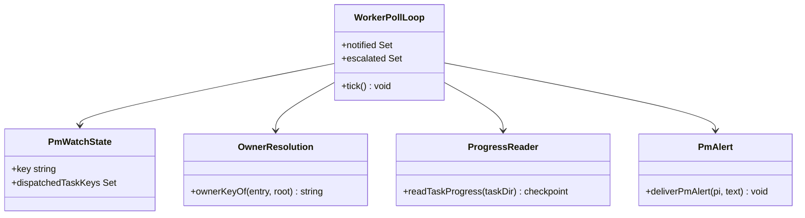
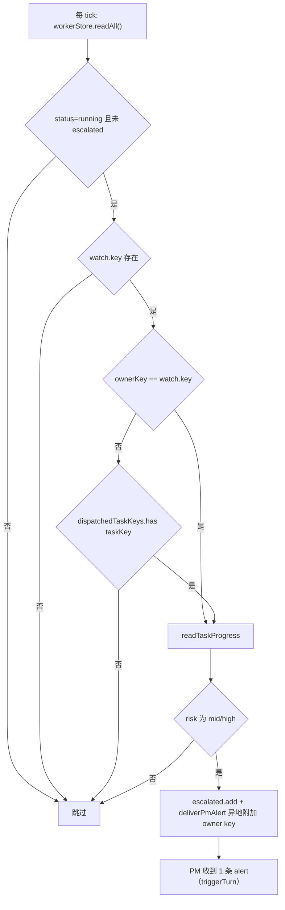

# Design: mw-crosskey-risk-escalation

> Key: mw-crosskey-risk-escalation
> 日期: 2026-09-23
> 上游: `spec.md`（AC-001~004，已锁定）；证据: `evidence/research/spec-crosskey-escalation-baseline-2026-09-23.md`（F1~F4）

## 1. 设计目标与约束

- 目标：让"本窗口派发但 owner key ≠ watched key"的 worker 在高风险检查点上**投递一次** PM 升级；保持"别窗口的 worker 不唤醒本窗口"的既有性质。
- 约束继承：GC-1（判定只读文件 + 进程内集合，无守护进程）、GC-2（只改扩展）、GC-3（零 Python 行为改动）、GC-5（不引入跨窗口广播）。
- 非目标：判据本身、低风险投递、面板聚合行（`mw-worker-visibility-gate` 已交付）、`dispatchedTaskKeys` 的持久化。

## 2. 现状（来自 spec 阶段证据）

| # | 事实 | 出处 |
|---|------|------|
| F1 | 升级过滤 = `entry.status !== "running"` + `escalated.has` + `!watch.key` + `ownerKeyOf(entry) !== watch.key` | `pm-orchestrator.ts:564-578` |
| F2 | `watch.dispatchedTaskKeys?: Set<string>` 是"本窗口派发"的既有登记面（进程内、不持久化），`list_tasks`/`ack` 已消费 | `ui-bridge.ts` `PmWatchState` |
| F3 | 既有用例 `diverging workers owned by other keys never wake this window` 是硬反例守卫（夹具不含 `dispatchedTaskKeys`） | `agent-team-loop.test.ts:3964-4000` |
| F4 | 投递口 `deliverPmAlert` 与判据 `readTaskProgress` 无需改动；alert 文本是包含式断言 | 同文件 |

## 3. 决策

### D-101 归属判定改为"或"关系（watched key ∪ 本窗口派发）

把该分句由

```ts
if (!watch.key || ownerKeyOf(entry, agenticdocRoot) !== watch.key) continue;
```

改为

```ts
const ownerKey = ownerKeyOf(entry, agenticdocRoot);
const owned = watch.dispatchedTaskKeys?.has(entry.taskKey) ?? false;
if (!watch.key || (ownerKey !== watch.key && !owned)) continue;
```

- `!watch.key` 短路**保留**：没在 watch 任何 key 的窗口不会因为历史派发记录而开始投递（避免"未参与编排的窗口被唤醒"）。
- `ownerKey` 提取为局部变量，供 D-102 的文案复用；`owned` 显式布尔化，避免 `undefined` 与 `false` 在条件里混用（可读性 + 类型明确）。
- 只读 `watch`（进程内状态），无新 IO、无持久化 → 满足 GC-1/GC-5。

### D-102 alert 文案在"异地"时附加 owner key

watched key 自身的 alert 文本**逐字不变**（保护既有 AC-004 用例与 PM 的既有阅读习惯）；当 `ownerKey !== watch.key` 时，在 worker 名后附加 `（owner key=<ownerKey>）`：

```
[mw] 发散风险：worker 't-cross'（owner key=_scratch）检查点 risk=high（elapsed 30m，reads=74 writes=0，phases=-，重复读 top=3）。机器判据仅供参考——…证据：…/trace.log（[CHECKPOINT] 行）与 …/progress.md（自评行；无写工具角色另含框架机器行）。
```

判定依据：PM 需要知道"这是异地任务"，才能正确选择"继续等 / 收窄 / 终止分拆 / 直执"（否则会以为是自己 watched key 的活而误判上下文）。

### D-103 去重与低风险抑制不变

`escalated` 集合的语义（每 task 每窗口至多 1 条）与 `if (!ck || ck.risk === "low") continue` 一律不变；不为异地行新增集合。理由：跨 key 行天然也在 `entries` 里，同一集合即可覆盖。

### D-104 否决"全局广播"（去掉 owner 过滤）

备选方案对比：

| 方案 | 覆盖面 | 副作用 | 判定 |
|------|--------|--------|------|
| A（本设计） | watched key ∪ 本窗口派发 | 无（别窗口静默） | ✅ 采用 |
| B 全局广播 | 所有 running worker | N 个窗口同时被唤醒；越权上下文（别窗口的 key/任务对当前 PM 无意义）；既有反例守卫用例会失败 | ❌ 否决 |
| C 只在面板标记（现状 + `mw-worker-visibility-gate` 聚合行） | 仅被动可见 | 异地高风险 worker 永远不会主动唤醒 PM | ❌ 已被用户否决（本 key 的触发源） |

## 4. 组件与流程





## 5. 错误与边界

- `dispatchedTaskKeys` 为 `undefined`（未接线/测试夹具）：`owned=false`，行为与改造前**逐行相同**（F3 用例继续绿）。
- `entry.taskPath` 不在任何 key 目录下（`ownerKeyOf` 返回空串或兜底值）：仍按 `!owned → 跳过` 处理，不新增抛错路径。
- `trace.log` 缺失/无 `[CHECKPOINT]`：`readTaskProgress` 返回 undefined → 跳过（不变）。
- 窗口重启后 `dispatchedTaskKeys` 丢失 → 异地 worker 不再投递（spec §4 R-1，接受；未决 Q-1 记录）。

## 6. Coverage（F → VC）

| 事实 | 覆盖用例 | 说明 |
|------|----------|------|
| F1 | VC-001/VC-002/VC-003 | 过滤分句的两种取值都被驱动 |
| F2 | VC-001 | 判定输入正是 `dispatchedTaskKeys` |
| F3 | VC-002/VC-004 | 反例守卫（未派发 → 静默）+ watched key 路径不变 |
| F4 | VC-001/VC-004 | alert 文本与投递口 |

## 7. 验证用例（VC）

| VC | 对 AC | 构造 | 期望证据 |
|----|-------|------|----------|
| VC-001 | AC-001 | watch `key-a`；`key-b` 下 running task `t-cross`；`watch.dispatchedTaskKeys = new Set(["t-cross"])`；trace.log 含 `risk=high`；fake timers tick | 恰好 1 条 alert；文本含 `t-cross`、`key-b`、`risk=high`；`options[0].triggerTurn === true`；`[VERIFY] VC-001: alerts=1 owner_in_text=true trigger_turn=true` |
| VC-002 | AC-002 | 同 VC-001 但不设 `dispatchedTaskKeys`（以及显式空 Set 两种形态） | 0 条 alert；`[VERIFY] VC-002: alerts=0 ...` |
| VC-003 | AC-003 | 跨 key 已派发但 `risk=low`；另一 task 已派发且 `risk=high` 在第二 tick 保持 | 低风险 0 条；高风险恰 1 条（第二 tick 不重复）；`[VERIFY] VC-003: low_alerts=0 high_alerts=1 dup=0` |
| VC-004 | AC-004 | 既有 watched key 用例 | 用例通过（1 条、文本片段、`triggerTurn`、第二 tick 不重复）；`[VERIFY] VC-004: watched_key_alerts=1 text_unchanged=true` |

## 8. 影响面与回归

- 改动文件（预期）：`pm/pm-orchestrator.ts`（1 处条件 + 1 处文案拼接）；测试：`test/extensions/agent-team-loop.test.ts`（新增 3 个用例，既有 2 个 AC-004 用例零改动）。
- 回归面：整个 `test/extensions/agent-team-loop.test.ts` + `test/extensions/agent-team-loop-watch-aggregate.test.ts`（同属面板/轮询面）+ `npm run check`。
- 无 `dist/**`、无 Python、无 CHANGELOG 之外文档改动（CHANGELOG 由收口步骤处理）。

## 9. 残留（供 done 时登记）

- R-1：`dispatchedTaskKeys` 进程内语义 → 窗口重启后异地 worker 不再升级（未决 Q-1：是否持久化）。
- R-2：升级面只覆盖"本次会话派发"的异地任务；更早派发（别会话）的异地高风险 worker 仍只被动可见于面板聚合行。
