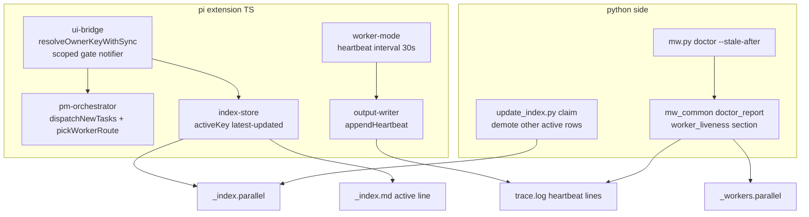
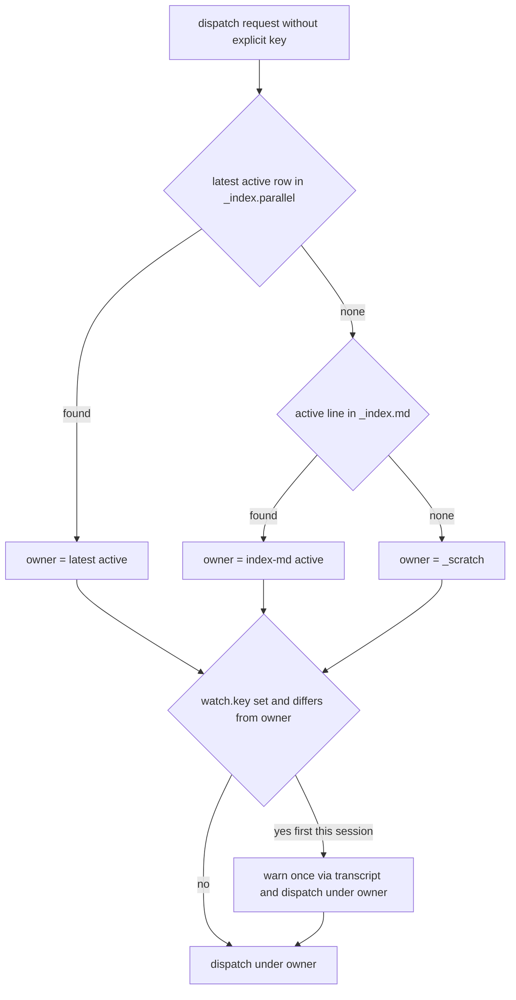
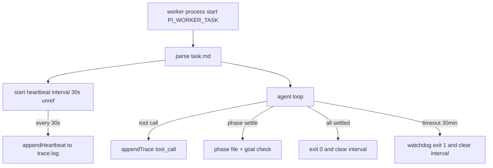
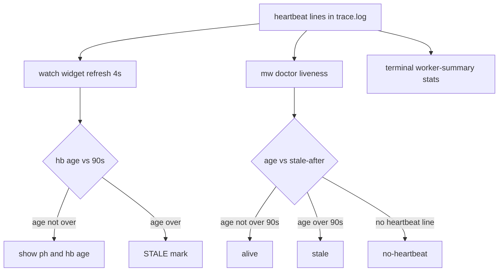
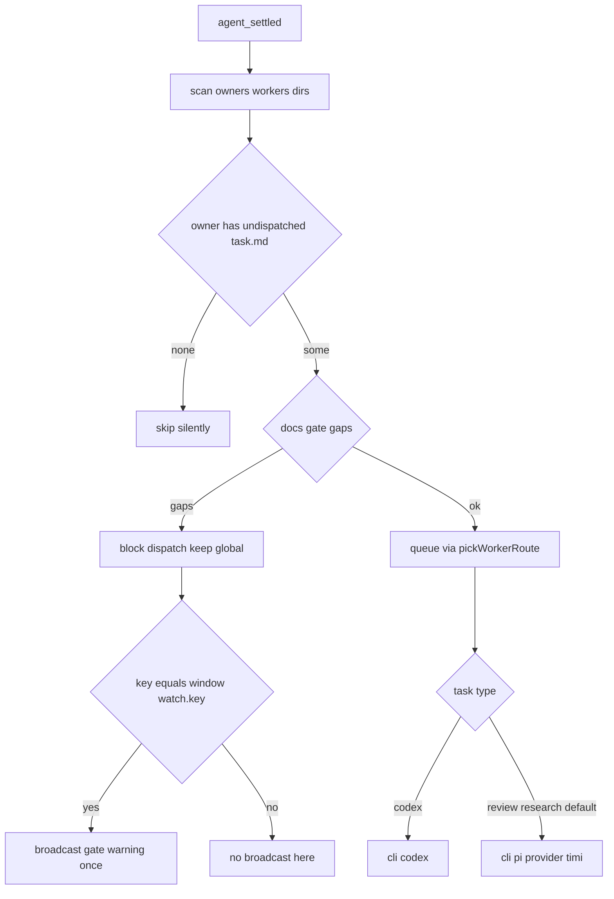

# Design: mw-dispatch-flow-fixes

## §0 设计前提锚定

- spec_path: `.agenticdoc/mw-dispatch-flow-fixes/spec.md`
- spec_locked_at: 2026-09-07T20:43:55+08:00
- ac_count: 13
- ac_ids: AC-001, AC-002, AC-003, AC-004, AC-005, AC-006, AC-007, AC-008, AC-009, AC-010, AC-011

## §1 架构选型

### D-001 owner key 解析来源与优先级

**需求摘要**：AC-001——无显式 key 派发时 owner 必须等于当前激活 key（ga-spec-review-1 事故根除）。

| 方案 | Pros | Cons |
|------|------|------|
| A. 激活指针链：`_index.parallel` latest-updated active 行 > `_index.md` active 行兜底 > `_scratch`；写侧同步修 `update_index.py claim` 降级其他 active 行 | 与用户决策 1 一致（激活为准）；修复真正的根因（双 active 并存 + find-first）；三源收敛为一条确定性链 | `updated` 字段作时序依据有残余风险（stale 行近期被 bump 会赢）——写侧修复阻断新分歧后可接受 |
| B. 窗口 `watch.key` 优先（per-window authority） | 窗口语义直观 | 事故场景 watch=agent-team-loop（陈旧恢复）→ 仍落错目录，AC-008 不满足；与"以激活为准"决策相悖 |

**推荐**：`A`
**理由**：根因已定位（`update_index.py claim` 不降级 + `activeKey()` find-first + `_index.md` 手工维护分歧）；A 同时修写侧与读侧，watch 降级为告警输入（D-002）而非解析输入。
**调研**：`evidence/research/design-owner-key-root-cause-2026-09-07.md`

### D-002 watch 与激活不一致的告警机制

**需求摘要**：AC-002——不一致时以激活为准 + 一次告警留痕，不静默。

| 方案 | Pros | Cons |
|------|------|------|
| A. `resolveOwnerKeyWithSync` 每 session 每对 (watch, owner) 用 displaySummary 告警一次；不自动改 watch | 留痕进时间线（CustomMessageEntry 持久 + LLM 可见）；无意外副作用；实现集中在单一 helper | 窗口 watch 保持错位直至人工 /pm-key switch（告警已给出对齐命令） |
| B. 派发时自动 /pm-key switch 对齐 watch | 状态自动收敛 | 静默改写窗口状态，违背"不静默"精神；switch 有认领副作用（抢 claim） |

**推荐**：`A`
**理由**：告警即行动指引；自动 switch 在多窗口下可能抢其他窗口的 claim。
**调研**：`evidence/research/design-owner-key-root-cause-2026-09-07.md`

### D-003 心跳机制

**需求摘要**：AC-003/005——worker 执行期 ≤60s 间隔结构化条目，additive。

| 方案 | Pros | Cons |
|------|------|------|
| A. worker-mode 内 `setInterval`（30s，`unref()`）+ `appendHeartbeat` 独立行类型 `[HEARTBEAT]` | 与既有 30min 看门狗同一存活模型（事件循环存活则触发）；网络挂起不误报；单写者无锁追加（GC-2/GC-3 合规）；行类型独立于 `[FLOW]`/`[GOAL_CHECK]`（additive） | 事件循环被同步代码阻塞时心跳也停——但这正是要检测的异常（外部 doctor 判 stale），见调研发现 2 |
| B. PM 侧轮询探活（向 worker 进程发信号） | 主动探测 | 引入跨进程通信通道，违背 GC-3；PM 需知 worker PID/端口，耦合 launcher |

**推荐**：`A`
**理由**：心跳的真正价值是外部可观测性：进程内看门狗在事件循环阻塞时同样失灵，心跳把内部活性落到文件供 doctor 外部判定（分钟级早于 30min）。
**调研**：`evidence/research/design-heartbeat-and-gate-2026-09-07.md`

### D-004 活性判定载体

**需求摘要**：AC-004——从结构化日志计算 alive/stale，阈值默认 90s 可配。

| 方案 | Pros | Cons |
|------|------|------|
| A. `mw_common.doctor_report` 新增 `worker_liveness` 节：running 行 → 最后 `[HEARTBEAT]` 距今 vs 阈值；`mw.py doctor --stale-after <sec>`；`/mw doctor` 摘要行 | 复用 doctor 队列读取与 JSON 出口（mw-dispatch-reliability D-005 双入口同源纪律）；CLI 与 pi 内同源 | Python 侧小量新增（约 40 行 + 测试）——spec §1.2 "Python 零改动"仅约束路由，不冲突 |
| B. TS 侧独立判定脚本/组件 | 纯 TS | 另起一套诊断实现，违背 doctor 单源纪律；读队列/trace 需重复 Python 侧逻辑 |

**推荐**：`A`；verdict ∈ `alive` / `stale` / `no-heartbeat`（旧 bundle 任务）；**信息性不改 doctor 退出码**（kill 语义保留给 GC-4 看门狗）。
**调研**：`evidence/research/design-heartbeat-and-gate-2026-09-07.md`
### D-005 路由默认值修改

**需求摘要**：AC-006/007——`type: review|research` 不再触发 claude，默认 pi/timi。

| 方案 | Pros | Cons |
|------|------|------|
| A. `pickWorkerRoute` 删除 `review|research → claude` 一行（codex 行保留）；`dispatch_worker` 显式 cli 参数行为不变 | 单行改动达成 AC-006/007；静态决策无运行时检测（§2.2）；既有测试无该映射断言（已核实） | 行为变更非 additive——需新增正向断言 + 同步提及该映射的文档 |
| B. task.md 增加 `cli:` 显式行 + 内容路由全默认 pi | 扫描路径可显式指定 cli | 超出已决范围（全局默认 pi 已满足；显式通道 = 工具参数） |

**推荐**：`A`
**理由**：用户决策 3 的最小实现；B 的显式通道已由 dispatch_worker cli 参数承担。
**调研**：`evidence/research/spec-routing-decisions-2026-09-07.md`

### D-006 docs gate 收敛与播报作用域

**需求摘要**：AC-010/011——全终态 key 不告警；gate 告警按窗口认领 key 过滤。

| 方案 | Pros | Cons |
|------|------|------|
| A. `dispatchNewTasks` 把"未入队任务过滤"提到 gate 评估前（无未入队任务则跳过 gate）；播报作用域过滤放在 pmActivate 的 `onDocGate` 接线处（watch 闭包） | 本体保持纯函数语义（既有测试不破）；gate 阻塞语义全局不变，仅告警播报按 watch 过滤；作用域策略可独立单测（fake pi 捕获 sendMessage） | 未认领 key 的 gate 告警无播报面（spec 已决接受：widget/doctor 可见） |
| B. dispatchNewTasks 接收 watch 参数在内部过滤播报 | 单点实现 | 本体掺入窗口状态，可测性下降；与既有 onDocGate 回调设计相悖 |

**推荐**：`A`
**理由**：关注点分离——扫描/阻塞（全局正确性）与播报（窗口可观测性）分层。
**调研**：`evidence/research/design-heartbeat-and-gate-2026-09-07.md`

### D-007 测试架构

**需求摘要**：11 条 AC 的分层验证。

| 方案 | Pros | Cons |
|------|------|------|
| A. L1 为主：vitest fake-pi（捕获 sendMessage）覆盖 owner/gate/播报/路由；pytest 覆盖 doctor liveness；框架脚本（update_index.py）临时根目录脚本级验证；L2 仅 AC-008 同规格实跑 | 全部 L0/L1 可密封跑（`./test.sh` + pytest）；L2 范围最小 | 框架脚本验证游离于 pytest 套件（脚本位于 .agents/skills，非 packages 内） |
| B. 全部 L2 实跑 | 端到端真实 | 慢、依赖凭证/服务，无法密封回归 |

**推荐**：`A`
**理由**：与 mw-dispatch-reliability D-007 同构（假件密封 + marker 隔离真实链路）。

### D-008 心跳消费面（PM 侧 monitor）
| D-009 | 终态自动回读：终态消息注入 output.md 全文（readOutputBody，上限 20k 截断+指路），替代仅 Summary 节选；消息头保留 taskKey/status/心跳统计。评审后用户决策（成果自动交付），AC-014/VC-020 |

**需求摘要**：AC-012/013（设计审核轮用户追加）——PM 窗口持续可见 worker 进度，终态摘要附心跳统计。

| 方案 | Pros | Cons |
------|------|------|
| A. 活 monitor 做在 watch widget（renderWatchLines running 行追加 `ph i/n hb <age>`，STALE 标记）+ 终态摘要附统计 `(6m, ph 3/3)`（formatHeartbeatAge 粗粒度桶 15s/3m/2h，n2 修正） | widget 每 4s 随 poll 循环原位重绘（零新增轮询机制）；transcript 消息 append-only，活更新只能上 widget；终态统计进时间线留痕 | 需在 renderWatchLines / 终态摘要处读 trace.log 尾部（仅 watch key 的 running 任务，量级 ≤ max_workers） |
| B. 活 monitor 做在 worker-summary 消息（每次心跳新发/更新一条消息） | 无 | sendMessage append-only 无法更新；每 30s 一条消息会刷爆 transcript 与 LLM 上下文 |

**推荐**：`A`
**理由**：widget 是唯一可原位更新的用户可见面且已有 4s 刷新周期；summary 承担终态一次性统计（用户“也许可以放在 summary”的落地形态）。
**调研**：`evidence/research/design-heartbeat-and-gate-2026-09-07.md`（追加节：消费面事实）

### D-010 终态 finish call：triggerTurn 唤醒 PM（AC-015）

**需求摘要**：AC-015（2026-09-09 用户缺陷报告 1）——终态回读仅展示不推进，dispatch→monitor 后中断；需补全 finish call → pm run 环节。

**根因**：displaySummary 走 `pi.sendMessage(msg)`（无 options）：agent 空闲时 sendCustomMessage 只入栈消息不触发 turn（agent-session.ts sendCustomMessage 无 triggerTurn 分支），PM 永远不会醒。

| 方案 | Pros | Cons |
|------|------|------|
| A. 终态回读专用 deliverWorkerResult：`sendMessage(msg, { triggerTurn: true })`，空闲→立即开 turn，流式→steer 注入当前 turn；消息尾附 PM 循环指引文案 | 最小改动复用 sendMessage 语义；自定义消息类型/渲染器保留；流式/空闲两态全覆盖 | PM 被动多消耗 agent turn（正是需求）；消息文案需引导下一步 |
| B. `pi.sendUserMessage`（总是触发 turn） | 语义最直接 | 伪装成用户消息；丢失 customType/details 通道 |
| C. 定时唤醒：PM 周期性 poll _workers.parallel 自主推进 | 无侵入 | 消耗持续轮询 turn，空转成本高；与 4s 静默 poll 重复 |

**推荐**：`A`
**理由**：triggerTurn 是 pi 为“外部事件唤醒 agent”提供的原生通道；仅终态回读使用（初始化/gate/告警类保持被动 displaySummary，不消耗 turn）；循环安全：notified 每 taskKey 每 session 去重 + 指引文案让 PM 对 failed/needs-clarification 分叉处理（重试/修复/澄清），无自动重派循环。

### D-011 worker 结构化进度与 worker.log 修复（AC-016）

**需求摘要**：AC-016（2026-09-09 用户缺陷报告 2）——trace.log 只有测活信号无中间进度/状态/报错；worker.log 空。

**根因**：worker.log 空是因为 exitWithSuccess 在 agent_settled 内 process.exit(0)——此时 pi print-mode 的最终回复尚未写入 stdout（sendCustomMessage/_runAgentPrompt 未 resolve），process.exit 截断待刷新写入。trace.log 只有 [FLOW] tool_call 工具名 + [HEARTBEAT]。

| 方案 | Pros | Cons |
|------|------|------|
| A. 成功路径不 exit（让 print-mode 自然输出+退出）；失败/超时保留 exit(1)+fs.writeSync(1) 状态行；trace 新增 [START]/[PHASE]/[TOOL]/[TOOL_ERR]/[TIMEOUT]/[ERROR]/[END] 行类型，时长由 [START]/[END] 承载（[HEARTBEAT] 格式不动） | worker.log 得到完整最终回复；exit code 归真（pi 自身语义）；trace 机器可解析进度/报错；全部 additive，Python 解析（前缀 regex）零改动 | 需新增 readTaskProgress 解析与 widget/摘要接线；[TOOL] 行带目标摘要有轻量噪音 |
| B. 心跳行扩 elapsed= 后缀 | 行内自带时长 | 改 [HEARTBEAT] 格式破坏 AC-005 additive 约束，TS/Python 两端解析都要动 |
| C. 独立 status.json 结构化状态文件 | 任意复杂度 | 新文件新协议，与 trace.log 双源易漂移 |

**推荐**：`A`
**理由**：根因修复（exit 时机）而非绕过；新行类型只增不改，旧任务 trace 仍可解析（字段 undefined 降级）；widget/终态摘要/doctor 三消费面共读同一 readTaskProgress。

## §2 核心结构



（模块级关系；心跳的写入与消费链见 §5。）

## §3 模块划分

```
packages/coding-agent/src/extensions/agent-team-loop/
├── shared/index-store.ts      # activeKey() 改为 latest-updated active 行（唯一生产调用方 resolveOwnerKey）
│                              #   新增 readIndexMdActive(root)（_index.md active 行兜底解析）
├── pm/ui-bridge.ts            # resolveOwnerKey 升级为 resolveOwnerKeyWithSync(pi, indexStore, watch, explicit, root)
│                              #   registerWorkerTools / registerWorkerCommands 增加 watch 参数（pmActivate 传入）
│                              #   新增 makeScopedDocGateNotifier(pi, watch)（AC-011 播报作用域）
│                              #   renderWatchLines running 行追加心跳派生进度 + STALE 标记（AC-012）
├── shared/heartbeat.ts        # 新：HEARTBEAT_INTERVAL_MS / HEARTBEAT_STALE_MS 常量 + readHeartbeatInfo(taskDir)
│                              #   （写方在 worker/output-writer，读方 widget 与终态摘要共用）
├── pm/pm-orchestrator.ts      # dispatchNewTasks：未入队过滤前置（AC-010）；pickWorkerRoute 移除 claude 硬路由（AC-006/007）
│                              #   pmActivate：onDocGate 接线经 scoped notifier；工具/命令注册传 watch
│                              #   终态摘要附心跳统计（AC-013，经 readHeartbeatInfo）
├── worker/worker-mode.ts      # heartbeat setInterval（30s、unref、全部 exit 路径 clearInterval）
└── worker/output-writer.ts    # appendHeartbeat(taskKey, workersRoot, phaseInfo) —— 沿用现有路径约定

packages/multi-workers/
├── mw_common.py               # doctor_report 增 worker_liveness 节（alive/stale/no-heartbeat，信息性）
└── mw.py                      # cmd_doctor 透传 --stale-after（默认 90）

.agents/skills/agentic-task/scripts/update_index.py   # cmd_claim 降级其他 active 行（框架源改动，需 commit+push 上游）

packages/coding-agent/test/extensions/agent-team-loop.test.ts   # VC-001~005、008~010、013~016 用例
packages/multi-workers/test_serve_doctor.py                     # VC-006/007 用例
```

依赖方向：`ui-bridge → index-store → 文件`；`worker-mode → output-writer → 文件`；`mw.py → mw_common → 文件`。无循环依赖。`update_index.py` 为框架侧独立写者。

## §4 接口与集成

### 4.1 对外接口清单

| 接口 | 签名/形态 | 说明 |
|------|----------|------|
| owner 解析 | `resolveOwnerKeyWithSync(pi, indexStore, watch, explicit, agenticdocRoot): string` | 显式参数 > latest-active > `_index.md` active > `_scratch`；watch≠owner 每 session 每对一次告警 |
| activeKey | `IndexStore.activeKey(): string \| undefined`（语义变更） | 返回 `updated` 最新的 active 行 |
| _index.md 兜底 | `readIndexMdActive(agenticdocRoot): string \| undefined` | 解析 `^active:\s*(\S+)` |
| 心跳写入 | `appendHeartbeat(taskKey, workersRoot, phaseInfo): void` | 行格式 `[HEARTBEAT] <ISO-ts> task=<key> phase=<i>/<n\|->` |
| 心跳间隔 | `HEARTBEAT_INTERVAL_MS = 30_000`（常量，shared/heartbeat.ts） | AC-003 上界 60s 留 2x 余量 |
| 心跳阈值 | `HEARTBEAT_STALE_MS = 90_000`（常量，与 doctor 默认 90s 同步维护） | widget STALE 标记与 doctor stale 共用默认值 |
| 心跳读取 | `readHeartbeatInfo(taskDir): { lastTs, ageMs, phase, phaseTotal, count, firstTs } \| undefined` | 扫描 trace.log 最后一条 [HEARTBEAT]；无则 undefined（no-hb/no-heartbeat） |
| widget 行 | `> task-key ph 2/3 hb 15s`；STALE：`> task-key ph 2/3 hb 5m STALE`；无：`> task-key (no-hb)` | running 任务行，随 4s poll 重绘 |
| doctor | `python mw.py doctor --project=<dir> [--json] [--stale-after <sec>]` | report 增 `worker_liveness: [{task_key, last_heartbeat, age_s, verdict}]`，默认阈值 90 |
| /mw doctor | pi 内命令（现有） | 摘要新增活性行：`alive n / stale: k1,k2 / no-heartbeat n` |
| 终态摘要统计 | `[{taskKey}] {status}: {summary} ({duration}, ph {i}/{n})` | 仅当 trace 含 ≥2 条 [HEARTBEAT]；否则保持现状格式 |
| 路由 | `pickWorkerRoute(content)` | `type: codex → codex`；其余（含 review/research）→ `pi/timi` |
| 框架 claim | `update_index.py claim <key>` | 成功后其他 active 行降级 idle（`updated` 一并刷新） |

### 4.2 外部依赖集成

- pi Extension API：`sendMessage`（告警留痕，append-only）、`setInterval`（Node 内建）——无新 API 依赖
- mw doctor：经既有 `spawnSync` 出口，`/mw doctor` 播报复用 mw-runner
- bundle 重建走既有 `/mw build`（build-extension.sh 单文件约定不变）
- 框架脚本改动（update_index.py）：按 AgenticTask 维护规则在 installed clone 内修改后 `git push` 上游

## §5 Function Flow

owner 解析与派发（dispatch_worker 工具与 /worker 命令共用）：



心跳写入与活性判定：

心跳写入（worker 进程内）：



心跳消费（外部判定与展示）：



扫描派发与 gate：



## §6 Coverage Matrix

| ID | 功能点 | 正常路径 | 边界测试 | 异常路径 | 验证层级 |
|----|--------|---------|---------|---------|---------|
| F1 | owner 解析（D-001） | 单 active 行解析 | 双 active 行 latest 胜；_index.md 兜底 | 无 active → _scratch | L1 |
| F2 | mismatch 告警（D-002） | watch=owner 无告警 | 同对二次派发不重复告警 | watch≠owner 告警一次且 owner 不变 | L1 |
| F3 | 心跳写入（D-003） | 执行期间持续条目 | 间隔常量 ≤60s；phase 信息 | exit 路径全部清理 interval | L1/L2 |
| F4 | 活性判定（D-004） | alive | no-heartbeat（旧 bundle）；阈值覆盖 | stale | L1 |
| F5 | 协议 additive（AC-005） | 混合 trace 解析 | [FLOW]/[GOAL_CHECK] 格式不变 | output/exit-code 回归 | L1 |
| F6 | 路由默认 pi（D-005） | review 扫描 → pi/timi | codex 保留 | 显式 claude 不受影响 | L1 |
| F7 | gate 收敛（D-006） | 全终态 key 静默 | 有未入队才评估 | undoc + 未入队仍阻塞 | L1 |
| F8 | 播报作用域（D-006） | watch key 播报 | 无 watch 不播 | 非认领 key 不播 | L1 |
| F9 | 写侧单 active（D-001） | claim 后唯一 active | — | 多 active 存量被降级 | L1 |
| F10 | 回归重跑（AC-008） | 同规格全链通过 | — | 三项任一失败即 fail | L2 |
| F11 | 心跳消费面（D-008） | widget 显示 ph+hb；终态摘要附统计 | no-hb 占位（旧 bundle） | STALE 标记 | L1 |

## §7 Verification Contract

```
VC-001: 当 _index.parallel 含两个 active 行（agent-team-loop updated=旧、goal-autopilot updated=新）时，resolveOwnerKeyWithSync 无显式参数必须返回 goal-autopilot
       Layer: L1
       Output: [VERIFY] VC-001: owner=goal-autopilot
       Source: AC-001

VC-002: 当 _index.parallel 无 active 行且 _index.md 含 "active: K" 时，resolveOwnerKeyWithSync 必须返回 K
       Layer: L1
       Output: [VERIFY] VC-002: owner=K
       Source: AC-001

VC-003: 当 watch.key=X 且解析 owner=Y（X≠Y）时，首次派发必须恰好产生 1 条含 X 与 Y 的 mismatch 告警，同 session 二次派发 0 条，且 task.md 落在 {Y}/workers/ 名下
       Layer: L1
       Output: [VERIFY] VC-003: warn_count=1; owner=Y
       Source: AC-002

VC-004: 当检查实现时，HEARTBEAT_INTERVAL_MS 必须 ≤ 60000，且 appendHeartbeat 输出行匹配 ^\[HEARTBEAT\] \S+ task=\S+
       Layer: L0
       Output: [VERIFY] VC-004: interval_ms<=60000; line_format=matched
       Source: AC-003

VC-005: 当 trace.log 同时含 [FLOW]、[GOAL_CHECK]、[HEARTBEAT] 行时，[FLOW] 与 [GOAL_CHECK] 行格式必须与改前完全一致（既有解析断言全绿），[HEARTBEAT] 为独立新行类型
       Layer: L1
       Output: [VERIFY] VC-005: flow_format=unchanged; goalcheck_format=unchanged; heartbeat_type=independent
       Source: AC-005

VC-006: 当 doctor 运行于含 running 行的项目时，worker_liveness 必须按最后 [HEARTBEAT] 距今输出 verdict（≤阈值 alive、>阈值 stale、无行 no-heartbeat），--stale-after 覆盖默认 90
       Layer: L1
       Output: [VERIFY] VC-006: verdicts={alive,stale,no-heartbeat}; threshold_override=ok
       Source: AC-004

VC-007: 当 /mw doctor 播报执行时，摘要必须含 worker 活性行且 stale 任务名列出
       Layer: L1
       Output: [VERIFY] VC-007: summary.contains=liveness; stale_listed=true
       Source: AC-004

VC-008: 当 worker-mode 心跳改动合入后，既有 vitest（output.md 四节、exit code 映射、看门狗、扫描派发）必须全绿
       Layer: L1
       Output: [VERIFY] VC-008: vitest_regression=pass
       Source: AC-005

VC-009: 当扫描路径遇到 task.md 含 "type: review" 时，队列行必须为 cli=pi、provider=timi
       Layer: L1
       Output: [VERIFY] VC-009: cli=pi; provider=timi
       Source: AC-006

VC-010: 当 dispatch_worker 显式 cli=claude 时队列行必须为 cli=claude（回归）；当 pickWorkerRoute 解析 "type: research" 内容时必须返回 pi/timi
       Layer: L1
       Output: [VERIFY] VC-010: explicit_claude=claude; research_route=pi-timi
       Source: AC-007

VC-011: 当显式 cli=claude 任务在无 ANTHROPIC_API_KEY/AUTH_TOKEN 环境派发时，该任务 status=failed、worker.log 含缺失凭证名、同批 pi/timi 任务不受影响（mw-dispatch-reliability 既有 L1 用例回归通过）
       Layer: L1
       Output: [VERIFY] VC-011: claude_task=failed; sibling=done
       Source: AC-009

VC-012: 当以 ga-spec-review-1 同规格重跑（review 派发至派发窗口认领 key 名下；原事故实例为 goal-autopilot，REVISED @ 2026-09-08 用户决策 9——goal-autopilot 处 SPEC 阶段被 docs gate 正确拦截）时，task.md 必须落在认领 key/workers/ 名下、执行期相邻 [HEARTBEAT] 间隔 ≤60s、任务经 pi/timi 默认路由完成、全程无人工路由干预
       Layer: L2
       Output: [VERIFY] VC-012: owner=claimed-key; heartbeat_gap_max<=60s; route=pi-timi; manual_intervention=0
       Source: AC-008

VC-013: 当 key 名下全部任务已在队列（workers/ 下无未入队 task.md）且该 key 文档缺失时，dispatchNewTasks 必须不触发 onDocGate
       Layer: L1
       Output: [VERIFY] VC-013: gate_events=0
       Source: AC-010

VC-014: 当 key 存在 ≥1 未入队任务且文档缺失时，onDocGate 必须触发（每 session 每 key 一次）且该任务不入队（阻塞语义不变）
       Layer: L1
       Output: [VERIFY] VC-014: gate_events=1; queued=0
       Source: AC-010

VC-015: 当窗口 watch.key=K 时，gate 告警播报必须仅含 K 的事件（K→1 条、J→0 条）；无 watch 时全部为 0 条
       Layer: L1
       Output: [VERIFY] VC-015: K_broadcast=1; J_broadcast=0; nowatch_broadcast=0
       Source: AC-011

VC-016: 当 worker 进入终态时，终态摘要必须仅播报本窗口 watch.key 名下的任务（fake pi 捕获 sendMessage 断言）
       Layer: L1
       Output: [VERIFY] VC-016: summary_scope=watch_key_only
       Source: AC-011

VC-017: 当 update_index.py claim K 执行于含其他 active 行的临时根时，执行后 _index.parallel 的 active 行必须唯一（=K）
       Layer: L1
       Output: [VERIFY] VC-017: active_rows=1; active_key=K
       Source: AC-001

VC-018: 当本窗口 watch key 名下 running worker 的 trace.log 含新鲜 [HEARTBEAT] 时，renderWatchLines 该任务行必须含 phase 进度与最近心跳距今且无 STALE 标记；距今 > 90s 时含 STALE；无 [HEARTBEAT] 时显示 no-hb 占位
       Layer: L1
       Output: [VERIFY] VC-018: running_line=ph+hb; stale_marked=true; nohb_placeholder=present
       Source: AC-012

VC-019: 当 worker 进入终态且 trace.log 含 ≥2 条 [HEARTBEAT] 时，终态摘要必须附带时长与 phase 完成度统计（含时长与 ph 字样）；心跳 <2 条时保持现状格式
       Layer: L1
       Output: [VERIFY] VC-019: summary_stats=present; low_hb_format=unchanged
       Source: AC-013
```

VC-020: 当 worker 进入终态且 output.md 存在时，终态 worker-summary 消息 content 必须包含output.md 全文（≤20,000 字符；超出部分截断并包含 "full report:" 路径指路）；output.md 缺失时消息保持 spawn-failure/无输出格式（与 AC-014 对应）
       Layer: L1
       Output: [VERIFY] VC-020: full_body_injected=true; cap_enforced=true; no_output_fallback=true

## §8 AC → VC 映射表

| AC ID | AC 摘要 | 对应 VC | 路径分类 |
|-------|--------|---------|---------|
| AC-001 | owner = 激活 key（路径正确） | VC-001, VC-002, VC-017 | 正常/边界 |
| AC-002 | watch 不一致同步 + 告警 | VC-003 | 异常 |
| AC-003 | 心跳 ≤60s 结构化条目 | VC-004 | 正常 |
| AC-004 | 活性判定机制（阈值可配） | VC-006, VC-007 | 正常/边界 |
| AC-005 | 既有协议 additive | VC-005, VC-008 | 回归 |
| AC-006 | 无凭证环境 review 默认 pi 完成 | VC-009 | 正常 |
| AC-007 | 显式 claude 保留；type 不触发 | VC-010 | 边界 |
| AC-008 | ga-spec-review-1 同规格回归 | VC-012 | 正常（L2） |
| AC-009 | 显式 claude 缺凭证隔离不降级 | VC-011 | 异常 |
| AC-010 | gate 仅评有未入队任务的 key | VC-013, VC-014 | 边界/异常 |
| AC-011 | 播报按窗口认领 key 过滤 | VC-015, VC-016 | 边界 |
| AC-012 | widget 心跳进度 monitor | VC-018 | 正常/边界 |
| AC-013 | 终态摘要附心跳统计 | VC-019 | 正常/边界 |

## §9 非功能实现方案

- **性能**：gate 前置过滤减少无谓 stat/dispatchDocGaps 调用（全终态 key 零开销）；doctor liveness 仅读 running 行的 trace.log 尾部（O(running)）；心跳 30s 一次 appendFileSync 微量 IO；路由决策纯静态零开销
- **安全**：[HEARTBEAT] 行仅含时间戳/task-key/phase 序号，无凭证无 prompt 内容（§2.3）；doctor 输出沿用 `_mask_env_value` 规则；update_index.py 改动经原子写保护（既有 `_write_index_atomic`）
- **可观测性**：三层——worker 内 [HEARTBEAT] trace 行（外部可判活）、doctor worker_liveness 节（CLI/pi 内同源）、owner mismatch 告警（时间线留痕 + LLM 可见，含对齐指引）

## §10 决策记录

| D-ID | 决策点 | 选择 | 否决 | 理由 |
|------|--------|------|------|------|
| D-001 | owner 解析 | latest-active 链 + 写侧 claim 降级 | watch 优先 | 根因在双 active + find-first；激活为准是用户决策 |
| D-002 | mismatch 告警 | 每 session 一次 displaySummary，不自动 switch | 自动对齐 watch | 避免静默抢 claim |
| D-003 | 心跳 | worker 内 30s interval + 独立行类型 | PM 侧探活 | GC-3 禁跨 worker 通信；外部可观测是价值所在 |
| D-004 | 活性判定 | doctor 新节（信息性） | TS 独立脚本 | doctor 双入口同源纪律 |
| D-005 | 路由 | pickWorkerRoute 删 claude 行 | task.md cli 行 | 全局默认 pi 最小实现 |
| D-006 | gate/播报 | 过滤前置 + 接线处作用域 | 本体掺 watch | 关注点分离，可测性 |
| D-007 | 测试 | L1 密封为主 + L2 仅 AC-008 | 全 L2 | 与 mw-dispatch-reliability D-007 同构 |
| D-008 | 心跳消费面 | widget 活 monitor + 终态摘要统计 | summary 消息活更新 | transcript append-only；widget 已有 4s 刷新 |
