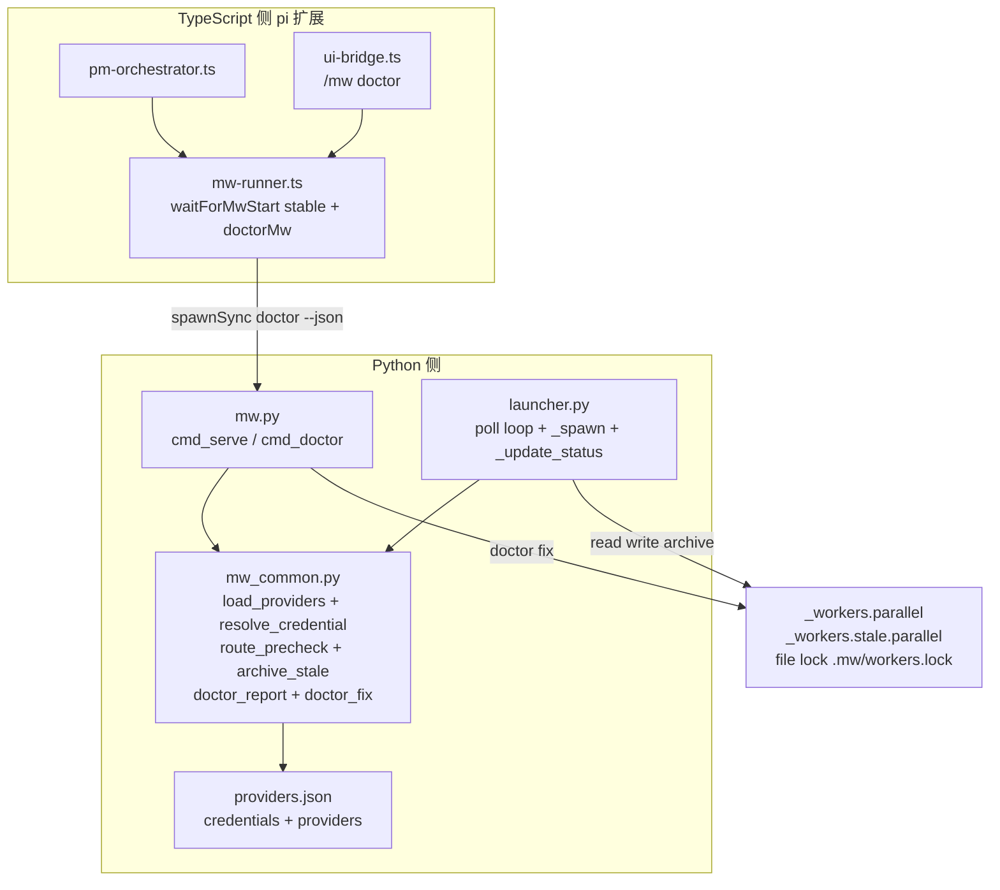
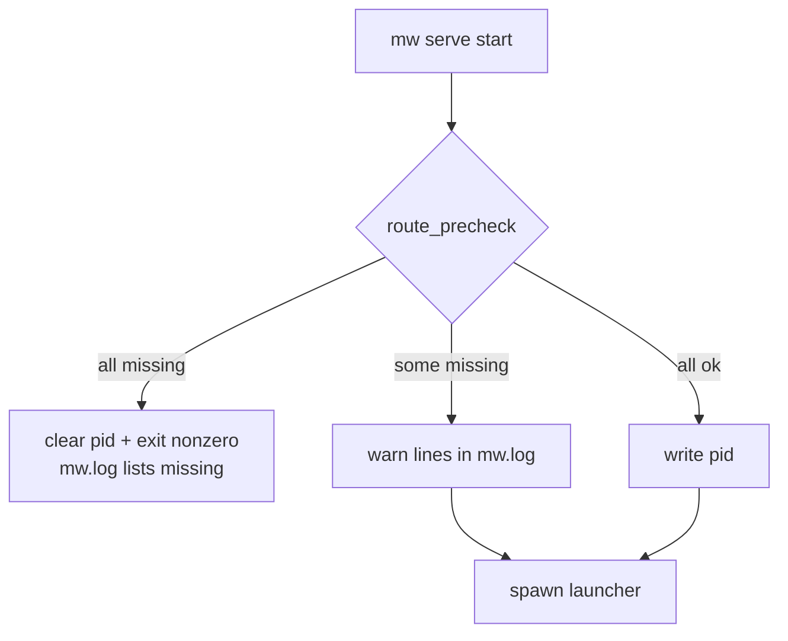
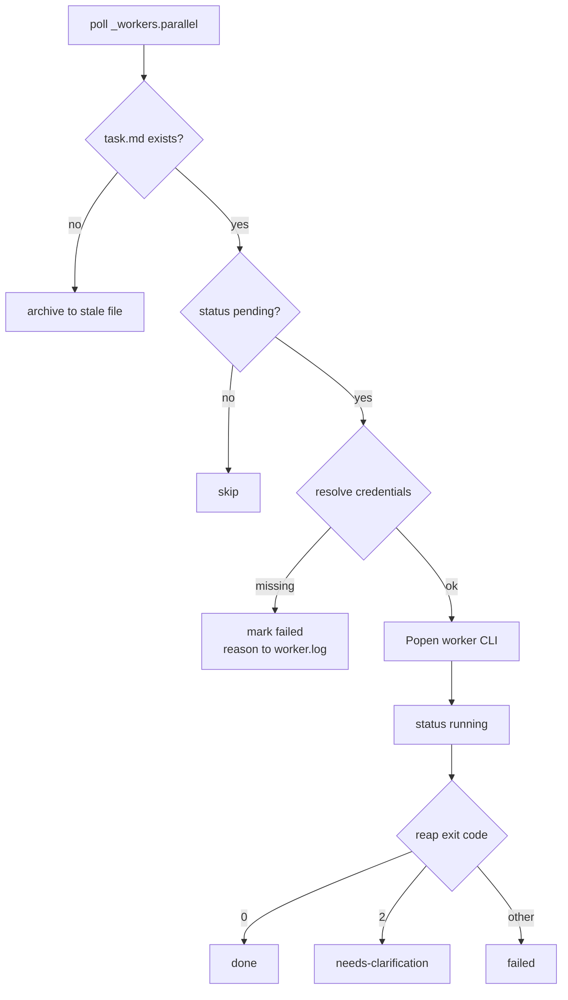
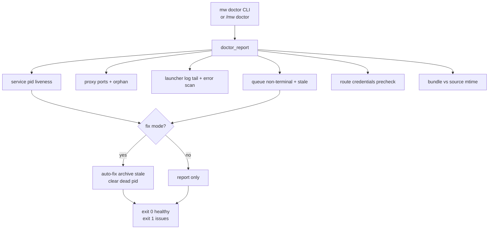
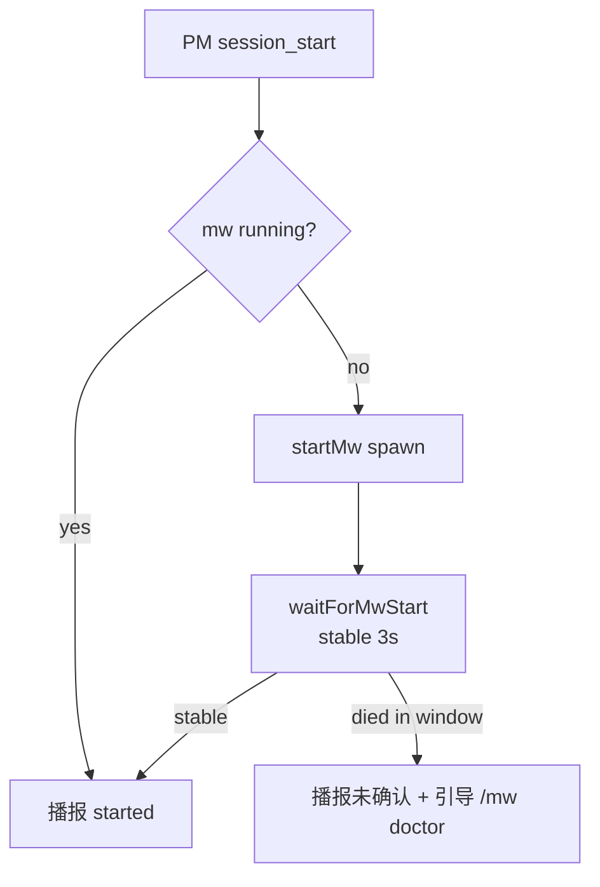

# Design: mw-dispatch-reliability

## §0 设计前提锚定

- spec_path: `.agenticdoc/mw-dispatch-reliability/spec.md`
- spec_locked_at: 2026-08-28T16:30:00+08:00
- ac_count: 17
- ac_ids: AC-001, AC-002, AC-003, AC-004, AC-005, AC-006, AC-007, AC-008, AC-009, AC-010, AC-011, AC-012, AC-013, AC-014, AC-015, AC-016, AC-017

## §1 架构选型

### D-001 缺凭证隔离的实现位置
**需求摘要**：单任务缺凭证不得连坐杀死 launcher/mw serve。

| 方案 | Pros | Cons |
|------|------|------|
| A. `_spawn` 内降级：`_build_env` 的缺凭证 RuntimeError 不再升级为 `_FatalLauncherError`，改为该任务标 `failed` 并把原因写入该任务 `worker.log` | 改动最小；每任务实时判定（不受快照过期影响）；worker.log 落证据 | 需要 spawn 失败路径主动写 worker.log（CLI 未运行，日志原本为空） |
| B. 仅靠启动预检快照过滤：预检时缺凭证的路由任务直接标 failed，不进 spawn | 集中判定 | env 在运行期变化（很少见）会导致快照失真；预检在 mw serve 侧，launcher 侧仍需兜底 |

**推荐**：`A`（B 作为预检的日志/doctor 辅助，不承担过滤职责）
**理由**：隔离语义的判定点离使用点（spawn）越近越可靠；A 同时覆盖 AC-001 与 AC-009 的密封化诉求。

### D-002 路由预检的载体与时机
**需求摘要**：启动时枚举路由可用性，全缺 fail fast，部分缺告警。

| 方案 | Pros | Cons |
|------|------|------|
| A. `cmd_serve` 启动时（spawn launcher 前）预检，结果写 mw.log；全缺则清 PID 文件后非零退出 | 入口处 fail fast 语义清晰；mw.log 单一来源 | launcher 侧 spawn 时仍需独立判定（D-001 已覆盖） |
| B. launcher 启动时预检 | 与队列处理同进程 | mw serve 已先占 PID 文件，退出时序复杂；doctor 复用不便 |

**推荐**：`A`
**理由**：mw serve 是服务入口；PID 文件在预检通过后才写入，可让 AC-005 的"PID 出现≈服务存活"假设成立，简化 PM 侧判定。

### D-003 凭证来源配置 schema
**需求摘要**：凭证来源（env / 配置文件）声明式可配置，加路由零代码改动。

| 方案 | Pros | Cons |
|------|------|------|
| A. providers.json 演进：顶层 `credentials` 节声明凭证链（env → file fallback），路由条目引用凭证名 | 单一事实来源；`_read_timi_api_key_from_config` 硬编码迁移为声明；strip 集合可从声明自动推导 | schema 变更需同步代码默认值与测试 |
| B. 独立 credentials.json | 职责分离 | 两份配置的合并/优先级逻辑；与路由强相关却分离存放 |

**推荐**：`A`，schema 如下（`~` 展开为 home，`field` 支持点路径）：

```json
{
  "credentials": {
    "anthropic":      { "sources": [{ "env": "ANTHROPIC_API_KEY" }] },
    "anthropic-auth": { "sources": [{ "env": "ANTHROPIC_AUTH_TOKEN" }] },
    "deepseek":       { "sources": [{ "env": "DEEPSEEK_API_KEY" }] },
    "timi":           { "sources": [
                        { "env": "TIMI_API_KEY" },
                        { "file": "~/.timi-anthropic-proxy/config.toml", "format": "toml", "field": "auth.api_key" }
                      ] }
  },
  "providers": {
    "claude":     { "port": 7001, "base_url_env": "ANTHROPIC_BASE_URL", "credential": "anthropic" },
    "claude-cli": { "port": 7003, "base_url_env": "ANTHROPIC_BASE_URL", "credential": "anthropic-auth" },
    "deepseek":   { "port": 7004, "base_url_env": "DEEPSEEK_BASE_URL",  "credential": "deepseek" },
    "timi":       { "credential": "timi" }
  }
}
```

**理由**：launcher 的 `_load_providers` 已读该文件；`_build_env` 的 strip 集合 = 全部声明 env 名 ∪ 现有 `_EXTRA_CREDENTIAL_VARS`；ti​mi 直连路由（cli=pi, provider=timi）与代理路由统一经 `resolve_credential()` 取值。

### D-004 陈旧条目归档载体
**需求摘要**：task.md 缺失的队列条目周期扫描并移入专门归档。

| 方案 | Pros | Cons |
|------|------|------|
| A. launcher poll 循环内扫描：每轮读 `_workers.parallel` 后检查各条目 taskPath 存在性，缺失者持锁重写（移出行 + 追加 `_workers.stale.parallel`） | launcher 是队列既有写者（`_update_status` 已持锁重写）；零新进程；≤2 poll 周期时延 | launcher 职责略增 |
| B. PM 扩展（TS 侧）扫描 | PM 全程在线 | 违反"PM 只增不改队列"分工；跨语言锁重写风险大 |
| C. doctor 触发式 | 简单 | 非周期，队列仍可能长时间被卡 |

**推荐**：`A`（doctor `--fix` 复用同一 Python 函数做按需归档）
**理由**：单写者纪律（launcher/doctor 侧 Python 持锁改写，PM 侧只 upsert）；归档行格式 `原行 | archived_at | reason`，追加式不清空。running 状态且 task.md 缺失同样归档（worker 结束时 `_update_status` 按 task_key 找不到行则无操作，安全）。

### D-005 doctor 形态与共享代码
**需求摘要**：CLI + `/mw doctor` 双入口同源数据，允许自动修复。

| 方案 | Pros | Cons |
|------|------|------|
| A. 新建 `mw_common.py`：凭证解析、路由预检、stale 归档、doctor 核心（`--json`/`--fix`）；mw.py 加薄壳 `cmd_doctor`；launcher.py 复用同模块 | 单一实现双入口（AC-007）；mw.py（900 行）不再膨胀 | 多一个文件 |
| B. 全部塞进 mw.py | 无新文件 | mw.py 膨胀；launcher 子进程无法 import 复用（现在是独立进程） |
| C. TS 侧再实现一份 doctor | pi 内体验好 | 两套实现违反 AC-007 同源要求 |

**推荐**：`A`；`/mw doctor` 由扩展 `spawnSync("python", [mw.py, "doctor", "--project=...", "--json"])` 取 JSON 播报中文摘要。
**理由**：预检/归档/凭证解析天然被 serve、launcher、doctor 三方共享，模块化是唯一不出两套实现的路。

### D-006 假成功播报修复机制
**需求摘要**：mw 启动即死时 PM 不得播报 started。

| 方案 | Pros | Cons |
|------|------|------|
| A. `waitForMwStart` 增加"稳定窗"：PID 出现后连续存活 ≥3s 才返回 true；未确认时播报引导 `/mw doctor` | 改动集中在 mw-runner.ts；预检失败退出发生在 ~1s 内，3s 窗足以区分 | 启动播报延迟 3s（可接受） |
| B. PM 下一轮 agent turn 再二次校验 | 无延迟 | 播报时序复杂；假消息已发出 |

**推荐**：`A`（配合 D-002 的"预检通过后才写 PID"，双重保障）

### D-007 测试架构
**需求摘要**：L0 密封、L1 零 LLM 集成、L2 真实调用，全部并入正式套件。

| 方案 | Pros | Cons |
|------|------|------|
| A. L1 用"假 CLI 注入"：fixture 在 tmp 目录生成 `pi.cmd`（Windows）/`pi`（POSIX），行为由 env（FAKE_EXIT/MARK 路径）驱动，PATH 前插；起真实 launcher 子进程（`--poll-interval=1`）；pytest 轮询断言 | 覆盖完整状态机与并发，零 LLM、零真实 CLI | 需处理 Windows .cmd 与 POSIX sh 双形态 |
| B. mock subprocess 层 | 快 | 测不到真实文件总线/锁/进程语义，价值大减 |

**推荐**：`A`；L2（`test_e2e_real.py`）用 pytest marker `e2e_real` 默认 skip（无 timi 凭证时自动 skip），显式 `-m e2e_real` 运行；TS 侧断言并入 `packages/coding-agent/test/extensions/agent-team-loop.test.ts` 走 `./test.sh`。

## §2 核心结构 / 类图



## §3 模块划分

```
packages/multi-workers/
├── mw_common.py        # 新：providers/credentials 加载解析、resolve_credential、
│                       #     route_precheck、archive_stale_entries、doctor_report/doctor_fix
├── mw.py               # cmd_serve：预检门禁（全缺→退出，PID 写入移到预检后）
│                       # cmd_doctor：薄壳（--project/--json/--fix）
├── launcher.py         # _spawn：缺凭证→per-task failed + 原因写 worker.log（移除 FATAL 升级）
│                       #         poll：每轮 stale 扫描归档；_build_env/_load_providers 走 mw_common
├── providers.json      # 新 schema（§1 D-003）
├── test_launcher.py    # 密封化修复（2 个失败用例）+ 隔离语义新用例
├── test_common.py      # 凭证解析/预检/归档单元测试
├── test_integration.py # 新 L1：假 CLI 注入，真 launcher 进程
├── test_e2e_real.py    # 新 L2：真实 pi/timi（marker e2e_real，默认 skip）
└── smoke_test.sh       # T5 假阳性修复

packages/coding-agent/src/extensions/agent-team-loop/
├── shared/mw-runner.ts # waitForMwStart(projectDir, timeoutMs, stableMs=3000)；doctorMw()
└── pm/ui-bridge.ts     # /mw doctor [fix] 子命令（spawnSync doctor --json，中文摘要播报）

packages/coding-agent/test/extensions/agent-team-loop.test.ts
                        # 新 vitest：收编 test-l1-full.ts 全部断言 + waitForMwStart stable 语义
```

依赖方向：`mw.py / launcher.py → mw_common.py → providers.json`；TS 侧 `ui-bridge → mw-runner → (spawnSync) mw.py doctor`。无循环依赖。

## §4 接口与集成

### 4.1 对外接口清单

| 接口 | 签名/形态 | 说明 |
|------|----------|------|
| 预检 | `mw_common.route_precheck(providers, env) -> list[RouteStatus]` | 每路由 `{route, cli, available, source(env/file/none), missing[]}` |
| 凭证解析 | `mw_common.resolve_credential(cred_cfg, env) -> str \| None` | 按 sources 顺序 env → file；file 支持 toml/json/plain + 点路径 field |
| 归档 | `mw_common.archive_stale_entries(project_dir) -> list[archived]` | 持锁移行到 `_workers.stale.parallel`，幂等 |
| doctor | `python mw.py doctor --project=<dir> [--json] [--fix]` | 人读文本 / JSON / 修复模式；healthy=0, issues=1 |
| doctor 核心 | `mw_common.doctor_report(project_dir, fix=False) -> dict` | JSON 结构化结果，7+ 节 |
| waitForMwStart | `waitForMwStart(projectDir, timeoutMs=8000, stableMs=3000)` | PID 出现后连续存活 stableMs 才 true |
| /mw doctor | `/mw doctor [fix]`（pi 内命令） | 播报 doctor JSON 的中文摘要 |

### 4.2 外部依赖集成

- timi-proxy-cli：仅 doctor 检查端口监听，不改动 proxy_multi.py 运行逻辑
- pi 扩展：`/mw doctor` 经 `spawnSync`，无新扩展 API 依赖；bundle 重建走既有 `/mw build`
- pytest：`packages/multi-workers` 本地直跑（`python -m pytest`）；vitest 走根仓 `./test.sh`
- 凭证文件读取：Python 3.11+ `tomllib`（与现有一致），json/plain 用标准库

## §5 Function Flow

调度主链路（含异常出口）：

serve 启动与预检：



launcher poll 循环：



doctor 链路：



PM 启动播报链路：



## §6 Coverage Matrix

| ID | 功能点 | 正常路径 | 边界测试 | 异常路径 | 验证层级 |
|----|--------|---------|---------|---------|---------|
| F1 | 缺凭证隔离（D-001） | 混合队列正常任务完成 | 多个缺凭证任务连续到达 | 单任务缺凭证不杀服务 | L1 |
| F2 | 启动预检（D-002） | 全路由可用启动 | 部分缺（含 file 源生效） | 全缺 fail fast 退出 | L1 |
| F3 | 凭证可配置（D-003） | env 源解析 | file 源（toml 点路径） | 源链全缺 | L1 |
| F4 | stale 归档（D-004） | pending+task.md 缺失归档 | running+缺失归档；归档幂等 | 归档期间 PM 并发 upsert | L1 |
| F5 | doctor（D-005） | 健康项目全绿 | /mw doctor 与 CLI 同源 | 各节异常态逐项检出 | L0/L1 |
| F6 | 播报修复（D-006） | 正常启动播报 started | 稳定窗边界 | 启动即死不播报 started | L1 |
| F7 | L1 测试基建（D-007） | exit0/exit1 状态机 | max_workers 串行 | 8 并发写不丢行 | L1 |
| F8 | L2 真实链路 | "Say exactly: ok" 全链 done | 上游失败人工判读 | 120s 超时判 failed | L2 |
| F9 | vitest 收编 | ./test.sh 通过 | 游离脚本删除 | 断言等价迁移 | L1 |
| F10 | smoke 修复 | 检测到任务 PASS | — | 未检测到 FAIL（去假阳性） | L0 |

## §7 Verification Contract

```
VC-001: 当队列含缺 ANTHROPIC_AUTH_TOKEN 的 pending claude 任务时，处理后该行 status 必须等于 failed
       Layer: L1
       Output: [VERIFY] VC-001: claude_task.status=failed
       Source: AC-001

VC-002: 当 VC-001 场景发生时，该任务 worker.log 必须包含 "ANTHROPIC_AUTH_TOKEN"，且同队列 pi/timi 任务 status ∈ {running, done}
       Layer: L1
       Output: [VERIFY] VC-002: worker_log.contains=ANTHROPIC_AUTH_TOKEN; sibling.status=done
       Source: AC-001

VC-003: 当所有路由凭证源均不可解析时，cmd_serve 必须以非零码退出且 mw.log 包含每个路由的缺失凭证清单
       Layer: L1
       Output: [VERIFY] VC-003: serve_exit!=0; mw_log.contains=missing
       Source: AC-002

VC-004: 当至少一条路由可用时，mw serve 启动后 mw.log 必须包含每路由一行 available/missing 标记
       Layer: L1
       Output: [VERIFY] VC-004: mw_log.route_lines==len(providers)
       Source: AC-003

VC-005: 当队列存在 task.md 缺失的 pending 条目且 mw serve 运行时，≤10s 内该行必须从 _workers.parallel 消失并出现于 _workers.stale.parallel（含 archived_at 与 reason）
       Layer: L1
       Output: [VERIFY] VC-005: archived_lines=1; queue_lines_stale=0
       Source: AC-004

VC-006: 当 mw serve PID 文件出现后 3s 内进程死亡时，waitForMwStart 必须返回 false
       Layer: L1
       Output: [VERIFY] VC-006: waitForMwStart=false
       Source: AC-005

VC-007: 当 doctor 运行于任意项目时，输出必须包含 ≥7 个诊断节（service/proxy/launcher-log/queue/credentials/bundle/orphan），healthy 退出码 0、issues 退出码 1，执行 < 5s
       Layer: L1
       Output: [VERIFY] VC-007: sections>=7; exit_code∈{0,1}; duration_s<5
       Source: AC-006

VC-008: 当 /mw doctor 执行时，必须经 spawnSync 调用 mw.py doctor --json（同一数据源），不存在第二套诊断实现
       Layer: L0
       Output: [VERIFY] VC-008: ui_bridge.calls=mw.py_doctor_json
       Source: AC-007

VC-009: 当 doctor --fix 运行且存在 stale 条目与陈旧 mw.pid 时，二者必须被修复且输出修复清单；bundle 过期与孤儿 proxy 仅输出建议
       Layer: L1
       Output: [VERIFY] VC-009: fixed=[stale_archive, pid_clear]; suggested=[bundle, proxy]
       Source: AC-008

VC-010: 当机器存在真实 ~/.timi-anthropic-proxy/config.toml 时，pytest（test_launcher/test_common/test_integration）必须全绿且无真实 LLM 请求、无真实 CLI 子进程
       Layer: L1
       Output: [VERIFY] VC-010: pytest_pass=all; real_calls=0
       Source: AC-009

VC-011: 当 L1 假 CLI 注入 exit 0 与 exit 1 两个 pending 任务时，30s 内状态分别必须等于 done 与 failed，且两任务 worker.log 均存在
       Layer: L1
       Output: [VERIFY] VC-011: t1=done; t2=failed; worker_logs=2
       Source: AC-010

VC-012: 当 --max-workers=1 且两个 pending 任务时，第二任务 status=running 的时间必须晚于第一任务进入终态的时间
       Layer: L1
       Output: [VERIFY] VC-012: t2_running_at > t1_terminal_at
       Source: AC-011

VC-013: 当 8 个并发 upsert 与 launcher 状态写同时运行时，最终 _workers.parallel 行数必须等于全部写入行数（无丢失）
       Layer: L1
       Output: [VERIFY] VC-013: lines_written==lines_read
       Source: AC-012

VC-014: 当 L2 以真实 pi/timi 执行 prompt="Say exactly: ok" 时，任务 120s 内 status 必须等于 done，output.md 包含 "## Summary" 且 > 50 字节
       Layer: L2
       Output: [VERIFY] VC-014: status=done; output_md.contains=## Summary; size>50
       Source: AC-013

VC-015: 当检查 smoke_test.sh 内容时，不得存在任务未检测仍判 PASS 的 else 假阳性分支
       Layer: L0
       Output: [VERIFY] VC-015: false_positive_branch=absent
       Source: AC-014

VC-016: 当 ./test.sh 运行时，新 vitest 文件必须通过且包含原 test-l1-full.ts 全部断言场景，且 packages/multi-workers/test-l1-full.ts 不存在
       Layer: L1
       Output: [VERIFY] VC-016: vitest=pass; loose_script=deleted
       Source: AC-015

VC-017: 当 providers.json 为某凭证声明 file 源（toml + 点路径 field）且对应 env 未设置时，resolve_credential 必须返回文件中的值，预检与 worker env 注入均可用
       Layer: L1
       Output: [VERIFY] VC-017: resolved_from=file; precheck.available=true
       Source: AC-016

VC-018: 当仅修改 providers.json 增加 dummy 路由（env 源）时，route_precheck 与 doctor 输出必须包含该路由，launcher.py/mw.py/mw_common.py 代码零改动
       Layer: L1
       Output: [VERIFY] VC-018: new_route.in_precheck=true; code_diff=0
       Source: AC-017
```

## §8 AC → VC 映射表

| AC ID | AC 摘要 | 对应 VC | 路径分类 |
|-------|--------|---------|---------|
| AC-001 | 缺凭证任务隔离 failed，服务存活 | VC-001, VC-002 | 异常 |
| AC-002 | 全路由缺凭证 fail fast 退出 | VC-003 | 异常 |
| AC-003 | 部分可用时预检逐路由记录 | VC-004 | 正常/边界 |
| AC-004 | stale 条目 ≤10s 归档 | VC-005 | 异常 |
| AC-005 | 启动即死不播报假成功 | VC-006 | 异常 |
| AC-006 | doctor CLI ≥7 节 <5s 退出码语义 | VC-007 | 正常 |
| AC-007 | /mw doctor 同源播报 | VC-008 | 正常 |
| AC-008 | doctor --fix 自动修复清单 | VC-009 | 正常/异常 |
| AC-009 | 测试密封全绿零真实调用 | VC-010 | 边界 |
| AC-010 | 假 CLI exit 0/1 状态机 | VC-011 | 正常 |
| AC-011 | max_workers=1 串行 | VC-012 | 边界 |
| AC-012 | 8 并发写不丢行 | VC-013 | 边界 |
| AC-013 | L2 真实任务全链 done | VC-014 | 正常 |
| AC-014 | smoke T5 去假阳性 | VC-015 | 异常 |
| AC-015 | vitest 收编游离脚本 | VC-016 | 正常 |
| AC-016 | file 凭证源可用 | VC-017 | 边界 |
| AC-017 | 配置扩展零代码改动 | VC-018 | 边界 |

## §9 非功能实现方案

- **性能**：doctor 全本地检查（进程/文件/netstat），无网络调用，目标 <5s；预检仅 env/文件读取 <1s；launcher 每轮 poll 增加的 stat 调用量 = 条目数，可忽略
- **安全**：doctor/日志/归档输出一律 mask（沿用 `_mask_env_value` 规则）；归档文件仅含队列行 + 时间 + 原因，不含凭证；worker 子进程 env strip 集合 = 全部声明 env ∪ `_EXTRA_CREDENTIAL_VARS`，隔离语义不变
- **可观测性**：mw.log 预检逐路由行；launcher.log spawn 失败行含 task_key 与缺失 env 名；worker.log 记录 spawn 期失败原因；doctor 汇总以上全部

## §10 决策记录

| D-ID | 决策点 | 选择 | 否决 | 理由 |
|------|--------|------|------|------|
| D-001 | 缺凭证隔离位置 | _spawn 内降级 per-task failed | 预检快照过滤 | 判定靠近使用点，不受快照过期影响 |
| D-002 | 预检载体 | cmd_serve 入口，预检后写 PID | launcher 侧 | fail fast 语义清晰，PID 出现≈存活 |
| D-003 | 凭证配置 schema | providers.json 增 credentials 节 | 独立 credentials.json | 单一事实来源，硬编码兜底迁声明式 |
| D-004 | stale 归档载体 | launcher poll 内扫描 | PM 侧 / doctor 触发 | 队列单写者纪律，零新进程 |
| D-005 | doctor 形态 | mw_common.py 共享核心 + 双入口薄壳 | 塞进 mw.py / TS 重实现 | 三方共享，避免两套实现 |
| D-006 | 播报修复 | waitForMwStart 3s 稳定窗 | 下轮 turn 二次校验 | 改动集中，时序简单 |
| D-007 | 测试架构 | 假 CLI 注入真 launcher + marker 隔离 L2 | mock subprocess | 覆盖真实文件总线与进程语义 |
