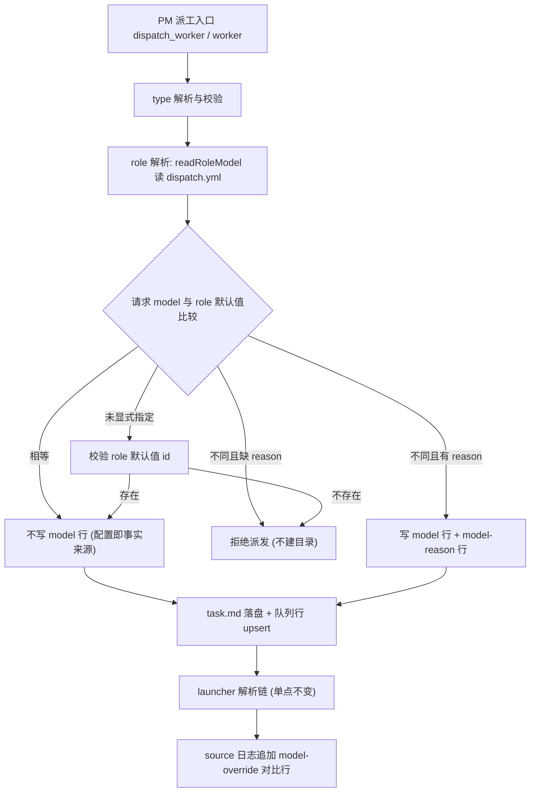

# design: mw-dispatch-role-escape

> key: mw-dispatch-role-escape / 阶段: DESIGN / 上游: spec.md（AC-001 ~ AC-011）

## 1. 设计目标

在**不改变模型解析链顺序**的前提下，让 `.mw/dispatch.yml` 的 role 策略：可声明（type）、可达成
（role 可达）、可审计（偏离留痕）、可校验（id 存在性）。所有改动落在 agent-team-loop 扩展
（TS）+ mw launcher（Python），解析单点仍留在 Python。

## 2. 数据流



## 3. 决策

### D-001 `type` 参数（AC-001/002/003）

- 新参数名 `type`（与 task.md 字段同名，避免两套词汇）；取值集合 `DISPATCHABLE_TYPES =
  ["coding", "review", "research"]`。
- 省略 → 保留既有推导（保持历史产物字节级不变，AC-010）：`codex -> codex`、`claude -> review`、
  其余 `-> coding`。
- 非法值 → 返回拒绝文本（列出合法值），**在 `fs.mkdirSync` 之前返回**（AC-002 要求无半成品）。
- `/worker` 增加 `--type` 与 `--reason`，复用同一校验函数与同一 frontmatter 渲染函数。

### D-002 role 由 type 推导，TS 侧只读镜像（AC-004/005/007）

新增 `shared/dispatch-models.ts#DISPATCH_ROLE_BY_TYPE`（镜像 `mw_common.TASK_TYPE_TO_ROLE`，
未命中 → `coding`，与 `resolve_dispatch_model` 的 `.get(type, "coding")` 同口径）。TS 侧只用它选择
「比较/校验哪个 role 的值」，**不做** 链式解析（解析仍是 launcher 单点）。双侧 parity 由测试锁定
（TS 测试断言镜像字面量；Python 测试断言 `TASK_TYPE_TO_ROLE` 等于同一字面量）。

### D-003 偏离留痕：`model-reason:` 键（AC-006）

- 命名 `model-reason`（连字符），写入 task.md frontmatter，紧随 `model:` 行。
- 兼容性锁定：launcher 的 `^model:[ \t]*(\S+)` 与 worker 的 `type:`/`model:` 前缀匹配都**不会**
  匹配 `model-reason:`（`model` 后必须是 `:`），`ui-bridge.ts#readModel` 的 `/^model:\s*(.+)$/im` 同理。
  已有测试（`test_dispatch_models.py` 的 `_read_task_md_fields` 用例）作为回归证据。
- 换行/回车 → 折叠为单个空格（理由必须单行，否则 frontmatter 结构被破坏）。

### D-004 校验函数（AC-007）

`shared/dispatch-models.ts` 导出纯函数：

```ts
validateModelValue(registry, cli, taskProvider, value) -> { ok: boolean; message?: string }
```

- `registry` 可为 `undefined`（测试/无 registry 路径）→ 跳过校验，`ok: true`。
- `cli !== "pi"` → 跳过（codex/claude CLI 有自己的模型表）。
- prefix 属 `MODEL_PREFIX_TO_PI_PROVIDER` → providerId 取映射；prefix 属 CLI 前缀 → 跳过；
  裸 id → providerId 取 `taskProvider`（pi 任务为 `timi`；空则跳过）。
- `registry.find(providerId, modelId)` 命中 → ok；未命中 → 拒绝，消息含 provider、给定值、
  该 provider 前 5 个候选 id（`registry.getAll()` 过滤 provider + 排序）与
  `/mw model set <role> <value>` 修正提示。

### D-005 非法 role 默认值 fail-closed（AC-007，例外条款见 spec §2.4）

- 校验对象二选一：显式 `model`（2.3a）优先；未显式时校验 `readRoleModel(cwd, role)`（2.3b）。
- role 默认值不合法 → 拒绝派发。**逃生口**：显式传 `model`（此时 role 默认值不参与解析）——
  这样既不让坏配置静默跑，也不把 PM 锁死。
- 与 `mw-dispatch-models` 的「解析失败不阻断」不冲突：那条针对 parse 错误，本 key 针对
  「parse 成功但 id 不存在」。

### D-006 等值不写 `model:` 行（AC-005）

请求值与 role 默认值归一化相等（trim 后逐字符比较）→ 不写 `model:` 行，结果文本说明
`model: dispatch.yml <role>=<value>`。目的：配置保持唯一事实来源，后续改配置能自然生效。

### D-007 回显文案（AC-008，固定格式便于断言/审计）

- 无覆盖：`Dispatched worker 'T' (type: <type>, role: <role>, model: dispatch.yml <role>=<v>) under key 'K'.`
- 有覆盖：`Dispatched worker 'T' (type: <type>, role: <role>, model override: role default <role>=<v> -> <x> (reason: <r>)) under key 'K'.`
- 无配置：`model: <x> (no dispatch.yml <role> default)`。
- 同时修正：旧文本的 `(type: ${cli})`（把 cli 当 type 回显）删除。

### D-008 launcher 观测行（AC-009）

`launcher.py#_resolve_entry_model` 返回值扩展为携带 `config_role` / `config_value`（或在 `_spawn`
内二次读取，取轻者：让 `_resolve_entry_model` 增返回一个 dict）。判定：`source == "task"` 且
配置里存在该 role 默认值且与 task 值不同 → 在既有 `[launcher] ... source=...` 行后追加：

```
[launcher] <task_key>: model-override task=<X> config:<role>=<Y>
```

派发行为零变化（显式值仍获胜）。

### D-009 dispatch.yml role 读取（复用而非重写）

`shared/dispatch-models.ts` 的严格手写解析泛化为 `readRoleModel(cwd, role): string | null`，
`readMainModelConfig` 保留为 `readRoleModel(cwd, "main")` 的包装（既有测试与调用点不动，bundle
保持无 yaml 依赖）。解析规则不变：只认 `models:` 块的 `  <role>: <value>` 行。

### D-010 `/mw model set` 前置校验（AC-007 最早捕获点）

`runMwModelCommand` 的 `set` 分支在调用 Python 前用同一 `validateModelValue` 校验
`prefix/model`（pi 前缀 + registry 可用时）。失败 → notify error，不写配置。registry 缺失
（无 UI/测试路径）→ 跳过，行为同今天。

### D-011 不做的事

不改解析链顺序、不改 schema、不删 `model` 参数、不改 worker 白名单、不自动改写 dispatch.yml。

## 4. 失败模式

| 失败模式 | 处置 |
|----------|------|
| registry 无该 provider（如未配置 timi） | 校验会全部拒绝 → 消息提示候选为空 + `/mw model set`/`pi --list-models`；避免误判：仅当 registry 有该 provider 的条目时才判定不存在（无条目 → 跳过，交给 launcher 的凭证检查报错） |
| `model_reason` 为空串 | 等同于缺失（触发拒绝） |
| dispatch.yml 存在但无该 role | 无默认值 → 不要求 reason，不校验（AC-004/007 的条件不成立） |
| `model:` 与 role 值只差空白 | trim 后比较，视为相等（不写行） |
| type 与 cli 组合无意义（如 `claude` + `type: research`） | 允许（type 决定 role 与白名单，cli 决定执行器），但 role 默认值仍按 type 校验 |

## 5. 验证策略（VC ↔ AC）

| VC | 手段 | AC |
|----|------|-----|
| VC-001 | TS 单测：`dispatch_worker` type 三值 + 省略默认 + 非法拒绝（无目录/无队列行） | AC-001/002 |
| VC-002 | TS 单测：`/worker pi --type review` 落盘 type 与 notify 文案 | AC-003 |
| VC-003 | TS 单测：reason 门（缺 reason 拒绝且消息含 role 默认值；有 reason 接受并写 `model-reason`） | AC-004/006 |
| VC-004 | TS 单测：等值不写 `model:` 行 + 结果文案 | AC-005 |
| VC-005 | TS 单测：`validateModelValue` 纯函数矩阵（非法 id / 合法 id / 裸 id / 未知 prefix / CLI 前缀跳过 / registry 缺失跳过 / 无 provider 条目跳过） | AC-007 |
| VC-006 | TS 单测：成功派工的 `type`/`role`/role 默认值/覆盖三元组回显 | AC-008 |
| VC-007 | TS 单测：`readRoleModel` 解析 + `readMainModelConfig` 行为不变（既有断言） | AC-005/007 |
| VC-008 | TS 单测：`/mw model set` 非法值被拦（runner 注入断言未被调用） | AC-007 |
| VC-009 | Python 单测：launcher override 日志行（hermetic tmp_path + dispatch.yml） | AC-009 |
| VC-010 | TS 回归：不传新参数时 frontmatter 逐字节断言 + 原 dispatch 用例全绿 | AC-010 |
| VC-011 | Python 回归：`test_dispatch_models.py` + `test_launcher.py` 全绿，role map parity 断言 | AC-010 |
| VC-012 | 文档改动 + `npm run check` 0/0/0 | AC-011 |

## 6. 影响面

- `packages/coding-agent/src/extensions/agent-team-loop/shared/dispatch-models.ts`（读取泛化 + 校验纯函数 + role 镜像）
- `packages/coding-agent/src/extensions/agent-team-loop/pm/ui-bridge.ts`（两个派工入口 + `/mw model set`）
- `packages/multi-workers/launcher.py`（观测行）
- 测试：`packages/coding-agent/test/extensions/agent-team-loop.test.ts`、`packages/multi-workers/test_dispatch_models.py`
- 文档：`packages/coding-agent/CHANGELOG.md`、`packages/multi-workers/{README.md,CHANGELOG.md}`
- **需要重建 dist bundle 才在真实 pi 会话生效**（agent-team-loop 以 bundle 形式加载，见 `mw build`）。
