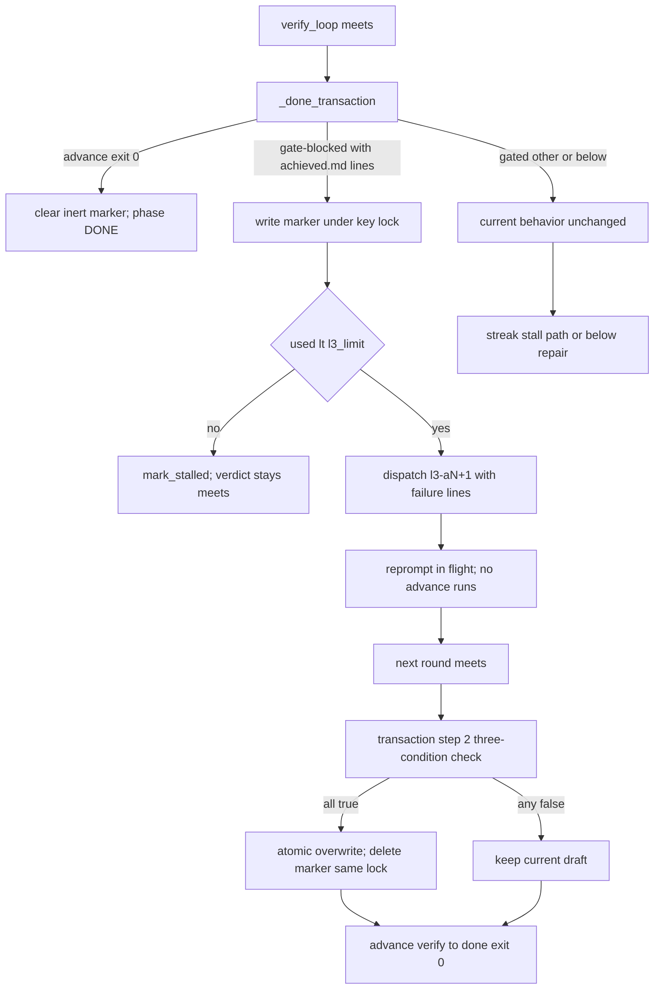

# Design: mw-done-closure-repair

## §0 设计前提锚定
- spec_path: `.agenticdoc/mw-done-closure-repair/spec.md`
- spec_locked_at: 2026-09-25T11:16:40+08:00（AC-002/AC-008 于 2026-09-25 依 AC 锁定协议 [REVISED] 修订）
- ac_count: 11
- ac_ids: AC-001, AC-002, AC-003, AC-004, AC-005, AC-006, AC-007, AC-008, AC-009, AC-010, AC-011

## §1 架构选型

### D-001 失败原文回传契约：元组返回
- 选择：`_done_transaction(...) -> tuple[str, str]`，返回 `(verdict, err)`；verdict 域不变（advanced/below/gated），err 仅在 gated 路携带 advance stderr（其余路径 `""`）。cls 不随返——调用方用现成 `_classify_advance_failure(err)` 从 err 重导（单一来源）
- 否决：小 dataclass（无字段扩张需求，多一个模块级名字）；ConductorState 字段（隐藏数据流契约、跨 tick/跨 key 残留风险、违背 D-102「zero private state, every decision re-derives from files」）
- 改动面：唯一调用点 conductor.py:1229 + 9 个 return 点，两个测试文件 0 直接破坏（断言全为副作用）
- 调研：`evidence/research/design-return-path-20260925.md` F-1/F-2/F-6

### D-002 失败行提取与 reprompt prompt 组成
- 选择：新 helper `_closure_failure_lines(err) -> list[str]`——按稳定前缀 `"   - "`（3 空格+连字符）解析 stderr 的失败行，返回全部行（≤5 行，GATES['done'] 规则数上界）；触发判据 `_has_achieved_failure(lines)` = 任一行含字面量 `achieved.md`。reprompt prompt = **reprompt 固定基底 + 失败行逐字列表**，无其他内容；固定基底 = `_l3_prompt(key, attempt)` + closure.py 模块常量 `REPROMPT_INSTRUCTION`（固定通用文案：告知驳回原文含义、指示在 `## Achieved` 节内按所列规则组织子节、禁止改动任何 PASS/FAIL 判定；不含工程词表字面量，受 VC-003 扫描约束）。两分式组成逐字节可断言
- 否决：从 timeline 回读失败原文（`_one_line(err,200)` 已压平截断 + 尾部有界，不满足 AC-002 逐字要求）；只筛 achieved.md 行进 prompt（丢失上下文）；裸贴失败行无连接文本（reviewer 无法把驳回原文关联到自己 output.md 的产出义务，生产鲁棒性差——dcr-review MAJOR-1 方案 a 否决理由）
- 调研：design-reprompt-loop F-15/F-16/F-17/F-18，design-return-path F-3/F-4/F-5；dcr-review 发现 1（方案 b 收敛）

### D-003 marker 契约：内容寻址坏稿声明
- 选择：`.agenticdoc/<key>/.mw-achieved-baddraft.json`，schema：`{"file": "achieved.md", "sha256": "<被拒稿字节精确哈希>", "declared_at": "<ISO>", "failures": ["<失败行逐字>", ...]}`
  - 写入：仅当 advance 失败 class=gate-blocked 且 `_has_achieved_failure` 为真，在事务 step-5 失败现场（err 作用域内）写入；per-key 锁（`key-{key}`）内；原子写（mkdir → `json.dumps` 先求值 → 同目录固定名 tmp `.mw-achieved-baddraft.json.tmp` → utf-8+LF → `os.replace`，照 `gates._write_atomic` 形状）；同 sha 重复失败原地更新单文件（「只在变化时写」原则）
  - 校验（覆盖授权三条件）：marker 存在 ∧ `marker.sha256 == sha256(当前 achieved.md 字节)` ∧ `marker.failures` 含 ≥1 行含 `achieved.md`
  - 删除：覆盖成功即在**同一锁作用域**内删除（堵 W7：不能等 advance exit=0）；advance exit=0 后惰性清理（覆盖人工修稿路径——无覆盖发生时清走失配 marker）；**终态清扫**：`_mark_key_done` 与 `_apply_stalled_rejections` 置终态（DONE/closed-legacy）时顺带 unlink 残留 marker（幂等、一次性），封堵 exit=0-与清理间崩溃窗与 closed-legacy 带活 marker 两残留窗（dcr-review 发现 4）
  - sha256 用字节精确 `hashlib.sha256(read_bytes())`
- 否决：`.mw/` 落点（全局运行时命名空间，与锁/pid/诊断面耦合）；timeline 消费事件（marker 消费=删除，self-consuming 文件真值即守卫）；`sha256_eol_normalized`（EOL 归一会让"仅换行改稿"漏判失配，弱化 AC-004 人工修稿保护）
- 调研：design-marker-mechanics F-1/F-2/F-6/F-7/F-11/F-12/F-13/F-14

### D-004 覆盖守卫替换与原子写升级
- 选择：事务 step-2 的 `≥200B 不覆盖` 守卫替换为：absent/<200B → 写（现状）；≥200B → D-003 三条件全真才覆盖。achieved.md 写入移入 per-key 锁作用域并与 marker 校验/删除同锁；写法从裸 `write_text` 升级为 tmp+`os.replace`（与 GC-2 对齐；现状非原子是反面教材）
- 否决：维持非原子写（P-003 家族风险——半写截断 achieved.md）；锁外校验+锁内写（校验-写入窗口的交错违背 W5b fail-safe 论证）
- 调研：design-marker-mechanics F-5/F-13（W5/W5b），design-return-path F-1（步骤序）

### D-005 gate-blocked 分支展开 + 自持预算封顶
- 选择：`_verify_loop` meets 分支（评审时行号漂移：并发会话正改 `_verify_loop`/`_l3_round_verdict`，L3 source 解析 I-1/I-2；插入点以现行树为准重定位——唯一调用点、meets 无预算检查、`_done_transaction` 9 return 点结构性论断经 dcr-review 复验均未变）展开为四分支：
  1. `advanced` → `return False`（不变）
  2. `gated` ∧ cls=gate-blocked ∧ `_has_achieved_failure` → **自带** `used < l3_limit` 检查（镜像 no-verdict 先例 conductor.py:1210）：满足 → 派发 l3-a{used+1} reprompt（dispatch 标准 reviewer 形制，loop=`l3:{key}`、attempt=used+1、read_scope 同现状）并 `return result.ok`；耗尽 → `mark_stalled`（reason 单行，含轮次与失败摘要）+ `return False`
  3. `gated` 其他（PASS 锁/OSError/index 失配/gate-blocked 但无 achieved.md 行）→ `return False` 维持现状（AC-006：非结案类走 advance_stall_ticks 收敛）
  4. `below`（含新增的 meets∧l3_source is None 回退，归入既有路径，语义无冲突）→ 既有 below/repair 路径（不变）
  耗尽 stall 时 **verdict 保持 meets 不翻 below**：L3 质检判定（meets）与结案词表失败是两个正交事实，closure dossier 行必须如实记 meets，真实原因由 stall reason 承载
- 否决：依赖 advance streak 兜底 reprompt 回路（dispatch 事件打断 streak，5-tick 守卫对该回路失效——P-009 无界形状）；耗尽时 `_persist_l3_verdict("below")`（把质检判定改写为 below 是失真，dossier 行随之错误翻转）
- 调研：design-return-path F-9/F-10（meets 分支现状零预算检查），design-reprompt-loop F-8/F-10/F-11

### D-006 时间线事件：新增 `l3-reprompt` 事件
- 选择：reprompt 派发时追加一条 `l3-reprompt` 事件（detail = `_one_line` 限长失败摘要，如 `verify->done gate-blocked (achieved.md x2) -> l3-a2`）；全文只进 prompt 不进 timeline（`gates.create` 拒多行；EVENT_TYPES 词表开放无需改 timeline.py；若需进 console 默认过滤视图则同步加词表——可选）
- 否决：失败原文全文进 timeline detail（多行破坏事件协议；200 字符界会截断）
- 调研：design-reprompt-loop F-19/F-20

### D-007 回归面与判据修订
- 选择：AC-002/AC-008 合成词表固定为「行为影响」「未了事项」（`autopilot/` 源码目录零命中，2026-09-25 实测）；「遗留」退出扫描判据（与框架自有 L3 prompt 文案 9 处天然重合）。e2e_l2 `test_full_chain_single_key` 是词表缺口的仓内复现（代码级推断）——plan 阶段先跑一次 `pytest -m e2e_l2` 证实/证伪，修复后作为 AC-001 场景 A 的最近 L2 回归面（stub 需产出合规词表或经 reprompt 轮修正）
- 调研：design-return-path F-11/F-12

## §2 核心结构

### 2.1 marker JSON schema

```json
{
  "file": "achieved.md",
  "sha256": "<sha256(achieved.md bytes) at rejection time>",
  "declared_at": "<ISO-8601>",
  "failures": ["NO MATCH: achieved.md missing pattern '系统行为变化' — ...", "..."]
}
```

### 2.2 新模块 `autopilot/closure.py`（marker 与失败行原语，可单测）

```python
FAILURE_LINE_PREFIX = "   - "            # advance_phase.py main() stderr 稳定前缀

def closure_failure_lines(err: str) -> list[str]      # 解析全部 "   - " 行
def has_achieved_failure(lines: list[str]) -> bool    # 任一行含 "achieved.md"
def read_bad_draft_marker(key_dir: Path) -> dict | None
def write_bad_draft_marker(project_root: Path, key: str, failures: list[str]) -> None
    # key-{key} 锁内；原子写；sha256 = 现场字节哈希；同 sha 幂等
def clear_bad_draft_marker(project_root: Path, key: str) -> None   # 锁内删除
def overwrite_authorized(key_dir: Path, current_bytes: bytes, marker: dict | None) -> bool
    # 三条件：marker is not None ∧ marker["sha256"]==sha256(current_bytes)
    #         ∧ has_achieved_failure(marker["failures"])
```

### 2.3 conductor.py 改动点

```python
def _done_transaction(...) -> tuple[str, str]        # D-001；step2 守卫替换（D-004）；
                                                     # step5 失败现场写 marker（D-003）；
                                                     # advance exit=0 后 clear（惰性清理）
def _l3_reprompt_prompt(key: str, attempt: int, failure_lines: list[str]) -> str  # D-002
# _verify_loop meets 分支四路展开 + l3-reprompt 事件（D-005/D-006）
```

## §3 模块划分

```
packages/multi-workers/
├── autopilot/
│   ├── closure.py            # 新：失败行解析 + marker 读写删 + 三条件判定（纯逻辑+文件 IO，无 conductor 依赖）
│   └── conductor.py          # 改：_done_transaction 返回契约/守卫/marker 挂点；_verify_loop 四分支；_l3_reprompt_prompt
└── test_autopilot_closure.py           # 新：L1 单元（失败行解析/三条件真值表/原子写幂等）
└── test_autopilot_conductor_exec.py    # 扩：L2 tick 驱动用例族（reprompt 闭环/预算/分流/in-flight）
```

依赖方向：`conductor.py → closure.py`（单向）；closure.py 不 import conductor（可独立单测）。marker 为运行时数据文件（非代码，不新增 git 跟踪面——见 plan 决策项：`.gitignore` 增 `.agenticdoc/**/.mw-achieved-baddraft.json`）。

## §4 接口与集成

### 4.1 对外接口清单（函数签名）

| 函数 | 签名 | 消费者 |
|---|---|---|
| `closure.closure_failure_lines` | `(err: str) -> list[str]` | conductor 事务 + verify 回路 |
| `closure.has_achieved_failure` | `(lines: list[str]) -> bool` | 同上（触发判据） |
| `closure.write_bad_draft_marker` | `(project_root: Path, key: str, failures: list[str]) -> None` | 事务 step-5 失败现场 |
| `closure.overwrite_authorized` | `(key_dir: Path, current_bytes: bytes, marker: dict \| None) -> bool` | 事务 step-2 |
| `closure.clear_bad_draft_marker` | `(project_root: Path, key: str) -> None` | 覆盖成功（同锁）+ advance exit=0 |
| `_done_transaction` | `-> tuple[str, str]`（verdict, err） | `_verify_loop`（唯一调用点） |
| `_l3_reprompt_prompt` | `(key: str, attempt: int, failure_lines: list[str]) -> str` | verify 回路 reprompt 分支 |

### 4.2 外部依赖集成
- `advance.advance` 子进程 stderr（`-X utf8` 通道，CJK 字面量完整）——失败原文唯一来源
- `dispatch.dispatch` 标准 reviewer 派发（REGISTRY 现成；read_scope 同现状 `[.agenticdoc/{key}, .agenticdoc/goal.md]`）
- per-key 锁 `acquire_conductor_lock(key-{key})`，全程**四次顺序获取无嵌套**：step-2（三条件校验+覆盖+同锁删 marker）→ step-4（PASS）→ step-5（marker 写）→ exit=0（惰性清理）；每次获取遇 `ConductorLockHeld` 当 tick 放弃（事务返回 gated，下 tick 重试，W1 形退化，与 `_append_pass_line` 返回 False → gated 同型）
- timeline `l3-reprompt` 事件（开放词表）

## §5 Function Flow



## §6 Coverage Matrix

| ID | 功能点 | 正常路径 | 边界测试 | 异常路径 | 验证层级 |
|---|---|---|---|---|---|
| F1 | 词表缺口自动闭环（场景 A） | reprompt→覆盖→done | 第二套词表（AC-008） | — | L2 |
| F2 | marker 三条件覆盖授权 | 全真→覆盖 | 真值表 4 否定例 | sha 失配不覆盖 | L1 |
| F3 | 人工修稿保护（场景 B） | — | 失败后外部改稿 | 误覆盖=禁止 | L2 |
| F4 | reprompt 预算封顶（场景 C） | 预算内派发 | round_budget=1 | 耗尽→stalled、verdict 保持 meets | L2 |
| F5 | 非结案类分流（场景 D） | — | 无 achieved.md 行 | 不派 reprompt、streak 收敛 | L2 |
| F6 | in-flight 不重跑 | 在飞期间零 advance | pending 行 | — | L2 |
| F7 | 幂等与不洪泛 | gate-answered ≤1/id | 30 tick 混合 | gate 文件不随 tick 增长 | L2 |
| F8 | 逐字转写 | achieved == L3 节 | 尾部换行差异 ≤1 | — | L2 |
| F9 | marker 生命周期 | 覆盖/成功后删除 | 同 sha 重复失败单文件 | 死文件=advance 后清理 | L1/L2 |
| F10 | 崩溃窗口 | W1-W9 全枚举 | 每窗 fail-safe 不覆盖 | — | L1（论证）+ L2（抽查 W5b） |
| F11 | e2e_l2 全链回归 | 标准模板真实框架 | stub 词表 | 修复前红/修复后绿 | L2-e2e |

## §7 Verification Contract

```
VC-001: 当标准模板 fixture 工程的 key L3 meets 且 done 门禁要求「系统行为变化」「遗留」时，conductor tick 循环后 phase=DONE 且 stalled gate 文件数=0、gate-answered 事件数=0
       Layer: L2
       Output: [VERIFY] VC-001: phase=DONE, stalled_gates=0, gate_answered=0
       Source: AC-001
VC-002: 当 gate-blocked 失败发生且失败行含 achieved.md 时，随后派发的 ap-{key}-l3-a{N+1}/task.md prompt 正文逐字含失败行，且全文逐字节等于 reprompt 固定基底（_l3_prompt + REPROMPT_INSTRUCTION 常量）+ 失败行逐字列表
       Layer: L2
       Output: [VERIFY] VC-002: prompt_contains_failure_lines=True, prompt_equals_fixed_base_plus_lines=True
       Source: AC-002
VC-003: rg 扫描 packages/multi-workers/autopilot/ 对「系统行为变化」「行为影响」「未了事项」命中数 = 0
       Layer: L0
       Output: [VERIFY] VC-003: vocab_literal_hits=0
       Source: AC-002
VC-004: 当三条件中任一为假（无 marker / sha 失配 / failures 无 achieved.md 行）且 achieved.md ≥200B 时，事务不覆盖该文件（字节内容不变）
       Layer: L1
       Output: [VERIFY] VC-004: overwrite_authorized=False per negated condition, bytes_unchanged=True
       Source: AC-003
VC-005: 当三条件全真时，事务以 tmp+os.replace 覆盖 achieved.md 且同锁删除 marker
       Layer: L1
       Output: [VERIFY] VC-005: overwritten=True, marker_absent_after=True
       Source: AC-003
VC-006: 当 gate-blocked 失败后外部按工程词表重写 achieved.md 时，事务此后不覆盖该稿（字节不变）且 reprompt 轮收敛后 verify->done advance exit=0
       Layer: L2
       Output: [VERIFY] VC-006: bytes_unchanged=True, advance_exit=0
       Source: AC-004
VC-007: 当 reprompt 连续耗尽 l3_limit 轮时，key 标记 stalled 且 l3 家族 dispatch 总数 ≤ l3_limit（含首轮），l3-verdict.txt 保持 meets
       Layer: L2
       Output: [VERIFY] VC-007: stalled=True, l3_dispatches<=l3_limit, verdict=meets
       Source: AC-005
VC-008: 当 gate 失败行全部不含 achieved.md 时，l3 家族 dispatch 计数不变且连续 advance_stall_ticks 次失败后 mark_stalled
       Layer: L2
       Output: [VERIFY] VC-008: l3_dispatch_delta=0, streak_stall=True
       Source: AC-006
VC-009: 当 l3 reprompt worker 行 in-flight 时，该 key 后续 tick 的 advance 事件新增数 = 0
       Layer: L2
       Output: [VERIFY] VC-009: advance_events_delta=0
       Source: AC-007
VC-010: 当第二套合成词表（「行为影响」「未了事项」）fixture 工程运行时，0 stalled gate、0 gate-answered、phase=DONE
       Layer: L2
       Output: [VERIFY] VC-010: stalled_gates=0, gate_answered=0, phase=DONE
       Source: AC-008
VC-011: 当 30 tick 混合场景运行时，同一 gate id 的 gate-answered ≤1 次且 gates 目录文件数增量 ≤ 活跃 key 数
       Layer: L2
       Output: [VERIFY] VC-011: max_answered_per_gate=1, gates_growth<=key_count
       Source: AC-009
VC-012: 当事务覆盖 achieved.md 后，其字节内容 == 源 l3-a{N}/output.md 的 ## Achieved 节（尾部换行差异 ≤1）
       Layer: L2
       Output: [VERIFY] VC-012: byte_equal=True
       Source: AC-010
VC-013: 当覆盖成功或 advance exit=0 后，marker 文件不存在；同一被拒内容重复失败时 marker 保持单文件
       Layer: L1/L2
       Output: [VERIFY] VC-013: marker_absent=True, marker_count=1
       Source: AC-011
```

## §8 AC → VC 映射表

| AC ID | AC 摘要 | 对应 VC | 路径分类 |
|---|---|---|---|
| AC-001 | 标准词表零人工达 done | VC-001 | 正常 |
| AC-002 | 失败原文进 prompt + 零硬编码 | VC-002, VC-003 | 正常 |
| AC-003 | 三条件覆盖授权 | VC-004, VC-005 | 边界 |
| AC-004 | 人工修稿保护 | VC-006 | 异常 |
| AC-005 | 预算封顶 + verdict 保真 | VC-007 | 异常 |
| AC-006 | 非结案类分流 | VC-008 | 异常 |
| AC-007 | in-flight 零 advance | VC-009 | 边界 |
| AC-008 | 词表可移植 | VC-010 | 边界 |
| AC-009 | 幂等 + 不洪泛 | VC-011 | 回归 |
| AC-010 | 逐字转写 | VC-012 | 正常 |
| AC-011 | marker 生命周期 | VC-013 | 边界 |

## §9 非功能实现方案

- **崩溃安全**：W1-W9+5b 全窗口枚举（design-marker-mechanics F-13 表）——任一不确定状态使三条件至少一条为假 → 不覆盖；死文件窗由同锁删 + 终态清扫（D-003）**收敛**为纯崩溃窗残余（exit=0 与惰性清理间崩溃 → 惰性无害死文件，仅 git 噪音）；浪费一次 advance（W1/W3）为可接受退化。事务入口 phase=DONE 短路锚处理 advance 后崩溃
- **prompt 注入面**：失败行 = 模板 GATES 常量 + 数值（文件内容从不进入），≤5 行 ~1.5KB，信任级 = 工程配置级；reviewer 只读工具集 + 逐字转写 + 判定不代写三重兜底
- **并发**：单写者（conductor）+ per-key 锁毫秒级持有；锁顺序获取无嵌套；advance 子进程无锁不写 achieved.md
- **性能**：每 tick 至多一次 advance 子进程（现状）+ marker 小文件 IO（<1KB）；无新增轮询/扫描
- **可观测性**：`l3-reprompt` 事件（限长摘要）+ marker 文件（provenance：被拒 sha + 失败行原文）供人工收口路径消费

## §10 决策记录

| D-ID | 决策点 | 选择 | 否决 | 理由 |
|---|---|---|---|---|
| D-001 | 失败原文回传契约 | 元组 (verdict, err) | dataclass / State 字段 | 最小充分 + 代码库惯例 + 无隐藏契约 |
| D-002 | 失败行提取与 prompt 组成 | 固定基底（_l3_prompt+指示常量）+ 失败行两分式 | timeline 回读 / 只筛子集 / 裸贴失败行 | 逐字要求 + 生产鲁棒性 + 逐字节可断言 |
| D-003 | marker 契约 | key 目录点前缀 JSON + 字节精确 sha + 同锁删 + 终态清扫 | .mw/ 落点 / timeline 消费 / EOL 归一哈希 | 扫描面零命中 + fail-closed + 死文件窗收敛 |
| D-004 | 覆盖守卫 | 三条件 + 原子写 + 同锁 | 裸 write_text / 锁外校验 | W5b fail-safe + GC-2 |
| D-005 | gate-blocked 分支 | 四路展开 + 自持 l3 预算 + verdict 保真 meets | streak 兜底 / 耗尽翻 below | streak 被 dispatch 打断（P-009）；质检判定与词表失败正交 |
| D-006 | 时间线事件 | l3-reprompt 限长摘要事件 | 全文进 timeline | 多行破坏事件协议 |
| D-007 | 回归面与判据 | 合成词表「行为影响」「未了事项」+ e2e_l2 证实 | Impact/Follow-ups | 自然词项假阳性；仓内复现是最近回归面 |
