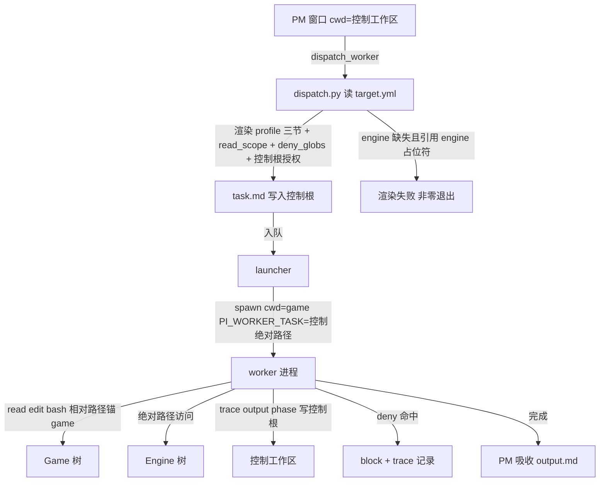

# Design: mw-dual-workspace（控制工作区与目标工程分离）

## §0 设计前提锚定

- spec_path: `.agenticdoc/mw-dual-workspace/spec.md`
- spec_locked_at: 2026-09-11T15:01:58+08:00（AC-007 于 2026-09-11 经锁定协议修订：profile 载体改为 target.yml 配置节，用户决策）
- ac_count: 9
- ac_ids: AC-001, AC-002, AC-003, AC-004, AC-005, AC-006, AC-007, AC-008, AC-009

## §1 架构选型

### D-001 worker cwd 与控制根传递
- 选择：cwd=Game 根；控制根由 `PI_WORKER_TASK` 推导（worker-mode.ts:229 机制复用，零新增 env）
- 否决：cwd=控制工作区 + 绝对路径操作目标（工具链相对路径失效、检索锚错树）
- 调研：`evidence/research/design-dual-root-injection-points-2026-09-11.md`（发现 1/2）

### D-002 双根解析所有权
- 选择：launcher 是唯一注入点（spawn cwd=game + `PI_WORKER_TASK` 绝对路径不变）；PM 扩展与 mw serve 的 cwd 本就是控制工作区，零改动；target.yml 由 TS（PM 注入）与 Python（serve/launcher/conductor）各自解析，parity 测试锁一致（T-17 模式）
- 适配成本（复用≠零成本）：T-17 parity 为**模式复用非代码复用**——适配量 = TS/Python 双侧各一个解析器 + 1 个 parity 测试文件（新代码，非既有测试改写）
- 否决：单一语言拥有配置、跨语言传递解析结果（引入额外 IPC；env 已足够）
- 调研：同上（发现 1/2 + 补充核查 parity 口径）

### D-003 read_scope 锚定语义与 deny 匹配基准
- 选择：语义不变——相对条目锚 cwd（dual 下=Game 根），绝对条目原样（realpath 跨盘已实测）；新增 `deny_globs:` frontmatter，minimatch 匹配（coding-agent 已依赖 minimatch@10.2.5，零新增依赖）
- 匹配基准（双基准，缺一不可）：deny glob 对「归一化绝对路径」与「game 根相对路径」双匹配，任一命中即 deny——实测裸目录形态 `DerivedDataCache/**` 不匹配绝对路径（minimatch false）但匹配相对路径，双基准使 AC-006 两种形态均生效；[EXEC @ 2026-09-11 注记] 尾部 `/**` 的 glob 额外匹配剥掉 `/**` 后的目录本身（minimatch 纯语义下 ls/find 以裸目录为路径可列内容，属 L1 漏洞，VC-011 测试抓出后修正）
- 适配成本（复用≠零成本）：minimatch 对 Windows 反斜杠路径实测可命中 `**/*.uasset`（无需预归一分隔符）；双基准匹配与 deny 优先逻辑为 read-scope.ts 新增分支（估 ~60 行含用例）；语义差异注记：相对 scope 条目的有效锚点随模式变化（single=控制根，dual=Game 根）——D-007 dispatch 生成时展开为绝对路径规避歧义，手写 task.md 相对条目按 cwd（dual=Game 根）解释
- 否决：别名前缀（`engine:/**` 语法糖，后续按需加）
- 调研：同上（发现 8 + 补充核查 minimatch 实测）；`evidence/research/spec-cross-drive-fixture-2026-09-11.md`（发现 5）

### D-004 deny globs 执行层级
- 选择：三层——L1 调用级强制（tool_call 的 path 命中 deny → block + trace，满足 AC-006 字面）；L2 遍历有界（rg/fd 原生尊重 .gitignore + 输出截断 + read-scope caps 兜底）；L3 提示级（contract/ignore 要点注入任务上下文）
- 否决：改核心 find/grep 加 exclude 参数（违反 GC-1）；registerTool 影子工具（可行但重复实现核心工具，复杂度 > 收益）
- 调研：同上（发现 3/4/5/6/7）
- 已知限制：P4 工作区无 .gitignore 时遍历不排除 DDC/Intermediate，但每次调用被输出截断与 caps 限流，洪泛有界（实测：F:\ProjectH 顶层无 .gitignore、E:\CFHEngine 有——调研 cross-drive note 补充核查）

### D-005 profile 注入通道
- 选择：dispatch 渲染 task.md 时注入 toolchain/ignore/contract 三节要点 + 控制工作区绝对路径（task.md 自包含原则）；dispatch.py 生成 read_scope 时自动附加控制根（授权 worker 读 profile 全文）
- 否决：extension instructions API 注入（破坏 task.md 自包含与 PI_WORKER_TASK 设计）
- 调研：同上（发现 1/9）

### D-006 目标工程已有 AGENTS.md
- 选择：不干预——pi 原生读取 cwd 的 AGENTS.md，profile 叠加；零文件原则=框架不添加文件，不删除已有
- 否决：合并/禁止（超出框架职责）
- 调研：spec 待确认 6 决策

### D-007 conductor read_scope 生成
- 选择：dispatch.py 渲染时相对条目按 game 根展开为绝对路径；展开失败（game 未配置）显式报错，不静默
- 否决：留相对条目让 worker 侧展开（双份锚定语义，parity 负担）
- 调研：spec 待确认 7 决策

### D-008 长路径
- 选择：不做特殊处理（本机 LongPathsEnabled=1，实测 319 字符 OK）；design 记录机器级依赖
- 否决：`\\?\` 前缀守卫（本机无需求，未开启机器属环境问题）
- 调研：`evidence/research/spec-cross-drive-fixture-2026-09-11.md`（发现 7）

### D-009 跨盘测试门控
- 选择：跨盘语义用例（VC-003）读 env `MW_TEST_CROSS_DRIVE_ROOTS`（≥2 个不同卷路径），缺失则 skip 且输出标注原因；逻辑用例（路径解析/deny 匹配/双根推导）用同盘双 fixture 无条件跑 **[AI 推荐]**
- 否决：同盘模拟跨盘（无法验证跨盘语义，假覆盖）
- 调研：spec 待确认 9 决策

### D-010 target 配置载体与 profile 整合
- 选择：`.agenticdoc/target.yml` 单文件承载 mode/game/engine/vcs/uproject + toolchain/ignore/contract 三节；`.agenticdoc` 下不新增目录；将来确需系统目录时 `_` 前缀（与 `_index.parallel`/`_autopilot`/`_scratch` 约定一致）；`mw target set` 只写引导字段（mode/game/engine/vcs/uproject），三节手工维护，PyYAML 安全读写不碰未知节
- 否决：三份 profile markdown 文件（用户否决——配置尽量结构化）；`.mw/` 私有目录（PM 扩展也要读，且项目级事实与 goal.md 同层级）
- 调研：PyYAML 6.0.3 运行环境实测可用（`python -c "import yaml"` → 6.0.3，2026-09-11，见 design note 补充核查；mw 代码当前零使用，成为新隐式依赖，mw doctor 增加检查项）

### D-011 模式切换指令
- 选择：`mw target set --game <p> [--engine <p>] [--vcs git|p4|none] [--uproject <p>]`（写 target.yml，mode→dual）/ `mw target clear`（删文件回 single）/ `mw target show`；env `MW_TARGET_GAME`/`MW_TARGET_ENGINE` 临时覆盖（测试与一次性场景）；优先级 **env > target.yml > single** **[AI 推荐]**
- 否决：只手编 target.yml（AC-005 要求指令通道）
- 调研：spec 待确认 3 决策

### D-012 VCS 与游戏 CI 范围
- 选择：本 key 不做目标工程 VCS 抽象与游戏 CI——框架 git 子命令继续作用于控制工作区；目标工程 p4/git 操作是任务内容（worker bash 直跑），先手动提交；VCS/CI 必要性后续讨论
- 否决：VCS 无关抽象层（Game=P4、Engine=git 的混合现实下收益低；AC-002 已保证协调文件不进目标树）
- 调研：`evidence/research/spec-cross-drive-fixture-2026-09-11.md`（发现 1）

### D-013 toolchain 探测持久化
- 选择：探测结果（Build.bat 存在性、{engine} 路径有效性等）持久化到 `.mw/toolchain.json`（机器本地缓存——toolchain 是机器属性，不进项目级 target.yml）；mw doctor 探测，项目确定后一般不变，重复 dispatch 不再探测
- 否决：探测结果写 target.yml（机器特定信息污染项目配置）
- 调研：用户决策 2026-09-11；`.mw/` 已是 serve 私有机器本地目录（serve.meta/PID 同类）

### D-014 编译目标锚点
- 选择：toolchain 命令模板以 Game 的 `.uproject` 为目标——`{uproject}` 占位符；解析规则：game 根存在唯一 `*.uproject` → 该绝对路径；0 个或多个且无显式 `uproject:` 字段 → 非零退出显式失败（fail-closed）；占位符全集 `{game} {engine} {uproject}`
- 否决：按 EngineAssociation GUID 发现（注册表绑定本机，跨机器不可复现）
- 调研：用户决策 2026-09-11；ProjectH.uproject 的 EngineAssociation 为 GUID {23E9971E-494F-379B-3DDE-2B87E07A1A55}（本机注册表绑定，实测读取 2026-09-11，见 cross-drive note 补充核查）

## §2 核心结构

```
WorkspaceConfig（TS: shared/target-config.ts ｜ Py: mw_common.py，parity 锁定）
  ├─ mode: single | dual          判定：MW_TARGET_* env > target.yml > single
  ├─ game / engine / vcs / uproject
  ├─ toolchain: {name: command}   占位符 {game} {engine} {uproject}
  ├─ ignore.deny_globs: string[]
  └─ contract: {forbidden_paths, conventions, docs}

ReadScopeConfig（worker/read-scope.ts，扩展）
  ├─ scope: string[]              相对锚 cwd（dual=Game 根），绝对原样，realpath 归一
  ├─ denyGlobs: string[]          新增；minimatch；deny 优先于 allow
  ├─ fileCap / byteCap            不变（D-106）
  └─ verdict: allow | deny-glob | scope | cap-file | cap-bytes

WorkerMeta（worker-mode.ts）
  ├─ taskPath ← PI_WORKER_TASK（控制根绝对路径）
  ├─ agenticdocRoot ← dirname 推导（worker-mode.ts:229，零改动）
  └─ cwd = Game 根（launcher 注入）
```

## §3 模块划分

```
packages/coding-agent/src/extensions/agent-team-loop/
├── shared/target-config.ts        [新增] target.yml 解析 + 占位符渲染 + 模式判定
├── shared/paths.ts                [微改] controlRootFromTaskPath() 显式化（语义即 worker-mode.ts:229）
├── worker/read-scope.ts           [扩展] denyGlobs 解析 + deny 判定 + block 原因
├── worker/worker-mode.ts          [微改] 拦截器接入 deny（read/ls/find/grep 四类不变）
└── pm/task-dispatcher.ts          [扩展] profile 三节注入 task.md prompt

packages/multi-workers/
├── mw_common.py                   [扩展] load_target_config()（PyYAML）+ 渲染 parity
├── launcher.py                    [扩展] dual 模式 spawn cwd=game（list args 不变，AC-023 保持）
├── autopilot/dispatch.py          [扩展] 相对 scope 按 game 根展开；deny_globs 默认注入；read_scope 附加控制根
└── mw.py                          [扩展] target set/clear/show 子命令；doctor 加 PyYAML 检查 + toolchain 探测（.mw/toolchain.json）

依赖方向：target-config（纯解析，无 IO 副作用）← worker/pm/dispatch；read-scope ← worker-mode。无循环依赖。
```

## §4 接口与集成

### 4.1 对外接口清单

| 接口 | 形式 | 说明 |
|------|------|------|
| `mw target set --game <p> [--engine <p>] [--vcs <t>] [--uproject <p>]` | CLI | 写 target.yml 引导字段，mode→dual |
| `mw target clear` / `mw target show` | CLI | 删配置回 single / 显示当前解析结果（含渲染后 roots） |
| `.agenticdoc/target.yml` | 配置文件 | schema 见 4.2 |
| task.md frontmatter `deny_globs:` | 任务协议 | dispatch 从 ignore 节默认注入，可任务级覆盖 |
| env `MW_TARGET_GAME` / `MW_TARGET_ENGINE` | 环境变量 | 临时覆盖（优先级最高） |
| env `MW_TEST_CROSS_DRIVE_ROOTS` | 环境变量 | 跨盘测试门控（如 `"F:/;E:/"`） |
| `.mw/toolchain.json` | 探测缓存 | doctor 探测结果持久化（D-013） |

### 4.2 target.yml schema

```yaml
mode: dual               # dual | single；缺省 single；文件不存在 = single（AC-001）
game: F:/ProjectH        # dual 必填
engine: E:/CFHEngine     # 可选（UE）
vcs: p4                  # 可选，信息性（git | p4 | none）
uproject: ""             # 可选，显式覆盖；缺省从 game 根唯一 *.uproject 发现（D-014）

toolchain:               # 命令模板，占位符 {game} {engine} {uproject}
  build_editor: '"{engine}/Engine/Build/BatchFiles/Build.bat" ProjectHEditor Win64 Development -project="{uproject}"'
  test: "..."
ignore:                  # 上下文防火墙默认 deny
  deny_globs:
    - "**/*.uasset"
    - "**/*.umap"
    - "**/DerivedDataCache/**"
    - "**/Intermediate/**"
    - "**/Binaries/**"
    - "**/Saved/**"
contract:
  forbidden_paths: ["**/Generated/*"]
  conventions: |
    （多行内联）
  # docs: [...]          # 溢出长文引用，按需启用
```

### 4.3 外部依赖集成

- PyYAML（Python 侧新隐式依赖，运行环境 6.0.3 已验证，doctor 增检查）
- minimatch@10.2.5（TS 侧已有，零新增）
- pi Extension API：`tool_call` 拦截（既有通道，types.ts:899-911）
- launcher spawn 协议不变：list args、无 shell、`PI_WORKER_TASK` 绝对路径（launcher.py:522-524/125）

## §5 Function Flow



## §6 Coverage Matrix

| ID | 功能点 | 正常路径 | 边界测试 | 异常路径 | 验证层级 |
|----|--------|---------|---------|---------|---------|
| F1 | 单目录缺省回落 | 无配置→single 语义 | env 覆盖优先级 | 配置损坏→fail-closed | L1 |
| F2 | 目标树零污染 | 协调文件全落控制根 | 跨盘 fixture | 误锚检测（trace.log 探针） | L2 |
| F3 | worker 双根 | cwd=game + 控制根写 | 同盘/跨盘 | PI_WORKER_TASK 缺失（既有行为） | L1 |
| F4 | Game+Engine 渲染 | 双根占位符替换 | {uproject} 唯一性发现 | engine/uproject 缺失→非零退出 | L1 |
| F5 | 模式切换 | set/clear 指令 | env 临时覆盖 | 未知 YAML 节不破坏 | L1 |
| F6 | deny 防火墙 | 命中→block+trace | allow+deny 冲突→deny 优先 | 遍历洪泛→截断+caps 有界 | L1 |
| F7 | profile 注入 | 三节要点入 task.md | 长文 docs 引用 | 节缺失→跳过注入不阻断 | L1 |
| F8 | goal 一致性 | [GOAL_CHECK] 双根不变 | goal.md 移动（不存在场景） | 既有失败路径 | L1 |
| F9 | serve 根绑定 | PID/meta/stop 前缀=控制根 | staleness 双根 | serve 异常退出（既有行为） | L1 |

## §7 Verification Contract

VC-001: 当 target.yml 不存在且 MW_TARGET_GAME 未设置时，target-config 解析结果 mode=single 且解析根=cwd（gameRoot=controlRoot）
       Layer: L1
       Output: [VERIFY] VC-001: mode=single roots-equal=true
       Source: AC-001

VC-002: 当本 key 改动合入后运行 npm run check 与 ./test.sh，check 输出 0 error/0 warning/0 info 且测试相对合入前基线无新增失败（Windows 89 例环境基线对照）
       Layer: L1
       Output: [VERIFY] VC-002: check-clean=true new-failures=0
       Source: AC-001

VC-003: 当 MW_TEST_CROSS_DRIVE_ROOTS 指向两个不同卷且双工作区 worker 任务运行后，目标树扫描 .agenticdoc/.mw/_workers.parallel/_index.parallel/trace.log/output.md/phase-*.md 计数=0 且控制工作区上述文件齐全；env 缺失时该用例 skip 且输出含 skip 原因
       Layer: L2
       Output: [VERIFY] VC-003: target-tree-hits=0 control-files=complete
       Source: AC-002

VC-004: 当 dual 模式派发 worker 时，launcher spawn 的 cwd 值=target.yml game 字段解析的绝对路径
       Layer: L1
       Output: [VERIFY] VC-004: spawn-cwd=<game 绝对路径>
       Source: AC-003

VC-005: 当 dual 模式 worker 任务运行时，trace.log/output.md/phase 文件的写入路径前缀=控制根（PI_WORKER_TASK 推导）
       Layer: L1
       Output: [VERIFY] VC-005: write-prefix=control-root
       Source: AC-003

VC-006: 当 target.yml 含 engine 且 toolchain 命令模板含 {engine} 占位符时，渲染结果包含 engine 绝对路径且不含未替换占位符
       Layer: L1
       Output: [VERIFY] VC-006: rendered-contains-engine=true unresolved-placeholders=0
       Source: AC-004

VC-007: 当 mode=dual 且 target.yml 缺 engine 字段时，引用 {engine} 的命令渲染以非零退出码失败且错误输出含明确原因，不回退 game 根
       Layer: L1
       Output: [VERIFY] VC-007: exit-nonzero=true fallback=false
       Source: AC-004

VC-008: 当 game 根存在唯一 *.uproject 时 {uproject} 解析为该绝对路径；当 0 个或多个且无显式 uproject 字段时渲染以非零退出码失败且错误输出指明数量
       Layer: L1
       Output: [VERIFY] VC-008: uproject-resolved=true ambiguous-fail=true
       Source: AC-004

VC-009: 当 read_scope 同时授权 game 与 engine 下的路径时，两根下的 read 调用放行、两根之外的调用拦截
       Layer: L1
       Output: [VERIFY] VC-009: game-allow=true engine-allow=true outside-block=true
       Source: AC-004

VC-010: 当执行 mw target set（mode→dual）后路径解析根=game，mw target clear 后解析根=控制根（single）；set/clear 的文件写面仅 target.yml（测试以 fs 写调用断言，无其他文件写入），dist bundle 产物 mtime 在切换前后不变
       Layer: L1
       Output: [VERIFY] VC-010: dual-root=game single-root=control write-scope=target-yml-only dist-mtime-unchanged=true
       Source: AC-005

VC-011: 当 read_scope 含 deny_globs（覆盖 *.uasset 与 DerivedDataCache/** 形态）时，命中 deny 的 read/ls/find/grep 调用 100% 被 block 且 trace 含 rule=deny-glob 的 block 原因
       Layer: L1
       Output: [VERIFY] VC-011: deny-block-rate=100 trace-has-reason=true
       Source: AC-006

VC-012: 当同一路径同时命中 allow scope 与 deny glob 时，判定为 block（deny 优先于 allow）
       Layer: L1
       Output: [VERIFY] VC-012: precedence=deny
       Source: AC-006

VC-013: 当 target.yml 含 toolchain/ignore/contract 三节且任务派发时，渲染后 task.md 包含三节特征字符串（测试注入特征标记）
       Layer: L1
       Output: [VERIFY] VC-013: toolchain-mark=true ignore-mark=true contract-mark=true
       Source: AC-007

VC-014: 当 dual 模式任务带 phase 完成时，现有 goal check 用例（agent-team-loop.test.ts:379/417/573）在双根 fixture 下通过且 trace.log 含 [GOAL_CHECK] 行
       Layer: L1
       Output: [VERIFY] VC-014: goal-check-pass=true trace-has-goalcheck=true
       Source: AC-008

VC-015: 当 dual 模式 mw serve 运行时，PID/serve.meta/stop 请求/serve 日志路径前缀=控制根 .mw/
       Layer: L1
       Output: [VERIFY] VC-015: serve-meta-prefix=control-mw
       Source: AC-009

VC-016: 当控制工作区 mw 源码 mtime 晚于 serve.meta 的 started_at 时，staleness 判定 stale=true（双根 fixture 下 serveStaleness 既有用例通过）
       Layer: L1
       Output: [VERIFY] VC-016: staleness-detect=true
       Source: AC-009

## §8 AC → VC 映射表

| AC ID | AC 摘要 | 对应 VC | 路径分类 |
|-------|--------|---------|---------|
| AC-001 | 单目录缺省零回归 | VC-001, VC-002 | 正常 |
| AC-002 | 目标树零污染（跨盘） | VC-003 | 正常+边界 |
| AC-003 | worker cwd=game + 协调文件落控制根 | VC-004, VC-005 | 正常 |
| AC-004 | Game+Engine 双目录渲染 + fail-closed | VC-006, VC-007, VC-008, VC-009 | 正常+异常 |
| AC-005 | 配置/指令切换模式 | VC-010 | 正常+边界 |
| AC-006 | deny globs 防火墙 | VC-011, VC-012 | 正常+异常 |
| AC-007 | target.yml 三节注入 | VC-013 | 正常 |
| AC-008 | goal mtime 双根不变 | VC-014 | 正常 |
| AC-009 | serve 根绑定控制工作区 | VC-015, VC-016 | 正常+边界 |

## §9 非功能实现方案

- **性能**：协调层 IO 维持同步 `fs.appendFileSync`（实测 p95 ≤ 0.2ms 跨盘，阈值 p95 < 1ms/max < 50ms）；deny glob 匹配作用于已归一化路径（minimatch，纯内存，无新增 IO）；read-scope 每调用 realpathSync 维持现状（实测 0.088ms），双根不新增每调用 realpath——控制根推导是启动期一次性的（PI_WORKER_TASK dirname）。[EXEC 注记 2026-09-17 质检修正：deny-glob 任务的 read 类调用在 deny 判定（内 realpathSync 归一）未命中后再走 scope 判定（再次归一），最 2 次 realpath/调用（改造前 1 次）；deny-only 任务 0~1 次。增量 = 1 次 realpathSync ≈ 0.088ms/调用（本节既有实测值），无可感知影响。归一化结果双分支复用为可选微优化（质检 CR-1 建议，登记后续候选，不随本次合入）。]
- **安全**：凭证隔离不变（launcher 既有机制）；fail-closed 链完整——空 scope 阻断全部读取、deny 优先于 allow、engine/uproject 缺失显式非零退出、YAML 未知节不破坏引导字段
- **可观测**：trace 新增 `[READ_SCOPE] rule=deny-glob` block 行（沿用 appendReadScopeTraceLine 通道）；`mw target show` 显示解析后 roots 与渲染示例；doctor 输出 toolchain 探测结果
- **已知限制**（接受并记录）：P4 工作区无 .gitignore 时 find/grep 遍历不排除 deny 目录，依赖输出截断 + caps 限流（有界非阻断）；长路径依赖机器 LongPathsEnabled=1

## §10 决策记录

| D-ID | 决策点 | 选择 | 否决 | 理由 |
|------|--------|------|------|------|
| D-001 | worker cwd 与控制根 | cwd=game + PI_WORKER_TASK 推导 | cwd=控制根 | 工具链相对路径锚目标；零新 env |
| D-002 | 双根所有权 | launcher 唯一注入点 + 双侧解析 parity | 跨语言共享解析 | PM/serve 零改动，改动面最小 |
| D-003 | read_scope 锚定 | 相对锚 cwd + deny_globs/minimatch | 别名前缀 | 语义不变，零新依赖 |
| D-004 | deny 执行层级 | 调用级强制 + 遍历有界 + 提示级 | 核心工具改动/影子工具 | GC-1 合规，AC-006 满足 |
| D-005 | profile 注入 | task.md 渲染 + 控制根授权 | instructions API | task.md 自包含原则 |
| D-006 | 目标 AGENTS.md | 不干预 | 合并/禁止 | pi 原生行为优先 |
| D-007 | conductor scope | game 根展开，失败报错 | worker 侧展开 | 单一锚定语义 |
| D-008 | 长路径 | 不特殊处理 | \\?\ 守卫 | 本机实测 OK，记录依赖 |
| D-009 | 跨盘测试门控 | env 门控 + 显式 skip | 同盘模拟 | 假覆盖不如显式 skip |
| D-010 | target.yml 载体 | 单文件含三节，无新目录 | 三份 md / .mw 私有 | 用户决策；配置结构化 |
| D-011 | 切换指令 | target set/clear/show + env 覆盖 | 仅手编 | AC-005 要求指令通道 |
| D-012 | VCS/游戏 CI | 不抽象，手动提交 | VCS 无关层 | 用户决策；后续讨论 |
| D-013 | toolchain 探测 | .mw/toolchain.json 持久化 | 写 target.yml | 机器属性不进项目配置 |
| D-014 | 编译锚点 | {uproject} 占位符 + 唯一性发现 | GUID 发现 | 跨机器可复现，fail-closed |
