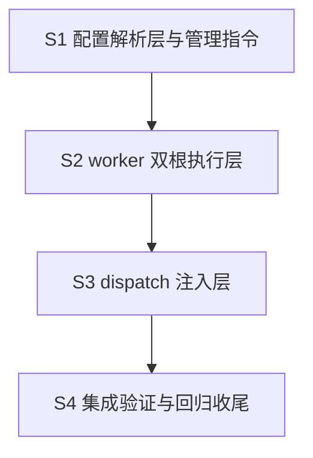

# Plan: mw-dual-workspace（控制工作区与目标工程分离）

- 输入: `spec.md`（AC-001~009 锁定）+ `design.md`（D-001~D-014、VC-001~016）
- 生成时间: 2026-09-11T16:15:00+08:00（Phase 1）
- 执行约定: 每 stage 完成即跑 `audit_phase.py mw-dual-workspace`，VC 证据落 `evidence/runs/`；提交与否由用户逐次决定，PM 不自行 commit

## Stage 概览（串行，无并行机会）

## S1 配置解析层与管理指令

- 目标：target.yml 读写、解析、模式判定（env > target.yml > single）、占位符 `{game}/{engine}/{uproject}` 渲染（fail-closed）全链落地，TS/Py 双侧 parity
- 产出：
  - `packages/coding-agent/src/extensions/agent-team-loop/shared/target-config.ts`（新增：解析 + 渲染 + 模式判定）
  - `packages/multi-workers/mw_common.py` 扩展：`load_target_config()`（PyYAML）+ 渲染
  - `packages/multi-workers/mw.py` 扩展：`target set/clear/show` 子命令 + doctor（PyYAML 检查、toolchain 探测缓存 `.mw/toolchain.json`）
  - parity 测试（T-17 模式复用，模式复用非代码复用——双侧解析器 + 新测试文件）
- 验收 VC: VC-001, VC-006, VC-007, VC-008, VC-010
- 验证方式: 单测（模式回落/占位符渲染/fail-closed/uproject 唯一性发现）+ parity 测试 + `mw target show` 手动冒烟

## S2 worker 双根执行层

- 目标：dual 模式 worker cwd=Game、协调文件写控制根、deny globs L1 调用级强制拦截（双基准匹配、deny 优先）
- 产出：
  - `worker/read-scope.ts` 扩展：denyGlobs 解析 + 双基准匹配（绝对归一 + game 根相对，实测依据见 design D-003）+ verdict 增 `deny-glob`
  - `worker/worker-mode.ts` 微改：read/ls/find/grep 拦截器接入 deny 分支
  - `shared/paths.ts` 微改：`controlRootFromTaskPath()` 显式化
  - `packages/multi-workers/launcher.py` 微改：dual 模式 spawn cwd=game（list args、无 shell，AC-023 语义不变）
- 验收 VC: VC-004, VC-005, VC-009, VC-011, VC-012
- 验证方式: `autopilot-read-scope.test.ts` 扩展 deny 用例 + launcher 单测断言 spawn cwd + trace `[READ_SCOPE] rule=deny-glob` 行

## S3 dispatch 注入层

- 目标：task.md 自包含——profile 三节要点 + deny_globs frontmatter + 双根 read_scope（相对条目按 game 根展开、附加控制根授权）
- 产出：
  - `packages/multi-workers/autopilot/dispatch.py` 扩展：read_scope 展开规则、deny_globs 从 ignore 节默认注入、控制根附加
  - `packages/coding-agent/src/extensions/agent-team-loop/pm/task-dispatcher.ts` 扩展：toolchain/ignore/contract 三节要点渲染（长文 `docs:` 引用支持）
- 验收 VC: VC-013（含 VC-009 生成侧）
- 验证方式: dispatch 单测（三节特征标记断言、scope 展开断言、展开失败报错断言）

## S4 集成验证与回归收尾

- 目标：全链验证 + 基线回归 + 变更收尾
- 产出：
  - 跨盘零污染用例（`MW_TEST_CROSS_DRIVE_ROOTS` 门控，缺失显式 skip）
  - goal check（:379/:417/:573）与 serveStaleness（:635）双根 fixture 化
  - serve 根绑定断言（PID/serve.meta/stop 前缀=控制根 .mw/）
  - `packages/coding-agent/CHANGELOG.md` + `packages/multi-workers/CHANGELOG.md` [Unreleased] 条目
  - `mw doctor` 输出含 target.yml 校验与 toolchain 探测结果
- 验收 VC: VC-002, VC-003, VC-014, VC-015, VC-016
- 验证方式: `npm run check`（0/0/0）+ `./test.sh`（对照 Windows 89 例环境基线）+ 手动跨盘冒烟（F:/E: fixture，需重启 mw serve）

## 依赖理由

- S2 ← S1：deny 双基准匹配需要 gameRoot（S1 解析产物）
- S3 ← S2：deny_globs frontmatter 格式与 read-scope 消费端对齐
- S4 ← S1-S3：全链验证前置完成

## 风险与缓解

| 风险 | 缓解 |
|------|------|
| Windows 89 例环境基线噪声 | VC-002 以基线对照表判新增失败，不追既有失败 |
| P4 工作区无 .gitignore 遍历洪泛 | 已知限制（design §9），截断 + caps 限流有界，不做阻断 |
| mw serve 运行中（PID 90292）需重启生效 | S4 集成前提示用户重启，staleness 机制自动检测 |
| 手写 task.md 相对 scope 条目锚点随模式变化 | design D-003 语义注记已入档；dispatch 生成路径已展开规避 |

## 非目标（本 key 不做）

- 目标工程 VCS 抽象与游戏 CI（D-012，先手动提交）
- deny L1 拦截扩展到 glob 工具（维持现状）
- 别名前缀语法糖（`engine:/**`）
