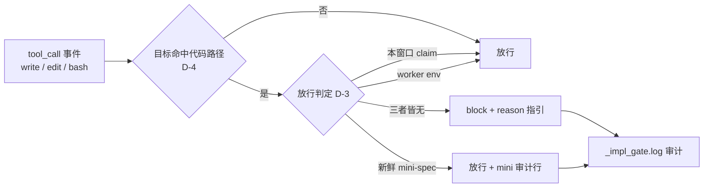

# Design: mw-implementation-gate

> Key: mw-implementation-gate
> 创建时间: 2026-09-21
> 依据: W1（pi 拦截能力）+ W2（P-002 先例）+ 综合定案（evidence/research/design-gate-form-synthesis-2026-09-21.md）

## D-1 形态：tool_call 三层门禁

1. **write/edit 硬门**（主形态）：拦截精确、误报≈0；
2. **bash 收窄启发式**（兜底）：只判写结构的**目标参数**命中代码路径（`>`/`>>` 重定向目标、`tee`/`cp`/`mv`/`rm`/`sed -i` 的参数侧）；payload 文本引用代码路径 + 写词**不触发**（吸取 W2 实测误报教训——worker 写调研文档被拦两次）；声明"not a sandbox"（python -c 内联写、预写脚本执行等已知漏报，事后扫描记遗留）；
3. **事后审计兜底**：v1 不做扫描器，block 全模式落审计行（D-7）。

拦截原语：`pi.on("tool_call")` 返回 `{block: true, reason}`（W1 证据链：types.ts:1071-1075 → runner.ts:932-951 → agent-loop.ts:636-641，工具从不执行）。

## D-2 模块结构（复用 P-002 骨架）

```
packages/coding-agent/src/extensions/agent-team-loop/shared/implementation-gate.ts
  纯判定函数（可脱离 pi 单测）：isCodePath / hasActiveKeyClaim / findFreshMiniSpec / checkBashWriteTarget / gateDecision
  registerImplementationGate(pi)：tool_call handler
packages/coding-agent/src/extensions/agent-team-loop/index.ts
  activate() 内双加载 flag 之后、模式分支之前注册（PM/Worker/交互三模式全覆盖，同进程双 bundle 防重入）
```

## D-3 放行语义（三条件 OR，缺一且目标为代码路径 → block）

1. **本窗口 claim**：`_index.parallel` 中存在 status=active 且 claim_id 匹配当前 host:pid（大小写不敏感）的行——PM 窗口写 spec 自动 claim 的行即此形态；
2. **worker env**：`PI_WORKER_TASK` 存在（被派发的 worker 进程，其 pid 不在 claim 行里——不加此条件会误拦所有 coding worker，破坏派发流程）；
3. **新鲜 mini-spec**：`.agenticdoc/*/mini-spec.md` 存在且 mtime ≤ 24h（框架 mini fast path 的留痕文件本身即审计；新鲜度防陈旧豁免永久关门）。

判定只读文件系统（_index.parallel / mini-spec），零写入——满足 P-002 只读判定约束。`_index.parallel` 缺失/解析失败 → 视为无 claim（fail-closed）。

## D-4 代码路径定义

- 命中：resolve 后位于 `<repo>/packages/` 下且扩展名为 `.ts/.tsx/.js/.cjs/.mjs/.py`；
- 排除：`**/node_modules/**`、`**/dist/**`、`**/.tmp/**`；
- 路径规范化复用 P-002 工具链（tilde 展开、cwd 相对、win32 折叠）；
- `.md`/docs/package.json 等非代码扩展名天然不命中（AC-004 白名单行为）。
- 测试钩子：`MW_IMPL_GATE_ROOT` env 覆盖项目根（默认 process.cwd()），供 suite 测试指向 fixture。

## D-5 reason 文本（引导通道）

`{为什么拦 + 最短合规路径}`：指明当前无 active key claim，给出两条路——建 key（`/agentic` 流程或写 `.agenticdoc/<key>/spec.md` 自动 claim）/ mini fast path（写 `.agenticdoc/<key>/mini-spec.md` 后重试）。对照 GUARD_EXPLANATION 范式（W2 Q3-2）。

## D-6 审计

`.agenticdoc/_impl_gate.log` 追加写一行（ISO 时间 + `blocked|mini-pass` + tool + path + 判定依据），失败不影响拦截/放行本身（W2 recordProtectedBlockTrace 范式）。**全模式落盘**（修 W2 缺口②：P-002 仅 worker 模式）；keyed/worker 放行不落（claim/task 记录已是痕迹），mini 放行落一行（AC-003）。

## D-7 测试（修 W2 缺口①——P-002 纯函数测试是反面教材）

- 纯函数单测：isCodePath / claim 匹配 / mini 新鲜度 / bash 目标判定；
- **真实工具调用层**：`packages/coding-agent/test/suite/` 下用 harness + faux provider 驱动会话，faux provider 产出 write/edit/bash 的 tool_use，注册 gate 的测试扩展拦截——覆盖 AC-001（无 claim 拒写 + reason 含指引）、AC-002（有 claim 放行）、AC-004（白名单路径不受影响）；fixture 用 MW_IMPL_GATE_ROOT 指向临时 _index.parallel/mini-spec。

## D-8 部署生效面（修 W2 缺口⑥）

守卫活在 agent-team-loop 扩展 bundle 内：`mw setup --build` 重建 dist + 重启窗口后生效；旧 bundle 进程在重启前无门禁。CHANGELOG 如实声明。

## D-9 SKILL.md 触发词（AC-005）

框架仓 `.agents/skills/agentic-task/SKILL.md` description 追加 "before any non-trivial code implementation when .agenticdoc exists (implementation entry gate)"；commit+push 后 `diff-installed.py` 报 clean（clone HEAD=origin HEAD，.claude 一致）。

## D-10 不做

python 侧镜像接线（W2 缺口⑤——mw.py 无生产写路径需要）、事后 bash 逃逸扫描器（记遗留）、setActiveTools 变更（worker 白名单现状不动）、多项目通用配置化（本仓默认集即可）。

## 架构图


