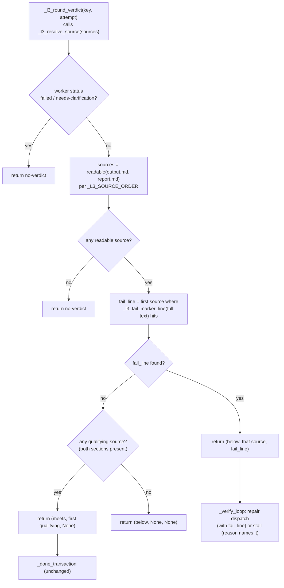

# Design: mw-l3-fail-marker-forms

基线: HEAD `d20a270d5` · 证据: `evidence/research/{spec-incident-fail-forms,spec-decision-space,design-code-facts,design-corpus-positive,design-corpus-negative}-20260925.md`（下称 R1/R2pos/R2neg/R3 按序）
前置: spec.md AC-001..AC-007（fingerprint 见 evidence-requirement.md）

## §0 定位

修复 L3 FAIL 检测的召回缺口与误伤面：现行 `_L3_FAIL_RE`（`conductor.py:1148`，a0c36fcce）以 `\|` 为唯一锚，语料 25 条正向非管道 FAIL 行（S4–S9）全部漏检；`sampling a1 output.md:12` 的 `- **FAIL：9**` 是该轮优先源（output.md）中**唯一**正向标记（G3——今天的 below 纯属 report.md 撞巧有 9 个加粗单元格）。同时负语料（meets 轮 QG 节内 50 行 FAIL-相邻文本）证明朴素放宽必翻车（`\bFAIL\b` 扫 QG 误翻 6/10，`(?i)` 10/10）。

**不改**冻结原语 `_parse_l3_output`/`_md_section`（region-SHA 锁，R1 §5.2）；**不动** source order、worker-status 门（I-4）、verdict 值域、事件类型集（`EVENT_TYPES == 17` 锁）。

## §1 设计决策

### D-001 检测规则：三形态 + 值感知豁免（token 局部）

以**行**为单位扫描（替代现行整段 `search`，顺带产出 AC-005 需要的行样本），每行依次尝试三条大小写敏感、仅大写 `FAIL` 的规则：

```python
_L3_FAIL_RE        = re.compile(r"\|\s*\**\s*FAIL\b")            # S1/S2/S3（现行规则，名宇保留不动，避免 :354/:486/:596 三处测试引用改名）
_L3_FAIL_BULLET_RE = re.compile(r"^\s*[-*]\s*\**\s*FAIL\b")      # S4/S5（含裸 `**FAIL**` 行：首 `*` 作 marker、次 `*` 作加粗，fail-closed 方向）
_L3_FAIL_PROSE_RE  = re.compile(r"^[^|\n]*?\**\s*FAIL\s*[—–-]")  # S6（行内无管道前缀 + FAIL 后随破折）
_L3_FAIL_ZERO_RE   = re.compile(r"FAIL\s*\**\s*[：:=]?\s*\**\s*0\b")  # 零值豁免（token 局部）
```

- 命中判定：pipe 或 prose 命中即 FAIL 行；bullet 命中后**再查**零值豁免——实现处方（评审 NIT-3）：`_L3_FAIL_ZERO_RE.match(line, fail_token_start)`，锚定在该 bullet 命中的 FAIL token 起点而非整行 `search`（防构造出的双 token 行 `- FAIL 9 项，其中 FAIL：0` 被第二个 token 的零值错误豁免）；`- FAIL：0`/`- **FAIL：0**` 豁免，`- **FAIL：9**`/`- FAIL：38` 触发。
- 语料实证（R2neg §5 翻转矩阵 + R2pos §3 形态表）：三规则 + 值豁免在全部 20 轮上 **meets 误翻 0/10、轮级正向漏检 0**（现行 80 管道命中全保留；S4/S5/S6 直接召回；S7/S8/S9 行级残留但轮级全部由共存管道覆盖，见 §4）。
- 词边界与大小写承担复合词排除：`FAILED`/`FAILURES`（`\b` 后非词字符）、`fail-closed`/`failed`/`fail_items`/`tamper_failures`（小写）；`PASS/FAIL` 元话语三条规则均不命中（无管道紧邻、无行首项目符、FAIL 后无破折）。
- 中文「失败」不纳入（R2neg §4.9：真 FAIL 行与否定行均大量出现，无可避免误伤）。

### D-002 扫描面：QG 节切片 → **全文件**

FAIL 扫描输入从 `_md_section(text, "## Quality Gate Report")` 改为**源文件全文**：

- 依据 G2：所有 reviewer 都把结论复写进 TL;DR/Summary（`:3`/`:7`），这些行今天结构性不可见；`sampling a1` 正是「bullet 在决定源、散文在 TL;DR」的形状，仅靠 report.md 撞巧救回。
- 语料安全边界（R2neg §1.3 + §5）：全文件扫描下三规则 meets 误翻仍为 **0/10**（TL;DR/Achieved 里的 uppercase-FAIL 负样本只有 `FAIL=0`/`0 FAIL` 族，均被形态+值豁免）；R2pos 附录 A 证实**无任何管道 FAIL 行落在 QG 切片外**——现行 80 命中的行为面在全文件扫描下零漂移。
- 与冻结原理解耦：FAIL 判定不再依赖 `_md_section` 的切片语义（P-013 型边界坑）；`_l3_qualifies`（两节存在性检查）**不变**，仍用 `_md_section`。

### D-003 洗白洞收口：FAIL 否决扩到**全部可读源**

现行 `_l3_resolve_source`（`conductor.py:1187-1190`）只扫 `qualifying` 源：output.md 带 FAIL 但缺节（不合规）+ report.md 干净合规 ⇒ meets——违背 no-whitewash 本意（a0c36fcce 的实现意外收窄）。新语义：

```
对每个可读源（_L3_SOURCE_ORDER 顺序）: 若 fail_scan(全文) 命中 → (below, 该源, 首个命中行)
若存在 qualifying 源 → (meets, 首个 qualifying 源, None)
否则 → (below, None, None)
```

- I-4 不受影响：worker-status 门（failed/needs-clarification → no-verdict）仍在一切文件读取之前。
- 语料验证：gui-time a2（双源均不合规、report.md 7 个 FAIL 单元格）从「缺节 below」变为「FAIL below」——判定不变、归因变准。
- 既有测试 `test_report_fail_not_whitewashed_by_output_pass` 语义保留并扩展（新增非合规源否决用例）。

### D-004 below 留痕穿线（AC-005）

- `_l3_resolve_source` 返回值 `(verdict, source)` → `(verdict, source, fail_line)`；`_l3_round_verdict` 3 元组 → 4 元组（R1 §4.2 已枚举：生产侧 1 处 `_verify_loop:1481`，测试侧 8 个解包点 + 3 个索引点，全部在本 key 测试工作中机械更新）。
- 消费面：
  1. `mark_stalled` reason 追加 `_one_line(fail_line)`（gate/stall 文本点名 FAIL 项）；
  2. `_persist_l3_verdict` 增可选 `reason` 参数 → timeline detail `l3-verdict {before} -> below (report from {source}; fail: {sample})`——**不新增事件类型**，骑现有 `config` 事件；
  3. `_repair_prompt` 注入首个 FAIL 行（repair worker 直接拿到目标），其「## Quality Gate Report 的 FAIL 项」限定语删除（fail_line 现可来自 QG 节外与非合规源）；另有 `_l3_prompt`（:1123）的「任一份出现 FAIL 单元格即 below」措辞更新为三形态口径（评审 MINOR-3b：该措辞在 reviewer 提示词里，不在 repair 提示词）；
  4. provenance sidecar（`l3-verdict-provenance.json`）增 `fail_line` 字段——append-only + task_key 去重天然幂等，已记录轮次不回改。
- meets 路径与 `_done_transaction` 不动（fail_line=None）。

### D-005 测试矩阵（语料锚点驱动）

| 层 | 内容 | 锚点（全部真实 file:line，R2pos §6 / R2neg §6） |
|---|---|---|
| L1 单元 | 三规则 × 豁免真值表，逐行 verbatim 内嵌 + 出处注释（正锚点 = 管道三变体 + bullet + prose + 构造变体；负锚点 11 条） | 正：`mvp a1 report.md:26`（S1 朴素管道）/ `marker a3 output.md:22`（S2 加粗管道）/ `gui-time a2 report.md:17`（S3 斜杠管道）/ `sampling a1 output.md:12`（S4 项目符非零）/ `sampling a1 output.md:3`（S6 行首散文）；构造变体（标注为构造，禁声称语料出处）：裸 `**FAIL**`（bullet 规则覆盖，fail-closed）、双 token 行 `- FAIL 9 项，其中 FAIL：0`（零值豁免 token 锚定，首 token 触发）；负：`cigate a1 output.md:3`（FAIL=0）/ `cigate a1 report.md:50`（PASS 35，FAIL 0）/ `cigate a2 output.md:84` / `tier-a a1 report.md:44` / `tier-a a2 report.md:53`（- FAIL：0）/ `mvp a2 output.md:10` / `params a3 output.md:12` / `freshness report.md:31` / `cigate a1 output.md:12`（fail_items=[]）/ `cigate a2 output.md:42`（9 failed）/ `gui-time a2 report.md:74` |
| L2 场景 | ① sampling 型：决定源仅 bullet FAIL、report.md 缺失 ⇒ below（G3 回归锚——**不得依赖 report.md**）② 洗白洞：非合规 output.md 带 FAIL + 干净合规 report.md ⇒ below ③ fail_line 穿线：stall reason/timeline detail/provenance/repair prompt 四消费面 ④ meets 保持：cigate-a2 型汇总行（`PASS 35 / FAIL 0`）⇒ meets ⑤ 行内否定：`| VC-034 \| **FAIL** \| yes \| … 0 fail …`（marker a3 report.md:44）⇒ 仍 below（豁免 token 局部，禁整行丢弃） | R2neg §4.7 |
| e2e | full_chain 变体：round-1 reviewer stub 写 `- **FAIL：1**`（bold bullet，非管道）⇒ below、无 false-meets DONE、repair 派发（stub 以 repair prompt 中的 fail_line 为分支键）⇒ round-2 合规 ⇒ DONE | AC-006 |
| 存量更新 | ① `test_config_snapshot_and_fail_regex_superset`（:568-612）：单 regex 超集探针改为**逐规则**探针，`FAILED` 样本（:592）三规则均不得命中，new_only 计数按新规则集重标；:483-489 的旧口径探针用新 fail-scan 重写（保持其断言语义）；`_L3_FAIL_RE` 名宇保留，:354/:486 引用不动 ② `test_change_classes_fixture_reproduce_4_plus_3`（:421-504）：17 轮夹具不含 bullet/prose/零值文本，4/3/10 分类计数**不变**（评审 MINOR-4：可证不变，无需重钉——在测试内加注释钉不变性口径即可；若要覆盖新形态分类另加夹具轮后再钉） ③ 8+3 元组解包点机械更新 ④ **新测试函数落位**（评审 MINOR-5）：新 L1 用例进新文件 `test_autopilot_fail_marker_forms.py`，L2 场景进 `test_autopilot_conductor_exec.py`（无 self-audit 锁）；`test_autopilot_verdict_source_fallback.py` 只做就地修改（不新增函数，`len(new_tests) == 15` 自审计锁保持） | R1 §5.5 |

### D-006 变更面

`conductor.py`（`_L3_FAIL_*` 常量区 + `_l3_resolve_source` + `_l3_round_verdict` + `_verify_loop` 消费点 + `_persist_l3_verdict` 可选参 + `_repair_prompt`（注入 fail_line、删 QG 限定语）+ `_l3_prompt`（:1123 措辞更新））+ 测试四件（新 L1 文件 `test_autopilot_fail_marker_forms.py`、exec 扩展、e2e stub 分支、fallback 文件就地修改）+ CHANGELOG/pitfalls。**零触碰**：`_parse_l3_output`、`_md_section`、`_l3_qualifies`、`_L3_SOURCE_ORDER`、`_l3_source_paths`、`_L3_FAIL_RE` 名宇、done transaction、closure repair 路径、timeline 事件集。

### D-007 GC 护栏

1. 冻结原语字节不变（region-SHA 测试原样绿，R1 §5.2 的 3 常量 2 文件不动）。
2. 无新事件类型；verdict 值域 {meets, below, no-verdict} 不变。
3. 大小写敏感 + `\b` 是误伤面的硬边界（降到 `(?i)` 即 10/10 翻车）。
4. fail-closed 方向：任何不确定形态（未观察到的 G8 构造变体）默认**不**触发新增豁免——豁免表只收语料实证过的零值族。

## §2 Function Flow



## §3 VC 契约

| VC | 断言 | AC |
|---|---|---|
| VC-001 | 管道三形态（S1/S2/S3）语料锚点全 below | AC-001 |
| VC-002 | bullet 非零触发（`- **FAIL：9**`/`- FAIL：38`）、零值豁免（`- FAIL：0`） | AC-001/002 |
| VC-003 | 行首散文形态（S6，`FAIL — …`/`❌ FAIL — …`/`状态：❌ FAIL — …`）锚点 below；管道行不重复触发散文规则 | AC-001 |
| VC-004 | 否定族 11 锚点 + `FAILED` + `PASS/FAIL` 元话语 + 行内 `0 fail` 全不触发 | AC-002 |
| VC-005 | 全文件扫描：TL;DR/Summary/Achieved 的 FAIL 可见；管道命中行为零漂移（语料 QG 切片内外计数一致） | AC-001/004 |
| VC-006 | 非合规源 FAIL 否决（洗白洞关闭） | AC-004 |
| VC-007 | fail_line 四消费面（stall reason / timeline detail / provenance / repair prompt）可观测 | AC-005 |
| VC-008 | `_parse_l3_output`/`_md_section` region-SHA 原样绿 | AC-003 |
| VC-009 | `EVENT_TYPES == 17`、verdict 值域不变 | AC-004 |
| VC-010 | 默认套件对照基线（927+2 外域先在）零新增失败；e2e_l2 全绿 | AC-003 |
| VC-011 | e2e bullet-FAIL 轮 below + repair 派发 + 无 false-meets DONE | AC-006 |
| VC-012 | 判据表（形态+豁免+锚点）落 CHANGELOG；pitfalls 登记 | AC-007 |

AC 覆盖: AC-001→VC-001/002/003/005 · AC-002→VC-002/004 · AC-003→VC-008/010 · AC-004→VC-005/006/009 · AC-005→VC-007 · AC-006→VC-011 · AC-007→VC-012（11/7 全覆盖）。

## §4 风险与残留

- **未观察形态与行级残留**（G8 + S7/S8）：① ASCII 冒号 `- FAIL: 9` 命中 bullet 规则（规则不限定冒号）且零值豁免不中（值 9）⇒ 触发 ✓；裸 `**FAIL**` 行**被 bullet 规则覆盖**（首 `*` 作 marker、次 `*` 作加粗，评审 MINOR-1 复演确认，fail-closed 方向，L1 加构造用例钉住）；② `FAIL(n=9)`/`### FAIL`/`- [x] FAIL` 不在三规则内（`[`/`#` 阻断 bullet 锚，FAIL 后无破折）——登记为残留；③ **S7/S8 行级残留**：`FAIL（…）`、`FAIL / below`、`**汇总：… 8 FAIL / 36**` 型行不触发任何规则——曾评估 `FAIL\s*[（(/]` 扩展，被 freshness a1 `**总计：19 PASS / 0 FAIL / 1 needs-rerun。**`（`FAIL` 后随 `/ 1`）否决；语料实证 S7/S8 行所在轮全部共存管道单元格（marker a3：14 / sampling a1：9 / mvp a1：40 / readcap a1：2 / gui-time a2：7），轮级召回 100%，行级 miss 如实登记，禁凭空声称覆盖；④ `FAIL / below — 42 条`（gui-time a2 output.md:3，斜杠变体散文）同样行级残留，轮级由 report.md 管道覆盖。
- **prose 规则无值豁免**：`FAIL — 0/30` 型（语料 0 例）会触发——方向是 below（fail-closed 侧），接受。
- **`_repair_prompt` 措辞变更**影响所有新派发 repair 轮的任务书——与 d20a270d5 的 reprompt 提示词无交叠（那是 reviewer 侧）。
- **17 轮回放计数**（评审 MINOR-4）：夹具不含 bullet/prose/零值文本，4/3/10 分类计数**可证不变**——测试内加注释钉口径即可，无重钉动作；若后续要覆盖新形态分类，另加夹具轮后再钉。

## §5 兼容性

- 生效时机：conductor 进程内 ⇒ 需 `mw serve` 重启（与 readcap/closure-repair 同口径）。
- 对 E2Feature 复算（`feature-false-meets-remediation`，基线逐行标注，评审 NIT-1）：新判定器回放 20 轮语料的期望翻转表——vs HEAD 判定器：marker a3 / readcap a1 / sampling a1 / gui-time a2 均 below 保持（归因修正：gui-time a2 从「缺节」变「FAIL」，sampling a1 从「report.md 管道」变「output.md bullet」）；vs 事故时记录的 `l3-verdict.txt`：sampling a1（meets→below，不再依赖 report.md）；meets 轮全部保持 meets（**0 个 meets 轮被误翻**）。此表写入 CHANGELOG 供 remediation 引用。
