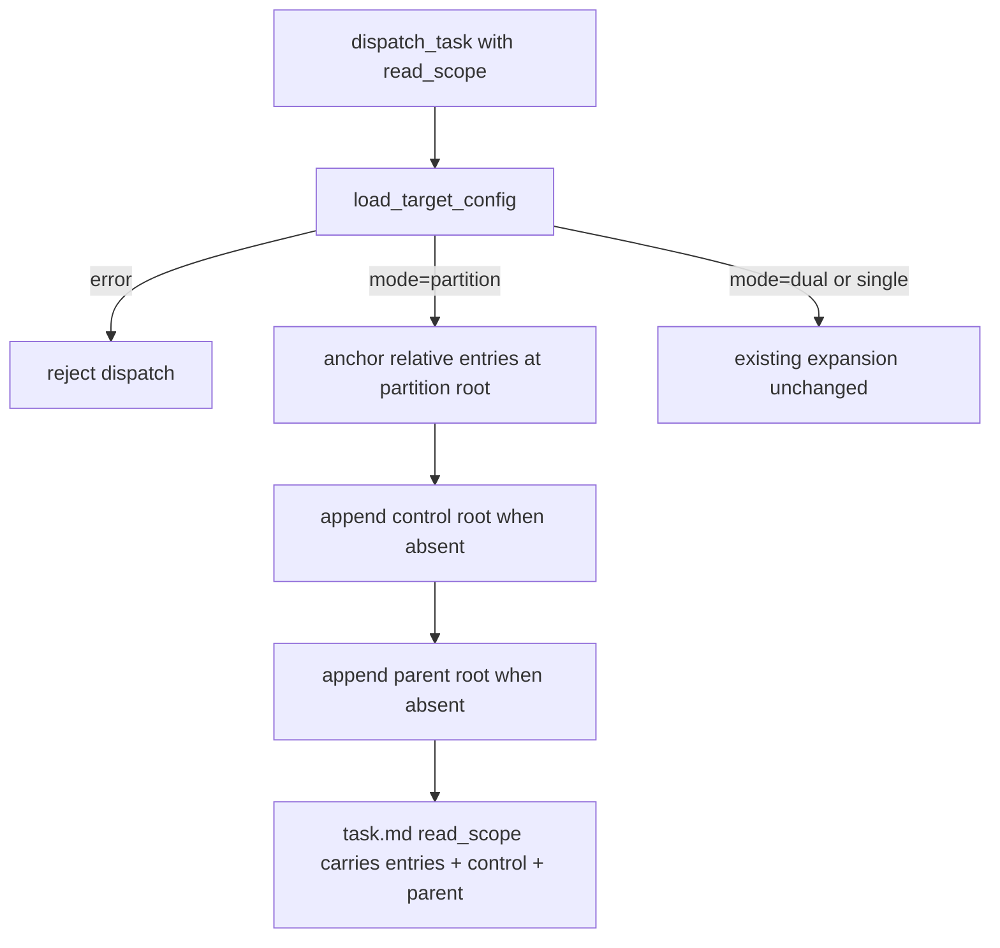
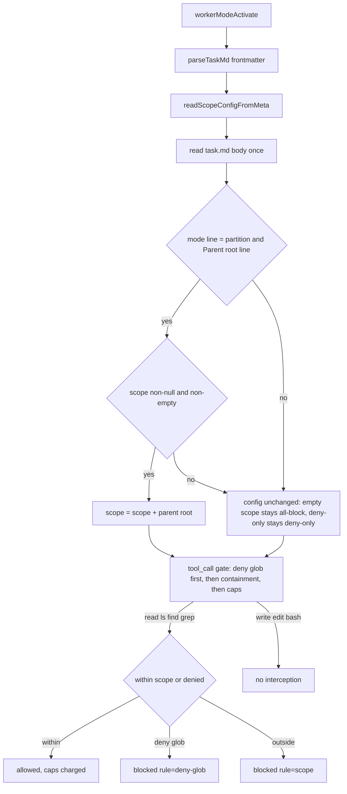

# Design: mw-partition-parent-extended

> 2026-09-20：parent 语义修正（只读上下文 → 扩展可写工作区）的窄改设计；上游 spec = mw-target-partition（已归档，不回改）

## §0 设计前提锚定

- spec_path: `.agenticdoc/mw-partition-parent-extended/spec.md`
- spec_locked_at: 2026-09-20T15:05:00+08:00
- ac_count: 6
- ac_ids: AC-001, AC-002, AC-003, AC-004, AC-005, AC-006

## §1 架构选型

### D-001 parent 扩展区语义的执行点
- 选择：**双层**——Py conductor 派发展开（task.md frontmatter 显式含 parent root，透明可审计）+ TS worker 侧 union（从 profile 块解析，覆盖一切携带 read_scope 的任务，含 PM 窗口 TS 路径派发）
- 否决：仅 Py 展开（TS 路径任务读不了 parent，语义窟窿）；仅 worker union（frontmatter 与实际允许集不一致，conductor 任务的 scope 列表失去透明性）
- 调研：`evidence/research/design-union-enforcement-2026-09-20.md`（发现 1）

### D-002 union 载体与纯度
- 选择：`read-scope.ts` 新增两个纯函数——`parentRootFromTaskContent(content: string): string | null`（模式行门控 + `Parent root` 前缀行提取，`:` 后路径 trim）与 `applyParentRootUnion(config: ReadScopeConfig | undefined, parentRoot: string | null): ReadScopeConfig | undefined`（非空 scope 追加 parentRoot，返回新对象）；`worker-mode.ts` wiring 处一次 `fs.readFileSync(taskPath)` 取内容（task.md 小文件，startup 一次性开销）
- 否决：扩展 `parseTaskMd`/`TaskMeta`（改共享接口，波及其测试夹具）；给 `readScopeConfigFromMeta` 加 content 参数（污染纯 meta 签名）
- 调研：同上（发现 2）

### D-003 union 不作用域（fail-closed 保持）
- 选择：仅当 `config !== undefined && config.scope !== null && config.scope.length > 0` 时追加；空 `[]`（全拒形态）与 deny-only（`scope=null`，本无包含检查）不并入
- 否决：`scope !== null` 即并入（空 scope 凭空造包含集，破坏"只扩大已声明的包含"红线）
- 调研：同上（发现 3；spec §2.3）

### D-004 解析器门控形态
- 选择：模式行正则 `^\[mw\] mode: partition[ \t]*$`（MULTILINE，对齐 launcher 撕裂校验 `_PROFILE_MODE_RE` 行形态，不设行窗口）；`Parent root` 前缀匹配取首个命中行的 `:` 后路径——兼容新旧两种标签（升级在途 task.md 不失效）
- 否决：解析 v2 marker 后定长取行（标签行序变化即碎）；仅匹配新标签（在途任务 union 失效）
- 调研：同上（发现 4/5；launcher.py:521）

### D-005 Py 展开追加顺序与判重
- 选择：`_expand_read_scope` partition 分支在 control 追加后追加 parent root：返回 [原条目（锚定 partition root，原序）..., control（缺失才加）, parent（缺失才加）]；判重沿用 normcase 等值比较；parent 取 `config["parent_root"]`（load_target_config 已 realpath 归一，`resolve()` 幂等兜底）
- 否决：parent 先于 control（既有 control-last 断言族冲突面大）；集合判重（无必要，追加位一次比较即可）
- 依据：AC-001 锁定顺序

### D-006 标签与措辞定型
- 选择：profile 行标签 `Parent root (extended workspace, writable):`（双侧渲染 + Py golden + 双侧断言同步）；`mw.py` 两处 "read-only context for the partition" → "extended writable workspace for the partition"（--parent 缺参报错 + argparse help）
- 否决：保持 `Parent root:` 不变（扩展语义对 worker 不可见，用户要求语义显性化）
- 调研：同上（发现 7：四个测试触点）

### D-007 测试布局
- 选择：Py——翻转 `test_partition_anchors_at_partition_root`（parent 在展开结果）、新增 parent 判重 case、golden/`_PARTITION_YML` 模板/conductor 注入断言三处标签同步；TS——`autopilot-read-scope.test.ts` 新增 describe（union 纯函数矩阵 + `startScopedWorker` 变体带 profile body 的 wiring 用例 + parent 路径 write 不拦截断言）、`agent-team-loop-profile-injection.test.ts` 标签断言更新
- 否决：新测试文件（两个既有文件即这两层的归属地；AC-006 限定修改面）
- 调研：同上（发现 6/7）

## §2 核心结构

TS（`worker/read-scope.ts`，纯函数层增量；`ReadScopeConfig`/`ReadScopeState` 等既有类型零变化）：

```ts
/** Partition extended-workspace union (mw-partition-parent-extended AC-002):
 * extract the Parent root line from a task.md body. Gated on the v2 profile
 * mode line (same line shape as the launcher tear check); matches the
 * `Parent root` prefix so both the old and the annotated label parse. */
export function parentRootFromTaskContent(content: string): string | null;

/** Append parentRoot to the scope entries of a built ReadScopeConfig.
 * No-op when config is undefined (no read_scope/deny_globs at all), when
 * scope is null (deny-only) or empty (fail-closed all-block form). */
export function applyParentRootUnion(
	config: ReadScopeConfig | undefined,
	parentRoot: string | null,
): ReadScopeConfig | undefined;
```

Py（`autopilot/dispatch.py`，函数签名零变化）：

```python
def _expand_read_scope(scope, config, project_root) -> list[str]:
    # partition 分支尾部新增（control 追加之后）：
    # parent root 缺失才追加（normcase 判重）——"parent 是扩展区"红线
```

WorkspaceConfig / target.yml schema / 命令面 / env：零变化。

## §3 模块划分

```
packages/coding-agent/src/extensions/agent-team-loop/
├─ worker/read-scope.ts          # +parentRootFromTaskContent / +applyParentRootUnion（纯函数）
├─ worker/worker-mode.ts         # wiring：readScopeConfig 构建处 3 行（重读内容 + union）
└─ pm/task-dispatcher.ts         # renderPartitionProfileBlock：Parent root 行标签

packages/multi-workers/
├─ autopilot/dispatch.py         # _expand_read_scope：partition 分支追加 parent root + 注释红线翻转
├─ mw_common.py                  # render_partition_profile_md：Parent root 行标签
└─ mw.py                         # --parent 缺参报错 + argparse help 措辞

测试
├─ packages/multi-workers/test_partition_dispatch.py            # 展开断言翻转 + 判重 case + 标签三触点
├─ packages/multi-workers/test/fixtures/partition-profile-block.golden.md  # 标签
└─ packages/coding-agent/test/suite/autopilot-read-scope.test.ts           # +union describe（纯函数 + wiring + write 不拦截）
   packages/coding-agent/test/extensions/agent-team-loop-profile-injection.test.ts  # 标签断言
```

依赖方向不变：read-scope（纯）← worker-mode；mw_common ← dispatch/mw。

## §4 接口与集成

### 4.1 对外接口清单

- TS 新导出：`parentRootFromTaskContent(content: string): string | null`、`applyParentRootUnion(config: ReadScopeConfig | undefined, parentRoot: string | null): ReadScopeConfig | undefined`（read-scope.ts）
- Py：`_expand_read_scope(scope: list[str], config: dict, project_root: pathlib.Path) -> list[str]`（签名不变，行为增量）
- CLI/命令面/env/golden 标签：`Parent root (extended workspace, writable):`
- 无新增文件、无 schema 变化、无命令变化

### 4.2 外部依赖集成

- bundle 重建：`packages/multi-workers/dist/extensions/agent-team-loop.js`；`packages/coding-agent/dist` 随构建对齐
- launcher 撕裂校验 / doctor / trace 写回 / cwd 语义：零接触

## §5 Function Flow

派发展开（Py conductor 路径）：



worker 侧 union（全路径）：



## §6 Coverage Matrix

| ID | 功能点 | 正常路径 | 边界测试 | 异常路径 | 验证层级 |
|----|--------|---------|---------|---------|---------|
| F1 | Py 展开（AC-001） | 三根互异展开 [条目, control, parent] | parent/control 已列判重；parent==control | dual/single 零变化 | L1 |
| F2 | union 纯函数（AC-002） | 模式行+Parent root 行 → scope 追加 | 新旧标签；无模式行；deny-only；空 scope | 无 Parent root 行 → null | L1 |
| F3 | union wiring（AC-002） | profile body + read_scope → parent 读放行 | 旧标签在途 task.md | 无 profile 块行为不变 | L1 |
| F4 | deny 优先（AC-003） | parent 路径命中 deny glob → 拒 | deny 与 scope 同时命中 | — | L1 |
| F5 | 写零拦截（AC-004） | parent 路径 write/edit/bash 不拦截 | 既有 non-read 用例 | — | L1 |
| F6 | 标签/措辞（AC-005） | 双侧渲染+golden 新标签 | 旧标签解析兼容 | mw.py 无 read-only 残留 | L1 |
| F7 | 零回归（AC-006） | dual/single 全绿 | check 0/0/0 | partition 用例修改面限定 | L1 |

## §7 Verification Contract

VC-001: 当 active=partition、三根互异、read_scope=["src/", 绝对条目] 时，`_expand_read_scope` 返回值必须逐项等于 [partition/src 绝对, 绝对条目, control 绝对, parent 绝对]；parent（或 control）已在条目中时返回值不含重复项；dual/single 同输入返回值与现行一致
       Layer: L1
       Output: [VERIFY] VC-001: expanded=[entries, control, parent], dedup=pass, legacy=unchanged
       Source: AC-001

VC-002: 当 task.md 内容含 `[mw] mode: partition` 行与 `Parent root: P`（或 `Parent root (extended workspace, writable): P`）行时，`parentRootFromTaskContent` 必须返回 P；无模式行或无 Parent root 行时必须返回 null
       Layer: L1
       Output: [VERIFY] VC-002: parentRoot=P | null
       Source: AC-002

VC-003: 当 ReadScopeConfig.scope=["src/"] 且 parentRoot=P 时，`applyParentRootUnion` 返回 scope=["src/", P]；config=undefined、scope=null（deny-only）、scope=[]（空）时必须返回原 config 不变
       Layer: L1
       Output: [VERIFY] VC-003: union=appended | unchanged
       Source: AC-002

VC-004: 当经 wiring（startScopedWorker 变体，task.md 带 profile body + read_scope）对 parent root 内路径发起 read 调用时，拦截器必须不 block；对 parent 外且 scope 外路径发起 read 时必须 block（rule=scope）
       Layer: L1
       Output: [VERIFY] VC-004: parent_read=allowed, outside=blocked
       Source: AC-002

VC-005: 当 deny_globs 含 `**/DerivedDataCache/**` 且 parent root 已并入允许集时，对 parent 下 DerivedDataCache 内路径的 read 调用必须 block 且 reason 含 rule=deny-glob
       Layer: L1
       Output: [VERIFY] VC-005: parent_deny=blocked, rule=deny-glob
       Source: AC-003

VC-006: 当经 wiring 对 parent root 内路径发起 write/edit/bash 调用时，拦截器必须不 block 且不产生 rejection 记录；tool_call 拦截覆盖集合必须为 {read, ls, find, grep}
       Layer: L1
       Output: [VERIFY] VC-006: write=unintercepted, gate_tools=[read,ls,find,grep]
       Source: AC-004

VC-007: 当渲染 partition profile 块时，TS `renderPartitionProfileBlock` 与 Py `render_partition_profile_md` 的 Parent root 行必须为 `Parent root (extended workspace, writable): <归一路径>` 且两实现输出逐字节一致；Py golden fixture 与两侧测试断言同步该标签
       Layer: L1
       Output: [VERIFY] VC-007: label=extended-workspace, parity=byte-identical
       Source: AC-005

VC-008: 当检查 CLI 措辞时，`mw partition set` 的 --parent 缺参报错与 argparse help 必须不含 "read-only" 且含 "extended writable workspace"
       Layer: L1
       Output: [VERIFY] VC-008: read_only_residual=0
       Source: AC-005

VC-009: 当全量运行两侧测试时，dual/single 既有用例必须零修改全绿；partition 既有用例修改面必须限于 AC-001 展开断言与 AC-005 标签断言；`npm run check` 必须 0 error / 0 warning / 0 info
       Layer: L1
       Output: [VERIFY] VC-009: legacy=green-zero-mod, partition_diff=bounded, check=0/0/0
       Source: AC-006

## §8 AC → VC 映射表

| AC ID | AC 摘要 | 对应 VC | 路径分类 |
|-------|--------|---------|---------|
| AC-001 | Py 展开并入 parent（顺序/判重/legacy 零变化） | VC-001 | 正常+边界 |
| AC-002 | worker union（门控/不作用域/wiring） | VC-002, VC-003, VC-004 | 正常+边界+异常 |
| AC-003 | deny 先于 union | VC-005 | 异常 |
| AC-004 | 写路径零拦截回归锁定 | VC-006 | 非功能 |
| AC-005 | 措辞/标签/golden 同步 | VC-007, VC-008 | 正常 |
| AC-006 | 零回归与修改面限定 | VC-009 | 非功能 |

## §9 非功能实现方案

- **fail-closed 保持**：空 read_scope 全拒形态不因 union 失效（D-003）；解析/派发/spawn 拒绝路径零变化
- **性能**：Py 展开每次派发多一次字符串追加与判重；worker 侧 startup 一次小文件重读 + 一次正则扫描——量级与既有 frontmatter 解析等同（spec §2.2 非验收）
- **安全**：零接触 `~/.pi/agent/`（P-002）；golden/spec/测试写盘走 write/edit 工具或 Python utf-8（P-001）；task.md 信任边界仍在派发层（union 解析的对象是派发层写入的 profile 块）
- **可观测**：conductor 任务 frontmatter 显式含 parent root（透明）；worker 拦截/拒绝记录协议（trace.log [READ_SCOPE] 行 + output.md 表格）零变化
- **升级零感知**：旧标签 task.md 经前缀匹配继续 union（D-004）；dual/single 路径 mode 门控零接触

## §10 决策记录

| D-ID | 决策点 | 选择 | 否决 | 理由 |
|------|--------|------|------|------|
| D-001 | 执行点 | Py 展开 + worker union 双层 | 单层 | TS 路径覆盖 + frontmatter 透明 |
| D-002 | union 载体 | read-scope.ts 两纯函数 + wiring 重读 | 扩 parseTaskMd | 接口面零波及 |
| D-003 | 不作用域 | 仅非空 scope | scope 非null 即并入 | 空 scope 全拒红线 |
| D-004 | 解析门控 | 模式行正则 + 前缀匹配 | marker 定长取行 | 对齐撕裂锚 + 标签兼容 |
| D-005 | Py 追加顺序 | [条目, control, parent] + normcase 判重 | parent 先行 | 既有断言族冲突最小 |
| D-006 | 标签措辞 | extended workspace, writable + mw.py 两处 | 保持旧标签 | 语义显性化（用户要求） |
| D-007 | 测试布局 | 既有文件内增量 | 新测试文件 | 归属地正确 + 修改面限定 |
