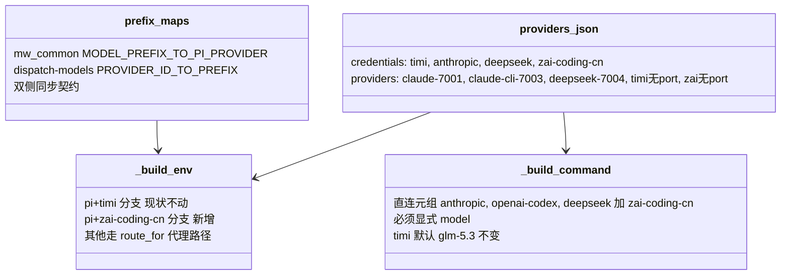
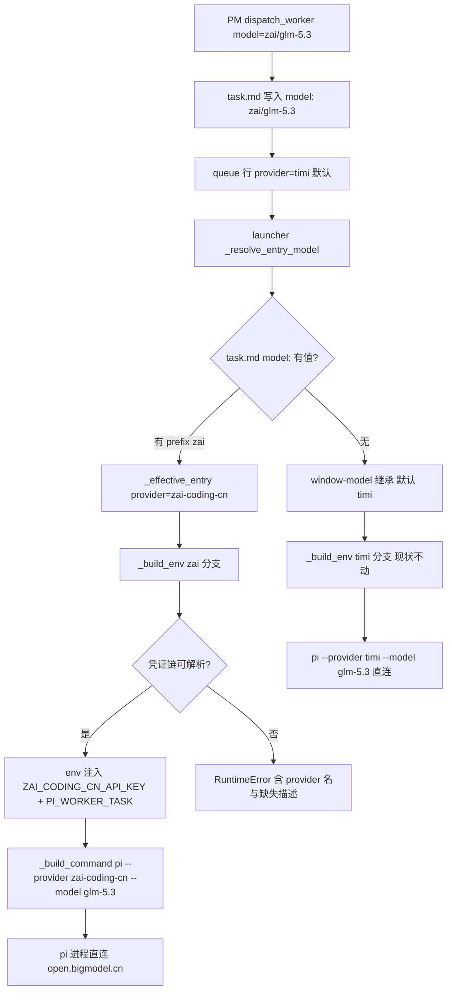

# Design: mw-provider-routing

## §0 设计前提锚定

- spec_path: `.agenticdoc/mw-provider-routing/spec.md`
- spec_locked_at: 2026-09-16T16:30:00+08:00
- ac_count: 8
- ac_ids: AC-001, AC-002, AC-003, AC-004, AC-005, AC-006, AC-007, AC-008

## §1 架构选型

### D-001 zai 接入的改动方式

**需求摘要**：接入 zai-coding-cn 直连路由，风险最小化——不触碰 timi 现行代码路径。

| 方案 | Pros | Cons |
|------|------|------|
| A. providers.json 新增 `pi_providers` 段（数据驱动泛化） | 消灭 4 个硬编码分支，长期维护成本低 | 迁移动 timi/anthropic/deepseek 现行路径，回归面大 |
| B. 「无 port = 直连」启发式 | 零新配置 | deepseek 键双重身份（pi 直连 vs CLI 代理 port 7004）导致错误路由；route_for 默认 port 7001 使判定不可靠 |
| C. 第 5 个硬编码直连分支 | 零触碰 timi 路径，回归风险 ≈ 0；约 30 行；AC-001 字面满足（zai 即无 port 路由 R） | 硬编码模式延续，第 6 个 provider 再付 ~30 行 |

**推荐**：`方案 C`（用户裁定 2026-09-17：先落地 C）
**理由**：LLM 调用链是框架命脉，新代码仅在 `provider == "zai-coding-cn"` 时执行，timi 回归风险隔离；A 拆后续独立 key（见 README Backlog「直连路由泛化」项），带专属回归测试矩阵。
**调研**：`evidence/research/design-pi-direct-routes-2026-09-16.md`

### D-002 zai 路由与凭证链

**选择**：providers.json providers 段加无 port 条目 `zai-coding-cn = {api_key_env: ZAI_CODING_CN_API_KEY, credential: zai-coding-cn}`；`credentials["zai-coding-cn"]` 双源（env `ZAI_CODING_CN_API_KEY` → auth.json field `zai-coding-cn.key`）；prefix 双侧 map 加 `"zai" ↔ "zai-coding-cn"`。
**否决**：引入裸 `zai`（国际端点 api.z.ai）——用户裁定 zai 家族固定 zai-coding-cn，消除 glm-* 裸 ID 重名歧义。
**调研**：`evidence/research/spec-zai-direct-2026-09-16.md`（双端点探针 + 选型）

### D-003 派发入口形式

**选择**：零改动——复用既有 prefix 机制：task.md `model: zai/glm-5.3`（`/worker pi --model zai/glm-5.3` 或 `dispatch_worker(model="zai/glm-5.3")` 写入）→ `_effective_entry` 前缀覆盖 provider。
**否决**：新增 `--provider` 旗标——入口已完备，加旗标引入第二条指定路径。
**调研**：`evidence/research/design-pi-direct-routes-2026-09-16.md`（发现 4）

### D-004 无 port 路由的系统语义（现状确认）

**选择**：确认既有行为即「无 port 路由 = 非 proxy 路由」：zai 无 port → serve 不 spawn proxy（已具备 None-safe 判定）、route_precheck 自动列出、doctor 端口检查不涉及。泛化（pi_providers 段、_stripped_env 收敛、双段遍历）整体推迟到后续 key。
**否决**：本 key 内顺手做泛化——与 D-001 风险裁定冲突。

## §2 核心结构



## §3 模块划分

| 文件 | 改动 |
|------|------|
| `packages/multi-workers/providers.json` | +`credentials["zai-coding-cn"]`（env → auth.json 双源）；providers 段 +`zai-coding-cn` 无 port 条目 |
| `packages/multi-workers/mw_common.py` | `MODEL_PREFIX_TO_PI_PROVIDER` + `"zai": "zai-coding-cn"` 一行 |
| `packages/multi-workers/launcher.py` | `_build_env` 新增 pi+zai-coding-cn 分支（照 timi 模式：解析凭证 → 注入 ZAI_CODING_CN_API_KEY + PI_WORKER_TASK，缺凭证 RuntimeError）；`_build_command` 直连元组加 `"zai-coding-cn"` |
| `packages/coding-agent/src/extensions/agent-team-loop/shared/dispatch-models.ts` | `PROVIDER_ID_TO_PREFIX` + `"zai-coding-cn": "zai"`；重建扩展 bundle + dist 同步提交 |
| `packages/multi-workers/test_launcher.py` | 直连分支/缺凭证/隔离/默认模型用例（hermetic config） |
| `packages/multi-workers/test_common.py` | route_precheck 列出 zai 用例 |
| `packages/multi-workers/test_serve_doctor.py` | AC-008 用例（仅直连凭证 → 无 proxy spawn） |
| e2e（`test_e2e_real.py`） | AC-005 真实冒烟（e2e_real 标记） |

零改动面：`route_for`、`_stripped_env`、serve proxy 判定、doctor 端口检查、TS 派发命令面（/worker、dispatch_worker）。

## §4 接口与集成

### 4.1 providers.json 新增条目

```json
"providers": {
  "zai-coding-cn": {
    "api_key_env": "ZAI_CODING_CN_API_KEY",
    "credential": "zai-coding-cn"
  }
}
"credentials": {
  "zai-coding-cn": {
    "sources": [
      { "env": "ZAI_CODING_CN_API_KEY" },
      { "file": "~/.pi/agent/auth.json", "field": "zai-coding-cn.key" }
    ]
  }
}
```

### 4.2 变更函数契约

- `_build_env(entry, config)`：新增 `cli=="pi" and provider=="zai-coding-cn"` 分支——`resolve_credential`（env → auth.json）失败时 `RuntimeError`（消息含 provider 名与 `describe_missing`）；成功时 `_stripped_env` + `env["ZAI_CODING_CN_API_KEY"]=值` + `PI_WORKER_TASK`；无 base_url 透传（pi provider baseUrl 固定，无对应 env）
- `_build_command(entry)`：直连元组 `("anthropic", "openai-codex", "deepseek")` → `(..., "zai-coding-cn")`，继承「必须显式 model」语义；timi 默认 glm-5.3 分支不动

### 4.3 外部集成

pi 原生 `zai-coding-cn` provider（零改动）；派发入口零改动；serve/doctor/proxy 判定零改动。

## §5 Function Flow



## §6 Coverage Matrix

| ID | 功能点 | 正常路径 | 边界测试 | 异常路径 | 验证层级 |
| --- | --- | --- | --- | --- | --- |
| F1 | zai 直连 env 注入 | 凭证可用 → 注入 + PI_WORKER_TASK | env 源 vs auth.json 源 | 凭证缺失 → RuntimeError | L1 |
| F2 | prefix 解析 | zai/glm-5.3 → zai-coding-cn | 裸 ID 不动路由 | 未知 prefix → RuntimeError（现状） | L1 |
| F3 | 默认模型 | timi 无 model → glm-5.3（回归） | zai 无 model → RuntimeError | — | L1 |
| F4 | 凭证隔离 | zai worker 无其他凭证 | — | — | L1 |
| F5 | 预检可见性 | zai available/missing 翻转 | auth.json file 源 | — | L1 |
| F6 | proxy 判定隔离 | 仅直连凭证 → 无 proxy spawn | — | — | L1 |
| F7 | 端到端真实派发 | zai/glm-5.3 真实往返 | — | 退出码非 0 | L2 |

## §7 Verification Contract

VC-001: 当 hermetic providers.json 含 zai-coding-cn 路由与可解析凭证链时，`_build_env` 以 (cli=pi, provider=zai-coding-cn) 调用返回的 env 必须满足 `ZAI_CODING_CN_API_KEY` 等于解析值、不含任何值为 `localhost` 的条目、含 `PI_WORKER_TASK`
       Layer: L1
       Output: [VERIFY] VC-001: zai_env_injected=yes localhost_absent=yes pi_worker_task=yes
       Source: AC-001

VC-002: 当 zai-coding-cn 凭证链两个源均解析失败时，`_build_env` 必须抛 `RuntimeError` 且消息同时包含 `zai-coding-cn` 与 `describe_missing` 输出片段
       Layer: L1
       Output: [VERIFY] VC-002: error_contains=provider_name+missing_desc
       Source: AC-002

VC-003: 当以 (cli=pi, provider=zai-coding-cn) 调用 `_build_env` 时，返回 env 必须不含 `ANTHROPIC_API_KEY`、`ANTHROPIC_AUTH_TOKEN`、`DEEPSEEK_API_KEY`、`TIMI_API_KEY`
       Layer: L1
       Output: [VERIFY] VC-003: leaked_credentials=none
       Source: AC-003

VC-004: 当 providers.json 含 zai-coding-cn 凭证链时，`route_precheck` 输出的 routes 必须含 `route=zai-coding-cn` 条目，且 `available` 随凭证存在性取 true/false、缺失时 `missing` 为描述文本
       Layer: L1
       Output: [VERIFY] VC-004: route_listed=zai-coding-cn available_flip=yes
       Source: AC-004

VC-005: 当 zai-coding-cn 凭证存在且以 `model: zai/glm-5.3` 派发真实 pi worker（预算 ≥1024 token）时，worker 必须以 `--provider zai-coding-cn` 启动、完成至少一次对 open.bigmodel.cn 的真实模型往返、以退出码 0 结束
       Layer: L2
       Output: [VERIFY] VC-005: exit_code=0 real_roundtrip=yes
       Source: AC-005

VC-006: 当 window-model 为 `timi/glm-5.3` 且 task.md 无 `model:` 行时，`_effective_entry` 的 provider 必须为 `timi` 且 `_build_env` 结果含 `TIMI_API_KEY`、不含 `ZAI_CODING_CN_API_KEY`
       Layer: L1
       Output: [VERIFY] VC-006: default_provider=timi zai_absent=yes
       Source: AC-006

VC-007: 当 multi-workers 全量 pytest 运行时，结果必须为 0 failed（e2e 默认 deselect）
       Layer: L1
       Output: [VERIFY] VC-007: failed=0 deselected=9
       Source: AC-007

VC-008: 当仅无 port 路由（timi/zai-coding-cn）有凭证、带 port 路由无凭证时，`cmd_serve` 的子进程 spawn 列表必须不含 proxy_multi.py
       Layer: L1
       Output: [VERIFY] VC-008: proxy_spawned=no
       Source: AC-008

VC-009: 当以 (cli=pi, provider=zai-coding-cn) 且 entry 无 model 调用 `_build_command` 时必须抛要求显式 model 的 `RuntimeError`；当以 (cli=pi, provider=timi) 且无 model 调用时命令必须含 `--model glm-5.3`（回归守护）
       Layer: L1
       Output: [VERIFY] VC-009: zai_no_default=raises timi_default=glm-5.3
       Source: AC-006

VC-010: 当检查 `mw_common.MODEL_PREFIX_TO_PI_PROVIDER["zai"]` 与 `dispatch-models.ts` 的 `PROVIDER_ID_TO_PREFIX["zai-coding-cn"]` 时，双侧映射必须存在且互逆（zai ↔ zai-coding-cn）
       Layer: L0
       Output: [VERIFY] VC-010: prefix_maps_synced=yes
       Source: AC-005

## §8 AC → VC 映射表

| AC ID | AC 摘要 | 对应 VC | 路径分类 |
| ----- | ----- | -------------- | ---- |
| AC-001 | 无 port 路由直连注入（env 无 localhost、含 PI_WORKER_TASK） | VC-001 | 正常 |
| AC-002 | 直连凭证缺失 → RuntimeError 含路由名与缺失描述 | VC-002 | 异常 |
| AC-003 | zai worker env 不含其他 provider 凭证 | VC-003 | 边界 |
| AC-004 | route_precheck 列出 zai-coding-cn 可用性 | VC-004 | 正常 |
| AC-005 | 真实端到端派发（glm-5.3 往返、退出码 0） | VC-005, VC-010 | 正常 |
| AC-006 | 默认路由保持 timi（env 含 TIMI 无 ZAI） | VC-006, VC-009 | 边界 |
| AC-007 | 全量 pytest 0 failed | VC-007 | 回归 |
| AC-008 | 仅直连凭证不 spawn proxy | VC-008 | 边界 |

## §9 非功能实现方案

- **安全**：key 不入仓库（docs/zai_guider.md 保持 untracked，落地后脱敏）；凭证写 auth.json 一律 pi 窗口外（P-002）；测试全部 hermetic（TEST_* env / tmp config），不触真 auth.json
- **风险隔离**：新代码仅在 `provider == "zai-coding-cn"` 时执行，timi/anthropic/deepseek/openai-codex 路径零触碰；PM 窗口链路不经 mw（天然保底）；纯 Python 改动 git revert 即时恢复
- **可观测性**：直连分支 RuntimeError 落 worker.log；route_precheck/doctor 自动呈现新路由
- **后续**：pi_providers 泛化拆独立 key（README Backlog 已登记），届时携带 timi 专属回归矩阵

## §10 决策记录

| D-ID | 决策点 | 选择 | 否决 | 理由 |
| ----- | --- | --- | --- | ----- |
| D-001 | zai 接入方式 | C：第 5 个硬编码分支 | A pi_providers 泛化 / B 无 port 启发式 | 风险最小裁定；A 拆后续 key；B deepseek 双重身份不可行 |
| D-002 | zai 路由 | zai-coding-cn + prefix zai | 裸 zai 双路由 | 用户裁定，消歧 |
| D-003 | 派发入口 | 零改动复用 prefix | 新增 --provider 旗标 | 入口已完备 |
| D-004 | 无 port 语义 | 确认现状即用（泛化推迟） | 本 key 顺手泛化 | 与 D-001 风险裁定冲突 |
