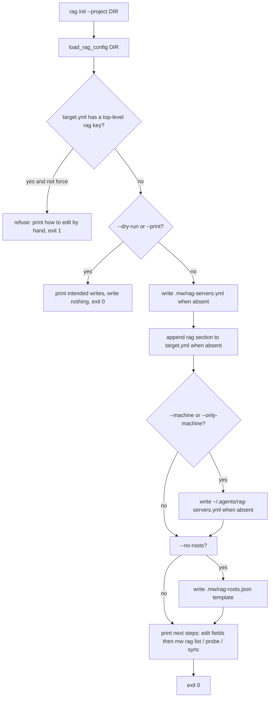

# Design: mw-rag-config-guide

- key: `mw-rag-config-guide`
- date: 2026-09-22
- 上游：`spec.md`（AC-201~AC-207）；上位实现 `mw-rag-integration`（本 key 不改其语义，只生成模板并文档化）

## 1. 决策表

| ID | 决策 | 理由 |
|---|---|---|
| D-201 | 模板文本的**唯一来源**是新模块 `packages/multi-workers/rag_templates.py`（常量 `SERVERS_TEMPLATE` / `TARGET_RAG_TEMPLATE` / `ROOTS_TEMPLATE` + `render_servers_template(server, url, token_env)`）；`mw.py` 只做参数处理与写盘，手册不手抄模板而是引用 `mw rag init --print` 的输出 | 一份文本一个来源；手册与 CLI 由 parity 测试钉住，避免 P-008（文档静默过期） |
| D-202 | `mw rag init --project <dir>` 默认写三处：`<dir>/.mw/rag-servers.yml`、`<dir>/.agenticdoc/target.yml` 的 `rag:` 段、`<dir>/.mw/rag-roots.json`（T-21C/D-210）；可选 `--machine`（**额外**写机器层 `~/.agents/rag-servers.yml`）、`--only-machine`（只写机器层）、`--no-roots`（跳过 roots 文件并把 `path_roots_file` 写成注释）。 | 默认只动项目内；不意外写用户 HOME；roots 模板默认可用（`engine: "."` = 项目根），`--no-roots` 时才不激活 |
| D-203 | 模板默认 `enabled: []`：**占位 url 不应让每个 worker 都去打不通的服务**；`--enable <name>` 可直接写成 `enabled: [name]`，供"我知道 url 就是它"的用户一步到位 | 安全默认 + 一步可用，二者用参数区分 |
| D-204 | 写入纪律：servers 文件**不存在才写**；`rag:` 段只在 `target.yml` **没有**该顶层键时**文本级追加**（保留注释与其他段）；`--force` 才覆盖（servers 文件整体重写；`rag:` 段替换 = 定位 `^rag:` 到下一个顶层键之间整段替换）。全部写入走 `utf-8` + `newline="\n"` + 临时文件 `os.replace` 原子替换 | `target.yml` 是多会话共享文件，YAML round-trip 会毁注释（违反既有 `_apply_bootstrap_line` 纪律）；半截写入比不写更糟 |
| D-205 | 退出码：`0` = 目标状态已达成（含"已存在 → 跳过并提示"以外的全部成功路径）；`1` = 拒绝/失败（已存在的文件或 `rag:` 段且未给 `--force`、写盘 OSError、参数组合非法如 `--machine --only-machine`）；`2` = argparse 用法错误（由 argparse 自身给出）。`--dry-run`/`--print` 不改任何文件且 exit `0` | 与 `mw rag` 其它子命令的 0/1/2 语义对齐（README 已有退出码表） |
| D-206 | 零交互：实现内不得出现 `input()`/`sys.stdin` 读取；所有缺省值来自 D-202/D-203 的示例常量（`example` / `http://localhost:8100/mcp/` / `EXAMPLE_MCP_TOKEN`） | 用户要求「没有输入的按示例写成模板」；在 `stdin=DEVNULL` 下也必须成功 |
| D-207 | 手册 `packages/multi-workers/docs/rag-config-guide.md` 章节骨架固定：① 3 分钟上手（init → 改字段 → 启用 → 验证）② 三个文件的角色与优先级 ③ **逐字段表**（服务表 11 字段 / `rag:` 段 5 键 / 每个 `roles`·`phases` 项 4 键 / `rag-roots.json`）④ 四类可直接复制的完整示例（mcp-only / cli-only / both / 双服务 + 角色阶段要求）⑤ 命令参考 + 退出码表 ⑥ 五层验证判据 ⑦ 失败 signature 表 ⑧ 已知坑 ⑨ FAQ（改完为什么不生效） | 用户要求"每个字段都有注释说明"+"可直接复制粘贴" |
| D-208 | 副作用边界：init 不写 `_workers.parallel` / `_index.parallel` / `goal.md` / `.pi/`，不注册工具、不探活、不碰 `mw serve` 状态；只写 D-202 列出的三类文件 | 配置生成必须无副作用，才能被反复安全调用 |

## 2. 写入路径与判定流

## 3. 跨语言/共享契约（不得改）

- 本 key **不新增也不修改**配置语义：字段集合由 `mw_common` 的校验器与 `rag/config.ts` 决定，手册只能描述它们。
- `target.yml` 的写入是**文本级**行为，不经过 `load_target_config` 的序列化；不得改变其它段的字节。
- `mw rag init` 不得写入 `rag` 的 fingerprint 或任何运行期状态。

## 4. VC 清单

| VC | 断言（可执行判据） | Layer | Source |
|---|---|---|---|
| VC-201 | 干净目录跑 `rag init --project DIR` 后：两个产物存在；`mw rag list --project DIR` exit 0 且 stdout 含 `enabled: (none)`；模板被 `load_rag_config` 真解析（非零 server 表） | L1 | AC-201 |
| VC-202 | 幂等/安全：重跑同一命令 exit 1 且两文件 sha256 与首次一致；`--force` 后 exit 0 且 sha256 改变 | L1 | AC-202 |
| VC-203 | `--dry-run` 与 `--print` 前后目录树快照（相对路径 + 内容 sha256 全表）字节相等；`--print` stdout 非空且不含写盘提示 | L1 | AC-202 |
| VC-204 | 零交互：`stdin=subprocess.DEVNULL` 且不设 `--project` 之外的输入时 exit 0；源码内 `input(`/`sys.stdin` 零命中 | L1 | AC-203 |
| VC-205 | 字段覆盖：模板文本包含校验器接受的**全部**字段名（`transport`/`adapter`/`path_roots_file`/`sources`/`capabilities.{graph,chat,rewrite}`/`mcp.{url,token_env,timeout_ms}`/`skill.{dir,cli_entry,timeout_ms}`）；模板里出现的每个 YAML 键都在手册的字段表中 | L1 | AC-204 |
| VC-206 | 手册 parity：手册中 machine-servers 的 fenced 块 == `rag init --print` 输出（换行归一后字节相等） | L1 | AC-206 |
| VC-207 | `--machine`（用临时 `MW_RAG_SERVERS_HOME`）写出机器层文件且其内容等于模板；再次运行 exit 1（已存在） | L1 | AC-203 |
| VC-208 | 默认写出 `.mw/rag-roots.json`（`_README` + `engine: "."`）且该 server 的 `path_roots_digest` 非空；端到端：真实文件 + `engine::` 引用的文档 → `mw rag audit` 的 `missing=0 unverified=0` 且 exit 0 | L1 | AC-203 |
| VC-209 | 文档诚实性：手册里「写错的后果」列出的报错文本与实现实际报错（`unknown rag server`、`unknown-key`、`transport must be one of`）一致 | L1 | AC-204 |
| VC-210 | 零回归：`python -m pytest -q` 无新增失败；`npm run check` exit 0；既有 fixtures/golden 与 `test_autopilot_l0.py` 零 diff | L1 | AC-207 |

## 5. Coverage Matrix

| Feature | 风险点 | VC |
|---|---|---|
| F-201 生成模板可用 | 写出的文件解析失败 / 默认把占位服务启用 | VC-201, VC-202 |
| F-202 命令安全 | 覆盖用户文件、毁 `target.yml` 注释、隐式等待输入 | VC-202, VC-203, VC-204, VC-207 |
| F-203 文档完整 | 字段漏写/多写、与 CLI 输出漂移 | VC-205, VC-206, VC-209 |
| F-204 零副作用/零回归 | init 影响别的段/别的键 | VC-203, VC-208, VC-210 |

## 6. 写面纪律

- 允许写：`packages/multi-workers/rag_templates.py`（新）、`mw.py`（新增 `_cmd_rag_init` + argparse）、
  `packages/multi-workers/docs/rag-config-guide.md`（新）、`packages/multi-workers/README.md`（指向手册）、
  两包 `CHANGELOG.md`、`packages/multi-workers/test_rag_init.py`（新）。
- 禁止写：`rag/*.ts`（coding-agent 扩展）、`mw_common.py` 的解析语义、既有 fixtures/golden、
  `test_autopilot_l0.py`、`_workers.parallel`/`_index.parallel`/`goal.md`、其它会话的未提交改动。
- 手册引用的 CLI 输出必须来自实跑（`--print`），不手抄。
