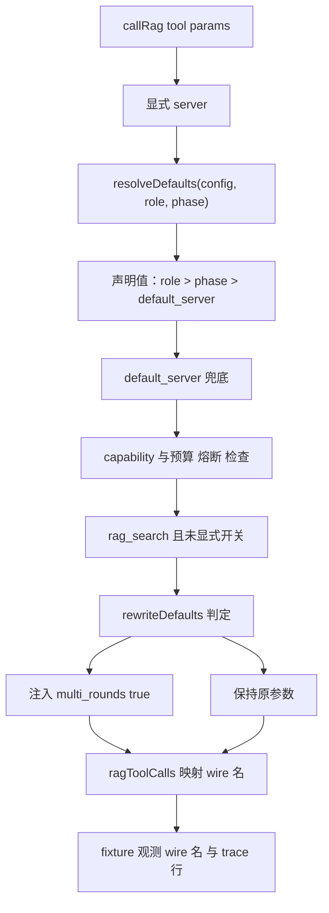

# Design: `mw-rag-integration-fix`

- 上位：`mw-rag-integration`（DONE）；本 key 只关闭复核缺口，不改对外契约
- 规格：`spec.md`（AC-101~AC-108）；调研：`evidence/research/spec-fix-scope-2026-09-22.md`
- 设计调研：`evidence/research/design-rag-fix-2026-09-22.md`

## 1. 决策

| ID | 决策 | 理由 / 替代方案 |
|---|---|---|
| D-101 | role/phase 默认的**唯一接线点在 `callRag`**（`rag/tools.ts:426`），`RagRuntime` 增只读 `role`/`phase` 字段，由 `registerRagTools` 的 opts 传入（PM 会话与未启用路径传空串） | 收口唯一、可测；不在每个工具定义里各写一遍。替代（在各工具 handler 内解析）会产生 7 份重复判定 |
| D-102 | 解析优先级 `显式参数 > 角色声明 > 阶段声明 > default_server`（上位 design 的权威口径），**取声明值**：`roles[r].server ?? phases[p].server ?? default_server`。直接复用 `rewriteDefaults(role, phase, capabilityRewrite, explicit)` 的返回值决定是否注入 `multi_rounds: true` | 只用既有函数，不新增第二套判定（避免 P-005 复发）；仅对 `rag_search` 生效，因 `RAG_TOOL_MAP` 里只有它一行 rewrite。**修订 @ 2026-09-22（T-19）**：不得用 `resolveForRole` 已回落到 `defaultServer` 的结果参与 `??` 链——否则「阶段声明了 server、角色只声明了 require」时会被 default 遮盖，与 Python `_rag_resolve_defaults` 的 `role_spec or phase_spec or default_server` 不一致 **显式 `server:` 的边界（已知且已文档化）**：`[mw] Rewrite:` 行按**默认 server 选择**解析；agent 显式传 `server:` 时运行时以被调用 server 的 `capabilities.rewrite` 重新判定，两者可能不同——这是「默认值声明」语义，Python 侧同理。 |
| D-103 | `role`/`phase` 为空串（或未注册）→ **完全不介入**：server 仍按 `params.server ?? default_server`，`args` 不做任何注入 | 保 D-014 零影响与既有单测；「未知即不猜」与 `phase:` 头「未知不写」同一口径 |
| D-104 | 注入块的 `[mw] Rewrite:` 行**照旧始终渲染**（去掉会破与 Python/golden 的字节 parity），但它的值必须来自与运行时**同一个**解析器；块与运行时不得各算一份 | 块与行为不一致本身就是复核找到的 D 类问题。**修订 @ 2026-09-22（T-19）**：原写「无 role/phase 时不写该行」未实现也不应实现——该行是既有字节契约的一部分（golden 347 B 里有它） |
| D-109 | 单源落地：TS 新增 `resolveDefaults(config, role, phase)`（`rag/config.ts`），`renderRagBlock` 与 `callRag` **共用**它；`resolveForRole`/`resolveForPhase` 删除（它们在生产中已无独立用途，留着就是 P-005 的复发点），其单测改写为 `resolveDefaults` 的用例。Python 侧 `_rag_resolve_defaults` 的 rewrite 兜底从「仅研究**角色**」改为「研究角色**或**研究阶段」（对齐 AC-006 的「角色/阶段」口径），使两侧同一输入产出同一三元组 | 每语言一个解析器、同一优先级表；跨语言用同 fixture 的对照用例钉住（VC-111） **T-19 落地注**：`rewriteDefaults` 与研究角色/阶段常量从 `adapter.ts` **迁入 `config.ts`**（`adapter.ts` 与 `config.ts` 互 import 会成循环）；唯一判定函数仍是它，语义未变。 |
| D-105 | Python 侧 `mw.py:1866` 的 role 回落改为 `.get(task_type, "coding")`，与 `shared/dispatch-models.ts:78` 对齐；`required` 的并集语义不动 | 跨语言契约必须单源；`mw_common.py:303` 已经是 `coding`，改后三处一致 |
| D-106 | **删除 `MW_RAG_ENABLED`**（`launcher.py:353` 注入 + `test_rag_launcher.py` 两处断言 + 不实注释），env 文档不登记 | 死变量（零读取方）；若将来真需要门控，应由 `target.yml` 派生而不是新增隐式 env。替代（加读取方）会引入第二套启用判定 |
| D-107 | VC-018 优先**补运行时用例**（真实 key 布局下 validator 取到 `rag/<server>-<slug>.md` 并判 ok）；若在预算内不可行，则降为 L1 并同步 `evidence-requirement.md` 与 design，**不得留 L2 声明** | 证据层级必须与实际证据同层；二选一都必须落定 **T-17/T-18 落地注**：T-17 选了优先路径（在 `rag-required.test.ts` 补真实 key 布局的运行时双用例），但 T-18 独立裁定其层级仍为 **L1**（假 pi + 合成 `agent_settled` 的进程内集成，不含真实时序）→ 本 key 的 `evidence-requirement.md` 写 L1，上位 key 的 L2 声明追加修订标记，L2 证据记入「遗留 R-1」；该用例已由反例 B（断掉 key 目录 → 有文档用例变红）证明可证伪。 |
| D-108 | README 以 argparse 为唯一真源重写「RAG 接入」用法段：四条命令带 `--project`、列 `--json`/`--key`/`--out`、给出退出码表（list/probe/sync=1、audit=0/1/2）；删掉 `--server`；`mw.py` 的 probe help 文案改为与行为一致（保留「配置错误返回 1」的行为） | 文档可直接执行优先；不为了迁就错误 help 文案而降低错误码可用性  |

## 2. 解析流程（运行时）

## 3. VC（验收断言）

| ID | 断言 | 层级 | Source |
|---|---|---|---|
| VC-101 | role=`design` 且未显式传 `multi_rounds`，server 具备 rewrite 能力 → fixture 观测到的 wire 名 = `rag_search_multi_rounds`；role=`coding` → `rag_search` | L2 fixture | AC-101 |
| VC-102 | role 声明 `server: B` 且未显式传 server → 请求发往 B 的 url；显式 `server: A` 压过 role | L2 fixture | AC-101 |
| VC-103 | `[VERIFY] VC-008` 行的 `rewrite_tool` 字段与 fixture 的 `calls[].name` 同源（反例：把 role 配置反转 → 行内值随之变化、测试变红） | L2 fixture | AC-102 |
| VC-104 | 不可达 server 激活后工具描述含 `[unreachable at session start]`；首次调用后 trace 增量含 `rag-unavailable` | L1 集成 | AC-103 |
| VC-105 | `type: foobar` 的 task.md：TS worker 得 role=`coding`（required 命中），Python audit 得同一 role 与同一 required 结论 | L1+L2 两侧 | AC-104 |
| VC-106 | 运行时用例（真实 key 布局下预置文档 → validator 判 ok）**或** `evidence-requirement.md` 中 VC-018 = L1 且 design 同步（二选一必须落定并可查） | L1 或 L2 | AC-105 |
| VC-107 | README 四条 `mw rag` 命令逐条真跑成功；README 不含 `--server`；`rg MW_RAG_ENABLED` 在生产代码零命中 | L1 | AC-106 |
| VC-108 | 未启用项目四断言仍成立；`render_task_md(phase="", role="", …)` 与旧调用逐字节相同；`rag-*` 与 `test_rag_*.py` 全绿；golden sha256 不变 | L1+L2 | AC-107 |
| VC-109 | 本 key 新增/修改的每条证据行至少一个字段来自被测数据（反例试验可使其变化/变红） | 口径 | AC-108 |
| VC-110 | 无 role/phase 的路径（PM 会话、未启用项目）行为与修复前一致：不注入 `multi_rounds`、不改 server 选择、不写新文件 | L2 | AC-101 |
| VC-111 | **跨语言默认解析一致**：同 fixture（`test/fixtures/rag/phase-only-target.yml`：`default_server: B` 且 B `capabilities.rewrite: false`；`phases.design.server: A`（A `rewrite: true`）+ `source`；`roles.coding` 只声明 `require`）下，两侧解析结果必须同为 `server=A, source=<phase.source>, rewrite=true`：TS 断言 `resolveDefaults`，Python 断言 `render_rag_block` 对应三行文本 | L1 两侧 | AC-101 |

## 4. Coverage Matrix

| 路径 | 异常分支 | VC |
|---|---|---|
| F-101 role/phase 解析与注入 | 未知 role/phase / 无 role/phase / 显式参数压过默认 / role 压过 phase / server 不存在 | VC-101, VC-102, VC-110 |
| F-102 证据行强度 | 直调纯函数（禁止）/ fixture 观测 | VC-103, VC-109 |
| F-103 未起服务降级 | 激活期 marker / 首次调用证据行 | VC-104 |
| F-104 跨语言 role 推导 | 已登记 type / 未登记 type / phase 缺失 | VC-105 |
| F-105 文档与契约 | 缺 `--project` / 幻影参数 / 死变量 / 退出码 | VC-107, VC-106 |
| F-106 跨语言默认解析一致性 | 阶段声明被 `default_server` 遮盖 / 阶段级研究 rewrite 兜底 / 空 role+phase | VC-111, VC-110 |

## 5. 写面纪律（多会话并行）

- 只改：`rag/tools.ts`、`rag/adapter.ts`（若需）、`rag/config.ts`（若需）、`worker/worker-mode.ts`、
  `pm/pm-orchestrator.ts`、`shared/dispatch-models.ts`、`mw.py`、`launcher.py`、`README.md`、
  `docs/environment-variables.md`、两包 `CHANGELOG.md`、以及本 key 新增/相关的测试文件。
- 不碰：`index.ts`、`implementation-gate.ts`、其他会话的未提交改动；不改 `test_autopilot_l0.py` 与文本层守护；不 commit。
- `dist/extensions/agent-team-loop.js` 是跟踪文件：所有 TS 改动落定后必须重建一次（`packages/multi-workers/build-extension.sh`）。
