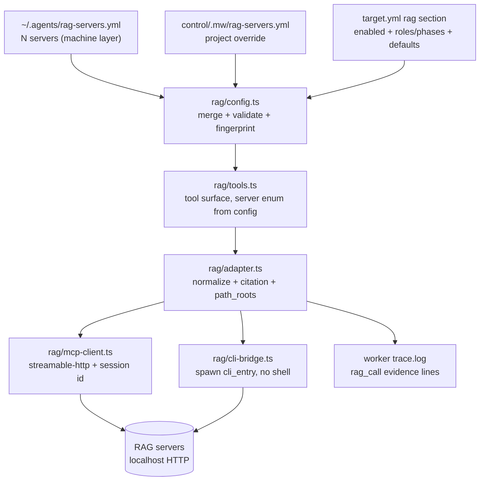
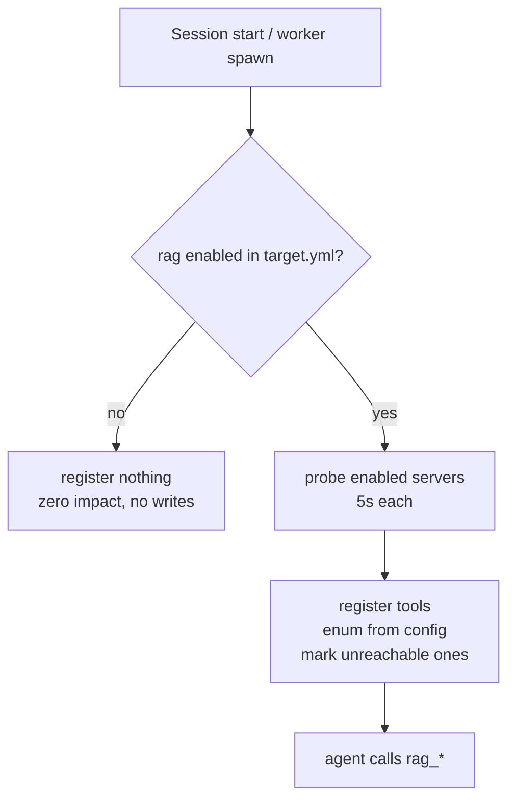
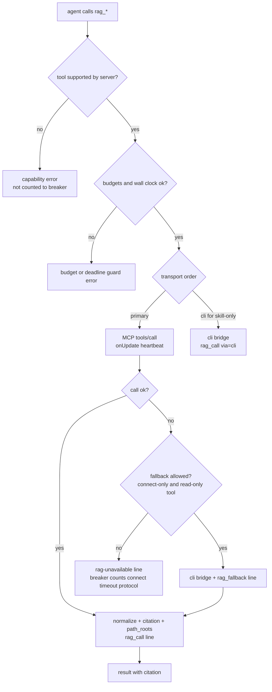

# Design: mw-rag-integration（可配置 RAG(MCP) 接入 AgenticTask 工作流）

## §0 设计前提锚定

- spec_path: `.agenticdoc/mw-rag-integration/spec.md`
- spec_locked_at: 2026-09-22T12:10:00+08:00（AC-001~AC-016 锁定，编号永不回收）
- ac_count: 17（AC-017 于 2026-09-22 评审后追加，编号顺延）
- ac_ids: AC-001 … AC-017
- 交付分期: K1 = AC-001~AC-010 + AC-017（配置层 + 工具面 + 证据 + skill 同步）；K2 = AC-011~AC-016（rag-research 类型 + 调研文档 + audit）
- **修订记录（2026-09-22，第 1 轮评审后）**：
  - `ref-verify`（REFS-BROKEN）：21 组引用中 16 组一致、5 组需修正——`setActiveTools` 并非"只执行一次"（在 `before_agent_start` handler 内，每次 agent run 都会执行，故工具面更新必须幂等）、`_build_env` 是"5 个早返回 + 末尾通用代理返回"、`task-dispatcher.ts` 只是**内容注入**的唯一锚点（task.md 初始创建另有 `ui-bridge.ts` 两处）、若干行号漂移已按实据修正。
  - `design-critique`（NEEDS-REVISION）：采纳 C-1/C-3/C-4/C-5/C-6/C-7、W-1~W-10、S-1；**不采纳 C-2**（PyYAML 是本仓既有隐式依赖，见下 D-003 注）。
  - 本文件为修订后版本；所有 VC 已按评审意见重写或补强。

## §1 架构选型

### D-001 MCP client 的实现位置
- 选择：扩展内实现（TS，`rag/mcp-client.ts`），PM 与 Worker 两模式共用同一模块；Python 侧**不实现** client，只做配置解析/校验/env 注入/审计
- 否决：Python 侧代理（多一跳 + 把 RAG 可用性绑到 serve 常驻；且要建第二套归一化）；纯 skill 脚本桥（review/verifier 白名单无 bash，支柱 C 直接不可达）
- 调研：`evidence/research/design-rag-integration-2026-09-22.md`（发现 1/5/6）

### D-002 工具注册门控与 worker 白名单注入
- 选择：activate 时按项目配置决定是否注册；未启用 → 注册数 0（结构性零影响）。Worker 侧挂在既有 `before_agent_start` handler（`worker-mode.ts:516-518`，其中 `:517` 调用 `pi.setActiveTools(toolsForType(meta.type))`）内，按"该类型的 RAG 子集 ∩ 项目启用集"**幂等**追加工具名——该 handler 每次 agent run（含 phase/follow-up turn）都会执行，因此实现必须是"每次都算出完整期望集合再 set"，不能假设只跑一次
- 否决：在 `TOOL_ALLOWLISTS` 里静态写死 `rag_*`（未启用项目也会露出工具名，破坏零影响）；按任务动态生成白名单（parity 锁失效，无法机械校验）
- 调研：同上（发现 1）；`evidence/research/design-rag-integration-2026-09-22.md` 修订记录

### D-003 配置载体与合并规则
- 选择：机器级 `~/.agents/rag-servers.yml` + 项目级 `<control>/.mw/rag-servers.yml`；`target.yml` 的 `rag:` 段只做"选用 + 必需声明 + 默认值 + 预算"
- **合并规则（逐字段，不是整块覆盖）**：按 server 名对齐；对每个 server 的**标量字段与嵌套对象逐键合并**（项目级给值即覆盖，未给则继承机器级）；`mcp`/`skill`/`capabilities` 为嵌套对象，同样逐键合并；数组字段（`sources`）**整体替换**（项目级给 `[]` 表示显式清空，不是继承）；`null` 表示"显式删除该字段"（用于关掉机器级给的 `skill` 块）；`origin` 逐字段记录（`machine|project`），`mw rag list --json` 逐字段暴露；合并矩阵由 VC-024 锁定
- **Python 侧解析**：复用 `mw_common` 既有的 PyYAML 隐式依赖（`mw_common.py:53` 已有 `import yaml` 注释 "PyYAML: implicit dep…"，由 mw-dual-workspace 引入用于 target.yml，`mw.py:2787` bootstrap 已检查）——**不新增任何依赖**；spec §2.1 的 "stdlib only / 无新 pip 依赖" 指不引入新包，PyYAML 属既有面
- 否决：单层（跨项目复制）；放 `~/.pi/agent/`（pi 私有目录且紧邻受保护集合）
- 调研：同上（发现 5）；`mw_common.dispatch_config_path` 的 `.mw/` 项目级先例

### D-004 归一化信封、能力表与引用语法
- 选择：适配器族 `adapter: overcode-v1`（v1 唯一实现）。`normalize(server, tool, raw)` → 统一信封 `{server, tool, source, snapshot: true, items[], meta}`；`item` 固定含 `citation` 与本地核对三件套（`local_path`/`exists`/`line_hint`）。能力表 `capabilities: {graph, chat, rewrite}` = 配置声明 + activate 探活校正；无能力调用返回**结构化错误** `{kind: "capability", server, tool, message}`（message 含 `no knowledge graph` 之类可读说明，判定以 `kind` 为准）
- **引用语法（消除 `::` 歧义）**：`citation = server ":" source ":" file_path ":" line`
  - 解析：从左取 2 段得 `server`/`source`（两者均不得含 `:`）；从右取最后一段为 `line`（必须匹配 `^\d+$`）；**中间全部剩余部分（含 `::`、Windows 反斜杠、空格、Unicode）作为 `file_path`**
  - 生成：由适配器直接产出该字符串，模型不得自行拼接；`file_path` 保留 RAG 侧原形（`engine::Runtime/Renderer/X.cpp`），本机路径另存 `local_path`（不混进 citation）
  - 契约 fixture 覆盖：`::` 形态、无 role 前缀形态、含空格、含反斜杠、Unicode（VC-006/VC-018）
- 否决：服务端结构直接透传（结构漂移会直接进上下文与证据）；逐工具硬编码解析（无扩展位，第二个 server 就要改代码）
- 调研：`.../references/tools-reference.md` 的返回结构与"局限性"逐条

- **工具名映射（`overcode-v1` 适配器职责，AC-018 / VC-028）**：逻辑工具名与参考服务真实工具名不完全同名——`rag_graph` → `graph_query`；`rag_sources` → `list_sources` + `list_collections`（两次调用合并为一个信封）；`rag_search` 在重写开关为 true 时 → `rag_search_multi_rounds`（业务参数保留、开关不下发）；其余同名。映射以**数据表**形式声明在适配器内（`ragToolCalls` / `mergeToolResponses`），不在 `tools.ts` 逐工具硬编码，也不引入配置 schema 改动（第二个服务族走新 adapter）。证据行 `tool` 记**逻辑名**、`mcp_tool` 记实际发出名。
### D-005 传输选择、兜底策略、熔断与错误分类
- 选择：`transport: both` 时 mcp 主、cli 兜底；`skill` 直接走 cli（**主路径，不是兜底**）
- **兜底策略（防重复副作用）**：自动兜底仅当同时满足 (a) 失败可证"请求未送达"（连接建立失败，`kind=connect`）且 (b) 工具是只读检索类。以下一律**不自动兜底**：`rag_feedback`（唯一写操作）、`rag_chat`（昂贵且非幂等）、以及 `kind=timeout`（请求可能已送达）；这些错误直接上抛并留证
- **熔断计数口径**：只计 `connect` / `timeout` / `protocol` 三类；`capability`、`budget`、`tool`（服务端已给出应答）不计入。连续 3 次计数类失败 → 熔断（`kind=circuit`），之后同一 `(worker, server)` 不再发起请求
- 统一 `RagTransportError{kind: connect|protocol|tool|capability|budget|timeout|circuit}`
- 否决：只实现 mcp（skill-only 服务落空）；只实现 cli（review 档不可达）；静默兜底（证据断链）；无差别兜底（重复落盘/重复计费）
- 调研：`setup/mcp-config.json` 协议要点；`SKILL.md` §八 错误恢复、§九 反馈闭环

### D-006 长调用心跳、超时与预算
- 选择：
  - **心跳**：所有可能长耗时的调用（不只 `rag_chat`）每 30s 调一次 `onUpdate`（host 转 `tool_execution_update` → watchdog `touch()`）
  - **单次上限**：`AbortSignal` 600s（`rag_chat`）；检索类 180s
  - **次数预算**：`rag_chat_budget`（task.md `rag_chat_budget:`，缺省 2）。计数写 `<worker task dir>/rag-budget.json`，且**调用前同步预留**（先递增再 await，避免并发调用同时读到同一余量）；失败是否返还由调用类型决定（`connect` 失败返还，`timeout` 不返还——请求可能已送出）
  - **任务级累计时间预算**：task.md `rag_time_budget_s`（缺省 900s）。累计超限 → 拒绝新的 RAG 调用（`kind=budget`）
  - **剩余墙钟守卫**：任务已用时间 > 墙钟预算 70% → 拒绝 `rag_chat`（昂贵），便宜检索仍允许；与收敛检查点/deadline steer 的语义一致（checkpoint 提醒自评，本守卫直接拒绝新昂贵调用）
- 否决：调大全局 idle 阈值（副作用外溢，违反 GC-6 本意）；把 chat 拆成多个短调用（服务端无该接口）；只给次数不给累计时间（3×600s + 检索 + 模型回合会撞 60m 墙钟）
- 调研：`worker-mode.ts:556/576`、`agent-loop.ts:683-689`；`SKILL.md` §二 延迟预算

### D-007 路径解析实现位置与契约
- 选择：TS 内联（`adapter.ts` 内实现），**契约与 rag-mcp `resolve_path.py` 对齐**（实读其源码确认）：
  - 映射文件为 JSON：`{ "<role>": "<本机绝对根>", … }`，键以 `_` 开头者忽略（`_README`）；解码用 `utf-8-sig`（容忍 BOM）
  - `file_path` 语法：`role::relative/path` 或裸 `relative/path`（裸形态 role 默认 `engine`）
  - 归一化：`rel` 去空白、`\` → `/`、去开头 `/`；结果 = `resolve(Path(root) / rel)`
  - 未知 role → 错误并列出可用 role 集合（不静默回落）；`local_path` 必须为规范化绝对路径
  - 越界检查：`rel` 不得逃出 root（`..` 归一化后必须仍在 root 下），越界 → `local_path=null` + 明确原因
  - 未配置映射 → `local_path=null`、`exists=false`、`meta.hint` 含 `path_roots`；映射存在但文件缺失 → `exists=false` 且 citation 仍可解析（两种情况必须可区分）
  - 恒置 `snapshot_warning: true`；`line_hint` 保留索引行号（原始值，不做本地校正）
- 否决：每次调用 spawn `resolve_path.py`（多进程开销 + 把 python 依赖引入每次检索）；不解析只回索引路径（"可核对引用"无法成立）
- 调研：同上（发现 6）；`SKILL.md` §四；`E:\...\rag-mcp\scripts\resolve_path.py`（`load_roots`/`resolve`/`DEFAULT_ROLE` 实读）

### D-008 证据行与 audit 判定（只读）
- 选择：调用即在 trace 追加机器可解析行；`mw rag audit` **只读**，判定结果写 stdout（`--out` 需显式指定才落盘）
- **扫描边界**：只扫 `<key>/rag/*.md` 与**终态** worker 目录的 `output.md` / `trace.log`；不扫 `spec.md`/`design.md`（其中的示例引用不算真实引用）。非终态（pending/running）worker 不参与判定，避免读到写一半的文档
- **归属与引用计数**：输出每条引用带 `task_key / worker / role / phase` 归属；`parseResults` 与生成侧共用同一引用语法（D-004）
- 输出：`{calls, citations, missing[], unverified[], required_missing[]}`，退出码 0 全可达 / 1 有 missing / 2 参数或配置错误
- 否决：audit 写回产出物（破坏只读原则）；纯 grep 判定（判不了存在性，会把幻觉引用判成通过）；全目录扫描（示例引用污染判定）
- 调研：同上（发现 8）

### D-009 task.md 注入块与撕裂检查
- 选择：`<!-- mw-rag: v1 -->` 独立 marker 块，含可用服务、必需角色/阶段、默认 server/source、rewrite 默认、chat 预算与累计时间预算、引用语法、`fingerprint=<sha256>`
- **注入锚点**：TS 侧挂在 `dispatchTask()` → `injectWorkspaceProfile()`（`task-dispatcher.ts:208-249`，是 task.md **内容注入/替换**的唯一锚点；task.md 的**初始创建**另有 `ui-bridge.ts:1073/1398` 两处，两条派发路径都经 `dispatchTask`，故实现挂此即可覆盖，但不得假设仓内只有一个 task.md writer）；Python 侧挂在 `autopilot/dispatch.py:105 render_task_md`（生产侧唯一生成器，`:307` 调用、`:329` 写入）
- **指纹范围（评审 W-3 采纳）**：只哈希"该任务实际会用到的静态配置"——启用集内 server 的名称、`transport`、`mcp.url`、`token_env` **名**、`skill.dir`/`cli_entry`、`path_roots_file` 路径 **及其内容摘要**、角色/阶段默认解析结果、预算值。**排除**探活/健康状态、`Mcp-Session-Id`、能力校正结果、未启用 server 的任何字段。语义：URL/映射内容变化 = 撕裂（拒 spawn）；同一 URL 下服务重启 = 不撕裂
- launcher spawn 前重算比对（照 `launcher.py:647-671 _check_config_tear` 形状）：不一致 → `config torn (rag)` 拒 spawn + `[LAUNCHER]` trace
- 否决：无指纹（配置切换后静默换知识库）；只 TS 注入（conductor 派发路径漏注入）；哈希整份配置（未启用 server 改动会误拒）
- 调研：同上（发现 3/4）；`launcher.py:577/647/826`

### D-010 Python 侧 CLI / doctor / env 注入点
- 选择：`mw rag list|probe|audit|sync` 四动词（argparse 照 `mw.py:3407+` 既有形状）+ `mw doctor` 的 `rag` 段；env 注入实现为 `_build_env` 调用之后的 post-step `inject_rag_env(env, entry, project_dir)`——`_build_env` 实为 **5 个早返回分支**（timi/zai-coding-cn/openai-codex/anthropic|deepseek/纯 codex）+ 末尾通用代理返回，共 6 个返回路径，post-step 统一覆盖，不改任何分支
- 剥离面：`_stripped_env`（`launcher.py:96-103`，生产代码唯一的 `env.pop` 点）增加"剥离全部配置声明的 RAG token env 名"，再由 post-step 只注入本项目启用服务所需的那几个
- 否决：在 6 个返回路径各自注入（重复）；把 RAG 端点塞进 providers.json（语义不同：那是 LLM 路由表）
- 调研：同上（发现 5）；ref-verify 第 13/19 项

### D-011 `rag-research` 类型接入：保持双侧 parity，用能力标记挡 conductor
- 选择（评审 C-1 采纳，替换初版的"改 parity 允许列表"）：**在 Python `REGISTRY` 增加 `rag-research` 条目**（工具集与 TS 侧逐项等序），`DispatchType` 增加字段 `conductor_dispatchable: bool`（本条目为 `False`），conductor 侧派发函数（`autopilot/dispatch.py:265` 附近的注册校验）对 `False` 类型直接拒绝；TS 侧 `TOOL_ALLOWLISTS`/`DISPATCH_ROLE_BY_TYPE`（`rag-research → research`）/`DISPATCHABLE_TYPES` 同步追加，Python `mw_common.TASK_TYPE_TO_ROLE` 追加 `rag-research → research`
- 理由：AC-011 要求"TS 白名单与 Python `REGISTRY` parity 测试通过且两者条目顺序一致"——初版方案改 `test_autopilot_l0.py:246-250` 的允许列表属于"改测试让门禁通过"，即使是本仓已预留的 legacy 桶位也不应作为扩展机制；用能力标记既保住 parity 不变式（测试**零修改**），又保住"conductor 不派发该类型"的范围边界
- 否决：只放 TS 桶 + 改 parity 允许列表（动门禁）；同时把 REGISTRY 条目设为可派发（超出本 key 范围）
- 调研：ref-verify 第 17 项断言原文（`expected_ts_keys = set(py_reg) | {"coding","review","research","fallback"}`，任意额外 TS key 即 fail）；`autopilot/dispatch.py:64/94/98/265`

### D-012 方法论载体（skill 与工具指导的分工）
- 选择：单一事实来源 = 框架仓 `packages/multi-workers/skills/mw-rag/SKILL.md`（调用纪律 + 引用格式 + 反模式）；`mw rag sync`（**显式人工命令**）在项目启用 RAG 时安装到 `<control>/.pi/skills/mw-rag.md`（内容为源文件字节副本），未启用时移除该文件并清理；扩展侧不复制方法论，工具 `promptGuidelines` 只留 3 行调用纪律
- 分期归属：**K1**（验收 AC-017）
- 否决：把方法论写进工具描述（随每个 server 重复且与 skill 双份漂移）；只在 skill 里写（PM 未安装 skill 时工具无人指导）
- 调研：`.pi/skills/add-llm-provider.md` 的项目级 skill 布局先例；`SKILL.md` §七 反模式

### D-013 机器级配置目录的跨平台解析
- 选择：解析顺序 `MW_RAG_SERVERS_HOME`（目录覆盖，测试与非常规部署）→ `$HOME` → `%USERPROFILE%`；目标文件 `<home>/.agents/rag-servers.yml`。目录不存在 = 该层视为空（**不自动创建**，因为创建本身即一次写影响，违反 D-014）；`MW_RAG_SERVERS_FILE`（整文件覆盖，测试用）优先级最高
- 否决：硬编码 `~` 展开（Node 与 Python 展开规则不同，Windows 上有歧义）；自动创建目录/文件
- 调研：`E:\...\rag-mcp` 的 `~/.agents/skills/` 安装约定；`mw_common` 的 env 覆盖先例（`MW_TARGET_*`）

### D-014 零影响面（会话运行期不写任何文件）
- 选择：pi 会话的 activate/工具调用**不创建、不删除、不修改**任何项目或机器级文件——不写 skill（只由显式 `mw rag sync` 写）、不创建 budget 文件（首次调用 RAG 时才创建）、不写配置、不做探活之外的网络请求（探活只对启用集且 5s 超时）；`rag_call` 等证据行是 worker 任务自身的 trace，属既有机制而非新增文件面
- 否决：activate 时"顺手"安装 skill 或预热 budget 文件（让"零影响"依赖运行时判断而非结构保证）
- 调研：AC-001/AC-017 的措辞；评审 W-1

## §2 核心结构



配置解析结果（TS 与 Python 双侧同构，parity 锁定）：

```
RagConfig
  ├─ enabled: string[]                项目启用集（空 = 全关）
  ├─ defaultServer: string | null
  ├─ servers: Record<string, RagServer>   逐字段合并后的服务表
  │    ├─ transport: mcp | skill | both
  │    ├─ mcp: { url, tokenEnv, timeoutMs } | null
  │    ├─ skill: { dir, cliEntry, timeoutMs } | null
  │    ├─ adapter: "overcode-v1"
  │    ├─ pathRootsFile: string | null
  │    ├─ sources: string[]           整体替换（[] = 清空）
  │    ├─ capabilities: { graph, chat, rewrite }
  │    └─ origin: Record<field, "machine" | "project">
  ├─ roles: Record<role, { server, source, require, rewrite, chatBudget, timeBudgetS }>
  ├─ phases: Record<phase, { server?, source?, require, rewrite }>
  └─ fingerprint: string              静态配置摘要（D-009 范围，不含探活/session）
```

默认值解析优先级：角色声明 > 阶段声明 > `defaultServer` > 报错（显式传未知 server 一律报错，不回落）。
必需判定与默认值解析**分离**：`required = role.require OR phase.require`（并集，无例外）。

**配置文件形态与跨语言契约（T-06 落地后锁定，T-12 做 parity 锁定）**：

- 两层文件形态均为 `{servers: {<name>: {...}}}`，**只有 `servers` 是合法顶层键**（否则 `unknown-key`）；`target.yml` 的 `rag:` 段接受 `enabled` / `default_server` / `roles` / `phases` / `budgets`。
- 配置文件字段为 **snake_case**（`token_env`/`timeout_ms`/`cli_entry`/`path_roots_file`/`default_server`/`chat_budget`/`time_budget_s`）；`mw_common.RAG_FIELD_CAMEL` 为权威映射表，TS 侧必须接受 snake_case 输入并在对外结构用 camelCase（两侧各断言一次该映射）。
- `origin` 的键是 **snake_case 求值字段路径**（`mcp.url`、`mcp.token_env`、`capabilities.graph`、`sources`、`skill` …）；TS 对外暴露时经 `RAG_FIELD_CAMEL` 映射。
- `MW_RAG_SERVERS_FILE` 是**硬覆盖**：设定但文件缺失 → 机器层为空，**不回落到 HOME**（测试隔离）；`MW_RAG_SERVERS_HOME` → `HOME` → `USERPROFILE` 依次尝试，取首个存在的 `<home>/.agents/rag-servers.yml`；任何情况都**不创建**目录/文件。
- 指纹：canonical JSON（`sort_keys`、`separators=(",",":")`、`ensure_ascii=False`、整值浮点归一为 int；重算时忽略配置中的 `fingerprint` 键）；`roles`/`phases` **整块参与**指纹（不按启用集过滤），只有 server 条目按启用集过滤；`path_roots_digest` 在 load 时计算（相对路径按 project root 解析，缺失 → `null`）。
- rag 块的**字节契约**：`packages/multi-workers/test/fixtures/rag-block.golden.md`（347 B，**无尾换行**；由 Python 侧生成）。TS 侧渲染器（`rag/block.ts`）必须逐字节相等；注入侧追加语义为 `content.rstrip() + "\n\n" + block + "\n"`。
- **task.md `phase:` 头（阶段轴，AC-015 / VC-020 的前提）**：worker task.md 可带 `phase: <SPEC|DESIGN|PLAN|TASKS|EXECUTE|VERIFY|DONE>` 头（与 `type:` 同级的首行块）。**两侧派发器在知悉所属 key 当前阶段时必须写它**（TS `/worker` 路径 `pm/ui-bridge.ts`；Python conductor `render_task_md`）；未知阶段（`_scratch`、无 key）**不写该行**（既有 task.md 逐字节不变）。消费方：worker（`parseTaskMd` → `TaskMeta.phase`，用于 VC-014 的 `rag-required-missing` 行）与 `mw rag audit`（T-10 的 `phase:` 解析）。语义：`required = role.require OR phase.require`，`phase` 取**派发时**的 key 阶段（不是审计时的当前阶段）。
- 共享输入 fixture：`packages/multi-workers/test/fixtures/rag/{machine-servers.yml,project-servers.yml,target.yml,rag-roots.json}` —— TS 侧经相对路径读取（先例：`test/extensions/agent-team-loop-profile-injection.test.ts:550`）。

## §3 模块划分

```
packages/coding-agent/src/extensions/agent-team-loop/
├── rag/
│   ├── config.ts        [新增] 两层加载 + 逐字段合并 + 校验 + 默认解析 + 必需并集 + fingerprint
│   ├── tools.ts         [新增] 七个工具定义、注册门控、server enum 生成、promptGuidelines
│   ├── adapter.ts       [新增] overcode-v1 归一化 + citation 语法 + path_roots 契约 + 能力校验
│   ├── mcp-client.ts    [新增] JSON-RPC 2.0 over HTTP POST：initialize/session/tools.call/timeout/abort
│   ├── cli-bridge.ts    [新增] skill 形态：spawn cli_entry（参数数组）、解析 stdout JSON、退出码 0/2/3
│   ├── evidence.ts      [新增] trace 证据行 + rag-budget.json（预留计数、先算后写）
│   ├── budget.ts        [新增] 次数/累计时间预算与剩余墙钟守卫（预留 → 执行 → 结算）
│   └── guidelines.ts    [新增] 3 行调用纪律常量（promptGuidelines 单一来源）
├── worker/worker-mode.ts [微改] before_agent_start handler 内幂等追加 RAG 子集；parseTaskMd 读 rag_chat_budget / rag_time_budget_s
├── pm/task-dispatcher.ts [微改] 同一锚点追加 `mw-rag: v1` 块（含 fingerprint）
├── pm/ui-bridge.ts       [微改] dispatch_worker 前置 RAG 配置校验（unknown server → 拒绝派发）
└── shared/dispatch-models.ts [微改] rag-research 的 role 映射 + DISPATCHABLE_TYPES

packages/multi-workers/
├── mw_common.py         [扩展] load_rag_config()（两层逐字段合并）+ render_rag_block() + rag_token_env_names() + 跨平台路径解析 + TASK_TYPE_TO_ROLE 追加
├── launcher.py          [扩展] _stripped_env 剥离 RAG token；inject_rag_env post-step；check_rag_tear（指纹）
├── autopilot/dispatch.py [微改] render_task_md 追加同一 rag 块；REGISTRY 增 rag-research（conductor_dispatchable=False）+ 派发门
├── mw.py                [扩展] `mw rag list|probe|audit|sync` + doctor rag 段
└── skills/mw-rag/SKILL.md [新增] 方法论单一来源（`mw rag sync` 安装，属 K1）

tests: packages/multi-workers/test_rag_*.py（合并矩阵/校验/audit/注入/env/指纹/parity）
       packages/coding-agent/test/suite/rag-*.test.ts + test/suite/rag-fixture.ts（注册门控、envelope+citation、心跳、预算与并发、fixture MCP server）
```

依赖方向：`config`（纯解析，无 IO 副作用）→ `tools`/`adapter`/`evidence`/`budget`；`adapter` → `mcp-client`/`cli-bridge`；`worker-mode`/`task-dispatcher` → `config`。无循环依赖。

## §4 接口与集成

### 4.1 对外接口清单

七个工具（`server` 可选；enum 由项目配置生成，**所有带 `server` 的工具**都必须有该 enum）：

| 工具 | 参数 | 返回（归一化后） |
|------|------|----------------|
| `rag_search` | `query`(必填), `server?`, `source?`, `collection?`, `top_k?`, `multi_rounds?: bool`, `auto_rewrite?: bool` | 信封，`items[]` 见下 |
| `rag_symbol` | `symbol_name`(必填), `server?`, `source?` | 信封（`items` 为符号命中，含 `callers`/`callees` 摘要） |
| `rag_graph` | `operation: callers|callees|inheritance|subgraph`(必填), `symbol_name`(必填), `server?`, `source?`, `depth?`(1..10), `limit?` | 信封（`items` 为边，`meta.static_analysis: true`） |
| `rag_impact` | `symbol`(必填), `server?`, `source?`, `depth?`(1..10) | 信封 + `meta: {total_callers, affected_files, callers_by_hop}`；`results` 计数 = `affected_files` 条数 |
| `rag_sources` | `server?` | `{items: [{name, collections[], has_graph}]}` |
| `rag_feedback` | `title`(必填), `tool`(必填), `expected`(必填), `actual`(必填), `scenario?`, `detail?`, `server?` | `{status: ok|duplicate, file}`（**不自动兜底**） |
| `rag_chat`（仅 `rag-research`） | `query`(必填), `server?`, `source?`, `top_k?`, `max_recall_rounds?` | 信封 + `meta.answer`（LLM 综合，标 `lead_only: true`，**不自动兜底**） |

`item` 固定字段：`symbol_name, qualified_name, symbol_type, file_path, line_start, line_end, snippet, score, citation, local_path, exists, line_hint, snapshot_warning`。
结构化错误固定字段：`{kind, server, tool, message, detail?}`，`kind ∈ connect|protocol|tool|capability|budget|timeout|circuit`。

CLI：

```
python mw.py rag list   --project <dir> [--json]      # 逐字段合并结果 + 来源标注 + 启用集
python mw.py rag probe  --project <dir> [--json]      # 逐个探活（5s/个，仅启用集）+ 能力校正
python mw.py rag audit  --project <dir> [--key K] [--json] [--out F]   # 引用核对（默认只写 stdout）
python mw.py rag sync   --project <dir>               # 显式安装/移除 .pi/skills/mw-rag.md（AC-017）
```

Python 内部 API：`load_rag_config(project_dir) -> dict`、`rag_token_env_names(config) -> set[str]`、`render_rag_block(config, task_meta) -> str`、`rag_fingerprint(config, enabled_servers) -> str`、`inject_rag_env(env, entry, project_dir)`、`check_rag_tear(entry, config)`。

### 4.2 外部依赖集成

- **MCP 传输**：`POST {url}`，JSON-RPC 2.0；`initialize` 带 `protocolVersion: "2025-03-26"`，从**响应头**取 `Mcp-Session-Id`，后续每请求携带（缺失则服务端 400）；不使用 SSE；鉴权 header `X-MCP-Token`（值取自 `tokenEnv` 指向的环境变量）。工具调用 = `tools/call {name, arguments}`；`rag_sources` = `list_sources` + `list_collections` 合并
- **skill 形态（cli_entry）**：契约 `<python> <cli_entry> <tool> --arg k=v ...`，stdout 单段 JSON，退出码 0 成功 / 2 连接或用法 / 3 工具级错误；扩展用参数数组 spawn（不经 shell，规避 P-004 类词法问题）；解释器用 `shared/mw-runner.ts::PYTHON_EXE` 约定（Windows `python` / 其它 `python3`）并支持 `MW_RAG_PYTHON` 显式覆盖（**不用 `process.execPath`**，那是 Node/Bun）；URL/token 经 env 传递
- **引用语法**：见 D-004（生成与解析共用同一实现，fixture 锁定边界形态）
- **fixture 服务**：`packages/coding-agent/test/suite/rag-fixture.ts`，脚本化返回结构、注入降级标记、记录请求参数/计数、模拟慢响应与"已送达但响应丢失"（用于兜底策略与超时口径断言）；AC-004~AC-017 全部据此断言，不依赖真机 RAG
- **rag-mcp 参考实现**：`E:\CLI_workspace\OverCode\depot\rag-mcp`（本机）；框架不依赖其路径，仅作为 adapter 与 `path_roots` 契约的对照来源

## §5 Function Flow

### 5.1 激活与注册



### 5.2 调用、预算与降级



## §6 Coverage Matrix

| ID | 功能点 | 正常路径 | 边界测试 | 异常路径 | 验证层级 |
|----|--------|---------|---------|---------|---------|
| F1 | 启用门控与工具注册 | 启用 → 普通会话六个工具 | enabled 为空 / 缺段 / skill-only 服务 | 未知 server 名 | L1 |
| F2 | 两层配置逐字段合并与校验 | 项目级覆盖单字段 | 只机器级 / 只项目级 / 数组显式清空 / null 删除 | 坏 YAML / 未知 server / skill 无 cli_entry | L0+L1 |
| F3 | 工具调用主路径 | 检索 → 归一化结果 | top_k / depth 边界 | 能力不支持 / 熔断 / 预算拒绝 | L1 |
| F4 | 引用归一化与语法 | path_roots 命中 → exists=true | 含 `::` / 空格 / 反斜杠 / Unicode / 越界 `..` | 未配映射、文件缺失、未知 role | L1 |
| F5 | 降级与熔断 | mcp 正常 / skill-only 走 cli | connect 失败 → 只读工具兜底 | 写操作与超时不兜底；3 连败熔断 | L1 |
| F6 | 长调用、预算与墙钟 | 180s chat 存活 + 心跳 | 次数预算用尽 / 累计时间超限 / 墙钟 70% | 并发争抢最后一个额度 | L1+L2 |
| F7 | 调研文档与 audit | 六小节齐全 + 引用全可达 | 仅 phase.require | 引用指向不存在文件 / 非终态文档 | L1+L2 |
| F8 | task.md 注入与撕裂 | 双侧块一致（golden） | 未启用 → 无块 | 指纹不一致 → 拒 spawn | L0+L2 |
| F9 | skill 同步（K1） | 启用项目 sync → 字节一致 | 未启用项目 sync → 移除 | 会话 activate 不动该文件 | L1 |

## §7 Verification Contract

```
VC-001: 在 target.yml 无 rag 段（或 enabled=[]）的项目下，会话注册的 ^rag_ 工具数必须等于 0，新派发 task.md 中 mw-rag 块数必须等于 0，fixture 服务的连接与请求计数增量必须等于 0，且会话前后 .pi/skills/mw-rag.md 与 workers/<task>/rag-budget.json 的存在性必须不变
       Layer: L1
       Output: [VERIFY] VC-001: rag_tools=0 task_md_block=0 probe_requests=0 skill_file_unchanged=true budget_file_absent=true
       Source: AC-001

VC-002: 机器级与项目级同时定义同名 server S 时，mw rag list --json 中 S.url 必须等于项目级值且 S.origin.url 必须等于 "project"
       Layer: L1
       Output: [VERIFY] VC-002: server=S url_match=true origin=project
       Source: AC-002

VC-003: 在 target.yml rag.enabled 引用未定义 server 时，dispatch_worker 必须返回含 "unknown rag server" 的错误，且 workers/<task>/ 目录不存在、_workers.parallel 新增行数必须等于 0
       Layer: L1
       Output: [VERIFY] VC-003: rejected=true error_kind=unknown-rag-server queued=0
       Source: AC-003

VC-004: 在启用服务 A/B 的项目下，会话注册的 rag 工具名集合必须等于 {rag_search, rag_symbol, rag_graph, rag_impact, rag_sources, rag_feedback}，rag_chat 必须不可见，且上述六个工具（凡带 server 参数者）的 server enum 必须都等于 [A, B]
       Layer: L1
       Output: [VERIFY] VC-004: tools=6 chat_visible=false server_enums=6/6
       Source: AC-004

VC-005: 在 server 声明 capabilities.graph=false 时，rag_graph 必须返回 kind 等于 "capability" 的结构化错误且 message 含 "no knowledge graph"，fixture 请求计数增量必须等于 0
       Layer: L1
       Output: [VERIFY] VC-005: error_kind=capability message_match=true api_calls=0
       Source: AC-004

VC-006: 在 fixture 返回 file_path=engine::Runtime/Renderer/X.cpp、line_start=123、映射 {engine: <引擎根>} 时，结果项 local_path 必须等于映射根下的规范化绝对路径、exists 等于 true、line_hint 等于 123、snapshot_warning 等于 true，且 citation 必须等于 "<server>:<source>:engine::Runtime/Renderer/X.cpp:123" 并能按同一语法解析回四元组（server/source/file_path/line 全部精确相等）
       Layer: L1
       Output: [VERIFY] VC-006: citation_roundtrip=true line_hint=123 exists=true
       Source: AC-005

VC-007: 映射未配置时必须 local_path=null、exists=false、meta.hint 含 "path_roots"；映射已配置但文件不存在时必须 exists=false 且 citation 仍可解析；两者必须由不同字段值区分（可判别"未配置"与"文件缺失"）
       Layer: L1
       Output: [VERIFY] VC-007: unconfigured_hint=true missing_file_distinct=true
       Source: AC-005

VC-008: 在角色为 spec/design（调研类）且未显式传参时，fixture 记录的实际请求参数 multi_rounds 与 auto_rewrite 必须都等于 true；角色为 coding 时必须都等于 false
       Layer: L1
       Output: [VERIFY] VC-008: research_rewrite=true coding_rewrite=false
       Source: AC-006

VC-009: 在服务未启动时，工具描述必须含 "[unreachable at session start]"，首次调用必须返回 kind 等于 "connect" 的结构化错误、耗时必须小于 2000ms，且 trace.log 增量必须含 "rag-unavailable"
       Layer: L1
       Output: [VERIFY] VC-009: error_kind=connect elapsed_lt_2000ms trace=rag-unavailable
       Source: AC-007

VC-010: 在同一 server 连续 3 次 connect/timeout/protocol 类失败后，第 4 次调用必须返回 kind 等于 "circuit" 且 fixture 请求计数增量必须等于 0；两次 capability 拒绝必须不增加熔断计数（其后 mcp 调用仍能成功）
       Layer: L1
       Output: [VERIFY] VC-010: short_circuited=true api_calls=0 capability_not_counted=true
       Source: AC-007

VC-011: 对六类工具各成功调用一次后，trace.log 增量中必须每类各出现一行匹配 ^rag_call server=\S+ tool=<t> via=(mcp|cli) ms=\d+ results=\d+ mcp_tool=\S+$（前六字段是规范前缀，`mcp_tool` 是必带的**实际发出名**——映射后的名字如 `graph_query`、`list_sources+list_collections`，审计靠它核对 AC-018 映射是否生效）；rag_impact 的 results 必须等于 affected_files 条数
       Layer: L1
       Output: [VERIFY] VC-011: rag_call_types=6 impact_results_semantics=affected-files
       Source: AC-008

VC-012: (a) transport=skill 的服务调用成功时，trace 增量必须是 rag_call 且 via 等于 "cli"，且不得出现 rag_fallback；(b) transport=both 且 MCP 连接被拒绝时，增量必须同时含 rag_fallback 与 via=cli 的 rag_call；(c) both 且 rag_feedback 遇到连接失败时不得兜底，fixture 侧请求尝试次数必须等于 1
       Layer: L1
       Output: [VERIFY] VC-012: skill_primary=true fallback_on_connect=true write_tool_no_fallback=true
       Source: AC-008

VC-013: 在 OVERCODE_MCP_TOKEN=SECRET123 且配置仅含 tokenEnv=OVERCODE_MCP_TOKEN 时，对 task.md/trace.log/output.md/evidence/worker.log 与 .mw/ 下派发/launcher 日志的 SECRET123 命中数必须等于 0，派发命令行 argv 必须不含该值，且连接失败路径的错误文本必须不含该值；worker env 必须含该 env 名
       Layer: L2
       Output: [VERIFY] VC-013: secret_hits=0 argv_clean=true error_redacted=true
       Source: AC-009

VC-014: 在 roles.review.require=true 且 review worker 全程未调用 rag_* 时，队列 status 必须等于 done、trace.log 必须含 "rag-required-missing"、output.md 必须含 "RAG 未生效"
       Layer: L2
       Output: [VERIFY] VC-014: status=done trace=rag-required-missing output_marked=true
       Source: AC-010

VC-015: Python REGISTRY 必须包含 rag-research 且 conductor_dispatchable 等于 False，test_autopilot_l0.py 的 parity 断言必须在零修改下通过（TS 与 Python 逐项等序）；rag-research 任务运行时活动工具集必须等于 {read, find, grep, ls, rag_search, rag_symbol, rag_graph, rag_impact, rag_sources, rag_feedback, rag_chat}；conductor 侧派发 rag-research 必须被拒绝
       Layer: L0+L1
       Output: [VERIFY] VC-015: parity_unchanged=pass tools=11 conductor_dispatchable=false
       Source: AC-011

VC-016: 在 rag_chat_budget=2 时第 3 次调用必须被拒（错误含预算与 used=2）且 fixture chat 计数等于 2；在仅剩 1 次额度时并发发起 2 次调用，必须恰好 1 次被拒（预留计数）且 fixture chat 计数等于 1
       Layer: L1
       Output: [VERIFY] VC-016: rejected=true chat_calls=2 concurrent_single_grant=true
       Source: AC-012

VC-017: (L1) 以注入时钟断言 onUpdate 心跳周期必须 <= 30s（180s 调用期间 >= 4 次）；(L2) 在 idle 阈值 60s 且单次 180s 慢调用下 worker 必须存活到调用返回、rag_call 的 ms >= 180000，且必须断言 idle 看门狗处于启用态（存在看门狗/检查点日志）
       Layer: L1+L2
       Output: [VERIFY] VC-017: heartbeat_interval_le_30s=true worker_alive=true watchdog_enabled=true
       Source: AC-013

VC-018: 在 rag-research 任务终态后，key 目录下必须存在 rag/<server>-<slug>.md，六个固定小节标题齐全（## 查询 / ## 结论 / ## 引用 / ## 未解决 / ## 快照 / ## 影响面，标准定义在 packages/multi-workers/skills/mw-rag/SKILL.md），「## 引用」段每条必须带 citation 与 local_path/exists，无法核对项必须在「## 未解决」出现，且每条引用必须能按 D-004 语法解析成功（至少一条为 `::` 形态）
       Layer: L2
       Output: [VERIFY] VC-018: doc_exists=true sections=6 citations_parseable=true
       Source: AC-014

VC-019: mw rag audit --json 对引用指向不存在文件的产出物必须退出码非 0 且 missing >= 1；对引用全可达者必须退出码 0 且 missing=0、unverified=0；spec.md/design.md 中的示例引用必须不计入；非终态 worker 的文档必须不参与判定；每条引用必须带 task/worker/role 归属且默认不写任何文件
       Layer: L1
       Output: [VERIFY] VC-019: negative_exit=1 scan_boundary=rag-dir-only attribution=present writes=0
       Source: AC-015

VC-020: 必需判定必须等于 role.require OR phase.require：仅 role.require=true 未用 → required_missing 非空；仅 phase.require=true 未用 → 同样非空；且只有 rag_call 证据行而无可核对引用时仍必须判 required_missing（"用了" = 存在可核对引用）
       Layer: L1
       Output: [VERIFY] VC-020: role_only=missing phase_only=missing call_without_citation=missing
       Source: AC-015

VC-021: 服务端 rewrite 降级时结果必须含 meta.rewrite_degraded=true 且 trace 增量含 "rag-rewrite-degraded"；服务端正常时必须 meta.rewrite_degraded=false 且本次调用前后的 trace 增量不含该行（不得做全文件断言）
       Layer: L1
       Output: [VERIFY] VC-021: degraded_flag=true trace_delta=rag-rewrite-degraded clean_delta=0
       Source: AC-016

VC-022: 在 task.md 的 mw-rag 块 fingerprint 与 spawn 时按 D-009 范围重算的指纹不一致（改动启用集内 server 的 url 或 path_roots 文件内容）时，spawn 必须被拒且 trace 含 "config torn (rag)"；仅改动未启用 server 的条目、或同一 URL 下服务重启（探活状态变化）时指纹必须不变且 spawn 正常
       Layer: L2
       Output: [VERIFY] VC-022: torn_refused=true unrelated_change_ok=true health_excluded=true
       Source: D-009（实现级加固，服务 AC-003 的 fail-closed 语义）

VC-023: 在 rag.enabled 非空的项目执行 mw rag sync 后 .pi/skills/mw-rag.md 必须存在且与 packages/multi-workers/skills/mw-rag/SKILL.md 的 sha256 相等；在 enabled=[] 的项目执行后该文件必须不存在；pi 会话 activate 前后该文件存在性必须一致
       Layer: L1
       Output: [VERIFY] VC-023: sync_installed=true sha_match=true activate_no_write=true
       Source: AC-017

VC-024: 机器层 server A 含 mcp.url/tokenEnv/timeoutMs/capabilities/sources 与 skill 块，项目层仅覆盖 A.mcp.url 时，必须断言 A.url=项目值、A.tokenEnv/timeoutMs/capabilities/sources 继承机器层、origin 逐字段标注；项目层对 A.sources 给 [] 必须清空（不继承）；项目层对 A.skill 给 null 必须删除该块并记录 origin
       Layer: L0+L1
       Output: [VERIFY] VC-024: field_merge=true array_replace=true null_delete=true origin_per_field=true
       Source: AC-002

VC-025: 在累计 RAG 耗时超过 task.md rag_time_budget_s（缺省 900s）后，新的 RAG 调用必须返回 kind 等于 "budget" 且错误含累计值；任务已用时间超过墙钟预算 70% 后 rag_chat 必须被拒而 rag_search 仍可用
       Layer: L1
       Output: [VERIFY] VC-025: cumulative_rejected=true wall_guard_chat_rejected=true cheap_call_allowed=true
       Source: AC-013

VC-026: 引用语法契约 fixture 必须覆盖 `::` 形态、无 role 前缀形态、含空格、含反斜杠、Unicode 五类输入，且每类都必须满足"生成 → 解析"往返一致；`file_path` 含 `:` 时不得被切成 server/source
       Layer: L0
       Output: [VERIFY] VC-026: grammar_cases=5 roundtrip=5/5
       Source: AC-005

VC-027: 跨语言 parity —— 对同一组共享 fixture（机器层 + 项目层 + target.yml + path_roots），TS `loadRagConfig` 与 Python `load_rag_config` 必须得到同一份有效服务表与同一份 origin 字段集合；TS `renderRagBlock` 必须与 `test/fixtures/rag-block.golden.md` 逐字节相等；且 TS 算出的指纹必须等于 golden 中的 `fingerprint=`（同一 canonical JSON 规则）；两侧对非法顶层键与未知 server 必须给出同名类别错误
       Layer: L0+L1
       Output: [VERIFY] VC-027: golden_byte_match=true fingerprint_match=true origin_table_match=true
       Source: AC-002
VC-028: 逻辑工具名到服务端工具名的映射由 `overcode-v1` 适配器的数据表声明：`rag_graph` 必须以 `graph_query` 发出；`rag_sources` 必须发出 `list_sources` + `list_collections` 两次调用并合并为一个信封（两来源的条目都在结果里，且各自保留 source 归属）；重写开关为 true 的 `rag_search` 必须以 `rag_search_multi_rounds` 发出（业务参数保留、开关不下发）；其余逻辑名与参考服务同名；映射表缺项或未知逻辑名必须返回类型化错误且零请求（复用 `RagConfigError`，`kind=invalid-shape`；v1 不为它扩 `RagConfigErrorKind` 联合，以免牵动跨语言契约）。判定以 fixture 记录的**实际发出工具名**为准
       Output: [VERIFY] VC-028: mapped_names=6/6 sources_merged=true multi_rounds_tool=rag_search_multi_rounds
       Source: AC-018 (AC-018 为 2026-09-22 追加的映射条目；VC-028 是它的唯一绑定)
```

## §8 AC → VC 映射表

| AC ID | AC 摘要 | 对应 VC | 路径分类 |
|-------|--------|--------|---------|
| AC-001 | 未启用零影响（工具/注入/网络/文件全部为 0） | VC-001 | 正常+边界 |
| AC-002 | 两层逐字段覆盖与来源标注 | VC-002, VC-024, VC-027 | 正常 |
| AC-003 | 未知 server 拒绝派发（+ 指纹撕裂拒 spawn） | VC-003, VC-022 | 异常 |
| AC-004 | 工具面恰六个 + 全量 server enum + 可读能力错误 | VC-004, VC-005 | 正常+异常 |
| AC-005 | 引用归一化、语法与本地存在性 | VC-006, VC-007, VC-026 | 正常+边界 |
| AC-006 | rewrite 默认按角色 | VC-008 | 正常+边界 |
| AC-007 | 服务未起的五层降级（标注/快失败/熔断口径） | VC-009, VC-010 | 异常 |
| AC-008 | 证据行（rag_call / rag_fallback / 兜底限制） | VC-011, VC-012 | 正常 |
| AC-009 | token 不落任何产出物与日志/argv | VC-013 | 安全 |
| AC-010 | require 未调用只告警不阻断 | VC-014 | 异常+边界 |
| AC-011 | rag-research 双侧 parity（零测试修改）与活动工具集 | VC-015 | 正常 |
| AC-012 | rag_chat 次数预算（含并发预留） | VC-016 | 边界 |
| AC-013 | 心跳保活、累计时间预算与墙钟守卫 | VC-017, VC-025 | 非功能 |
| AC-014 | 调研文档六小节 + 引用可解析 | VC-018 | 正常 |
| AC-015 | audit 判定、扫描边界与归属；必需=角色∪阶段 | VC-019, VC-020 | 正常+异常 |
| AC-016 | rewrite 降级标记与增量证据 | VC-021 | 异常 |
| AC-017 | skill 同步（启用安装/未启用移除/会话不写） | VC-023 | 正常+边界 |
| AC-018 | 逻辑工具名 → 服务端工具名映射 + `rag_sources` 合并 | VC-028 | 正常+异常 |

覆盖率：17/17（每条 AC 至少一条 VC；VC 共 27 条）。

## §9 非功能实现方案

- **性能**：检索类 180s、`rag_chat` 600s，均由 `AbortSignal` 控制；所有长耗时调用 30s `onUpdate` 心跳；任务级累计 RAG 时间预算（缺省 900s）+ 墙钟 70% 守卫，防止多次昂贵调用叠加撞 60m 墙钟与 30m 收敛检查点；activate 探活 5s/服务仅覆盖启用集；`mw rag probe` 复用同一实现
- **安全**：token 只以 `tokenEnv` 名进配置，值只存在于 serve 进程环境；`_stripped_env` 先剥离全部声明的 RAG token env 名，`inject_rag_env` 只注入本项目启用服务所需项；错误文本与证据行做脱敏（VC-013）；机器级服务表落 `~/.agents/`（D-013），避开 `~/.pi/agent/` 受保护集合与 agent dir 本身；配置由人维护，agent 不代改（P-002 同规则）
- **可观测性**：五类证据行落 `trace.log`：`rag_call`、`rag_fallback`、`rag-unavailable`、`rag-rewrite-degraded`、`rag-required-missing`；`mw doctor` 增 `rag` 段（启用集、探活、指纹、skill 安装状态）；`mw rag audit --json` 供 gate 与 review 消费（默认只写 stdout）
- **写面纪律（P-001/P-003 落地）**：

| 写面 | 谁写 | 编码 | 策略 |
|------|------|------|------|
| 机器级/项目级服务表 | 人（agent 不写） | utf-8 | 手工编辑，agent 侧拒绝 |
| task.md 的 mw-rag 块 | TS `dispatchTask` / Py `render_task_md` | utf-8 | marker 整体替换；先算后写 |
| trace 证据行 | 扩展 / launcher | utf-8 | 追加写（行级原子） |
| `rag-budget.json` | 扩展 `budget.ts` | utf-8 | 先算后写 + 调用前同步预留 |
| `.pi/skills/mw-rag.md` | `mw rag sync`（仅显式命令） | utf-8 | 临时文件 + `os.replace`；未启用则删除 |
| audit 结果 | `mw rag audit` | utf-8 | **默认只写 stdout**；`--out` 显式指定才落盘（先算后写） |

  **会话运行期零写入**（D-014）：activate、探活与普通工具调用不创建/删除/修改任何配置、skill 或 budget 文件（budget 文件仅在首次 RAG 调用时创建）。

- **失败语义**：不把外部依赖不可用升级为框架故障——派发不阻断、worker 不失败，只留证据与告警（spec §2、D-005）
- **可测试性**：内置 fixture MCP 服务（含"已送达但响应丢失"与慢响应模式）；配置合并/校验/注入/指纹/audit 为纯函数；`MW_RAG_SERVERS_FILE`/`MW_RAG_SERVERS_HOME` 提供测试钩子；rag 块、citation 语法与 audit 输出走 golden 基线

## §10 决策记录

| D-ID | 决策点 | 选择 | 否决 | 理由 |
|------|-------|------|------|------|
| D-001 | MCP client 位置 | 扩展内 TS 实现 | Python 代理 / 纯脚本桥 | 脚本桥在 review 档不可达；代理绑 serve 且制造第二套归一化 |
| D-002 | 工具注册门控 | activate 按配置决定；worker 在 `before_agent_start` 内**幂等**重算工具集 | 静态写死白名单 / 动态生成白名单 | 零影响须结构性成立；handler 每次 run 都执行，必须幂等 |
| D-003 | 配置载体与合并 | 机器级 `~/.agents/` + 项目级 `.mw/`，**逐字段**合并（数组替换、null 删除） | 单层 / 放 `~/.pi/agent/` / 整块覆盖 | 跨项目复用 + 避开受保护集合；字段级语义必须可判定 |
| D-004 | 返回结构与引用语法 | 归一化信封 + 能力表 + 固定 citation 语法（左 server/source、右 line、中间全归 file_path） | 透传 / 逐工具硬编码 / 朴素 split | 结构漂移不进证据；`::` 形态必须无歧义 |
| D-005 | 传输、兜底与熔断 | both 时 mcp 主 cli 兜底；兜底仅限"可证未送达 + 只读工具"；熔断只计 connect/timeout/protocol | 无差别兜底 / 只 mcp / 只 cli | 重复副作用与重复计费必须避免 |
| D-006 | 长调用与预算 | 全类调用 30s 心跳 + 单次上限 + 次数预算（预留）+ 累计时间预算 + 墙钟 70% 守卫 | 只限次数 / 调大 idle 阈值 / 拆短调用 | 3×600s 叠加会撞墙钟；全局副作用不可取 |
| D-007 | 路径解析 | TS 内联，契约对齐 `resolve_path.py`（role 默认 engine、越界拒绝、未配置与缺失可区分） | spawn python / 不解析 | 每次调用都要做；契约必须钉死 |
| D-008 | 证据与 audit | trace 机器行 + 只读 audit（0/1/2）+ 扫描边界 + 归属 | audit 写回 / 全目录扫描 / 纯 grep | 示例引用与写一半文档会污染判定 |
| D-009 | task.md 注入与指纹 | 双侧同锚追加 + 静态配置指纹（含映射内容摘要，排除探活） | 无指纹 / 哈希整份配置 / 只 TS 注入 | 防静默换库；未启用改动不得误拒 |
| D-010 | Python 侧接入 | post-step env 注入 + 剥离面扩展 + 四动词 CLI | 改 6 个返回路径 / 塞进 providers.json | 单点注入；RAG 端点与 LLM 路由语义不同 |
| D-011 | rag-research 边界 | 入 Python `REGISTRY` + `conductor_dispatchable=False`，parity 测试零修改 | 只放 TS 桶改允许列表 / 设为可派发 | 保住 parity 不变式，同时不把类型交给 conductor |
| D-012 | 方法论载体 | 框架仓 skill 单一来源 + `mw rag sync`（显式命令，K1/AC-017） | 写进工具描述 / 会话自动安装 | 避免双份漂移；自动安装破坏零影响 |
| D-013 | 机器级路径解析 | `MW_RAG_SERVERS_HOME` → `HOME` → `USERPROFILE`；目录缺失视为空层，不创建 | 硬编码 `~` / 自动建目录 | Windows 与 Node/Python 展开规则不同 |
| D-014 | 零影响面 | 会话运行期不写任何配置/skill/budget 文件 | activate 预热与安装 | 让"零影响"是结构保证而非运行时判断 |
