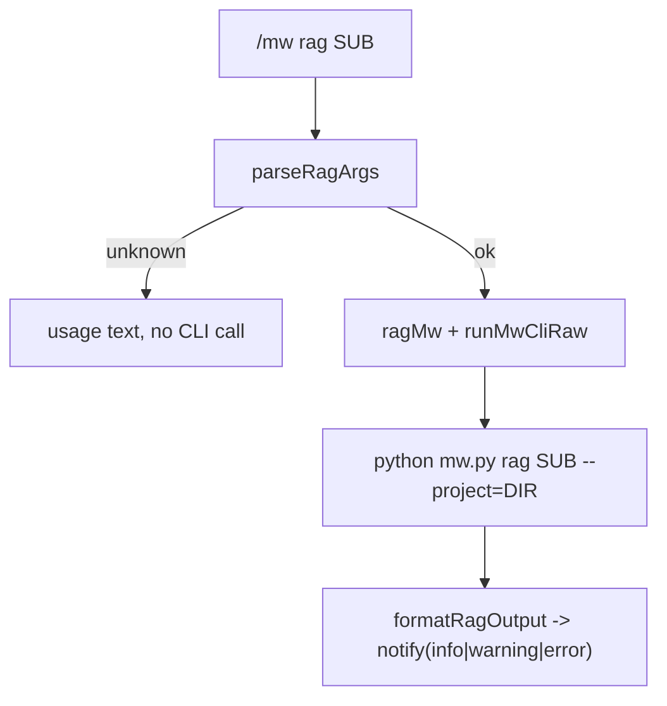
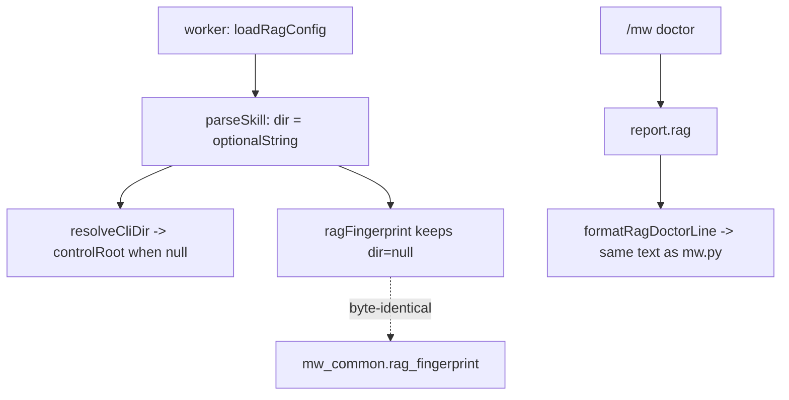

# Design: mw-rag-window-parity

- key: `mw-rag-window-parity`
- 依赖: spec.md AC-301~AC-306
- 写入面: `packages/coding-agent/src/extensions/agent-team-loop/{rag/config.ts, rag/tools.ts, shared/mw-runner.ts, pm/ui-bridge.ts}` + `packages/coding-agent/test/suite/rag-*.test.ts`（新增/扩展）+ 文档/CHANGELOG。**Python 侧零改动**。

## 1. 目标与非目标

**目标**：(a) 同一份 RAG 配置在 Python 与 worker 侧 TS 加载器上**同义**（`skill.dir` 缺省/`null` = 控制工作区根），
且已锁定的跨语言 fingerprint 字节等价**不被破坏**；(b) pi 窗口内可见且可驱动 RAG：`/mw rag ` 薄封装 +
`/mw doctor` 的 RAG 行（与 Python 文本行**逐字一致**）。

**非目标**：RAG 语义（工具集/熔断/预算/引用语法/注入块/fingerprint 算法）变更；pi 核心改动；新增 RAG 工具；
`/mw rag` 之外的窗口命令；真实服务联调。

## 2. 决策

| ID | 决策 | 理由 |
|---|---|---|
| D-301 | TS `parseSkill` 用 `optionalString` 解析 `dir`（缺省/`null` → `null`），`RagSkillEntry.dir: string \| null`；**不归一化成 `"."`** | 归一化会让两侧 canonical JSON 不同 → fingerprint 不同 → `config tear (rag)` 误报（spec §2 风险）。解析值语义必须与 Python `_rag_finalize_skill` 一致（`None`） |
| D-302 | 新增纯函数 `resolveCliDir(controlRoot: string, dir: string \| null): string`（`null` → `controlRoot`，否则 `path.resolve(controlRoot, dir)`），`cliCall` 改用它 | 让「缺省 = 项目根」可单测（不 spawn CLI），并让 `dir: null` 不再触发 `path.resolve(x, null)` 的 `TypeError` |
| D-303 | `dir: ""` 仍非法（`requireString` 语义保留），错误文本不变 | 与 Python（"non-empty string or null"）一致；空串是配置错误而非缺省 |
| D-304 | `ragFingerprint` 的 payload **不动**（继续用解析后的 `dir`，即 `null`）；新增 parity 测试覆盖 `dir` 缺省/`null`/显式三种 | AC-302 直接钉住 D-301 不破坏 fingerprint 合约 |
| D-305 | `runMwCli` 拆成 `runMwCliRaw(sub, projectDir, args, timeoutMs) → {code, output}`（内部）+ 既有 `runMwCli`（`ok/error` 包装，行为不变） | `/mw rag audit` 需要区分 exit 1（warning：有 findings）与 exit 2（error：用法/配置）；既有 target/model/partition 行为零变化 |
| D-306 | 新增 `ragMw(projectDir, args) → {ok, code, output}`（基于 raw）；`sub` 白名单 `list/probe/audit/sync/init` 由纯函数 `parseRagArgs(raw) → {sub, rest} \| {usage}` 校验，未知/空 sub 直接返回用法**不调 CLI** | Python 保持解析/校验唯一源；TS 只做「是否值得调」与展示。白名单与 `mw.py _RAG_ACTIONS` 一致 |
| D-307 | 展示策略：`formatRagOutput(output, code)` 纯函数 → `{text, level}`；`level`: 0=info / 1=warning / 2=error；超过 30 行截断并附 `… 完整输出：python mw.py rag  --project <dir>` | 通知通道会截断长输出（`rag list`/`audit` 可能很长）；把完整命令交给用户而不是静默丢失 |
| D-308 | `/mw doctor` 顶层新增 `formatRagDoctorLine(rag)` 纯函数，渲染格式**与 `mw.py:_format_rag_doctor_line` 逐字一致**（`rag: not enabled (skill X)` / `rag: ERROR - X` / `rag: enabled=A,...; probe=...; fingerprint=<12>; skill=X[; required_missing=N]`），`formatDoctorReport` 在 `report.rag` 存在时插一行、缺失时跳过 | 跨语言文本一致性可测（同一 JSON 喂两侧）；旧 `mw.py`（无 `rag` 键）不崩 |
| D-309 | `DoctorJson` 增加可选 `rag?: {…}`（镜像 `_doctor_rag` 的字段集，全可选） | 类型诚实；缺字段时渲染降级为 `unknown` |
| D-310 | 新增测试放 `test/suite/rag-window.test.ts`（TS 纯函数 + parity）、`test/suite/rag-trim-parity.test.ts`（padding parity，T-3C）与 `test/suite/rag-window-missing-mw.test.ts`（`findMwPy()===null` 分支，T-5 后补），并扩展 `rag-config`/`rag-parity` 覆盖 `dir` 三种变体；`[VERIFY]` 用 `process.stdout.write` | 与既有 suite 结构一致；沿用 `[VERIFY]` 纪律（vitest `silent: "passed-only"`） |
| D-311（T-3B） | `/mw doctor` 的 RAG 行门控 = `rag.exists or rag.enabled`（导出谓词 `shouldShowRagDoctorRow`），**不是**「`rag` 键存在」 | `_doctor_rag` 恒返回非空 dict ⇒ 存在性判定会给完全没配 RAG 的项目多打一行 `rag: not enabled`，窗口与终端不一致（VC-309b 钉住双向一致） |
| D-312（T-3C） | TS 对 `mcp.url`/`mcp.token_env`/`skill.dir`/`skill.cli_entry` 取 `.trim()`（`optionalTrimmedString`），镜像 Python `_rag_finalize_mcp`/`_rag_finalize_skill` 的 `.strip()`；**`sources` 条目、role/phase 的 `server`/`source`、`default_server` 不 trim**（Python 侧也不 strip） | T-4 实测：padding 下两侧 fingerprint 不等（同一配置文件两套哈希 = `config tear (rag)` 误报源）；无差别 trim 会造出新的不等（VC-305b 钉住） |
| D-313（T-3C） | `path_roots_file` **不** trim（保留原值，digest 亦按原值算） | Python 该字段 strip、但 `path_roots_digest` 用未 strip 串（`mw_common.py:636-637`）；保留原值可让两侧 digest 同为 `None`。残留差异（仅该键）实测记录为遗留 R-6，不在本 key 改 Python |

## 3. 跨语言契约

| 面 | 契约 |
|---|---|
| `skill.dir` 解析值 | Python `None` ↔ TS `null`（缺省/显式 `null` 等价）；`""` 两侧都非法 |
| fingerprint | TS `ragFingerprint` 与 Python `rag_fingerprint` 对同一配置**逐字节相等**（含 `dir: null` 情形）——AC-302/VC-305 |
| doctor RAG 行 | TS `formatRagDoctorLine(report.rag)` 与 `mw.py doctor` 的 `rag: ` 行**逐字相等**（同一项目的 JSON vs 文本）——AC-304/VC-309 |
| `/mw rag` 参数 | TS 只转发；`--project=<控制工作区>` 由 `runMwCliRaw` 追加（沿用既有约定） |
| exit code | `mw.py rag` 0/1/2 → 通知 info/warning/error，不抛异常（`audit` exit 1 = 有 findings 属预期） |

## 4. 结构图

## 5. VC（可验证条件）

| VC | 断言 | 层级 | AC |
|---|---|---|---|
| VC-301 | `skill` 块缺 `dir` → 解析成功且 `dir === null`（无 `invalid-shape`） | L1 | AC-301 |
| VC-302 | `dir: null` → 解析成功且 `dir === null` | L1 | AC-301 |
| VC-303 | `dir: ""` → `invalid-shape`，错误文本含 `skill.dir` | L1 | AC-301 |
| VC-304 | `resolveCliDir(root, null) === root`；`resolveCliDir(root, "skills/x") === path.resolve(root,"skills/x")` | L1 | AC-301 |
| VC-305 | `dir` 三种变体下 TS `ragFingerprint` == Python `rag_fingerprint`（同一 fixture 文件，Python 由 subprocess 实跑取串） | L1 | AC-302 |
| VC-305b | padding 值（`dir`/`cli_entry`/`url`/`token_env` 前后带空格）下 TS 解析值 = strip 后原值且 `ragFingerprint == rag_fingerprint`（Python 子进程实测）；空白 `dir` 两侧均拒 | L1 | AC-301/AC-302 |
| VC-306 | `parseRagArgs("list")` → `{sub:"list", rest:[]}`；`parseRagArgs("audit --key K")` → `{sub:"audit", rest:["--key","K"]}`；`parseRagArgs("bogus")` → usage | L1 | AC-303 |
| VC-307 | 未知/空 sub：返回用法（含 5 个子命令名）且**不调用** `mw.py`（以注入的计数桩或「未 spawn」断言证明） | L1 | AC-303 |
| VC-308 | `formatRagOutput(output, code)`：code 0/1/2 → level info/warning/error；>30 行截断并含完整命令提示 | L1 | AC-303 |
| VC-308b | 真 spawn：`MW_PY` 指向 stub 脚本，`ragMw(root, ["list"])` 的 argv == `["rag","list","--project=<root>"]`（exit 0 → ok），`["audit","--fail"]` → exit 1 保留且 `ok=false` | L1 | AC-303 |
| VC-309 | `formatRagDoctorLine(rag)` == `mw.py doctor` 同项目输出的 `rag: ` 行（not enabled / error / enabled+probe 三种 fixture，逐字相等） | L1 | AC-304 |
| VC-309b | 渲染门控跨语言同门：无 RAG 配置项目两侧都不打行（`empty_py_row=false, empty_ts_row=false`），有配置项目两侧都打行（`configured_py_row=true, configured_ts_row=true`） | L1 | AC-304 |
| VC-310 | `DoctorJson` 无 `rag` ⇒ 无 `rag:` 行且不抛；`rag` 存在但未配置（`exists:false, enabled:[]`）⇒ 同样无行（门控真值表：undefined/inert=false，`exists:true`/`enabled:["A"]`=true）；已配置 ⇒ 恰好一行 | L1 | AC-304 |
| VC-311 | `/mw` 命令描述文本包含 `rag`（读取注册时的 description 或常量导出比对） | L1 | AC-305 |
| VC-312 | 零回归：`npm run check` exit 0；TS 相关 suite 与 Python `pytest -q` 无新增失败；`test_autopilot_l0.py`、`test/fixtures/rag/*`、`rag-block.golden.md` 零 diff | L1 | AC-306 |

覆盖矩阵：AC-301 ← VC-301~304/VC-305b；AC-302 ← VC-305/VC-305b；AC-303 ← VC-306~308/VC-308b；AC-304 ← VC-309/VC-309b/VC-310；AC-305 ← VC-311；AC-306 ← VC-312。

## 6. 写入面纪律

- 允许写：上列 4 个 TS 源文件、`test/suite/rag-window.test.ts`（新）、既有 `rag-*` 测试的追加、两个 `CHANGELOG.md` 的 `[Unreleased]`。
- 不允许写：`packages/coding-agent/src/core/**`、`packages/multi-workers/mw.py`/`mw_common.py`、任何 fixture/golden、
  `test_autopilot_l0.py`、其它会话的未提交文件（`README.md`/`docs/`/`launcher.py`/`autopilot/*`/`dist/extensions/*.js`）。
- `dist/extensions/agent-team-loop.js` **不重建**（本 key 不做发布构建）；若某测试需要 bundle，改为直接 import 源文件。

## 7. 测试与验证命令

- TS（`packages/coding-agent`）：`node ../../node_modules/vitest/dist/cli.js --run test/suite/rag-window.test.ts`，
  另跑 `rag-config` / `rag-parity` / `rag-tools` / `rag-required` / `rag-role-defaults` 与
  `test/extensions/agent-team-loop*.test.ts`。
- Python：`python -m pytest -q`（`packages/multi-workers`，用于 VC-305/309 的取得与零回归）。
- 仓根：`npm run check`（exit 0 为通过）。
