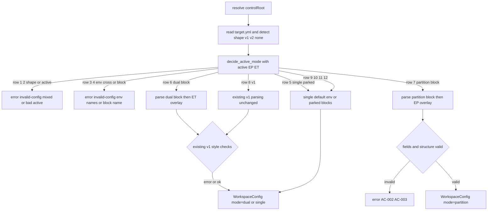
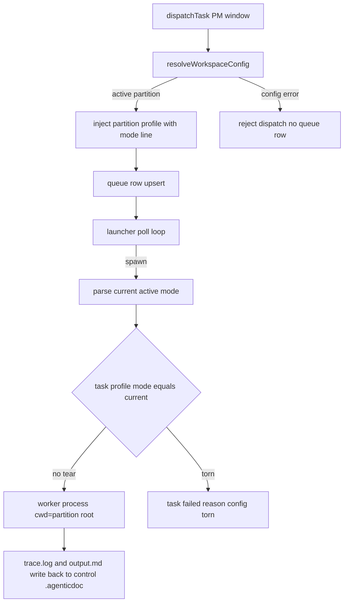

# Design: mw-target-partition

> 2026-09-19 v2：随需求转向单配置文件方案整体重写（前版两文件设计已废弃，决策历史见 key-decision.md 与 research note）

## §0 设计前提锚定

- spec_path: `.agenticdoc/mw-target-partition/spec.md`
- spec_locked_at: 2026-09-19T00:54:29+08:00（2026-09-19 v2 修订：[REVISED]/[OBSOLETE]/新增，见 spec §3 修订记录）
- ac_count: 21 生效（另 AC-014/015 标 OBSOLETE，编号 021 未分配）
- ac_ids: AC-001, AC-002, AC-003, AC-004, AC-005, AC-006, AC-007, AC-008, AC-009, AC-010, AC-011, AC-012, AC-013, ~~AC-014~~, ~~AC-015~~, AC-016, AC-017, AC-018, AC-019, AC-020, AC-022, AC-023

## §1 架构选型

### D-001 解析入口与文件形态分流
- 选择：单一 choke point（`resolveWorkspaceConfig` / `load_target_config`）入口先做**文件形态判定**（F ∈ {无, v1, v2}：v2 = 顶层含 `active` 键）+ `_decide_active_mode` 纯函数（§1.5 规则表 12 行），v1 分支进入既有解析逻辑（对既有合法 v1 输入行为零变化，唯一新增行为 = v2 检测与 v2 路径）
- 否决：双入口按形态分发（6 个调用点：mw.py ×2、launcher、dispatch.py、_doctor_target、测试两侧，全要加选择逻辑）
- 调研：`evidence/research/design-chokepoint-extend-2026-09-19.md`

### D-002 TS 类型策略
- 选择：`WorkspaceConfig` 增量扩展——mode 三值、`gameRoot: string | null`（partition 下 null；single 仍 = controlRoot；v1/v2 dual 不变）、新增 `parentRoot/partitionRoot: string | null`、`roots: Record<string, string>`；`renderToolchainCommand` 按 mode 分派 token 集（partition 分支拒绝 {game}/{engine}/{uproject} → missing-field；dual/single 走现行替换，`discoverUprofile` 仅 dual 路径调用）
- 否决：判别联合（全下游 narrowing，零回归风险大）
- 调研：同上（发现 2 + 评审补充：renderToolchainCommand 无条件用 gameRoot 的路径必须 mode 分派）

### D-003 错误模型
- 选择：复用 `TargetConfigError` kind 枚举；规则表与字段层错误统一 `invalid-config`（消息要素区分：混格式/env 名/块名/字段名/键名/根关系），占位符沿用 `missing-field`
- 否决：新增 kind 值（spec 按 kind 锁定，parity 断言最小）

### D-004 规则表实现
- 选择：`_decide_active_mode(F, A, EP, ET)` 独立纯函数（TS/Py 同构），先于任何字段解析；§1.5 的 12 行 = 参数化测试表（AC-017 全枚举 F × A × EP/ET 组合）
- 否决：判定散在解析各处

### D-005 profile 注入
- 选择：task-dispatcher 新增 `renderPartitionProfileBlock`（active 模式行 `[mw] mode: partition` 形态的非 key 前缀行 + parent/partition/roots + toolchain 渲染 + firewall + contract；full-file 行恒 target.yml）；幂等升级：**标记行到 EOF 整体替换**当且仅当 active 模式变化（AC-019）；dual 的 `renderProfileBlock` 一行不动（v1 注入文本零变化，AC-016d）
- 否决：扩展现有渲染函数混三模式；mark 不带模式信息（评审 MAJOR：切换后陈旧 profile）
- PROFILE_MARK 升级 v2（`<!-- mw-profile: v2 -->`）：v2 标记携带模式行，替换边界 = 标记行到 EOF；遇 v1 标记的旧文件按"模式行缺失视为 dual"处理替换语义

### D-006 read_scope 锚定
- 选择：`_expand_read_scope` 模式检查 `not in ("dual", "partition")`，锚定根 = game_root / partition_root；control root 追加与不并 parent 红线共享；dual 位相同
- 否决：双函数

### D-007 launcher cwd 与撕裂校验
- 选择：`_worker_cwd` 按 mode 分派（dual→game_root，partition→partition_root，single→control）；spawn 前新增**撕裂校验**（AC-020）：读 task.md 的 profile 模式行（D-005 的 v2 标记/模式行；v1 标记视为 dual），与当前解析 active 模式比对，不一致 → 任务标记 failed（原因 "config torn" + 两侧模式名），不 spawn；错误包装消息按活跃形态动态化（v1 → "target.yml is unusable" 现文案不变，v2 → 含 active 模式名；`dispatch.py:268` 与 launcher 共用描述函数）
- 否决：仅静默重解析（评审/spec 评审 BLOCKER 3：撕裂不 fail-closed）
- 依据：错误字面量无测试断言（git grep 仅源码命中）

### D-008 partition set 写盘（含 v1 迁移）
- 选择：v2 块级编辑——bootstrap 标量（active/parent/partition/vcs）行级编辑（沿用 `_apply_bootstrap_line` 模式保注释），roots 映射整段重写（定位既有块整体替换）；写盘 = 临时文件 + 原子替换（`os.replace` / `fs.renameSync`）；**v1 迁移**：读 v1 全部字段（含手维护段）→ 以 yaml 生成器写入 v2 dual 块（内容保留、排版可能变化，AC-022 断言内容级保留）→ 备份 `target.yml.bak` → stdout 提示；v2 下 `mw target set` 写 dual 块（新分支，v1 路径零改动）
- 否决：yaml round-trip 原地改（丢注释）；无备份迁移

### D-009 doctor / probe 缓存
- 选择：doctor target 段 JSON 对 v1/dual/single **零新增键**（AC-016e/AC-018c）；partition 激活时 config 子键加 parent_root/partition_root/roots（partition-only）。缓存 `.mw/toolchain.json` 新增 `fingerprint` 键（active 模式 + 归一根集合排序序列化）+ 文件 mtime；指纹或 mtime 变化 → 重探测；旧缓存无 fingerprint → 视为陈旧重探测一次（幂等）
- 否决：active_file 进 doctor 段 JSON；仅 mtime 判新鲜（评审 MAJOR：env 覆盖与 active 切换不触发）

### D-010 /mw partition TS 转发
- 选择：mirror `/mw target`——ui-bridge `runMwPartitionCommand`（flag 解析 + 可注入 runner + usage），mw-runner `partitionMw`（`runMwCli("partition", ...)` 一行包装）；`/mw partition on|off` 同一命令族动词
- 调研：ui-bridge.ts:1371-1450 命令模式

### D-011 parity 测试布局
- 选择：复用共享夹具目录 `test/fixtures/target-config-cases/`（续号新增 v2 case，不改既有目录）；两侧 runner 增量支持新可选字段（mode=partition、parent_root_rel/partition_root_rel/partition_root_equals_control/roots/active）；`test_mw_partition.py`（CLI set/show/clear/on/off + 迁移 + 基线）；TS `agent-team-loop.test.ts` 新 describe（/mw partition）；AC-016 基线用例**先行在 main 录制**且独立文件（不导入 partition 符号）
- 否决：独立夹具目录双 runner

### D-012 on/off 切换原语
- 选择：每命令族 `on`/`off` 子命令（v2：on = active→本模式，块缺失 exit 1 提示 set；off = active→single 块保留；v1 文件 → exit 1 提示经 set 迁移）；`/mw partition on|off` 转发
- 否决：set 重参数切换（用户要求扁平命令）；`mw target use <mode>`（把 partition 塞进 target 命令族）

### D-013 撕裂检测载体
- 选择：复用 D-005 的 profile 模式行（task.md 内 `[mw] mode: partition` 行，v1 标记视为 dual）——launcher spawn 前正则提取比对，无新文件无新协议
- 否决：派发快照 sidecar（新状态文件，队列孤儿态复杂化）

## §2 核心结构

TS（`shared/target-config.ts`）：

```ts
export type WorkspaceMode = "single" | "dual" | "partition";
export type WorkspaceConfigSource = "env" | "target-yml" | "default"; // 枚举不新增

export interface WorkspaceConfig {
  mode: WorkspaceMode;
  controlRoot: string;
  gameRoot: string | null;       // dual: 根; single: controlRoot; partition: null
  engineRoot: string | null;     // dual 专用
  parentRoot: string | null;     // partition 专用
  partitionRoot: string | null;  // partition 专用
  roots: Record<string, string>; // partition 专用（名 -> 归一路径，相对锚定控制根）
  vcs: string | null;
  uproject: string | null;       // dual 专用
  toolchain: TargetToolchain;
  ignore: TargetIgnore;
  contract: TargetContract;
  source: WorkspaceConfigSource;
}

// 规则纯函数（§1.5 为规约；TS/Py 同构）
export function decideActiveMode(input: {
  fileShape: "none" | "v1" | "v2";
  active: string | null;          // v2 的 active 键
  envPartitionParent: string | null;
  envPartitionRoot: string | null;
  envTargetGame: string | null;
  envTargetEngine: string | null;
}): { mode: WorkspaceMode; block?: "dual" | "partition" } | { error: TargetConfigError };
```

Py dict 镜像键：`mode/control_root/game_root/engine_root/parent_root/partition_root/roots/vcs/uproject/toolchain/ignore/contract/source`。

v2 文件 schema：顶层 `active` + `dual:` / `partition:` 块；块内白名单见 AC-003(d)(e)；v1 = 现行顶层字段集（无 active 键）。

## §3 模块划分

```
packages/coding-agent/src/extensions/agent-team-loop/
├─ shared/target-config.ts        # +decideActiveMode/v2 检测与块解析/roots/占位符 mode 分派
├─ shared/mw-runner.ts            # +partitionMw；DoctorJson 不动（透传 Python JSON）
└─ pm/
    ├─ task-dispatcher.ts         # +renderPartitionProfileBlock/PROFILE_MARK v2/模式行/整体替换
    └─ ui-bridge.ts               # +runMwPartitionCommand（set/show/clear/on/off）

packages/multi-workers/
├─ mw_common.py                   # +_decide_active_mode/v2 解析/roots/渲染分派/probe 指纹/doctor
├─ mw.py                          # +cmd_partition(set/show/clear/on/off+argparse+迁移)；cmd_target show 守卫 + v2 dual 块写入
├─ launcher.py                    # _worker_cwd 分派 + 撕裂校验 + 动态错误消息
└─ autopilot/dispatch.py          # _expand_read_scope partition 锚定 + 错误消息共用

测试
├─ packages/multi-workers/test/fixtures/target-config-cases/  # 续号 v2 case
├─ test_common_target_config.py      # runner 增量字段
├─ test_mw_partition.py              # CLI/迁移/切换/撕裂/基线（基线部分独立文件先行录制）
├─ packages/coding-agent/test/extensions/
│  ├─ agent-team-loop-target-config.test.ts      # runner 增量字段
│  ├─ agent-team-loop-profile-injection.test.ts  # +partition 注入/替换/模式行
│  └─ agent-team-loop.test.ts                    # +describe "/mw partition"
```

依赖方向不变：target-config（纯）← task-dispatcher/ui-bridge/mw-runner；mw_common ← mw/launcher/dispatch。

## §4 接口与集成

### 4.1 对外接口清单

CLI（`python mw.py`，全部扁平）：

```
partition set --project <控制根> --parent <目录> [--partition <目录>] [--root name=path ...] [--vcs git|p4|none]
partition on | off                # 切换 active（v1 → exit 1 提示迁移）
partition show | clear
```

pi 窗口：`/mw partition set --parent <p> [--partition <p>] [--root k=v ...] [--vcs t] | on | off | show | clear`。

env：`MW_PARTITION_PARENT` / `MW_PARTITION_ROOT`（仅激活 partition 时覆盖；无文件时齐备激活；进程环境变量不落盘）。

配置：target.yml v2（§2 schema；v1 兼容见 spec §1.3）。

TS 导出：`decideActiveMode` / `resolveWorkspaceConfig`（签名不变）/ `renderToolchainCommand`（签名不变，mode 分派）/ `partitionMw(projectDir, args)`。

### 4.2 外部依赖集成

- launcher / autopilot / doctor / 命令族经 `load_target_config` 统一取 WorkspaceConfig；无新外部依赖
- bundle 重建：`packages/multi-workers/dist/extensions/agent-team-loop.js`；`packages/coding-agent/dist` 随构建对齐

## §5 Function Flow

解析规则流：



派发与撕裂校验链路：



## §6 Coverage Matrix

| ID | 功能点 | 正常路径 | 边界测试 | 异常路径 | 验证层级 |
|----|--------|---------|---------|---------|---------|
| F1 | 规则表判定 | 行 5/6/7/9/12 | 行 8/11（v1/env 现行） | 行 1/2/3/4/10 | L1 |
| F2 | v2 partition 解析 | 13 字段 parity | 相对路径锚定/省略 vcs | 缺字段/缺块/结构 7 类 | L1 |
| F3 | 占位符渲染 | {parent}/{partition}/{root名} | 混合占位符 | 未知 token（missing-field） | L1 |
| F4 | env 覆盖 | EP 子集覆盖/source | 空白串/无文件齐备激活 | 交叉/不完整 | L1 |
| F5 | worker cwd | partition root | --partition 省略默认控制根 | 撕裂/配置坏拒 spawn | L1 |
| F6 | profile 注入 | 块内容+模式行 | 幂等/切换整体替换 | 配置坏拒派发 | L1 |
| F7 | read_scope 锚定 | 锚定+control 追加 | 绝对条目/空 scope | — | L1 |
| F8 | doctor/缓存 | checks+指纹 | active 切换/env 变化重探测 | 配置错误进 issue | L1 |
| F9 | CLI set/show/clear | exit 0 落盘+视图 | v1 迁移/.bak/重复 set 幂等 | 缺参/路径不存在/根关系/交叉 env | L1 |
| F10 | on/off 切换 | active 翻转 | 块保留/v1 报错 | 块缺失 exit 1 | L1 |
| F11 | /mw partition 转发 | 参数透传 | usage 分支 | runner 失败透传 | L1 |
| F12 | 零回归基线 | v1 dual 样例投影一致 | single 样例 | — | L1 |

## §7 Verification Contract

VC-001: 当 v2 target.yml active=partition 且块有效时，双侧 mode 必须等于 "partition"，parentRoot/partitionRoot 归一（相对锚定控制根），13 项字段逐字段相等
       Layer: L1
       Output: [VERIFY] VC-001: parity=pass, mode=partition
       Source: AC-001

VC-002: 当 active=partition 且块缺 parent/partition 或整块缺失时，双侧必须抛 kind="invalid-config" 且消息含字段名/块名
       Layer: L1
       Output: [VERIFY] VC-002: kind=invalid-config, contains=<字段名或partition>
       Source: AC-002

VC-003: 当结构层冲突（混格式/非法 active/白名单外键/块间字段错放/roots 键名/根关系）发生时，双侧必须抛 kind="invalid-config" 且消息含对应要素
       Layer: L1
       Output: [VERIFY] VC-003: kind=invalid-config, contains=<要素>
       Source: AC-003

VC-004: 当 partition 块 toolchain 含已定义/未定义占位符时，双侧必须渲染归一路径或抛 kind="missing-field"（含 token 名与原命令）；dual/single 渲染零变化
       Layer: L1
       Output: [VERIFY] VC-004: rendered=<路径> | kind=missing-field
       Source: AC-004

VC-005: 当 EP 覆盖激活 partition 时，字段必须被覆盖且 source="env"（空白串=未设置）；source 枚举必须为 {env, target-yml, default}
       Layer: L1
       Output: [VERIFY] VC-005: source=<枚举值>
       Source: AC-005

VC-006: 当 active=partition spawn 时，子进程 cwd 必须等于 partition root 且 trace/output 写回控制根
       Layer: L1
       Output: [VERIFY] VC-006: cwd=<partition_root>, writeback=<control>/.agenticdoc/
       Source: AC-006

VC-007: 当 active=partition 派发时，task.md 必须含 PROFILE_MARK v2 块（模式行/parent/partition/roots/toolchain/firewall/contract），同配置重派字节不变
       Layer: L1
       Output: [VERIFY] VC-007: profile_block=present, idempotent=pass
       Source: AC-007

VC-008: 当 partition 任务 read_scope 含相对条目时，展开必须锚定 partition root 并追加 control root，不因 parent 身份追加
       Layer: L1
       Output: [VERIFY] VC-008: scope=[<partition>/<rel>, <control>]
       Source: AC-008

VC-009: 当 active=partition 跑 doctor --json 时，target 段必须产出 parent_root/partition_root/root:* checks（无 uproject/engine），指纹变化后重探测
       Layer: L1
       Output: [VERIFY] VC-009: checks=[parent_root,partition_root,root:*], reprobe=on-fingerprint-change
       Source: AC-009

VC-010: 当合法输入时 partition set 必须 exit 0 落盘（--partition 省略写控制根；--root 语法校验）；v1 文件先迁移（.bak+提示）；拒绝路径 exit 1 文件不变
       Layer: L1
       Output: [VERIFY] VC-010: exit=0 migrated=v1-to-v2 | exit=1 yml=unchanged
       Source: AC-010

VC-011: 当缺 --parent 时必须 exit 1 文件不变（无 .bak）；clear 必须删块置 single（无剩余块删文件），块缺失 exit 0
       Layer: L1
       Output: [VERIFY] VC-011: exit=1 unchanged | clear=block-removed active=single
       Source: AC-011

VC-012: 当 /mw partition set 透传时，参数序列与产生的 target.yml 字节必须与 CLI 直调一致；show/on/off/clear 转发行为一致
       Layer: L1
       Output: [VERIFY] VC-012: yml_bytes=identical, forward=consistent
       Source: AC-012

VC-013: 当全量运行既有+新增用例时必须全绿且既有用例零修改；v1 解析对既有合法 v1 输入零行为变化（唯一新行为=v2 检测）；target set 在 v1 写 v1 格式；npm run check 0/0/0
       Layer: L1
       Output: [VERIFY] VC-013: tests=all-pass, v1_behavior=unchanged, check=0/0/0
       Source: AC-013

VC-016: 当 v1 dual 与 single 样例在合入前后运行时，legacy 字段投影、_worker_cwd、scope 展开、注入块全文、show 输出、doctor 段 JSON（零新键，除时间戳）必须逐字节一致
       Layer: L1
       Output: [VERIFY] VC-016: baseline_dual=identical, baseline_single=identical
       Source: AC-016

VC-017: 当规则表输入组合全枚举（F × active × EP/ET）参数化运行时，判定必须逐行符合 §1.5（行序即优先级），双侧 kind 与消息要素一致；行 5 块不解析；行 8 v1 零变化
       Layer: L1
       Output: [VERIFY] VC-017: table=all-rows, parity=pass
       Source: AC-017

VC-018: 当 active 感知检验时：target show 守卫按 active 互斥 exit 1；profile 块含模式行；doctor 段 partition-only 键（dual/single/v1 零新键）；缓存指纹随 active 切换失效
       Layer: L1
       Output: [VERIFY] VC-018: guard=exit-1, mode_line=present, partition_keys=conditional
       Source: AC-018

VC-019: 当 active 切换后重派 task.md 时，profile 块（标记到 EOF）必须整体替换为新模式内容；同 active 同配置重派字节不变
       Layer: L1
       Output: [VERIFY] VC-019: replaced=on-switch, idempotent=same-config
       Source: AC-019

VC-020: 当 spawn 时 task.md 模式行 ≠ 当前 active 时，任务必须标记 failed（含 "config torn" 与两侧模式名）且不 spawn
       Layer: L1
       Output: [VERIFY] VC-020: task=failed, reason=config_torn, spawned=no
       Source: AC-020

VC-022: 当写盘安全检验时：同参重复 set 字节不变；bootstrap/roots 变更后手维护段与注释保留；原子替换后文件总是完整 v2；迁移 .bak 完整含 v1 字段
       Layer: L1
       Output: [VERIFY] VC-022: idempotent=pass, preserved=pass, atomic=pass
       Source: AC-022

VC-023: 当 on/off 切换时：on 翻转 active（块缺失 exit 1 提示 set）；off 置 single 块保留；v1 上 on/off exit 1 提示迁移；/mw partition on|off 转发一致
       Layer: L1
       Output: [VERIFY] VC-023: on=active-flip, off=single-parked, v1=exit-1
       Source: AC-023

## §8 AC → VC 映射表

| AC ID | AC 摘要 | 对应 VC | 路径分类 |
|-------|--------|---------|---------|
| AC-001 | v2 partition 解析 13 字段 parity | VC-001 | 正常 |
| AC-002 | 缺字段/缺块报错 | VC-002 | 异常 |
| AC-003 | 结构层 7 类校验 | VC-003 | 异常 |
| AC-004 | 占位符 mode 分派渲染 | VC-004 | 正常+异常 |
| AC-005 | env 覆盖与 source 枚举 | VC-005 | 正常+边界 |
| AC-006 | worker cwd 与协调写回 | VC-006 | 正常 |
| AC-007 | profile 注入（模式行）幂等 | VC-007 | 正常+边界 |
| AC-008 | read_scope 锚定不并 parent | VC-008 | 正常 |
| AC-009 | doctor 探测与指纹缓存 | VC-009 | 正常 |
| AC-010 | CLI set（迁移/校验/落盘） | VC-010 | 正常+异常 |
| AC-011 | CLI 缺参/clear | VC-011 | 异常+边界 |
| AC-012 | /mw partition 透传等价 | VC-012 | 正常 |
| AC-013 | 零回归（v1 行为零变化） | VC-013 | 非功能 |
| AC-014 | [OBSOLETE] 两文件判定表 | — | 已废弃 |
| AC-015 | [OBSOLETE] 活跃文件感知 | — | 已废弃 |
| AC-016 | 升级基线（legacy 投影） | VC-016 | 非功能 |
| AC-017 | 单文件规则表全枚举 parity | VC-017 | 边界+异常 |
| AC-018 | active 模式感知 | VC-018 | 正常+边界 |
| AC-019 | profile 切换整体替换 | VC-019 | 边界 |
| AC-020 | 撕裂校验 fail-closed | VC-020 | 异常 |
| AC-022 | set 写盘安全（幂等/保留/原子/迁移） | VC-022 | 边界 |
| AC-023 | on/off 切换原语 | VC-023 | 正常+边界 |

## §9 非功能实现方案

- **fail-closed 一览**：规则表 5 类错误行、字段层 7 类、占位符 missing-field、CLI 拒绝路径（不落盘不迁移）、撕裂 failed——全部先于派发/spawn 拒绝，不静默回退
- **性能**：新增 IO = 解析时 1 次文件读（v2 检测读顶层）；doctor 探测幂等 + 指纹缓存；与 dual 等价量级（非验收说明）
- **安全/合规**：零接触 `~/.pi/agent/`（P-002）；UTF-8 写盘走 write/edit 工具或 Python utf-8（P-001）；set 原子替换防并发截断
- **可观测**：source 三枚举、错误消息要素（混格式/env 名/块名/字段名/键名/根关系/token）、doctor target 段 partition-only 键、撕裂 failed 原因
- **升级零感知**：AC-016 基线先行录制（main 上独立文件，不导入 partition 符号）+ AC-013 v1 零行为变化 + AC-017 行 8 钉死
- **VC-013 证据拆分**：自动测试（全绿）+ 零修改审计（既有夹具 case 001~014 零字节修改；既有测试文件仅允许纯新增 describe/case 与 runner 空值容差行（如 `or ""`），既有断言零修改——S4 审计逐条列删行归类）+ reviewer 签署 target 路径 diff（质检门禁项）+ VC-016 golden

## §10 决策记录

| D-ID | 决策点 | 选择 | 否决 | 理由 |
|------|--------|------|------|------|
| D-001 | 解析入口 | 单 choke point 按形态分流 | 双入口分发 | 6 调用点零改动 |
| D-002 | TS 类型 | interface 增量 + mode 分派 token | 判别联合 | 下游 narrowing 威胁零回归 |
| D-003 | 错误模型 | 复用 kind + 消息要素 | 新增 kind 值 | spec 按 kind 锁定 |
| D-004 | 规则表 | _decide_active_mode 纯函数 | 逻辑散置 | AC-017 参数化单点 |
| D-005 | profile 注入 | 独立块 + 模式行 + 整体替换 | 扩展现有函数 | dual 文本零改动 + 切换正确 |
| D-006 | read_scope | mode 集合判定各自锚定 | 双函数 | dual 位相同 |
| D-007 | launcher | mode 分派 + 撕裂校验 | 静默重解析 | 撕裂必须 fail-closed |
| D-008 | set 写盘 | 块级编辑 + 原子替换 + v1 迁移 .bak | yaml round-trip | 保注释/手维护段/并发安全 |
| D-009 | doctor/缓存 | 段 JSON 零新键 + partition-only 键 + 指纹 | active_file 进段/仅 mtime | AC-016e + env/切换失效 |
| D-010 | TS 转发 | mirror /mw target 可注入 runner | 新命令框架 | 模式已验证 |
| D-011 | parity 布局 | 复用共享夹具 + 增量字段 | 独立目录双 runner | 契约单点 |
| D-012 | on/off | 每命令族轻原语，v1 报错 | set 重参数 / use 命令 | 用户要求扁平 |
| D-013 | 撕裂载体 | profile 模式行复用 | 派发快照 sidecar | 零新状态文件 |
