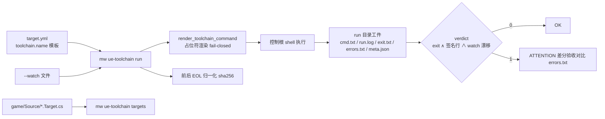

# Design: mw ue-toolchain

> Key: mw-ue-toolchain
> 创建时间: 2026-09-21

## D-1 执行留证与 run 目录

`ue-toolchain run <name>` 在控制工作区根（`shell=True`，cwd=control_root）执行渲染后的命令模板，工件落：

```
<control>/.mw/toolchain-runs/<YYYYMMDD-HHMMSS>-<name>/   ← 默认（机器本地审计轨迹）
  cmd.txt      逐字命令（含 --args 转发后）
  run.log      stdout+stderr 合并，UTF-8，errors=replace（.log 扩展名——质检脚本只扫 *.log）
  exit.txt     仅退出码数字
  errors.txt   错误签名命中行（供差分验收做集合对比）
  meta.json    name/template/command/cwd/exit_code/seconds/error_line_count/watched_drift_count/watched/ok
```

- 同秒重名 run 目录加 `-2`/`-3` 后缀防冲突；`--out DIR` 把父目录指到 key evidence 归档。
- 全部 `write_text(encoding="utf-8", newline="\n")`（PS 5.1 重定向 UTF-16 坑 + P-003 纪律）。

## D-2 合成判定与参数转发

- **mw 退出码 = 子命令 exit 0 ∧ 错误签名行数 0 ∧ `--watch` 漂移 0**；报告行 `exit=N seconds=X error_lines=Y watched_drift=Z/W — OK|ATTENTION`。
- `--watch PATH`（可重复）：执行前后各做 EOL 归一化 sha256；文件前后都不存在不算漂移，新建/修改算漂移。相对路径相对 control 根解析。
- `--args STR`：单字符串逐字追加到渲染命令（**等号形式** `--args="-X"`——argparse 把 `-` 开头的值当未知旗标；REMAINDER 方案因吞掉跟在 name 后的 `--project` 被弃用，见 research/design-cli-shape）。
- `--json`：meta.json 同时打到 stdout。
- fail-closed：target.yml 加载失败 / 未知名 / 占位符缺字段（engine 缺失等）→ 退出码 1 + stderr 指明（复用 `TargetConfigError` 的 kind 语义）。

## D-3 三个纯函数下沉 mw_common

- `sha256_eol_normalized(path)`：CRLF→LF 后 sha256（autocrlf=input 假漂移免疫）。
- `discover_build_targets(game_root)`：`Source/*.Target.cs` 文件名 → 目标名，`*Editor` 结尾 kind=editor，否则 game；无 Source 目录返回 `[]`（非 UE 根不报错）。
- `scan_build_error_lines(text)`：正则 `error C\d{1,5}|LNK\d{4}|error :`，逐行匹配；"Force local retry"（远程执行器重试噪声）天然不命中。

## D-4 指南入仓与模板注释

- 指南 45KB Copy-Item 入仓 `docs/dual-toolchain-practice-guide.md`，头部注入仓说明（出处 + 框架已吸收 §9.B + §9.A 留项目层 + 定义域声明）——WXWork 缓存路径会失效。
- `_target_template` 的 toolchain 注释块给 canonical 示例（build_editor 带 -WaitMutex、build_local 带 -NoUBA -MaxParallelActions=16）+ 指南指针。

## D-5 命名与定义域

- 动词 `ue-toolchain`（kebab，与 update-env/pull-agentictask 一致）；定义域 = dual UE 游戏开发（游戏仓+引擎源码仓+MSVC/UBT）。
- 三层表达：动词名（UE）、help 文本（MSVC/UE 签名集 vs 通用纪律的划分）、README 定义域段落。
- target.yml 配置键保留 `toolchain:`（dual 项目本身就是 UE 形态，键指"该项目工具链命令表"）；`mw_common` 函数名保持通用（docstring 写明域）。
- 旧动词 `toolchain` 不留别名（无外部调用方，双轨反而模糊定义域）。

## D-6 不做什么

exclusive_files 写者唯一性派发检查（需先验证派发层工具语义）；`/mw` TS 窗口转发（bash 直跑已可用）；非 UE 签名可配置（将来接非 UE 工具链再加对应动词或配置项）。

## 架构图


