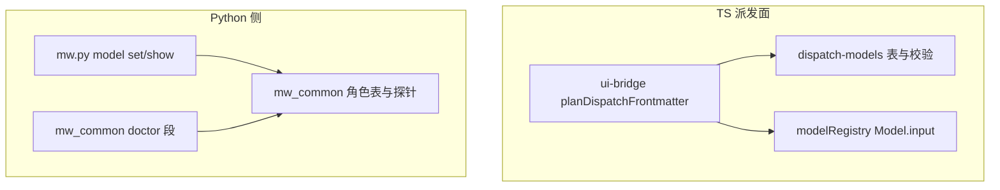
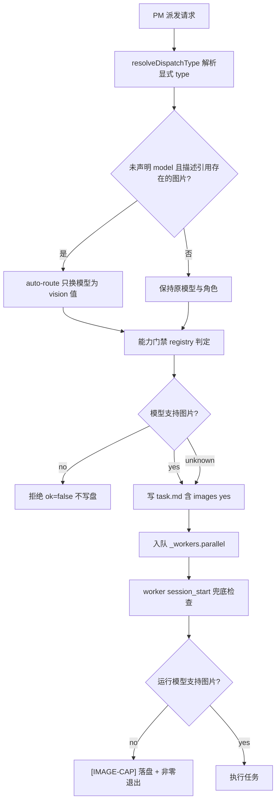

# Design: mw-vision-role

## §0 设计前提锚定

- spec_path: `.agenticdoc/mw-vision-role/spec.md`
- spec_locked_at: 2026-09-26T17:00:00Z
- ac_count: 19（AC-018 已 OBSOLETE → 有效 18）
- ac_ids: AC-001, AC-002, AC-003, AC-004, AC-005, AC-006, AC-007, AC-008, AC-009, AC-010, AC-011, AC-012, AC-013, AC-014, AC-015, AC-016, AC-017, AC-018(OBSOLETE), AC-019
- 设计前提：spec §0 的 GC-1..GC-5 全部继承；本 key 不新增 provider/凭证、不改 pi 核心。
- 调研留底：`evidence/research/spec-*.md`（5 份，spec 期）+ `evidence/research/design-*.md`（5 份，本期）。

## §1 架构选型

> 调研留底（5 份，均 `evidence/research/design-*.md`）：
> - `design-python-probe-contract-20260926.md` → D-002（探针实现契约、fail-open 三分支、注入点）
> - `design-ts-gate-autoroute-interface-20260926.md` → D-001/D-004/D-005/D-010（挂点、签名、回显接线、伪代码、测试骨架）
> - `design-images-header-writer-python-20260926.md` → D-003（写侧签名与插入位、零字节口径、golden 断言形态）
> - `design-doctor-show-output-contract-20260926.md` → D-008/D-011/D-012（四处输出面、断言清单、hermetic 注入、notify 不进 agent 上下文）
> - `design-verification-feasibility-20260926.md` → §6/§7 的 Layer 分配、命令、基线噪声隔离、不可机械判定项清单

### D-001 能力门禁的落点

**需求摘要**：任务需要看图而解析出的模型看不了时，必须在"写盘之前"失败，且不能让 `_workers.parallel`/task.md 出现半成品。

| 方案 | Pros | Cons |
|------|------|------|
| A. TS 派发面 `planDispatchFrontmatter` 前置拒绝 | registry 已在内存（`_context.modelRegistry`）；失败发生在 `fs.mkdirSync` 之前，天然零副作用；PM 立即拿到可读错误 | 只覆盖 PM/`/worker` 两个派发面 |
| B. Python `launcher.py` 启动前拒绝 | 覆盖所有路径（含 conductor） | Python 侧无 registry；任务已入队，失败发生在派发之后（PM 需轮询才发现） |
| C. 只做 worker 侧兜底 | 覆盖 window-model / per-cli 默认回退 | 已经是"跑起来才发现"，浪费一次 worker 启动 |

**推荐**：`A + C`（B 不做，理由：spec §1.4 明确排除 conductor 侧门禁；Python 侧能力数据源只用于配置期命令）。
**否决**：B（无 registry、失败时机过晚）。

### D-002 能力数据源

**需求摘要**：两侧各需要一个"这个模型能不能看图"的判据。

| 方案 | Pros | Cons |
|------|------|------|
| A. TS：内存 registry `Model.input.includes("image")`；Py：子进程 `pi --list-models` 表格探针（P1） | 与 `--list-models` 同源（`model-registry.find`），无需新清单文件；不动 pi 核心（GC-2） | Python 探针靠文本解析，受模糊匹配/表格格式影响 |
| B. 给 `pi --list-models` 加 `--json` | 解析稳健 | 改 pi 核心（违反 GC-2），需另开 key |
| C. 生成一份能力快照文件（`.mw/model-caps.json`） | 两侧共用一个文件 | 新增一个会腐坏的中间产物 + 刷新时机问题；P-005 类空转风险 |

**推荐**：`A`。
**否决**：B（越界）、C（新增契约面且无刷新责任方）。
**调研**：`evidence/research/design-python-probe-contract-20260926.md`（实测：`shutil.which("pi")`→`pi.CMD`；一次全量 `pi --list-models` = 31 行 / 0.86s；六列 `provider model context max-out thinking images`，2 空格填充；worker env 下前置 `[worker] start ...` 噪声行 → 必须按 token 形状过滤；**只列已认证 provider，缺失 ⇒ `unknown`（非 `no`）**）

### D-003 "需要图片"的声明形式

**需求摘要**：门禁要有一个可机读的触发条件，且不能误伤既有纯文本任务。

| 方案 | Pros | Cons |
|------|------|------|
| A. 显式 `images: yes|no` 头 + TS 派发面对描述中**存在**的图片路径 auto-detect（`images: no` 最高优先） | 可豁免、可机读、PM 无需记扩展名；`no` 能压住误报 | 头部新增一行 → 触碰 golden 测试（须条件渲染） |
| B. 只看显式头 | 零误报、零解析逻辑 | PM 大概率不会写这个头，能力形同虚设（RQ-5 A：PM 不主动感知） |
| C. 只看描述 auto-detect | 零记忆负担 | 无法豁免误报；"生成的 png"类描述会误拒 |

**推荐**：`A`。
**否决**：B（静默不用，违背"框架主动感知"目标）、C（无可豁免手段）。
**调研**：`evidence/research/design-images-header-writer-python-20260926.md`（Python 唯一渲染器 `autopilot/dispatch.py:253 render_task_md`，生产调用点仅 `dispatch.py:514`；插入位在 `:300` `if phase:` 与 `:301` `if model:` 之间；**零字节必须用真值判断 `if images:`**（`if images is not None:` 会让 `images=""` 违反 AC-009）；conductor 全树 `grep -i image` 零命中 → 该头只由 TS 派发面写）

### D-004 自动路由（auto-route）的位置与边界

**需求摘要**：检测到图片需求但类型角色的模型看不了图时，自动改用 `vision` 角色**的模型**派发，而不是只报错。

| 方案 | Pros | Cons |
|------|------|------|
| A. 同一次 frontmatter 计划内**只换模型**（`model:` 取 vision 角色值），`type:` 行永不变，回显与 `model-reason:` 记 `auto-route` | 不新增写盘路径；原子；**工具白名单随 `type:` 不变 → 不产生权限变更**（`review` 任务仍是只读）；AC-016/017 按锁定字面成立 | 需新增“显式 model 阻断”分支（AC-016 已有要求） |
| B. 连 `type:` 一起改判为 `vision` | PM 回显更“干净” | `review`/`research` 任务会从只读变可写（`vision` 白名单含 write/edit/bash）→ **隐式提权**；且把显式 `type:` 也改掉了 |
| C. 门禁只报错，由 PM 改成 `type: vision` 重派 | 语义最诚实、零隐式行为 | 依赖 PM 二次行为（多一轮）；`review` 任务重派为 `vision` 同样提权 |

**推荐**：`A`（只换模型，永不改 `type:`）。
**理由**：用户拍定的是“不越权改写 `type:`”——A 严格满足（`type:` 一字不改）；而 B/C 都会把只读任务变成可写。
**否决**：B（隐式提权 + 改 `type:`）、C（依赖 PM 二次行为）。
**边界**：显式 `model:` 存在时**不** auto-route（走 D-001 门禁拒绝）。这是 AC-016 已锁定的字面要求，与用户“显式优先”的意图一致（被显式锁定的模型不被覆写）。
**调研**：`evidence/research/design-ts-gate-autoroute-interface-20260926.md`（挂点/签名/回显接线/伪代码/测试骨架；并指出 spec §4 旧注“显式 `type:` 也阻断”与 AC-017 互斥）

### D-005 worker 侧兜底的实现

**需求摘要**：派发面判不到的模型回退（window-model / per-cli 默认）需要一道运行期防线。

| 方案 | Pros | Cons |
|------|------|------|
| A. `session_start` 检查 `ctx.model.input`，命中即复用 `dispatchRefusal` 落盘三件套 + 非零退出，日志打 `[IMAGE-CAP]` | 复用既有失败通道（无新机制）；必然有 output.md 与退出码，PM 可诊断 | 消耗一次 worker 启动（可接受） |
| B. 在 `read` 工具里对图片降级时报错 | 触发点最贴近实际丢图处 | 已有 `read.ts:87-91` 的降级语义（改写它属行为变更，影响所有纯文本模型用户） |
| C. 不兜底 | 零改动 | 任务会"瞎跑"产出无视觉依据的 UI 代码（最坏结局） |

**推荐**：`A`。
**否决**：B（改全局降级语义，超范围）、C。

### D-006 两侧镜像同步策略

**需求摘要**：角色表 / 类型→角色映射 / 白名单在 Py 与 TS 各有一份，必须同步。

| 方案 | Pros | Cons |
|------|------|------|
| A. 保留双份常量表，靠 parity 测试锁死（含 re-freeze 既有语料） | 零运行时耦合，符合 GC-3/GC-4 既有范式 | 需要人工同步 6 处常量 + 3 处文案 |
| B. 单一来源生成另一侧（代码生成） | 彻底消除漂移 | 引入构建步骤（超范围，且 mw 现无生成器） |

**推荐**：`A`。
**否决**：B（新构建面）。

### D-007 命名与排序

**需求摘要**：新增类型/角色的名字与插入位置要最小化对既有断言的影响。

**推荐**：类型名 = 角色名 = `vision`（用户拍定）；`DISPATCH_ROLES` 与 `DISPATCHABLE_TYPES` 均**追加到末尾**。
**理由**：`agent-team-loop.test.ts:5145` 的子串断言依赖 `DISPATCHABLE_TYPES` 的插入位置；末尾追加不动既有顺序断言。
**否决**：类型名 `design`（用户否决）；中间插入（会打破既有顺序/子串断言）。

### D-008 能力的暴露面

**需求摘要**：人配 `vision` 时要能看到能力判定；PM 要知道类型/角色存在。

| 方案 | Pros | Cons |
|------|------|------|
| A. `mw model show` 与 `mw doctor` 的派发行都加 `images=` 列；PM 面同步四处文本（工具描述/`/worker` USAGE/`/mw model set` USAGE/`PARALLEL_PROTOCOL`） | 人可见 + PM 可见；都是既有通道 | 触碰 doctor 文本断言（须按 RQ-D1 结论插入） |
| B. 只加 doctor | 改动更小 | `mw model show` 是人配角色时唯一会查的命令（配置期反馈缺位） |

**推荐**：`A`。
**否决**：B。
**调研**：`evidence/research/design-doctor-show-output-contract-20260926.md`（`mw model show` 无 `--json`，唯一输出是 stdout 文本；doctor 能力列必须先进 JSON `dispatch` 段（`mw_common.py:1265-1273`）——TS 渲染器只读 `report.dispatch`；`ui.notify` **不进** agent 上下文（`interactive-mode.ts:2631/3380-3402`）→ 能力列仅为**人**可见面，PM 侧仍靠 AC-014/AC-016；`test_dispatch_models.py:473` 是字典精确相等 `== {"exists": False}` → 缺 `dispatch.yml` 时不得新增任何键）

### D-009 conductor 是否可派发 `vision`

**需求摘要**：autopilot 能否自动派发视觉任务。

**推荐**：允许（`conductor_dispatchable=True`），但 conductor **不做**内容检测与自动改道（实证：派发点全是阶段字面量，无内容检测入口）→ "允许"= 阶段调用点可显式传 `type: vision`。
**否决**：禁止（用户拍定允许；禁止会让 autopilot 路径无法复用该能力）。

### D-010 auto-route 的来源留证通道

**需求摘要**：自动改道必须留下机读证据（否则无法事后判定"谁改的模型"）。

**推荐**：`model-reason: auto-route: <src-role> -> vision: <reason>` 头 + 派发回显（tool `:1272` / `/worker` `:1648`）显示 `model-source: auto-route` 与生效模型（`type:` 行保持原类型）。
**理由**：`model-reason:` 是既有头部字段且已有写侧（spec 期 RQ-3 确认它是"只写不读"，但作为留证通道语义合适）；回显保证 PM 立即看到改道。
**否决**：只回显不留盘（会话压缩后丢证）、新增专用头（新契约面，无读者）。

### D-011 能力列格式与测试语料重冻

**需求摘要**：插列方式决定哪些逐字节断言会红。

| 方案 | Pros | Cons |
|------|------|------|
| A. 行内列 `role=value images=<v>`（`mw model show` 行尾追加 ` images=<v>`） | 满足 AC-015 字面（**每个角色行**含 `images=`）；定位直观 | 打破 `agent-team-loop.test.ts:5029-5031` 的一条接合处子串 → 需重冻 1 条渲染期望 |
| B. 行尾分组子句 `; images=yes: <roles>; ...` | 零改断言 | **违反 AC-015**（不在每个角色行上）；且写法不含字面量 `images=yes` |

**推荐**：`A`（+ 重冻 `agent-team-loop.test.ts:5029-5031` 一条字面量：仅更新渲染期望，不放宽断言；同类先例：`test_mwpp_collection_parity.py`）。
**否决**：B（与锁定 AC-015 冲突）。

## §2 核心结构 / 类图

## §3 模块划分

改动文件（不含新增测试）：

| 侧 | 文件 | 职责变化 |
|----|------|---------|
| Py | `packages/multi-workers/mw_common.py` | `DISPATCH_ROLES` +`vision`；`TASK_TYPE_TO_ROLE` +`vision→vision`；新增能力探针（唯一实现）；doctor 段加 `images=` 列 |
| Py | `packages/multi-workers/mw.py` | `model set` 加 `--force` 与能力拒绝；`model show` 加 `images=` 列 |
| Py | `packages/multi-workers/autopilot/dispatch.py` | `REGISTRY` 加 `vision` 条目（`conductor_dispatchable=True`，白名单同 coding）；`render_task_md` 条件渲染 `images:` |
| Py | `packages/multi-workers/worker/state.py`、`launcher.py`（读侧） | 仅在 `images:` 行存在时解析（零字节兼容） |
| TS | `shared/dispatch-models.ts` | `DISPATCH_ROLES`/`TASK_TYPE_TO_ROLE`/`TOOL_ALLOWLISTS`/`DISPATCHABLE_TYPES` +`vision`；新增 `modelImageCapability()`（三态 fail-open）；auto-route 判定 |
| TS | `pm/ui-bridge.ts` | `planDispatchFrontmatter` 加门禁 + auto-route + 回显；四处文案同步；doctor TS 渲染加 `images=` |
| TS | `shared/mw-runner.ts` | `DoctorJson.dispatch` 加可选能力字段（类型面） |
| TS | `worker/worker-mode.ts` | `TaskMeta.images`；`session_start` 的 `[IMAGE-CAP]` 兜底 |
| TS | `pm/pm-orchestrator.ts` | `PARALLEL_PROTOCOL` 增加"引用图片的任务用 `type: vision`" |

依赖方向：`worker-mode` → `dispatch-models`（表）；`ui-bridge` → `dispatch-models` + registry；Python 三文件 → `mw_common`（探针与表）。无循环依赖。

## §4 接口与集成

### 4.1 对外接口清单

| 接口 | 形态 | 变更 |
|------|------|------|
| `dispatch_worker` 工具 | TS tool（`pm/ui-bridge.ts`） | `type` 描述含 `vision`；`images: yes` 触发门禁/auto-route；拒绝消息含 `mw model set vision` 与 `images: no` |
| `/worker` 命令 | TS slash | 同上门禁；USAGE 含 `vision` |
| `mw model set vision <value> [--force]` | CLI | 新角色；能力探针拒绝（非零退出）；`--force` 跳过 |
| `model_capabilities(values) -> dict[str, "yes"\|"no"\|"unknown"]` / `model_images(value) -> str` | Py（`mw_common.py` 新函数） | 一次 `pi --list-models` 全量快照建 `{(provider, model): images}`，进程内记忆化；`unknown` = which None / OSError / TimeoutExpired / rc≠0 / 不可解析 / 0 命中 / CLI 前缀 / 裸 id；可注入 seam `which=None, run=None`（测试用） |
| `mw model show` | CLI | 每角色行加 `images=yes\|no\|unknown` |
| `mw doctor` | CLI | dispatch 段加 `images=`；不支持 → issue；探针不可用 → skip（退出码 0） |
| task.md 头部 | 文件契约 | 新增条件行 `images: yes`（未声明时零字节），序 `type < phase < images < model` |
| `render_task_md(..., images: str \| None = None)` | Py（`autopilot/dispatch.py:253`） | 签名新增参数（默认 `None`）；渲染 `if images: lines.append(f"images: {images}")` 插在 `if phase:` 块之后、`if model:` 块之前；生产调用点 `:514` 保持默认（conductor 不写该头） |
| worker 兜底 | 进程行为 | `[IMAGE-CAP]` 机读行 + output.md + 非零退出 |

### 4.2 外部依赖集成

- pi 模型目录（`packages/ai`）：timi 静态目录（11 个 images=yes，含选定值 `timi/deepseek-v4-flash-vision-exp`）。
- `pi --list-models` 子进程探针（Python 侧，仅配置期命令使用；超时 ≤5s，超时/不可用 → unknown）。
- `read` 工具视觉分支与 `transformMessages` 的降级语义（不改动，仅依赖）。

## §5 Function Flow

## §6 Coverage Matrix

| ID | 功能点 | 正常路径 | 边界测试 | 异常路径 | 验证层级 |
|----|--------|---------|---------|---------|---------|
| F1 | 角色/类型注册与镜像（D-006/D-007） | `type: vision` 可派发 | 元组末尾追加 | 未知类型/角色拒绝 | L0+L1 |
| F2 | 派发期能力门禁（D-001/D-003） | 视觉模型放行 | `images: no` 豁免、undeclared 零字节 | 非视觉模型拒绝 | L1 |
| F3 | auto-route（D-004/D-010） | 未声明 model + 图片 → 只换模型，`type:` 不变 | 显式 `model:` 不改写 | vision 未配/不支持 → 拒绝 | L1 |
| F4 | worker 兜底（D-005） | 视觉模型正常跑 | 未声明 images 不受影响 | 非视觉 → `[IMAGE-CAP]` 非零退出 | L1（行为）+ 人工 L2 |
| F5 | 配置期探针（D-002/D-008） | yes 写入 | unknown fail-open | no 拒绝（`--force` 绕过） | L1 |
| F6 | 能力可见面（D-008） | show/doctor 有 images 列 | 未配置 → unknown/skip | 探针不可用 → skip 退出码 0 | L1 |
| F7 | PM 知情面（D-008） | 四处文本含 vision | 类型 token 集合与白名单一致 | — | L0 |
| F8 | conductor 派发（D-009） | `vision` 可派发 | 未知类型仍拒 | 非 conductor 类型拒绝 | L1 |

## §7 Verification Contract

VC-001: 当 `cmd_model` 执行 `set vision timi/deepseek-v4-flash-vision-exp`（探针桩返回 yes）时，`load_dispatch_config()["models"]["vision"]` 必须等于 `timi/deepseek-v4-flash-vision-exp` 且退出码 0
       Layer: L1
       Output: [VERIFY] VC-001: vision=timi/deepseek-v4-flash-vision-exp rc=0
       Source: AC-001

VC-002: 当执行 `mw model set visionx <值>` 时，退出码必须非 0 且 stderr 中的有效角色集合必须恰为 `{main,coding,review,research,vision}`
       Layer: L1（CLI 子进程）
       Output: [VERIFY] VC-002: rc=nonzero roles=5
       Source: AC-002

VC-003: 当 `resolve_dispatch_model(cli="pi", task_type="vision")` 在 task.md 无 `model:` 时，必须返回 `("timi/deepseek-v4-flash-vision-exp", "config:vision")`；task.md 带 `model: timi/glm-5.3` 时必须返回 `("timi/glm-5.3", "task")`
       Layer: L1
       Output: [VERIFY] VC-003: source=config:vision task_override=task
       Source: AC-003

VC-004: 当对 `vision` 类型/角色做映射查询时，`resolveDispatchType("pi","vision")` 必须返回 `{ok:true,type:"vision"}`、`roleForTaskType("vision")` 与 `TASK_TYPE_TO_ROLE["vision"]` 必须都等于 `"vision"`，且两侧角色表/类型集逐项相等
       Layer: L1
       Output: [VERIFY] VC-004: role_for_vision=vision mirror_ok=true
       Source: AC-004

VC-005: 当读取 `type: vision` 的工具白名单时，TS `TOOL_ALLOWLISTS["vision"]` 与 Python `REGISTRY["vision"]["tools"]` 必须同序逐元素相等且等于 `["read","write","edit","bash","find","grep","ls"]`
       Layer: L0
       Output: [VERIFY] VC-005: allowlist_vision=read,write,edit,bash,find,grep,ls parity=true
       Source: AC-005

VC-006: 当 `images: yes`（或描述引用存在的图片）且解析模型 `input` 不含 `image` 时，派发必须返回 `ok:false` 且消息同时含 `images` / `mw model set vision` / `images: no`，且 `_workers.parallel` 行数不变、任务目录不存在
       Layer: L1
       Output: [VERIFY] VC-006: refused=true queue_delta=0 dir_exists=false
       Source: AC-006

VC-007: 当同条件下模型 `input` 含 `image` 时，派发必须 `ok:true`、`_workers.parallel` 新增 1 行、task.md 必须含 `^images: yes$` 且头部行序满足 `type < phase < images < model` 严格递增
       Layer: L1
       Output: [VERIFY] VC-007: queue_delta=1 images_line=yes order_ok=true
       Source: AC-007

VC-008: 当模型值不可判定（registry `undefined` / `cli !== "pi"` / `codex_cli` 或 `claude_cli` 前缀）时，`images: yes` 必须不导致失败：`ok:true` 且 `_workers.parallel` 新增 1 行
       Layer: L1
       Output: [VERIFY] VC-008: failopen_ok=true queue_delta=1
       Source: AC-008

VC-009: 当任务未声明 `images:` 且描述未引用存在的图片时，TS 计划输出必须恰为 `"type: coding\n"`，Python `render_task_md(images=None)` / `render_task_md(images="")` / 冻结副本（预存 git-HEAD 渲染器模块，不依赖 live HEAD）同参输出三者逐字节相等，且两侧均不含 `images:` 行
       Layer: L1
       Output: [VERIFY] VC-009: zero_byte=true frozen_copy=true
       Source: AC-009

VC-010: 当 `mw doctor` 探针分别返回 `no` / `yes` / `unknown` 时，dispatch 段必须分别为 suggestion（消息含 `mw model set vision`）+ 该角色行标 `images=no` / `images=yes` ok 行 / `images=unknown` skip 行（非 issue 非 error），三种情形退出码均为 0
       Layer: L1（in-process monkeypatch `mw_common` 探针函数；子进程 CLI 只能覆盖 skip 支）
       Output: [VERIFY] VC-010: doctor_rc=0 states=suggestion,ok,skip
       Source: AC-010

VC-011: 当 task.md 声明 `images: yes` 且运行模型 `ctx.model.input` 不含 `image` 时，`worker.log` 必须含 `[IMAGE-CAP]` 与该模型 id、`output.md` 必须落盘、进程必须 `exit(1)`；同次未声明 `images:` 的对照任务必须不触发
       Layer: L1（行为，`vi.spyOn(process,"exit")`）+ 1 次人工真进程 L2
       Output: [VERIFY] VC-011: image_cap_line=true exit=1 control_ok=true
       Source: AC-011

VC-012: 当本 key 触达面命令与静态检查全部执行时，必须无失败：pytest 触达文件全绿、`npx biome check --error-on-warnings <scoped>` 与 `npx tsgo --noEmit` 干净，且原始输出留存
       Layer: 流程证据
       Output: [VERIFY] VC-012: scoped_tests=green check=green
       Source: AC-012

VC-013: 当 `mw model set vision <值>` 的探针返回 `no` 时退出码必须非 0 且 `.mw/dispatch.yml` 字节不变；`yes` → 退出码 0 且写入；`unknown` → 退出码 0 + skip 行；`--force` → 退出码 0 且写入（含已强制提示）；`--force` 用于非 `vision` 角色 → 退出码非 0
       Layer: L1 直调 + CLI 子进程
       Output: [VERIFY] VC-013: no_rc=1 yml_unchanged=true force_rc=0
       Source: AC-013

VC-014: 当从四处 PM 文本面（工具 `type` 参数描述 / `/worker` USAGE / `/mw model set` USAGE / `PARALLEL_PROTOCOL`）提取类型与角色 token 时，必须都含 `vision`，且工具描述的 token 集合必须等于 `DISPATCHABLE_TYPES ∪ {"codex"}`
       Layer: L0
       Output: [VERIFY] VC-014: surfaces=4 token_set_ok=true
       Source: AC-014

VC-015: 当执行 `mw model show` 与 `mw doctor` 时，每个角色行必须含 `images=yes` / `images=no` / `images=unknown` 之一（探针不可用为 unknown，不报错），两条命令退出码均为 0
       Layer: L1
       Output: [VERIFY] VC-015: show_images=yes|no|unknown rc=0
       Source: AC-015

VC-016: 当无显式 `model:` 且任务需要图片、且其角色模型 `input` 不含 `image`、且 `vision` 已配置且 registry 判为支持图片时，task.md 的 `model:` 必须等于 `vision` 角色值且 `model-reason:` 含 `auto-route`（`type:` 行保持不变）；`vision` 未配置或不支持 → 按 VC-006 拒绝；显式 `model:` → 一律不改写
       Layer: L1
       Output: [VERIFY] VC-016: auto_route=true type_unchanged=true explicit_model_untouched=true
       Source: AC-016

VC-017: 当对 `vision` 与 `review` 两个类型各跑一次 VC-016 的用例（参数化）时，两者结论必须相同（均改到 `vision` 的模型，且 `type:` 行分别为 `vision`/`review` 不变）
       Layer: L1
       Output: [VERIFY] VC-017: types=vision,review type_unchanged=true effective_vision=2 auto_route_fired=1
       [REVISED @ 2026-09-26，实现期实证] 原期望串 `routed=2` **不可满足**：`roleForTaskType("vision") == "vision"`（AC-004），故 `type: vision` 的源角色 == 目标角色，触发需同一值判 `"no"` 而路由需其判 `"yes"`，逻辑互斥；强行自路由会写出假来源 `auto-route: vision -> vision`，属测试驱动的语义污染。本行语义（“均改到 `vision` 的模型 + `type:` 不变”）不变，仅把计数拆为 effective/auto_route_fired 两组。
       Source: AC-017

VC-018: 不适用（AC-018 已 OBSOLETE：PM 粘贴只写路径不产生 ImageContent，无钩子点）
       Layer: N/A
       Output: [VERIFY] VC-018: n/a obsolete=true
       Source: AC-018

VC-019: 当 `autopilot.dispatch.dispatch(task_type="vision", ...)` 被调用时，必须不返回 `not-conductor-dispatchable` 且 `REGISTRY["vision"]["conductor_dispatchable"] is True`；未知类型仍必须返回 `unknown-type`
       Layer: L1
       Output: [VERIFY] VC-019: conductor_dispatchable=true unknown_type_refused=true
       Source: AC-019

## §8 AC → VC 映射表

| AC ID | AC 摘要 | 对应 VC | 路径分类 | 测试入口（命令见 §7 VC Layer） |
|-------|---------|---------|---------|------------------------------|
| AC-001 | set vision 成功写入 | VC-001 | 正常 | `packages/multi-workers` pytest `test_dispatch_models.py` |
| AC-002 | 未知角色拒绝（列 5 角色） | VC-002 | 异常 | 同上（`_run_cli` 范式） |
| AC-003 | 解析链命中 `config:vision` | VC-003 | 正常 | `test_dispatch_models.py` |
| AC-004 | 类型/角色映射两侧一致 | VC-004 | 正常 | `test_dispatch_models.py` + `agent-team-loop.test.ts` |
| AC-005 | 白名单两侧逐元素相等 | VC-005 | 正常 | `test_autopilot_l0.py` + `test_mwpp_collection_parity.py`（重冻） |
| AC-006 | 门禁拒绝且零副作用 | VC-006 | 异常 | `agent-team-loop.test.ts`（`setupTool` + `fakeRegistry`） |
| AC-007 | 放行 + `images: yes` + 头部顺序 | VC-007 | 正常 | 同上 |
| AC-008 | 不可判定 → fail-open | VC-008 | 边界 | 同上（`undefined`/CLI 前缀/`cli!=pi`） |
| AC-009 | 未声明时逐字节零变化 | VC-009 | 边界 | 同上 + `test_rag_phase.py` + 冻结渲染器 |
| AC-010 | doctor 三态（issue/ok/skip） | VC-010 | 正常+异常 | `test_serve_doctor.py` |
| AC-011 | worker 兜底 `[IMAGE-CAP]` | VC-011 | 异常 | 新建 `test/extensions/agent-team-loop-image-cap.test.ts` + 人工 L2 |
| AC-012 | 测试与 check 全绿 | VC-012 | 流程 | 触达面命令原文输出 |
| AC-013 | 配置期拒绝 + `--force` | VC-013 | 正常+异常 | `test_dispatch_models.py`（probe 桩） |
| AC-014 | PM 知情面四处文本 | VC-014 | 正常 | `test_autopilot_l0.py`（token-set 解析） |
| AC-015 | 能力可见（show/doctor 列） | VC-015 | 正常 | `test_dispatch_models.py` + `agent-team-loop.test.ts` |
| AC-016 | auto-route 只换模型 | VC-016 | 正常+边界 | `agent-team-loop.test.ts` |
| AC-017 | auto-route 按能力（参数化） | VC-017 | 正常 | 同上 |
| AC-018 | （作废） | VC-018 | N/A | — |
| AC-019 | conductor 允许派发 | VC-019 | 正常+异常 | `test_autopilot_dispatch.py` |

## §9 非功能实现方案

- 性能：门禁与 auto-route 为纯内存 registry 查询（<20ms）；Python 探针只出现在 `model set/show/doctor` 三个一次性命令，不进热路径（`doctor_report` 仅 `mw.py:518/4515` 调用），超时 `MODEL_PROBE_TIMEOUT_S=5.0`、一次快照单值复用、进程内记忆化。
- **已知基线红（与本 key 无关，不得归因自身改动）**：`test_autopilot_readcap_injection.py:885 test_baseline_left_end_bound` 在本机现状即为红（冻结副本 sha256 `219E80…` ≠ git HEAD `A17333…`）；`images:` 零字节证据不得挂该断言，改用自备冻结副本（范式 `_head_module()`/`head_render()` `:165-186/254-258`）。
- 唯一需要同步的既有签名断言：`test_autopilot_readcap_injection.py:898/906` 的 `extra` 期望列表需加 `"images"`。
- `model-reason:` 全仓只有写侧（`ui-bridge.ts:1088`）无读侧；worker 侧 `ctx.model` 仅 `session_start` 可读 → AC-011 只能挂该事件。
- 探针缺省语义：只列出**已认证 provider**的模型 → 条目缺失必须归入 `unknown`（fail-open），不得归入 `no`（否则会拒绝合法但本机未认证的模型）。
- 探针超时预算取 **3.0s**（非 5.0s）：`doctor_report` 自承诺 <5s 且 `test_serve_doctor.py:425` 断言 `elapsed < 5`，探针是其中唯一子进程；实测 0.8-0.96s，3s 硬上限仍满足 spec §2.2 的 ≤5s。
- 能力列数据流顺序（唯一合法顺序）：`mw_common.py:1265-1273` JSON 段 → `:2304-2308` Python 文本行 → `pm/ui-bridge.ts:1761-1765` TS 行 → `mw.py:3222/3234` `model show` 行；TS 类型 `shared/mw-runner.ts:380-385` 加可选字段；探针只在 `models` 非空且无 `error` 时触发（守住 `test_dispatch_models.py:473/475` 与 `agent-team-loop.test.ts:5024`）。
- 不在本 key 范围（记录为已知不一致）：TS `Object.entries`（`ui-bridge.ts:1761`，未排序）与 Python `sorted()`（`mw_common.py:2305`）的 doctor 角色顺序不一致，无 parity 锁；若要求两侧逐字节一致需另开 key。
- 安全：拒绝消息只回显角色名/模型值/模型 id，不回显凭证；不新增凭证读取路径。
- 可观测性：拒绝走结构化错误（含修复串）；auto-route 留 `model-reason: auto-route` + 回显；worker 兜底留 `[IMAGE-CAP]` 机读行 + output.md。
- 兼容性：未声明图片需求的任务产物逐字节不变（`images:` 条件渲染 + auto-detect 只在命中存在文件时触发）。

## §10 决策记录

| D-ID | 决策点 | 选择 | 否决 | 理由 |
|------|--------|------|------|------|
| D-001 | 门禁落点 | TS 派发面前置拒绝 + worker 兜底 | Python launcher 侧 | 有 registry + 写盘前零副作用 |
| D-002 | 能力数据源 | TS registry / Py `pi --list-models` 探针 | pi 加 `--json`；能力快照文件 | 同源、不动 pi 核心、无新中间产物 |
| D-003 | 声明形式 | `images:` 头 + 描述 auto-detect | 仅显式头；仅 auto-detect | 可豁免 + PM 免记忆 |
| D-004 | auto-route 位置 | 同点改判 + 留证，显式优先 | 报错让 PM 重派；Python 侧改写 | 原子、可留证、不越权 |
| D-005 | 兜底实现 | `session_start` + 复用 `dispatchRefusal` | 改 `read` 降级语义；不兜底 | 复用既有失败通道 |
| D-006 | 镜像同步 | 双份常量 + parity 锁 | 代码生成 | 无新构建面 |
| D-007 | 命名与排序 | 同名 `vision`，末尾追加 | `design`；中间插入 | 用户拍定 + 不动既有断言 |
| D-008 | 暴露面 | show + doctor 都加列，PM 面四处同步 | 只加 doctor | 配置期反馈 + PM 主动用 |
| D-011 | 能力列格式 | 行内 `role=value images=<v>`（重冻 1 条测试语料） | 行尾分组子句 | AC-015 要求每个角色行都有 |
| D-012 | doctor 能力不匹配的告警级别 | suggestion（退出码 0） | issue（必致退出 1） | 与 AC-010 退出码 0 及既有 dispatch 告警先例一致 |
| D-009 | conductor 派发 | 允许 | 禁止 | 用户拍定；阶段调用点可显式使用 |
| D-010 | 留证通道 | `model-reason: auto-route` + 回显 | 仅回显；新头 | 复用既有头 + 会话可追溯 |
