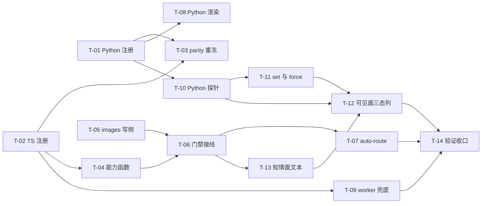

# Plan: mw-vision-role

- key: `mw-vision-role` · design 已定稿（D-001…D-012）· 19 AC（AC-018 OBSOLETE → 有效 18）/ 19 VC
- 基线：design 阶段零代码改动；代码面 = 当前工作区（`worker-mode.ts` 有**他人未提交改动**，见 R1）
- 定位：主交付 = `vision` 角色/类型 + 派发期能力门禁 + auto-route（只换模型）+ worker 兜底 + 配置期探针与能力可见面 + PM 知情面

---

## 1. 并行度分析（按**文件边界**切写面）

### 1.1 写面清单（同一文件同一时刻只允许一个 worker）

| 文件 | 归属任务（串行链） | 备注 |
|---|---|---|
| `packages/multi-workers/mw_common.py` | T-01 → T-10 → T-12 | 三处区域互不重叠：角色/类型表段（`:124-140`）/ 探针段（新，邻 `:1276` seam 风格）/ doctor JSON+文本段（`:1256-1273`、`:2298-2308`） |
| `packages/multi-workers/autopilot/dispatch.py` | T-01 → T-08 | `REGISTRY` 段（`:57-71`）/ `render_task_md` 段（`:253`、`:295-318`） |
| `packages/multi-workers/mw.py` | T-11 → T-12 | `cmd_model` set 段（`:3143-3152`）/ show 段（`:3210-3235`）+ argparse（`:5127-5138`） |
| `.../agent-team-loop/shared/dispatch-models.ts` | T-02 → T-04 | 表段（`:58-79`）/ 能力函数段（新，邻 `validateModelValue :166`） |
| `.../agent-team-loop/pm/ui-bridge.ts` | T-05 → T-06 → T-07 → T-12 → T-13 | **唯一热点**，五段串行：frontmatter `images` 写侧（`:1040-1095`）/ 门禁（`:1050-1054`）+ 两入口（`:1194-1272`、`:1594-1648`）/ auto-route（`:1036` 前）+ 回显 / doctor TS 渲染（`:1755-1766`）/ 四处文案（`:1146`、`:1554`、`:1993`） |
| `.../agent-team-loop/worker/worker-mode.ts` | T-02 → T-09 | `TOOL_ALLOWLISTS` 段（`:52-83`）/ `TaskMeta`+兜底段（`:234-266`、`:268-330`、`:693-704`、`:738`） |
| `.../agent-team-loop/shared/mw-runner.ts` | T-12 | `DoctorJson.dispatch` 类型（`:380-385`） |
| `.../agent-team-loop/pm/pm-orchestrator.ts` | T-13 | `PARALLEL_PROTOCOL`（`:650-658`） |
| 测试语料（Python 4 文件 + TS 2 文件） | T-03、T-08、T-11、T-12、T-13、T-14 | 见各卡 |

**测试文件归属规则（避免并行踩踏）**：每个编码任务**新建自己的 TS 测试文件**（`agent-team-loop-vision-gate.test.ts` / `-vision-autoroute.test.ts` / `-image-cap.test.ts`）；共享文件只有 `agent-team-loop.test.ts`（T-03 波 1 表断言 / T-12 波 3 重冻）、`test_autopilot_l0.py`（T-03 波 1 / T-13 波 2）、`test_dispatch_models.py`（T-11 波 2 / T-12 波 3）——两两分处不同波次，串行无交叠。

### 1.2 波次（波内文件边界互斥 ⇒ 可同时开工）

| 波 | 任务 | 独占写面 | 依赖 |
|---|---|---|---|
| **0** | T-01 Python 侧注册 | `mw_common.py`（表段）、`autopilot/dispatch.py`（REGISTRY 段） | — |
| | T-02 TS 侧注册 | `dispatch-models.ts`（表段）、`worker-mode.ts`（ALLOWLIST 段） | — |
| | T-05 `images:` 写侧与头部顺序 | `ui-bridge.ts`（frontmatter 段） | — |
| **1** | T-03 parity 语料重冻 | `test_autopilot_l0.py`、`test_mwpp_collection_parity.py`、`test_autopilot_dispatch.py`、`agent-team-loop.test.ts` | T-01, T-02 |
| | T-04 能力判定纯函数 | `dispatch-models.ts`（能力段） | T-02 |
| | T-06 派发期门禁接线 | `ui-bridge.ts`（门禁段 + 两入口） | T-04, T-05 |
| | T-08 Python `images:` 渲染 | `autopilot/dispatch.py`（render 段）、`test_autopilot_readcap_injection.py` | T-01 |
| | T-10 Python 探针 | `mw_common.py`（探针段）、`test_common.py`/`test_serve_doctor.py` | T-01 |
| **2** | T-07 auto-route 与留证 | `ui-bridge.ts`（auto-route 段） | T-06 |
| | T-09 worker 兜底 | `worker-mode.ts`（兜底段）、`agent-team-loop-image-cap.test.ts`（新） | T-02 |
| | T-11 `model set` 拒绝与 `--force` | `mw.py`（set 段 + argparse） | T-10 |
| | T-13 PM 知情面四处文本 | `ui-bridge.ts`（文案段）、`pm-orchestrator.ts`、`test_autopilot_l0.py` | T-06 |
| **3** | T-12 能力可见面（show/doctor 三态列） | `mw_common.py`（doctor 段）、`mw.py`（show 段）、`mw-runner.ts`、`ui-bridge.ts`（渲染段）、`test_dispatch_models.py`、`agent-team-loop.test.ts` | T-10, T-11, T-13 |
| **4** | T-14 验证收口与证据账本 | —（只跑命令 + 写 `evidence/runs/`） | 全部 |

最大并行度 = 5（波 1）。热点 `ui-bridge.ts` 是一条 5 段串行链（T-05→T-06→T-07→T-12→T-13），`mw_common.py` 与 `worker-mode.ts` 各 2-3 段串行；其余可插空。

---

## 2. 契约冻结（并行 worker 逐字遵守，不得重定义）

### 2.1 命名与排序

- 角色名 = 类型名 = **`vision`**；`DISPATCH_ROLES` 追加末尾 → `("main","coding","review","research","vision")`
- `TASK_TYPE_TO_ROLE["vision"] = "vision"`；`DISPATCH_ROLE_BY_TYPE["vision"] = "vision"`；`DISPATCHABLE_TYPES` 追加末尾 → `["coding","review","research","rag-research","vision"]`
- 工具白名单（两侧同序逐元素）：`["read","write","edit","bash","find","grep","ls"]`
- `REGISTRY["vision"]`：`conductor_dispatchable=True`，`tools` 同上，`cli/provider` 同 `coding` 条目口径

### 2.2 `images:` 头（文件契约，两侧唯一写法）

- 位置：`type:` →（`phase:` 若在）→ `images:` → `model:`；未声明时**零字节**（不得出现该行）
- 取值：`images: yes` / `images: no`；JS/TS 入参类型 `"yes" | "no" | undefined`；Python 渲染参数 `images: str | None = None`，**用真值判断** `if images:`
- 读侧 5 点（`worker-mode.ts:268`、`state.py:153`、`launcher.py:143`、`mw.py:1786`、`task-dispatcher.ts:115`）都是键前缀/整内容扫描，**不改**、无行序要求

### 2.3 能力判定（三态，唯一语义）

- TS：`modelImageCapability(registry, cli, provider, value): "yes" | "no" | "unknown"`
  - `"unknown"` 覆盖：空值 / registry `undefined` / `cli !== "pi"` / `codex_cli|claude_cli` 前缀 / 未知前缀 / 无 provider / 该 provider 无任何 id / `find` 未命中
  - `"yes"`/`"no"` 仅当 `registry.find(provider, modelId)` 命中且 `input.includes("image")` 为真/假
- Python：`model_capabilities(values) -> dict[str, str]` + `model_images(value) -> str`，一次全量 `pi --list-models` 快照，进程内记忆化，**超时 3.0s**，`shutil.which("pi")` 解析（禁用裸 `["pi",...]`），按 (provider, model) 两列**精确相等**取值，按 token 形状过滤数据行（worker env 会前置 `[worker] start ...`）
  - 缺失（未认证 provider / 模型不存在）→ `"unknown"`，**绝不** `"no"`
- **fail-open 铁律**：门禁只在判定 `"no"` 时拒绝

### 2.4 auto-route（只换模型）

- 触发：无显式 `model:` + 检测到图片需求 + 该类型角色模型判定 `"no"` + `vision` 已配置且判定 `"yes"`
- 动作：`model:` 取 `vision` 角色值；**`type:` 行一字不改**；`model-reason:` 追加 `auto-route: <src-role> -> vision`；回显（`:1272` / `:1648`）显示生效模型与 `model-source: auto-route`
- 阻断：显式 `model:` 一律不改写（走门禁拒绝）；`vision` 未配置或判定非 `"yes"` → 走门禁拒绝
- 顺序：解析显式 type/model → auto-route → 能力门禁 → 回显

### 2.5 错误与留证字面量（不得改写）

- 门禁拒绝消息必须同时含：`images`、`mw model set vision`、`images: no`
- worker 兜底机读行：`[IMAGE-CAP] model=<id> provider=
 task=<key> declared=images:yes`（写 `worker.log`），同时 `appendError` 到 trace.log 并 `writeOutput({exitCode:1,...})`，`process.exit(1)`
- doctor 能力不匹配：落 **suggestions**（不得落 issues，否则退出码必为 1）；`images=no` 的提示串含 `mw model set vision`
- 能力列格式：`role=value images=<yes|no|unknown>`（`mw model show` 行尾追加 ` images=<v>`）

### 2.6 不变量

- 未声明图片需求的任务产物**逐字节不变**（TS 计划输出、Python 渲染、7 处 golden 除 1 条签名 `extra` 外全绿）
- `_doctor_dispatch` 缺 `dispatch.yml` 时仍只返回 `{"exists": False}`（不得新增键）
- 探针**不进**常驻热路径（只用 `model set/show/doctor`）；`doctor_report` 的 `elapsed < 5` 断言不得被探针拖垮（故 3s 上限）
- 不新增 provider/凭证面；不改 pi 核心（含 `list-models.ts`）
- 不 `git add -A`；不碰他人未提交改动（R1）

---

## 3. 任务表（落成 `tasks/T-*.md`）

| 任务 | 名称 | 波 | AC | VC | 核心交付 |
|---|---|---|---|---|---|
| T-01 | Python 侧注册 | 0 | AC-004, AC-019 | VC-004, VC-019 | `mw_common.py` 角色/类型表 + `dispatch.py REGISTRY["vision"]` |
| T-02 | TS 侧注册 | 0 | AC-004, AC-005 | VC-004, VC-005 | `dispatch-models.ts` 表 + `worker-mode.ts TOOL_ALLOWLISTS["vision"]` |
| T-05 | `images:` 写侧与头部顺序 | 0 | AC-007, AC-009 | VC-007, VC-009 | `planDispatchFrontmatter` 接收 `images` 并条件渲染 |
| T-03 | parity 语料重冻 | 1 | AC-004, AC-005, AC-019 | VC-004, VC-005, VC-019 | 4 个测试语料/键集同步 + 新增 TS 半边断言 |
| T-04 | 能力判定纯函数 | 1 | AC-008 | VC-008 | `modelImageCapability` + `detectImageNeed` + 单测 |
| T-06 | 派发期门禁接线 | 1 | AC-006, AC-008 | VC-006, VC-008 | 两入口拒绝/放行/fail-open + 零副作用 |
| T-08 | Python `images:` 渲染 | 1 | AC-009 | VC-009 | `render_task_md(images=...)` + 冻结副本零字节用例 + `extra` 同步 |
| T-10 | Python 探针 | 1 | AC-010, AC-013 | VC-010, VC-013 | `model_capabilities`/`model_images` + 三态单测 + 注入 seam |
| T-07 | auto-route 与留证 | 2 | AC-016, AC-017 | VC-016, VC-017 | 只换模型 + `model-reason: auto-route` + 回显 |
| T-09 | worker 兜底 | 2 | AC-011 | VC-011 | `TaskMeta.images` + `[IMAGE-CAP]` 三通道 + exit 1 |
| T-11 | `model set` 拒绝与 `--force` | 2 | AC-001, AC-002, AC-013 | VC-001, VC-002, VC-013 | 配置期能力拒绝 + `--force`（仅 vision） |
| T-13 | PM 知情面四处文本 | 2 | AC-014 | VC-014 | 工具描述/`/worker` USAGE/`/mw model set` USAGE/`PARALLEL_PROTOCOL` |
| T-12 | 能力可见面（三态列） | 3 | AC-010, AC-015 | VC-010, VC-015 | JSON 段 + Python 文本 + TS 类型/渲染 + `model show` 列 |
| T-14 | 验证收口与证据账本 | 4 | AC-012 | VC-012 | 触达面全量 + check + 人工 L2 + `evidence/runs/` |

依赖图（mermaid 边标签无引号）：

---

## 4. 风险登记

| # | 风险 | 触发条件 | 缓解 |
|---|---|---|---|
| R1 | `worker-mode.ts` 有**他人未提交改动**（165+/13-，行号已漂移） | 并行会话同改一文件 | 编码前 `git diff --stat` 复核；以工作区现值为锚（`TaskMeta:234`/`session_start:738`）；T-02/T-09 只在自己的段内改；提交时只 `git add` 本 key 文件 |
| R2 | `ui-bridge.ts` 五段串行踩踏 | 并行派发 | 波次表锁单链；每段声明独占区域；开工前 `git diff` 确认他段未动 |
| R3 | 门禁误拒（把合法任务拒掉） | 能力判定把 `unknown` 当 `no` | VC-008 三条 fail-open 用例 + VC-006 只在 `no` 时拒 |
| R4 | `images:` 头破坏既有 golden | 无条件渲染 | VC-009：`images=""` 与 `None` 都零字节 + 冻结副本比对（**禁用** `test_baseline_left_end_bound`，它本机已红） |
| R5 | doctor 加列打破接合处子串 | 行内插列 | D-011 方案 A：只重冻 `agent-team-loop.test.ts:5029-5031` 一条渲染期望；`test_dispatch_models.py:473/475` 早退分支不得新增键 |
| R6 | 能力不匹配落 issues ⇒ doctor 退出 1 | 实现者忽略 healthy 语义 | AC-010 已 `[REVISED]` 为 suggestion；T-12 必须断言三情形 `rc=0` |
| R7 | `--force` 新增 flag 打破既有 Namespace 构造 | `test_dispatch_models.py:423 _model_args` 直造 Namespace | T-11 同步补 `force=False`（或用 `getattr` 兜底），二者取一并写明 |
| R8 | 探针拖垮 doctor 的 `<5s` | 探针超时用 5s | 探针上限 3.0s（实测 0.8-0.96s）+ 只在有配置角色时触发 |
| R9 | parity 重冻掩盖真实回归 | 只改期望不改语义 | 只做**新增**（键/类型/白名单），逐例 diff 后重冻；两侧都跑（P-021） |
| R10 | PM 侧"能派但不提示" | 只改 `DISPATCHABLE_TYPES` | T-13 强制四处文本 + VC-014 的 token 集合断言（== `DISPATCHABLE_TYPES ∪ {"codex"}`） |
| R11 | 测试空洞（断言"存在即过"） | 只验 `ok:true`/文件存在 | 每卡附非空洞对照：还原缺陷 ⇒ 对应 VC 变红（P-016） |
| R12 | Windows 基线噪声误判 | 跑全量 | 先跑触达面命令；全量时只比 `failed <= 76` 且禁止 `agent-team-loop*`/`worker-mode*`/`dispatch-models*` 失败 |
| R13 | 真进程 L2 缺失导致"兜底未实证" | 无真 worker 进程基建 | T-14 人工跑一次真派发（`images: yes` + 纯文本模型）留存 `worker.log` 原文与退出码 |

---

## 5. 验收与收口顺序

1. **波内自检**：每卡完成即跑该卡 `[VERIFY]` 命令 + 非空洞对照（还原缺陷 ⇒ 变红）。
2. **波间**：`npx biome check --error-on-warnings <scoped>` + `npx tsgo --noEmit`（**不跑**全仓 `npm run check`，P-017 会 `--write` 他人文件）。
3. **触达面全量**（T-14）：
   `cd packages/multi-workers; python -m pytest test_dispatch_models.py test_autopilot_l0.py test_autopilot_dispatch.py test_mwpp_collection_parity.py test_serve_doctor.py test_rag_phase.py test_autopilot_readcap_injection.py -q -s`
   `cd packages/coding-agent; node ../../node_modules/vitest/dist/cli.js --run test/extensions/agent-team-loop.test.ts test/extensions/agent-team-loop-image-cap.test.ts`
4. **基线对照**：`test_autopilot_readcap_injection.py::test_baseline_left_end_bound` 本机已红（与 images 无关），红集合不得新增。
5. **人工 L2**：真进程派发一次 `images: yes` + 纯文本角色模型（期望 `[IMAGE-CAP]` + 非零退出）；一次真实视觉派发（期望 trace 出现图片内容块而非降级行）。
6. **收口**：`/quality-gate` 逐 AC/VC 核销（对照 `evidence-requirement.md`）→ `achieved.md`（含「## 系统行为变化」「## 遗留」）→ `advance_phase done`。
