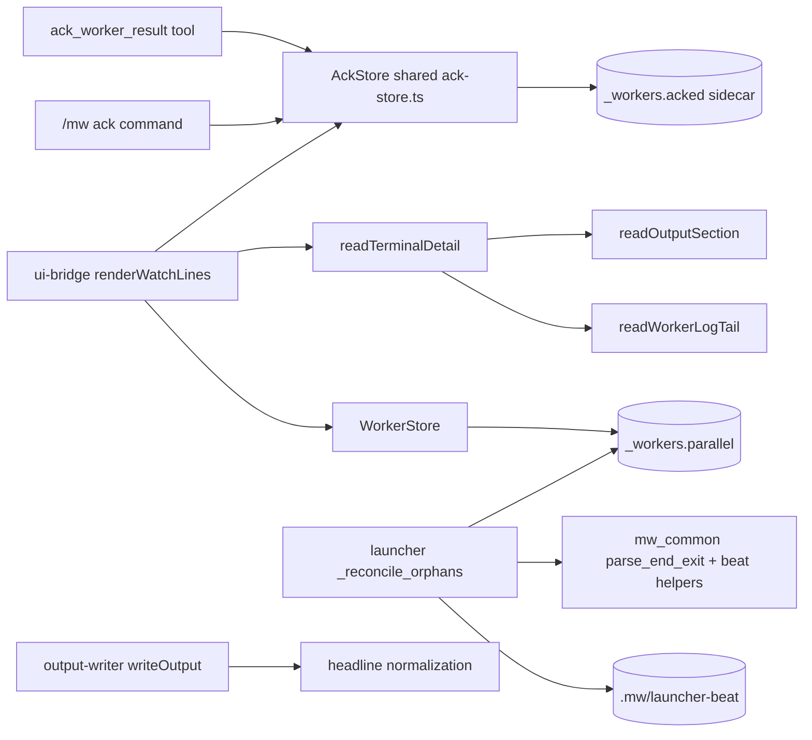
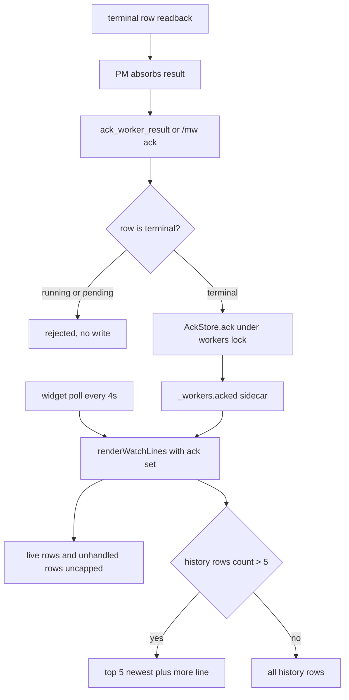
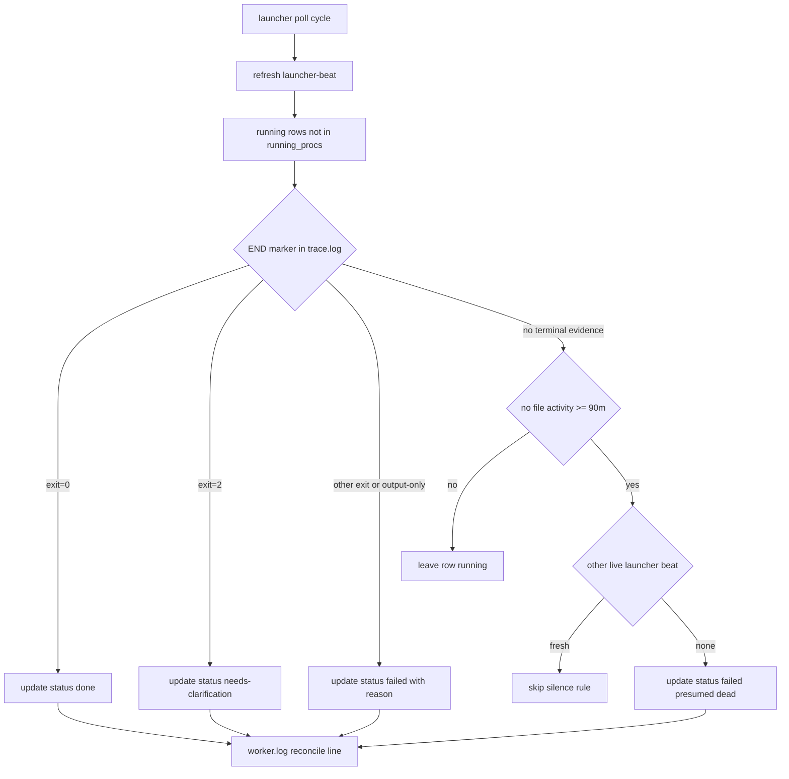

# Design: mw-widget-terminal-lifecycle

## §0 设计前提锚定

- spec_path: `.agenticdoc/mw-widget-terminal-lifecycle/spec.md`
- spec_locked_at: 2026-09-10T12:13:52+08:00
- ac_count: 13
- ac_ids: AC-001, AC-002, AC-003, AC-004, AC-005, AC-006, AC-007, AC-008, AC-009, AC-010, AC-011, AC-012, AC-013

## §1 架构选型

### D-001 ack 持久化（sidecar 文件）
- 选择：`.agenticdoc/_workers.acked`，行格式 `taskKey | ackedAtIso`。写入持 `.mw/workers.lock`（与队列同锁）+ tmp+rename 原子替换；读取为无锁全量读（小文件）。语义为**项目级**（多窗口共享：任一 PM 窗口 ack 后，所有窗口的 widget 同步折叠）。
- 否决：队列第 9 列（TS/Python 解析器只容忍 7/8 列，静默丢弃）；新 status 值 `acked`（破坏 Python `_TERMINAL_STATUSES`/doctor non_terminal 语义，且「是否已吸收」与「终态」是正交维度）；ack 时删行归档 `_workers.stale.parallel`（dispatchNewTasks 的 dispatched 集合丢失 → task.md 仍在时重复派发）。
- 调研：`evidence/research/design-ack-and-reconcile-2026-09-10.md`（发现 6/7）、`spec-widget-terminal-forensics-2026-09-10.md`（发现 5/6）

### D-002 ack 通道（命令 + agent 工具）
- 选择：`/mw ack <task-key> | all` 子命令（registerMwCommands 扩展，注入 workerStore/ackStore）+ `ack_worker_result` 工具（registerWorkerTools 处注册，参数 `task_key: string`，`"all"` 为特殊值）。两通道收敛到 `AckStore.ack()`；返回 acked/rejected 明细。工具注册在 PM 激活路径，worker 模式（PI_WORKER_TASK 分支）构造上不经过 → AC-005 由 index.ts 分支保证，无需运行时判断。
- 否决：仅命令（PM 循环是 agent 驱动，必须 agent 可调）；仅工具（用户手动回收场景需要命令）。
- 调研：`design-ack-and-reconcile-2026-09-10.md`（发现 1）

### D-003 widget 分区渲染
- 选择：`renderWatchLines` 重构为三区——**live**（running/pending，实时 detail 不变，不折叠）→ **unhandled**（failed/needs-clarification 且未 ack，不折叠）→ **history**（done ∪ 已 ack 终态，按 updatedAt 新→旧，上限 5 行，超出 `  ... +N more`）。`WATCH_MAX_TASK_LINES=6` 废弃，新增 `WATCH_HISTORY_MAX=5`。header 计数行在存在未 ack 终态行时追加 `N unhandled`。ack 集合每 tick 由 `AckStore.readAll()` 读入（4s 轮询既有节奏，无新轮询）。
- 否决：TTL 自动隐藏（用户明确否决）；单区 + 排序（现状，待处理信息被历史挤占）。
- 调研：`spec-widget-terminal-forensics-2026-09-10.md`（发现 1）

### D-004 终态 detail 取源（按状态分派 + 回退链）
- 选择：`readTerminalDetail(taskDir, status)` 统一产出，全部 `trunc(110)`：
  - failed → `readSpawnFailure`（现状，剥 `[launcher]` 前缀）?? `## Exit Reason` 首行
  - needs-clarification → `## Questions` 首行 ?? worker.log 尾条非空行（仅文件 ≤256KB 时读）?? `no output.md` 提示
  - done → `## TL;DR` 首行 ?? 清洗后的 `## Summary` 首行
  - 清洗规则（旧文件回退与 TL;DR 共用）：取首个非空行，剥离开头 `#{1,6} ` / `**` / `[-*] ` / `> ` 标记，折叠空白
- 否决：统一取 Summary 首行（现状，质量随模型波动、失败行丢失机器原因）。
- 调研：`design-terminal-summary-quality-2026-09-10.md`（发现 5/6/7）

### D-005 TL;DR 归一化（worker 侧写入 + starter 引导）
- 选择：`writeOutput` 在 `## Summary` 之前新增首节 `## TL;DR`，内容 `headline(summary)`：首个非空行 → 剥 markdown 标记 → 折叠空白 → 截断 100 字符，无内容时 `(no conclusion)`。`_starter_prompt`（launcher.py，跨 CLI 唯一注入点）追加一句：最终回复第一行必须是单行结论（状态 + 关键产出/卡点）。deadline steer 文案同步提及首行结论。
- 否决：仅 widget 侧清洗（旧样本已证伪——纯前导句无法机器识别，须源头引导）；仅 prompt 引导（模型不保证遵守，需归一化兜底）。
- 调研：`design-terminal-summary-quality-2026-09-10.md`（发现 1/2/3/4）

### D-006 reconcile 执行者（launcher）
- 选择：reconcile 逻辑在 launcher `_poll_once` 内执行，只处理 `status==running 且 task_key ∉ running_procs` 的行；状态写复用 `_update_status`（持锁单写者）。TS 侧不参与（显示层只读）。
- 否决：TS poll loop reconcile（running_procs 是 launcher 进程内存态，TS 无归属信息，会把活体行误判；且打破队列单写者原则）。
- 调研：`design-ack-and-reconcile-2026-09-10.md`（发现 2/3）

### D-007 reconcile 判据（正证据 + 静默窗口）
- 选择：
  - **正证据**（每 poll 无条件执行）：任务目录 trace.log 含 `[END]` → 按 exit 码映射（0→done、2→needs-clarification、其他→failed）；仅 output.md 存在而无 `[END]`（旧 bundle）→ failed，原因注明「completed without END marker, status unverifiable — read output.md」。两者都在 worker.log 追加 `[launcher] reconcile (<ts>): <reason>`。
  - **静默窗口**：无终态证据（无 output.md 且无 `[END]`）且 `max(任务目录全部文件 mtime, 行 updated_at)` 早于当前 ≥ `ORPHAN_DEAD_AFTER`（默认 90 分钟，env `PI_WORKER_ORPHAN_DEAD_MIN` 覆盖）→ failed + `presumed dead (no activity for <X>m)` 原因行。窗口内任何新鲜活动（心跳等）→ 行保持 running。
  - 时间戳统一 UTC 解析（spec §2.1）。
- 否决：启动时一次性 reconcile（serve 长驻期间的晚期孤儿无人收敛）；正证据也走退让检查（终态事实无需退让，双 launcher 幂等收敛）。
- 调研：`design-ack-and-reconcile-2026-09-10.md`（发现 4/8/9）、`spec-orphan-running-reconcile-2026-09-10.md`（发现 3/4/6/7）

### D-008 launcher beat 协议（静默规则防误杀）
- 选择：launcher 每 poll 刷新 `.mw/launcher-beat`（内容 `pid=<pid>`、`ts=<iso>`）。静默规则执行前检查：beat 新鲜（<30s）且 pid≠self 且该 pid 存活 → 跳过静默 reconcile（另一 launcher 在管）。正证据规则不受 beat 约束。文件缺失/过期/无法解析 → 视为无其他 launcher，正常执行。
- 否决：进程全表扫描找 python launcher（无可靠归属判据）；不做防误杀（kill -9 场景双 launcher 真实存在）。
- 调研：`design-ack-and-reconcile-2026-09-10.md`（发现 5）

### D-009 测试与回归策略
- 选择：TS 侧扩展现有 `packages/coding-agent/test/extensions/agent-team-loop.test.ts`（ack 往返/分区渲染/detail 取源/通道注册/防重派发/hint 文案），Python 侧扩展 `packages/multi-workers/test_launcher.py`（正证据三映射/output.md-only/静默窗口/own 行不动/beat 退让）。两侧既有套件零回归；`npm run check` 全绿。
- 否决：新建 e2e 套件（行为均为纯函数/文件协议层，L1 可全覆盖；无真实 LLM 依赖）。
- 调研：`design-terminal-summary-quality-2026-09-10.md`（样本回测）、`design-ack-and-reconcile-2026-09-10.md`（发现 4/5 的可测性）

## §2 核心结构 / 类图



## §3 模块划分

```
packages/coding-agent/src/extensions/agent-team-loop/
├── shared/
│   ├── ack-store.ts        [新] AckStore：readAll() / ack(keys)——lock + tmp + rename，workers.lock
│   ├── worker-store.ts     [不变]
│   ├── heartbeat.ts        [不变]
│   └── file-lock.ts        [不变]
├── pm/
│   ├── ui-bridge.ts        renderWatchLines 分区重构；readOutputSection / readTerminalDetail /
│   │                       readWorkerLogTail；/mw ack 子命令；ack_worker_result 工具；list_tasks acked 徽标
│   └── pm-orchestrator.ts  PM_CONTINUE_HINT 追加 ack 指示；poll loop 构造 AckStore 传入 render
└── worker/
    ├── output-writer.ts    writeOutput 增 TL;DR 首节 + headline() 归一化
    └── worker-mode.ts      [不变]（summary 透传，deadline steer 文案微调）

packages/multi-workers/
├── launcher.py             _starter_prompt 首行结论指令；_poll_once 增 _reconcile_orphans + beat 刷新
└── mw_common.py            parse_end_exit(task_dir)；launcher_beat_write/other_live_launcher；
                            ORPHAN_DEAD_AFTER 解析（env PI_WORKER_ORPHAN_DEAD_MIN，默认 90）
```

职责边界：ack 生命周期 = TS（展示语义 + PM 工作流）；队列状态收敛 = Python launcher（单写者）；两者只通过文件协议（`_workers.parallel` / `_workers.acked` / 任务目录证据）交互。

## §4 接口与集成

### 4.1 对外接口清单

| 接口 | 签名 / 形式 | 说明 |
|------|------------|------|
| AckStore.readAll | `readAll(): Map<string, string>` | taskKey → ackedAt（ISO）；文件缺失返回空 Map |
| AckStore.ack | `ack(taskKeys: string[]): Promise<{ acked: string[]; rejected: string[] }>` | 持锁合并写入；幂等（覆盖时间戳） |
| readOutputSection | `(taskDir: string, section: "Exit Reason" \| "Questions" \| "TL;DR") => string \| undefined` | 泛化自 readOutputSummary |
| readTerminalDetail | `(taskDir: string, status: WorkerStatus) => string` | D-004 回退链，已截断 |
| renderWatchLines | `(indexStore, workerStore, ackStore, agenticdocRoot, key) => string[]` | 签名扩展（ackStore 参数） |
| /mw ack | `/mw ack <task-key> \| all` | 终态行 ack；非终态拒绝并提示 |
| ack_worker_result | tool `{ task_key: string }`（`"all"` 特殊值） | PM-only 注册（index.ts 分支保证） |
| _reconcile_orphans | `_reconcile_orphans(project_dir, running_procs) -> None`（launcher 内部） | D-006/D-007 判据 |
| parse_end_exit | `parse_end_exit(task_dir: Path) -> int \| None`（mw_common） | 镜像 TS END_LINE_RE |
| launcher beat | `launcher_beat_write(project_dir, pid)` / `other_live_launcher(project_dir, self_pid) -> bool` | D-008 协议 |
| headline | `headline(summary: string) => string`（output-writer 导出） | D-005 归一化（测试直测） |

### 4.2 外部依赖集成

- `dispatchNewTasks`（pm-orchestrator.ts）：不变——ack 不动队列行，dispatched 集合语义保持
- 终态 readback（startWorkerPollLoop）：不变——reconcile 产生的终态转移同样触发一次 readback，PM 走既有超时处置分支（PM_CONTINUE_HINT）
- mw doctor：不读 `_workers.acked`；worker_liveness 保持提示性（spec §1.4 排除项）

## §5 Function Flow





## §6 Coverage Matrix

| ID | 功能点 | 正常路径 | 边界测试 | 异常路径 | 验证层级 |
|----|--------|---------|---------|---------|---------|
| F1 | ack 写入与持久化 | 单行 ack 落盘 | all / 重复 ack 幂等 | 非终态行拒绝 | L1 |
| F2 | widget 分区渲染 | live/unhandled/history 三区 | history=5/6 折叠边界；无 ack 文件 | 空 key / 无任务 | L1 |
| F3 | 终态 detail 取源 | 三状态各自首选源 | 行宽截断、空节 | 无 output.md 回退链 | L1 |
| F4 | TL;DR 归一化 | 合格首行直通 | 100 字符截断、markdown 剥离 | 空Summary fallback | L1 |
| F5 | ack 通道 | 命令/工具等效 | all 语义 | worker 模式不注册 | L1 |
| F6 | 防重派发 | ack 后 dispatchNewTasks 不重派 | task.md 仍在 | — | L1 |
| F7 | reconcile 正证据 | [END] 0/1/2 三映射 | output.md-only；≤1 poll 周期 | own 行不动 | L1 |
| F8 | reconcile 静默 | 90m 无活动 → failed | 窗口内新鲜活动不动 | 另一活 beat 退让 | L1 |
| F9 | PM 提示与 list_tasks | hint 含 ack 指示 | — | — | L0/L1 |

## §7 Verification Contract

VC-001: 当构造 3 running + 2 pending 行输入 renderWatchLines 时，输出包含全部 5 行任务行且不含 more 行
       Layer: L1
       Output: [VERIFY] VC-001: live_rows=5, more_line=absent
       Source: AC-001

VC-002: 当存在 3 个未 ack failed 行且 ack 其中 1 个后重新渲染时，unhandled 区含剩余 2 行、被 ack 行出现在 history 区
       Layer: L1
       Output: [VERIFY] VC-002: unhandled=2, history_contains=acked_key
       Source: AC-002

VC-003: 当 history 候选（done + 已 ack 终态）为 7 行时，输出 history 5 行 + `... +2 more`；为 5 行时无 more 行
       Layer: L1
       Output: [VERIFY] VC-003: history_lines=5, more=+2 / more=absent
       Source: AC-003

VC-004: 当执行 /mw ack t1（终态行）后，_workers.acked 存在 `t1 | <ISO>` 记录且新 AckStore 实例可读出；/mw ack all 覆盖全部未 ack 终态行；对 running 行 ack 返回错误且文件无该 key
       Layer: L1
       Output: [VERIFY] VC-004: acked=t1, persisted=yes, all_covered=N, rejected=t-running
       Source: AC-004

VC-005: 当 pmActivate 注册工具后 registry 含 ack_worker_result；当 PI_WORKER_TASK 置位激活 worker 模式时 registry 不含；工具调用 ack 效果与命令一致
       Layer: L1
       Output: [VERIFY] VC-005: pm_registered=true, worker_registered=false, tool_ack=equivalent
       Source: AC-005

VC-006: 当 ack 前后快照 _workers.parallel 各行 status 列并触发 dispatchNewTasks（task.md 保留）时，status 逐行相等且不新增 pending 行
       Layer: L1
       Output: [VERIFY] VC-006: status_diff=0, re_dispatch=0
       Source: AC-006

VC-007: 当 failed 行任务目录含 `## Exit Reason` 节时，widget 行 detail 等于该节首行（截断）；spawn 失败行 detail 等于剥除前缀的原因；detail 不以 #/**/- 开头
       Layer: L1
       Output: [VERIFY] VC-007: detail_source=exit_reason, markdown_prefix=absent
       Source: AC-007

VC-008: 当 needs-clarification 行分别提供 Questions 节 / 无 Questions 但有 worker.log / 两者皆无时，detail 依次为 Questions 首行 / worker.log 尾行 / no-output 提示
       Layer: L1
       Output: [VERIFY] VC-008: fallback_chain=questions,log_tail,no_output
       Source: AC-008

VC-009: 当 done 行任务目录含 TL;DR 时 detail 等于 TL;DR（≤100 字符、无 markdown 标记）；仅含 Summary 时 detail 等于剥离标记后的 Summary 首行
       Layer: L1
       Output: [VERIFY] VC-009: tldr_len<=100, markdown_prefix=absent, fallback=cleaned_summary
       Source: AC-009

VC-010: 当检查 PM_CONTINUE_HINT 常量字符串时，包含 ack_worker_result 指示
       Layer: L0
       Output: [VERIFY] VC-010: hint_contains=ack_worker_result
       Source: AC-010

VC-011: 当 list_tasks 输出含已 ack 与未 ack 终态行时，前者带 acked 标记、后者无
       Layer: L1
       Output: [VERIFY] VC-011: acked_badge=present_on_acked_only
       Source: AC-011

VC-012: 当孤儿 running 行任务目录 trace.log 分别含 [END] exit=0/1/2 时，1 个 poll 周期内行更新为 done/failed/needs-clarification 且 worker.log 含 reconcile 行；仅 output.md 时更新为 failed 且原因含 unverifiable；running_procs 内的行不被触碰
       Layer: L1
       Output: [VERIFY] VC-012: map=0-done,1-failed,2-nc, output_only=failed+unverifiable, own_row=untouched
       Source: AC-012

VC-013: 当孤儿行无终态证据且 mtime/updated_at 均 ≥90m 前时行更新为 failed 且 worker.log 含 `[launcher] reconcile`；任一证据新鲜时行保持 running；另一存活 launcher beat 新鲜时静默规则跳过
       Layer: L1
       Output: [VERIFY] VC-013: silence_failed=1, fresh_untouched=1, beat_guard=skipped
       Source: AC-013

## §8 AC → VC 映射表

| AC ID | AC 摘要 | 对应 VC | 路径分类 |
|-------|--------|---------|---------|
| AC-001 | live 行全部显示不折叠 | VC-001 | 正常 |
| AC-002 | 未 ack 终态待处理行常驻，ack 后移出 | VC-002 | 正常 |
| AC-003 | history 折叠 5 + more | VC-003 | 边界 |
| AC-004 | /mw ack 持久化/幂等/拒绝非终态 | VC-004 | 正常+异常 |
| AC-005 | ack_worker_result 工具 PM-only | VC-005 | 正常 |
| AC-006 | ack 不改队列、不重派 | VC-006 | 正常 |
| AC-007 | failed detail = Exit Reason | VC-007 | 正常 |
| AC-008 | nc detail = Questions + 回退链 | VC-008 | 正常+异常 |
| AC-009 | done detail = TL;DR/清洗回退 | VC-009 | 正常+边界 |
| AC-010 | hint 含 ack 指示 | VC-010 | 正常 |
| AC-011 | list_tasks acked 徽标 | VC-011 | 正常 |
| AC-012 | 孤儿行正证据 reconcile | VC-012 | 正常+异常 |
| AC-013 | 孤儿行静默 reconcile + beat 退让 | VC-013 | 边界+异常 |

## §9 非功能实现方案

- **性能**：widget 4s 轮询不变（ack 为小文件读）；launcher 5s poll 内 reconcile 每孤儿行 ≤ 数次 stat + 小文件尾部读（trace.log 只读尾部若干 KB）；beat 写为单行小文件每 5s 一次。无新进程/线程/轮询。
- **可观测性**：reconcile 决策落 worker.log（`[launcher] reconcile (<ts>): <reason>`，与 spawn failed 同族）；ack sidecar 自带时间戳可审计；widget header 的 `N unhandled` 是 PM 待处理队列的常驻计数。
- **安全**：ack 拒绝非终态行（防误吞 live 行）；reconcile 绝不触碰 own running_procs 行；静默规则双 launcher 退让；ack 文件仅 taskKey + ISO 时间戳，无敏感信息。
- **兼容**：队列 7/8 列协议不动（GC-4）；output.md 增节不破坏 readOutputSummary 正则；旧任务（无 TL;DR/无 [END]）均有回退路径。

## §10 决策记录

| D-ID | 决策点 | 选择 | 否决 | 理由 |
|------|--------|------|------|------|
| D-001 | ack 持久化 | sidecar `_workers.acked` + workers lock | 9 列 / 新 status / 删行归档 | 双侧解析器兼容；防重复派发 |
| D-002 | ack 通道 | 命令 + 工具双通道，PM-only 注册 | 单通道 | PM 循环与用户手动回收都需要 |
| D-003 | widget 分区 | live/unhandled 不折叠 + history 5+more | TTL / 单区排序 | 用户指令；待处理清单语义 |
| D-004 | 终态 detail | 按状态取源 + 回退链 | 统一 Summary 首行 | 机器原因/结论优先于模型原文 |
| D-005 | TL;DR | worker 侧归一化 + starter 引导 | 仅展示侧清洗 | 源头引导 + 兜底双保险 |
| D-006 | reconcile 执行者 | launcher（单写者） | TS poll loop | running_procs 归属知识只在 launcher |
| D-007 | reconcile 判据 | 正证据每 poll + 90m 静默窗口 | 仅启动时 / 无静默规则 | 晚期孤儿也要收敛；防误杀有量化窗口 |
| D-008 | beat 协议 | `.mw/launcher-beat` + 静默退让 | 进程扫描 / 不防护 | kill -9 双 launcher 真实存在 |
| D-009 | 测试 | L1 双侧扩展 + 零回归 | 新 e2e 套件 | 纯函数/文件协议层可全覆盖 |
