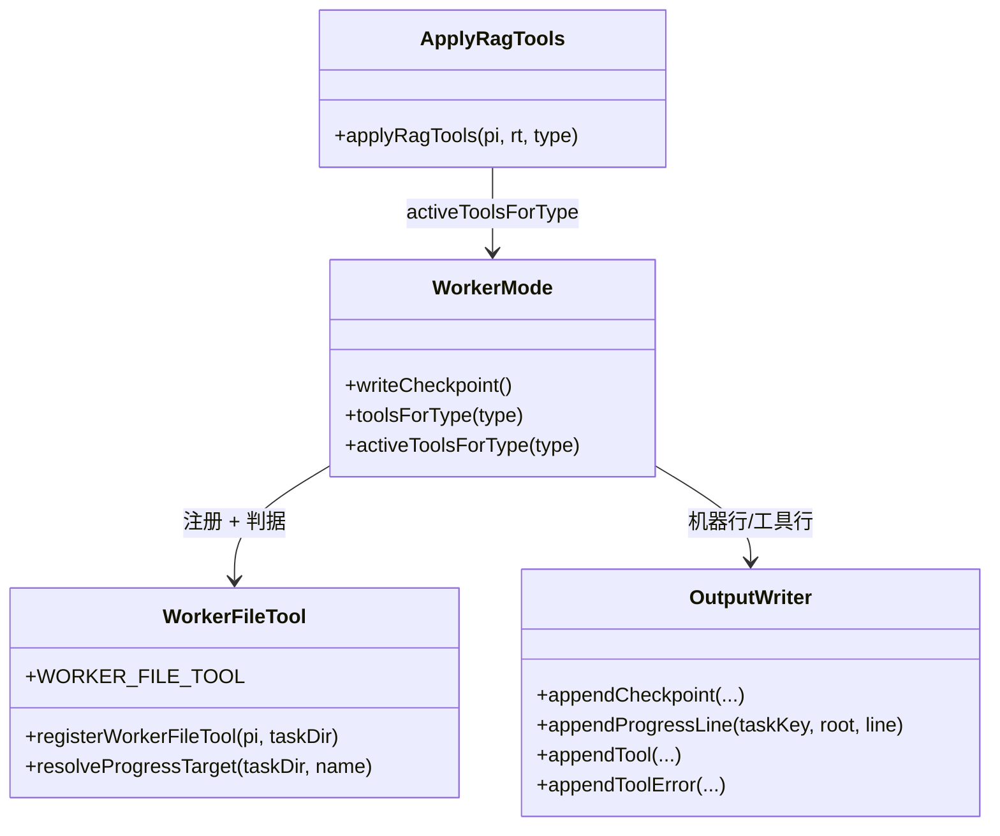
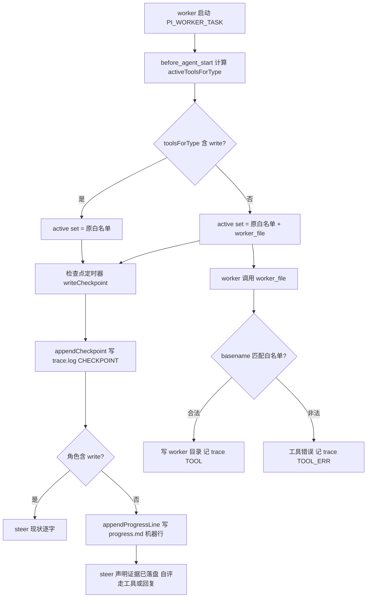

# Design: mw-worker-progress-persist

## §0 设计前提锚定

- spec_path: `.agenticdoc/mw-worker-progress-persist/spec.md`
- spec_locked_at: 2026-09-23
- ac_count: 11
- ac_ids: AC-001, AC-002, AC-003, AC-004, AC-005, AC-006, AC-007, AC-008, AC-009, AC-010, AC-011
- 关键前提证据：`evidence/research/spec-progress-persist-baseline-2026-09-23.md`（事故现场 + 根因 file:line）
- 用户已确认的三项范围决策（2026-09-23「按推荐」）：Q1 窄工具、Q2 `progress.md` + `report*.md`、Q3 机器行仅写给无写工具角色

## §1 架构选型

### D-101 落盘通道形态：扩展专用窄工具 vs 通用 write + 路径守卫

**需求摘要**：只读角色需要一条能落盘 progress.md/report 的通道，但不能因此获得任意路径写能力。

| 方案 | Pros | Cons |
|------|------|------|
| A. 给 review/research 白名单加 `write`/`edit` + `tool_call` 路径守卫 | 复用内置工具，agent 体验原生；无新工具 | 写入面=全盘减守卫；守卫失效即漏拦（P-004 先例：POSIX 词法在 Windows 路径上丢反斜杠）；`task.md`/`trace.log`/`worker.log` 与目标同目录，需额外 deny 名单 → 双重易错；白名单两侧 parity 必须同步改 |
| B. 注册专用窄工具（参数只有 basename + 内容 + 模式） | 无路径解析 → 穿越/漏拦在构造上不可能；框架证据文件不可达；`TOOL_ALLOWLISTS` 表不动 → Python parity 不受影响 | 新增工具面需进 active set 计算；agent 需学一个非内置工具名 |

**推荐**：`方案 B`
**理由**：`trace.log` / `worker.log` / `output.md` 是 PM 升级裁决直接引用的机器证据（bundle `agent-team-loop.js:22391`），写面一旦扩大到同目录的通用 write，就必须靠 deny 名单兜底；而 B 把「可写文件名」做成唯一输入，路径解析被彻底移除。

### D-102 可写文件名白名单形态

| 方案 | Pros | Cons |
|------|------|------|
| A. 任意 `*.md`（仅禁分隔符） | 最宽松，agent 自由命名 | 与框架文件同目录，`task.md` 会被放行（若只禁分隔符则 `task.md` 合法）→ 不可接受 |
| B. 固定集合 `progress.md` + `report.md` + `report-<slug>.md`（slug `[a-z0-9][a-z0-9._-]{0,40}`，仅 basename） | 精确、可枚举、正则即契约；Windows 保留设备名（CON/NUL/COM1…）在构造上不可达 | 报告名需遵守 slug 规则（够用：`report-f1.md`、`report.r1.md`） |

**推荐**：`方案 B`；`mode` 取 `append`（progress 自评）或 `write`（报告新建/整篇重写）；正则单一来源 `WORKER_FILE_NAME_RE`（schema 用 `.source` 引用、`execute` 用同一正则守卫，避免两处漂移）；`report` 后的分隔符允许 `-` 或 `.`（`report-f1.md`、`report.r1.md` 均合法，实测原 `report-` 单形式会拒掉后者并让 T-2 合法用例变红）。
**理由**：AC-006 的反例矩阵（`task.md`/`trace.log`/`output.md`/`worker.log`/路径变体）在 B 下全部由同一条正则拒绝，不需要第二道判断。

### D-103 output.md 是否纳入窄工具白名单

| 方案 | Pros | Cons |
|------|------|------|
| A. 纳入 | 只读角色结论直达既有消费方（PM 回读 / `readTerminalDetail` / conductor 正则） | `output.md` 已有 harness 写者（`output-writer.ts::writeOutput` 的 D-117 合并语义 + 首行机器可读契约），双写者会制造格式歧义 |
| B. 不纳入，报告落 `report*.md` | 单一写者语义清晰；`output.md` 摘要仍由 harness 生成 | PM 需要知道报告文件名约定 |

**推荐**：`方案 B`
**理由**：本 key 的目标是「存在落盘通道」，不是改变 readback 契约；`output.md` 的双写者语义留给后续 key（如真要修 P-007 的终稿通道，应在 output.md 契约层面单独设计）。

### D-104 机器检查点行写给哪些角色

| 方案 | Pros | Cons |
|------|------|------|
| A. 全角色统一写机器行 | 证据格式统一 | coding 角色已按 steer 自写 CKPT 行 → 同一文件出现机器行+自评行，行数与含义双轨 |
| B. 仅无写工具角色写机器行 | 现状零变更；机器行正好补上「本来不可能有行」的角色 | 两类角色 progress.md 形态不同（可接受：机器行带 `[machine]` 标记） |

**推荐**：`方案 B`；判据唯一来源 `toolsForType(type).includes("write")`（`worker-mode.ts:89`），不在调用点另行推断。
**理由**：AC-003 保证 coding 路径逐字不变，把回归面压到最小。

### D-105 机器行格式

- 决策：`CKPT <n>m [machine] ts=<ISO-8601> reads=<n> writes=<n> phases=<d>/<t> repeat_top=<k> risk=<low|mid|high>`
- 否决：与 trace 的 `[CHECKPOINT]` 行完全同构（无 `[machine]` 标记）→ 与 worker 自评行无法区分，违反 AC-002/003。
- 理由：字段与 `appendCheckpoint`（`output-writer.ts::CheckpointTraceOpts`）一一对应，PM 可同时读 trace 与 progress 交叉核对。

### D-106 工具与集合计算的挂载点

- 决策：`TOOL_ALLOWLISTS` 表与 `toolsForType`（parity 锁对象，`worker-mode.ts:49-90`）**不动**（函数体逐字保留：`test_autopilot_l0.py:292` 做源码子串断言，`test/suite/rag-research-doc.test.ts:37,107` 直接 import）；新增导出 `activeToolsForType(type) = toolsForType(type) ∪ (无 write ? [WORKER_FILE_TOOL] : [])`，由 `rag/tools.ts::applyRagTools` 的**两个分支**统一改用（`:402` 的 `rt === null` 与 `:406` 的 RAG enabled；只改 `:406` 会让无 RAG 配置的项目与全部 fixture 拿不到通道），同时把 `rag/tools.ts:22` 的 import 换成 `activeToolsForType`（避免未使用导入使 `check` 失败）。窄工具**只在角色无写工具时注册**，注册点精确到 `worker-mode.ts:677-697`——位于 RAG 的 `try/catch` **之后**（`:668-677` 的 catch 只记日志，放里面会让 RAG 配置损坏的只读 worker 丢掉落盘通道）、`before_agent_start`（`:697`）之前。
  - 依据：`evidence/research/design-verify-collection-parity-2026-09-23.md` F1/F2/F3/F6（生产侧仅 `rag/tools.ts:402,406` 两个消费点；PM 侧零命中）
- 否决：在 `TOOL_ALLOWLISTS` 条目里直接加工具名（会破坏 `test_autopilot_l0.py:215-239` 的 TS↔PY parity 锁）。
- 理由：Python `REGISTRY.entry.tools` 只被 `tools_snapshot`（`dispatch.py:145-146`）消费，无运行时消费者、launcher 不传 `--tools` → 本 key **零 Python 行为改动**。

### D-107 机器行写入器

- 决策：`output-writer.ts` 新增 `appendProgressLine(taskKey, agenticdocRoot, line)`：复用既有 `outputDir()`（含 taskKey 穿越守卫）+ `mkdirSync` + `appendFileSync`，只做追加。
- 否决：复用 `writeOutput`（写语义，会触发 D-117 合并路径）/ 直接 `open(p, "w")`（P-003：先截断后求值）。
- 理由：AC-002 要求 append-only，且失败模式最轻（最多丢一行）。

### D-108 窄工具写入是否计入检查点 writes 计数

- 决策：**不计入**：`worker_file` 不进 `WRITE_TOOLS`（`worker-mode.ts:140`）。
- 理由：`writes=0` 是「该只读任务没有产出」的信号，若自评落盘也涨数，会把「零产出」伪装成「有产出」，削弱 PM 的收敛/发散判据。

### D-109 拒绝留痕与失败形状

- 决策：窄工具的非法请求在 `execute` 内 `throw new Error(reason)`（agent loop 捕获 → `event.isError=true` → 既有 `tool_execution_end` 落 `[TOOL_ERR]`，`worker-mode.ts:786-790`）；合法调用由 `tool_execution_start` 落 `[TOOL]`，并把 `file` 参数纳入 `toolTarget`（`worker-mode.ts:333-345`）使 trace 行带上目标文件名。
- 否决：`return { isError: true, ... }` → `AgentToolResult`（`packages/agent/src/types.ts:355-368`）没有该字段，运行时被忽略、`isError` 恒为 false（RAG 的 `failResult`（`rag/tools.ts:167-169`）即此坑，永不产生 `[TOOL_ERR]`）；也否决新增专用 trace 行类型（会让 `shared/heartbeat.ts` 需要新增正则）。
- 依据：`evidence/research/design-verify-tool-contract-2026-09-23.md` F1（`agent-loop.ts:696-704` 是唯一的 execute-抛错→isError 路径）。

## §2 核心结构 / 类图



## §3 模块划分

```
packages/coding-agent/src/extensions/agent-team-loop/
├── worker/
│   ├── worker-file-tool.ts        (新增) 窄工具：名字常量、参数校验、basename 白名单、写盘
│   ├── worker-mode.ts             (改) activeToolsForType + 检查点机器行 + steer 文本分化 + 注册窄工具
│   └── output-writer.ts           (改) appendProgressLine + 机器行格式化
└── rag/
    └── tools.ts                   (改) applyRagTools 改用 activeToolsForType（含 rt === null 分支）
```

- `worker-file-tool.ts`：唯一职责 = 「把一个 basename 安全的文本写入 worker 目录」。导出 `WORKER_FILE_TOOL`（工具名常量）、`isAllowedWorkerFile(name)`（正则契约，测试直接调用）、`registerWorkerFileTool(pi, taskDir)`（`pi.registerTool`，参数 `file`/`content`/`mode`，typebox schema）。
  - 既有测试同步面（RQ-D2 F5；不同批更新则 `test_autopilot_l0.py:296-311` 会因 vitest 非 0 退出而红，VC-008/VC-009 不成立）：`test/suite/autopilot-protocol.test.ts`（fake `pi` 补 `registerTool` stub + 只读类型期望集加 `worker_file`，保留 `test_autopilot_l0.py:313-318` 要求的三个子串）、`test/suite/dual-root-worker.test.ts`、`test/suite/cross-drive-worker.test.ts`、`test/suite/autopilot-read-scope.test.ts`（补 `registerTool` stub）；新增 `packages/multi-workers/test_mwpp_collection_parity.py`（复用 `_parse_ts_allowlists`，10-key 快照；不得改 `test_autopilot_l0.py`——`test_rag_research.py:128-136` 有「L0 逐字节未改」守卫）。
- `worker-mode.ts`：新增导出 `activeToolsForType` 与 `checkpointSteerText`（把 steer 文本抽成纯函数以便 VC-004 逐字断言；coding 分支输出必须与改造前基线逐字相等）；**仅当角色无写工具时**注册窄工具（结构性 gating，与 `registerRagTools` 的「disabled 就不注册」同源）——注册点见 D-106（`worker-mode.ts:677-697`，RAG try/catch 之后）；在检查点处按角色写机器行并生成分化 steer。
- `output-writer.ts`：新增 `appendProgressLine` + `formatMachineCheckpoint`，与既有 `appendCheckpoint` 同层，保持「写入格式集中在此文件」的现状。
- 无新依赖；不使用 inline import；沿用 `node:fs`/`node:path` 与 `typebox`。

## §4 接口与集成

### 4.1 对外接口清单

```ts
// worker-file-tool.ts
export const WORKER_FILE_TOOL = "worker_file";
export function isAllowedWorkerFile(name: string): boolean;
export function registerWorkerFileTool(pi: ExtensionAPI, taskDir: string): void;

// worker-mode.ts
export function activeToolsForType(type: string): string[];
export function checkpointSteerText(opts: { elapsedMs: number; budgetMs: number; progressPath: string; hasWriteTools: boolean; narrowTool: string }): string;

// output-writer.ts
export function formatMachineCheckpoint(opts: { elapsedMs: number; reads: number; writes: number; phases: string; repeatTop: number; risk: string }): string;
export function appendProgressLine(taskKey: string, agenticdocRoot: string, line: string): void;
```

窄工具参数（typebox）：

| 参数 | 类型 | 约束 |
|------|------|------|
| `file` | string | 匹配 `^(progress\.md\|report\.md\|report-[a-z0-9][a-z0-9._-]{0,40}\.md)$`（仅 basename，无分隔符/盘符/`..`） |
| `content` | string | 非空；`Buffer.byteLength(content, "utf8") > 64 KiB` 在 `execute` 内拒绝（不截断；TypeBox `maxLength` 计 UTF-16 code unit，会漏拦多字节内容） |
| `mode` | `"append" \| "write"` | 可选；默认值必须在 `execute` 内落地（`Value.Convert` 不套用 schema `default`） |

- schema 附 `{ additionalProperties: false }`（TypeBox 默认放行额外字段）；`file` 行的正则以 D-102 最终形式为准（`report` 后分隔符 `-` 或 `.`），schema 的 `pattern` 用 `WORKER_FILE_NAME_RE.source` 单一来源；`promptGuidelines` 文案须自洽（全局 Guidelines 段无 per-tool 前缀，`agent-session.ts:1021-1045`），`promptSnippet` 可选。

### 4.2 外部依赖集成

- 注册与激活沿用 `applyRagTools`（`rag/tools.ts:400-407`）+ `before_agent_start`（`worker-mode.ts:697-700`）的「每次 run 重算完整集合」范式，保持幂等（D-002 同源）。
- Python 侧零改动（D-106）；parity 锁用例照跑即证明无漂移。
- 生效路径：改源码 → `mw build --install` 重建 bundle → 新 spawn 的 worker 即刻生效（既有 bundle 语义，`_arch_snapshot.md` §3）。

## §5 Function Flow



- 所有外部输入入口均入图：`PI_WORKER_TASK`（启动）、检查点定时器、agent 的 `worker_file` 调用。
- 异常出口：`M -- 非法 --> O`（拒绝，不写盘）；角色判据分支 `C -- 是/否` 两条激活路径。

## §6 Coverage Matrix

| ID | 功能点 | 正常路径 | 边界测试 | 异常路径 | 验证层级 |
|----|--------|----------|----------|----------|----------|
| F1 | 检查点机器行落盘 | 无写角色到锚点 | 预算/2 缩小锚点、连续 3 次 | append 到已存在文件、文件被 PM 代记过 | L1 |
| F2 | steer 文本角色分化 | 无写角色收到替代动作 | 有写角色逐字不变 | 边界预算下文本仍含替代动作 | L1 |
| F3 | 窄工具写入 | `progress.md` append、`report-f1.md` write | 空名/超长名/仅扩展名 | 非法名全矩阵、超大内容 | L1 |
| F4 | active set 计算 | 无写角色 +1 工具 | 每个 type 逐一比对 | 未知 type → fallback 全量集（现状） | L0 |
| F5 | parity 与现状一致性 | parity 用例绿 | `_parse_ts_allowlists` 解析结果==改造前 | 表被误改 → 用例红 | L0/L1 |

## §7 Verification Contract

```
VC-001: 当 type=review 的 worker 触发 writeCheckpoint 时，<taskDir>/progress.md 存在且含匹配 ^CKPT \d+m \[machine\] ts= 的行
       Layer: L1
       Output: [VERIFY] VC-001: progress_exists=true machine_lines=1
       Source: AC-001

VC-002: 同一 worker 触发 1 次检查点后 progress.md 追加 1 行机器行；append-only 半侧由 appendProgressLine 单元直调锁定（预置 sentinel，追加 3 次后前文逐字节保留）
       Layer: L1（单元）+ L1（1 次集成检查点）
       Output: [VERIFY] VC-002: machine_lines=1 sentinel_first=true
       Source: AC-002

VC-003: 当 type=coding 的 worker 触发检查点时，progress.md 中 [machine] 行数=0（若 worker 自写则保留其自有行）
       Layer: L1
       Output: [VERIFY] VC-003: machine_lines=0
       Source: AC-003

VC-004: 用渲染层基线断言（非源码 grep）：对无写工具角色渲染出的 steer 文本不匹配 /追加到.*progress\.md/ 且含替代动作标记；对 coding 渲染出的文本与改造前硬编码基线逐字相等，两分支 deliverAs 均为 followUp
       Layer: L1
       Output: [VERIFY] VC-004: writeless_write_instr=false coding_identical=true
       Source: AC-004

VC-005: worker_file(file="progress.md", mode="append") 使文件增长且尾部等于 content；worker_file(file="report-f1.md", mode="write") 新建文件且内容等于 content；trace.log 出现 [TOOL] worker_file 行
       Layer: L1
       Output: [VERIFY] VC-005: append_ok=true report_ok=true tool_line=true
       Source: AC-005

VC-006: 对 12 项非法 file 值（../x.md, a/b.md, ..\x.md, C:\abs\x.md, \\unc\share\x.md, trace.log, task.md, output.md, worker.log, 空串, .md, report-.md）逐个调用 worker_file 全部返回错误，且 worker 目录文件集合不变
       Layer: L1
       Output: [VERIFY] VC-006: rejections=12 new_files=0
       Source: AC-006

VC-007: 对每个已登记 type（含 rag-research），在 `before_agent_start` 事件**之后**读取最终 active 集合，断言其等于 `toolsForType(type)` 加（无 write 时）worker_file；且 TOOL_ALLOWLISTS 表与改造前 10-key 快照逐项相等
       Layer: L0
       Output: [VERIFY] VC-007: table_unchanged=true extra_only_writeless=true
       Source: AC-007

VC-008: 新增 Python 用例（不改 test_autopilot_l0.py）复用 `_parse_ts_allowlists` 断言 10-key 快照逐项保序相等；test_autopilot_l0.py 内建 parity 用例与 test_autopilot_dispatch.py / test_rag_research.py 全绿
       Layer: L1
       Output: [VERIFY] VC-008: parity_pass=true snapshot_equal=true
       Source: AC-008

VC-009: npm run check exit=0；新增 TS 用例与相关 pytest 用例全绿；既有 suite 失败数不超过 Windows 基线 89
       Layer: L1
       Output: [VERIFY] VC-009: check_exit=0 new_tests_pass=true baseline_ok=true
       Source: AC-009

VC-010: 两个包的 CHANGELOG [Unreleased] 各含本 key 条目；文档中 progress.md 的陈述与实现一致（grep 零悬空符号）
       Layer: L0
       Output: [VERIFY] VC-010: changelog_coding=1 changelog_mw=1 docs_in_sync=true
       Source: AC-010

VC-011: 真实派发 type=review 短预算任务后，任务目录 progress.md 含 >=1 行机器行或 worker_file 落盘行；终稿回复不含「无法写入 progress.md / 请编排方代为追加」；worker.log 出现 done exit=0
       Layer: L2
       Output: [VERIFY] VC-011: progress_lines>=1 refusal_text=false exit_ok=true
       Source: AC-011
```

## §8 AC → VC 映射表

| AC ID | AC 摘要 | 对应 VC | 路径分类 |
|-------|---------|---------|----------|
| AC-001 | 无写角色检查点写机器行 | VC-001 | 正常 |
| AC-002 | 连续检查点 append-only 计 3 行 | VC-002 | 正常/边界 |
| AC-003 | coding 不写机器行 | VC-003 | 正常（回归） |
| AC-004 | steer 文本角色分化 | VC-004 | 正常/边界 |
| AC-005 | 窄工具合法写入落盘 + [TOOL] | VC-005 | 正常 |
| AC-006 | 窄工具非法名矩阵全拒 | VC-006 | 异常 |
| AC-007 | active set = 原白名单 + 仅无写角色加工具 | VC-007 | 正常/边界 |
| AC-008 | 两侧 parity 无漂移 | VC-008 | 正常（回归） |
| AC-009 | check 与测试全绿、基线不涨 | VC-009 | 非功能 |
| AC-010 | CHANGELOG 与文档同步 | VC-010 | 非功能 |
| AC-011 | 真实派发 review 冒烟 | VC-011 | E2E |

## §9 非功能实现方案

- 安全：唯一写入口是 `worker_file.execute`，目标路径 = `path.join(taskDir, name)`，`name` 经正则校验（无 `/`、`\`、`:`、`..`、无空段）→ 路径解析层不存在，P-004 类漏拦在构造上不可达；`task.md`/`trace.log`/`worker.log`/`output.md` 均不匹配白名单正则，机器证据不可伪造；内容上限 64 KiB 防爆写。
- 并发：worker 进程内单写者（定时器机器行 + agent 工具调用），均为同步 `appendFileSync`；PM 代记发生在 worker 结束后（现状约定），不与其并发。
- 可观测：机器行带 `[machine]` 标记；窄工具调用/失败沿用 `[TOOL]`/`[TOOL_ERR]`。
- 兼容：`PI_WORKER_TASK` 之外无新环境变量；无新依赖；无配置项（白名单正则即契约）。
- 残留（本 key 不改，避免静默变更 GC-4 语义）：窄工具写入不计入 `writes`（D-108），因此只读角色即便落了报告，`writes` 仍为 0、`computeRisk` 可能持续判 `mid/high`——检查点机器行里的 `reads/writes` 保持既有语义，区分靠 PM 上下文判断；若要单独计数应另开 key。

## §10 决策记录

| D-ID | 决策点 | 选择 | 否决 | 理由 |
|------|--------|------|------|------|
| D-101 | 落盘通道形态 | 专用窄工具 | `write`/`edit` + 路径守卫 | 无路径解析 → 漏拦不可达；证据文件不可写 |
| D-102 | 白名单文件名 | `progress.md` + `report*.md` 正则 | 任意 `*.md` | 任意 `*.md` 会放行 `task.md` |
| D-103 | output.md 是否可写 | 不可写（报告落 `report*.md`） | 纳入白名单 | 避免与 harness D-117 合并语义双写 |
| D-104 | 机器行角色范围 | 仅无写工具角色 | 全角色统一 | coding 已有自评行，避免双轨 |
| D-105 | 机器行格式 | `CKPT <n>m [machine] …` | 与 `[CHECKPOINT]` 同构 | 需与自评行可区分 |
| D-106 | 集合计算挂载点 | 新 `activeToolsForType`，表不动 | 直接改 `TOOL_ALLOWLISTS` | 保 parity 锁，零 Python 改动 |
| D-107 | 机器行写入器 | `appendProgressLine`（append） | `writeOutput` / `open(w)` | append-only 与 P-003 规避 |
| D-108 | writes 计数 | 窄工具不计入 | 计入 `WRITE_TOOLS` | 保住「零产出」信号 |
| D-109 | 拒绝留痕 | 复用 `[TOOL]`/`[TOOL_ERR]` | 新 trace 行类型 | 免改 heartbeat 解析器 |
