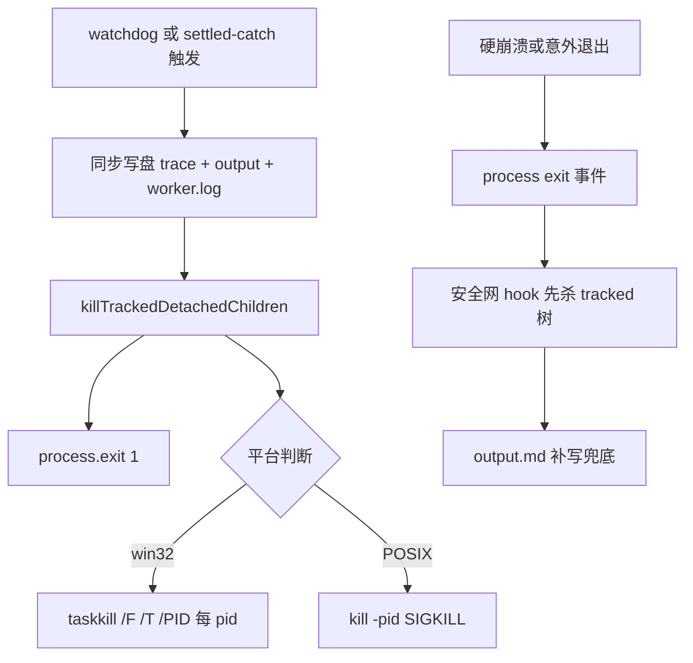

# Design: mw-worker-tree-kill

## §0 设计前提锚定

- spec_path: `.agenticdoc/mw-worker-tree-kill/spec.md`
- spec_locked_at: 2026-09-19T17:11:39+08:00
- ac_count: 6
- ac_ids: AC-001, AC-002, AC-003, AC-004, AC-005, AC-006

## §1 架构选型

### D-001 清理入口
- 选择：worker-mode.ts 顶层 `import { killTrackedDetachedChildren } from "../../../utils/shell.ts"`，退出路径调用——与 bash 工具共享同一模块实例的 tracked pid Set（读到该 Set 的唯一途径）。
- 否决：扩展内自实现杀树（Set 不可达，必漏杀已 tracked 的挂起命令）；对自身 pid 做 `taskkill /T`（POSIX 下 worker 非组长时 `kill(-pid)` 语义混乱，且强杀自身改变退出路径语义）。
- 调研：`evidence/research/design-worker-exit-cleanup-2026-09-19.md`

### D-002 覆盖策略与顺序
- 选择：全部 4 个 `process.exit(1)` 位点（:413 existsCheck、:439 refusal、:670 timeoutExit、:870 settled-catch）在 exit 前显式调用；既有 `process.on("exit")` 安全网 hook 内**最先**追加同一调用，兜底硬崩溃等未经显式路径的退出。位点内顺序：同步写盘（trace/output/worker.log）→ 杀树（fire-and-forget）→ `process.exit(1)`。
- 否决：只依赖 'exit' hook（Node 退出阶段 spawn 仅 best-effort，主路径需确定性）；只覆盖 timeoutExit（settled-catch 同样可能发生在 bash 挂起中）。
- 理由：早期位点（existsCheck/refusal）tracked Set 必为空，调用是 no-op，但令「worker-mode.ts 内 `process.exit` 必先杀树」成为可 grep 的机械不变量，防未来新增裸退出位点。

### D-003 launcher Job Object 兜底
- 选择：不做，记遗留（achieved.md 遗留节 + 后续 key）。
- 否决理由：worker 硬崩溃（扩展代码无机会运行）的 OS 级回收属独立交付物；本 key 修复的是实际事故链（watchdog 自杀路径）。

### D-004 测试观测
- 选择：单测文件 `vi.mock("../../../src/utils/shell.ts", importOriginal)` **只替换 `killTrackedDetachedChildren`**（worker-mode 跨模块导入 → mock 必然拦截；顺序用 `mock.invocationCallOrder` 断言）；'exit' hook 用 `process.listeners("exit")` 取新增 listener 直接调用。另设不 mock 的 live 测试文件：真实 spawn 独立挂起进程 ×2（各自 tracked）+ 孙进程树（pid 落盘可查）+ 真实 watchdog 退出 + 轮询探活，同时承担 per-pid 全覆盖与真实树终止的 L2 证据。
- 否决：mock `killProcessTree`（**执行期证实不可行**：`killTrackedDetachedChildren` 对同模块内 `killProcessTree` 的调用走模块内闭包绑定，vi.mock 工厂只替换导出表，观测不到内部调用）；mock node 内建 `child_process`（平台分支断言脆弱 + 影响面不可控）；`process.emit("exit")`（触发同文件累积的全部 exit listener，计数不可控）。
- 调研：`evidence/research/design-worker-exit-cleanup-2026-09-19.md`

## §2 核心结构

```text
worker-mode.ts（唯一改动源文件）
├─ import { killTrackedDetachedChildren } from "../../../utils/shell.ts"   ← 新增（值导入）
├─ exit 位点 x4：写盘 → killTrackedDetachedChildren() → process.exit(1)
└─ process.on("exit") 安全网：killTrackedDetachedChildren() → output 补写
```

## §3 模块划分

| 文件 | 职责 | 变更 |
|------|------|------|
| `packages/coding-agent/src/extensions/agent-team-loop/worker/worker-mode.ts` | worker watchdog 退出路径 | +1 import、4 个位点各 +1 行清理调用、'exit' hook +1 行 |
| `packages/coding-agent/test/extensions/agent-team-loop-worker-tree-kill.test.ts` | 单测（mocked killTrackedDetachedChildren）：AC-001~005 | 新增 |
| `packages/coding-agent/test/extensions/agent-team-loop-worker-tree-kill-live.test.ts` | live（真实进程 ×2 + 孙进程树，不 mock）：AC-006 + per-pid 全覆盖买证 | 新增 |

## §4 接口与集成

### 4.1 对外接口清单
无新公共 API。仅新增内部依赖：`killTrackedDetachedChildren(): void`（`utils/shell.ts` 既有导出，遍历 tracked Set 逐 pid 调 `killProcessTree`）。

### 4.2 外部依赖集成
pi bash 工具（未改动）：spawn 时 `trackDetachedChildPid`、finally `untrack` → 挂起命令的 pid 恒在 Set 中，worker 退出时由本设计收口。部署依赖：重建 dist bundle + `/mw restart`。

## §5 Function Flow



## §6 Coverage Matrix

| ID | 功能点 | 正常路径 | 边界测试 | 异常路径 | 验证层级 |
|----|--------|---------|---------|---------|---------|
| F1 | idle watchdog 退出清理 | 挂起子进程被树杀 | Set 为空时 no-op | taskkill 失败静默（既有 try/catch） | L1+L2 |
| F2 | wall budget 退出清理 | 同 F1 | 同 F1 | 同 F1 | L1 |
| F3 | settled-catch 退出清理 | 同 F1 | 同 F1 | 同 F1 | L1 |
| F4 | 'exit' 安全网兜底 | 硬崩溃后树杀+补写 | outputWritten=true 时只杀树 | hook 内 spawn best-effort | L1 |
| F5 | 成功路径零回归 | 无杀树调用、exit=0 | — | — | L1 |
| F6 | 真实树终止（含孙进程） | Windows taskkill /T | 孙进程独立存活也被收 | POSIX 组杀 | L2 |

## §7 Verification Contract

VC-001: 当 idle watchdog 触发（测试环境 PI_WORKER_IDLE_MS 缩短、无活动达阈值）时，killTrackedDetachedChildren 必须恰好被调用一次，且其 invocationCallOrder 必须小于 process.exit(1) 的 invocationCallOrder；trace.log 的 [TIMEOUT]/[END] 与 output.md 必须已写入。per-pid 全覆盖与真实树终止由 VC-006 live 证据承担
       Layer: L1
       Output: [VERIFY] VC-001: kill_before_exit=true, kill_calls=1
       Source: AC-001

VC-002: 当 wall budget 触发（task.md timeout: 头缩短至 2 分钟）时，行为与 VC-001 完全一致（共用 timeoutExit）
       Layer: L1
       Output: [VERIFY] VC-002: kill_before_exit=true, kill_calls=1
       Source: AC-002

VC-003: 当 agent_settled 处理抛异常（phase-runner writePhaseFile mock 注错）时，killTrackedDetachedChildren 恰一次且先于 process.exit(1)
       Layer: L1
       Output: [VERIFY] VC-003: kill_before_exit=true, kill_calls=1
       Source: AC-003

VC-004: 当 worker 已激活后直接调用其注册的 process 'exit' listener（模拟硬崩溃退出）时，killTrackedDetachedChildren 必须被调用（安全网兑底语义）
       Layer: L1
       Output: [VERIFY] VC-004: hook_kill_called=true
       Source: AC-004

VC-005: 当 agent_settled 正常完成（无异常、无挂起子进程）时，killTrackedDetachedChildren 调用次数必须为 0，process.exit 不被调用，trace.log 含 [END] exit=0
       Layer: L1
       Output: [VERIFY] VC-005: success_zero_kill=true, exit_code=0
       Source: AC-005

VC-006: 当 live 测试以真实进程树（2 个独立 tracked 挂起进程，其一含孙进程且孙 pid 落盘可查）作为 tracked 子进程并触发 idle watchdog 退出后，60 秒内全部 tracked 父进程与孙进程存活数必须为 0（进程探活全失败）
       Layer: L2
       Output: [VERIFY] VC-006: orphan_count=0, within=60s
       Source: AC-006

## §8 AC → VC 映射表

| AC ID | AC 摘要 | 对应 VC | 路径分类 |
|-------|---------|---------|---------|
| AC-001 | idle watchdog 退出前杀全部 tracked 树 | VC-001 | 异常 |
| AC-002 | wall budget 退出前杀全部 tracked 树 | VC-002 | 异常 |
| AC-003 | settled-catch 退出前杀全部 tracked 树 | VC-003 | 异常 |
| AC-004 | 'exit' 安全网兜底杀 tracked 树 | VC-004 | 异常 |
| AC-005 | 成功路径零回归（零杀树、exit=0） | VC-005 | 正常 |
| AC-006 | 真实进程树（含孙进程）在 worker 退出后消亡 | VC-006 | 异常 |

## §9 非功能实现方案

- 性能：清理为 fire-and-forget（detached spawn），不阻塞退出路径；写盘全同步先行。
- 可观测性：worker.log/trace.log 格式不变（GC-6 兼容）；杀树动作不新增日志行（taskkill 输出 stdio ignore，保持 worker.log 干净）。
- 平台：跨平台语义由 `killProcessTree` 既有实现承担（win32 / POSIX 分支），本设计不引入平台分支。

## §10 决策记录

| D-ID | 决策点 | 选择 | 否决 | 理由 |
|------|--------|------|------|------|
| D-001 | 清理入口 | 复用 utils/shell.ts killTrackedDetachedChildren | 扩展自实现 / 自杀整树 | tracked Set 唯一出口；同模块实例 |
| D-002 | 覆盖策略 | 4 位点显式 + 'exit' hook 兜底，写盘→杀树→exit | 仅 hook / 仅 timeoutExit | 确定性优先；可 grep 不变量 |
| D-003 | Job Object | 不做（遗留） | launcher 侧 OS 级回收 | 独立交付物，非本次事故链 |
| D-004 | 测试观测 | mock killTrackedDetachedChildren + invocationCallOrder + listener 直调；per-pid 由 live | mock killProcessTree（闭包不可达）/ mock 内建 / emit exit | 跨模块导出 mock 必拦截；真实证据优于 mock 计数 |
