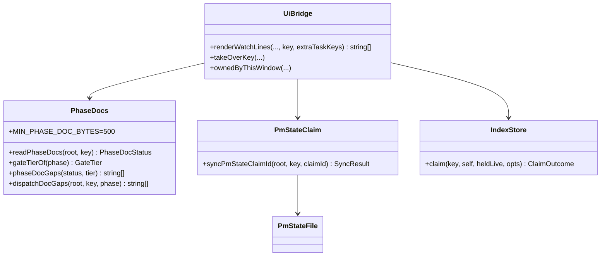
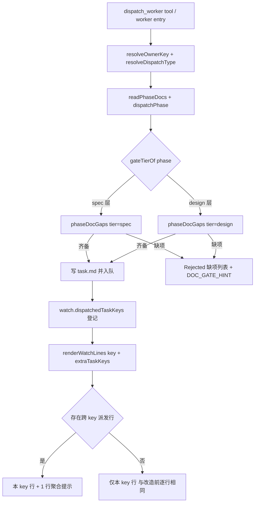

# Design: mw-worker-visibility-gate

## §0 设计前提锚定

- spec_path: `.agenticdoc/mw-worker-visibility-gate/spec.md`
- spec_locked_at: 2026-09-23T09:45:00Z
- ac_count: 13
- ac_ids: AC-001, AC-002, AC-003, AC-004, AC-005, AC-006, AC-007, AC-008, AC-009, AC-010, AC-011, AC-012, AC-013

## §1 架构选型

### D-101 门禁分层的落点
- 选择：分层判定写在 `shared/phase-docs.ts` 内（`phaseDocGaps` 增加 tier 参数，`dispatchDocGaps` 增加 phase 参数），调用点只负责把相位传进来。
- 否决：在两个调用点各自分层（理由：`ui-bridge.ts:1093` 与 `:1498` 会分叉，且 `phase-docs.ts` 已是文档门禁的单一事实源）。
- 调研：`evidence/research/design-gate-panel-claim-interfaces-2026-09-23.md` F1

### D-102 相位归一化与层边界
- 选择：`gateTierOf(phase)` 把 `SPEC` / `init`（框架 stub 占位）/ `—`（索引占位，本 key 只做兜底）/ 空串 / 未知串全部归为 `spec` 层；`DESIGN` / `PLAN` / `TASKS` / `EXECUTE` / `VERIFY` / `DONE` 归为 `design` 层（即 spec 侧四项 + design 侧两项全查）。
- 否决：只认严格枚举、未知即拒（理由：新 key 的 `init` 占位会让本改动的目标场景反而被拒，见 F1 归一化事实）。
- 调研：同上 F1

### D-103 不引入任务类型门禁
- 选择：门禁只按相位分层，**不**按 `type` 收紧（`type=coding` 在 SPEC 相位照旧放行）。
- 否决：SPEC 相位只放行 research/review（理由：与历史口径 P-007「审查/调研任务以 `type: coding` 派发以获得落盘通道」冲突，会把既有实践变成硬拒绝；spec §4 R-1 记录放宽后的缓解）。
- 调研：同上 F4

### D-104 `_scratch` 语义不变
- 选择：`dispatchDocGaps` 对 `_scratch` 的短路保持（`:128`），`_scratch` 仍是"无主临时任务"的合法入口。
- 否决：取消 `_scratch` 短路（理由：会让临时任务无法派发；本 key 的目标是让"有主的 key"不再被迫使用它）。

### D-105 面板聚合行的注入方式
- 选择：`renderWatchLines` 增加**可选**第六参数 `extraTaskKeys?: ReadonlySet<string>`（调用方传 `watch.dispatchedTaskKeys`）；未传时行为与改造前逐行相同。
- 否决：新增必填参数（理由：12 处既有测试调用全要改，且断言容易被动坏，见 F2）；也否决把 `owned` 直接换成 `ownedByThisWindow` 全混列（理由：跨 key 行会被误读成 watched key 的产物，且 `(no worker tasks)` 语义失效）。
- 调研：同上 F2

### D-106 聚合行的内容与顺序
- 选择：固定**一行**，追加在面板输出**末尾**（不进入 header 计数、不折叠）；格式：
  `  ~ <N> elsewhere: <owner>(<c1> running, <c2> failed, …; risk=high:<K>)`，多个 owner 以 `, ` 分隔且按 `(行数 desc, owner 名 asc)` 排序；计数项仅列出 >0 的状态，顺序固定 `running/pending/done/failed/needs-clarification`；`risk=high:<K>` 段仅在 K≥1 时出现；整行超过 `WATCH_LINE_MAX`（110）时用既有 `trunc()` 截断。
- 否决：每个跨 key 任务各占一行（理由：面板会被他键任务淹没，且 `WATCH_HISTORY_MAX` 的历史折叠语义只针对本 key）。
- 调研：同上 F2

### D-107 claim 同步的写入策略
- 选择：新增 `shared/pm-state-claim.ts` 的 `syncPmStateClaimId(agenticdocRoot, key, claimId)`：读字节 → 探测主导换行（`\r\n` 优先）→ 仅替换 `^- Claim-Id:[^\r\n]*` 这一行（保持行内其余字节不变）→ 原子写（`<file>.tmp` + rename）→ 返回 `{ ok: true }`；文件不存在时返回 `{ ok: false, reason }` 且**不创建**。
- **D-111（补充，2026-09-23 T-1 执行期发现）**：pm-state 存在但**缺** `- Claim-Id:` 行时的语义修订 —— 改为“在 `- Key:` 行之后插入该行（其余字节不变，原子写，返回 `ok:true`）”；只有 pm-state **既无 `- Claim-Id:` 也无 `- Key:` 行**时才 `ok:false` + reason（fail-closed，不写）。依据：本仓四个 key（`mw-worker-progress-persist`/`mw-task-scope-isolation`/`mw-rag-window-parity`/`mw-worker-visibility-gate`）的 pm-state **全部没有** Claim-Id 行 —— TS 路径（`switch_key` → `IndexStore.claim`）只写索引行，随后 `advance_phase.py` 新建的 7 段模板不带 Claim-Id，于是“镜像”在这些 key 上是**缺失**而非不一致；而框架自己的 `update_index.py` 缺行时的处理就是“insert after `- Key:`”。不改插行会训将“两处同值”对最常见的 key 创建路径变成无法达成（每次 claim 都只得到一条 warning）。
- 否决：复用 `StateManager.write()`（理由：它整体重写成旧 3 段模板，会抹掉 7 段模板与证据区，见 F3）；也否决“同步失败即回滚 claim”（理由：索引行是权威，pm-state 是镜像，镜像失败不该影响权威）。
- 调研：同上 F3（含补充发现 F3b）

### D-108 claim 同步的调用点与告警
- 选择：在两处 TS claim 成功后调用同步：`pm/ui-bridge.ts` 的 `takeOverKey`（被 `/pm-key` 与 `switch_key` 工具共用）与 `pm/pm-orchestrator.ts:298` 的会话恢复 quiet re-claim；同步失败时在返回文本/通知里追加 1 条 warning（`claim 已生效，但 pm-state.md 未同步（<reason>）`），claim 结果仍为成功。
- 否决：只在 `takeOverKey` 同步（理由：会话恢复路径同样会把 Claim 列改成新窗口 pid，漏掉它就又制造分叉）。
- 调研：同上 F3

### D-109 拒绝文案与提示不变
- 选择：缺项文案继续由 `phaseDocGaps` 生成（同一字符串常量），拒绝时仍追加 `DOC_GATE_HINT`；不新增任何旁路/豁免参数。
- 否决：加 `allow_undocumented` 参数（理由：等于把门禁降级为可选，违背"无文档不派发"的初衷）。

## §2 核心结构 / 类图



## §3 模块划分

```
packages/coding-agent/src/extensions/agent-team-loop/
├── shared/
│   ├── phase-docs.ts          ← 改：gateTierOf + phaseDocGaps(status, tier) + dispatchDocGaps(root, key, phase)
│   └── pm-state-claim.ts      ← 新：syncPmStateClaimId（单行原地替换 + 换行探测 + 原子写）
└── pm/
    ├── ui-bridge.ts           ← 改：两处 dispatchDocGaps 传相位；renderWatchLines 聚合行；takeOverKey 同步 pm-state
    └── pm-orchestrator.ts     ← 改：三处 renderWatchLines 传 dispatchedTaskKeys；quiet re-claim 后同步 pm-state
```

职责边界：
- `phase-docs.ts`：纯判定（读文件 → 缺项列表），不写任何文件。
- `pm-state-claim.ts`：唯一新增写面，只碰 `pm-state.md` 的 `- Claim-Id:` 一行。
- `ui-bridge.ts`：组装（门禁调用、面板渲染、claim 编排）。
- `pm-orchestrator.ts`：会话生命周期调用点。

## §4 接口与集成

### 4.1 对外接口清单

```ts
// shared/phase-docs.ts
export type GateTier = "spec" | "design";
export function gateTierOf(phase: string): GateTier;              // SPEC/init/—/空/未知 → "spec"，其余 → "design"
export function phaseDocGaps(status: PhaseDocStatus, tier: GateTier): string[];
export function dispatchDocGaps(agenticdocRoot: string, key: string, phase?: string): string[];

// shared/pm-state-claim.ts
export interface PmStateClaimSyncResult { ok: boolean; reason?: string; }
export function syncPmStateClaimId(agenticdocRoot: string, key: string, claimId: string): PmStateClaimSyncResult;

// pm/ui-bridge.ts
export function renderWatchLines(
  indexStore: IndexStore, workerStore: WorkerStore, ackStore: AckStore,
  agenticdocRoot: string, key: string, extraTaskKeys?: ReadonlySet<string>,
): string[];
```

（`dispatchDocGaps` 的第三参数**可选**，缺省 `""` → spec 层：这样 T-1 单独合入时既有调用点仍能编译，不制造并行 worker 之间的瞬时 typecheck 红；T-3 负责把所有调用点都改成传真相位。`renderWatchLines` 的第六参数为可选 —— 保证既有 12 处测试调用与 AC-007 的"未传即不变"同时成立。）

门禁调用点实为**三处**（T-1 执行期补充发现，见 D-110）：`pm/ui-bridge.ts:1093`、`pm/ui-bridge.ts:1498`、`pm/pm-orchestrator.ts:429`（`dispatchNewTasks` 后台扫描）。三处必须同改，否则行为分叉。

### 4.2 外部依赖集成

- 相位来源：`StateManager.read().phase`（只读，经 `dispatchPhase()`）。
- 派发登记：`watch.dispatchedTaskKeys`（`ui-bridge.ts:1153`，`mw-task-scope-isolation` 引入）。
- 检查点风险：`readTaskProgress(taskDir)?.checkpoint?.risk`（与行详情同源）。
- 索引权威：`IndexStore.claim()`（不改其签名，同步在其之后调用）。
- 跨语言：Python 侧 `advance_phase.py` 仍是 pm-state 相位的唯一写入者；本 key 不改任何 Python。

## §5 Function Flow



## §6 Coverage Matrix

| ID | 功能点 | 正常路径 | 边界测试 | 异常路径 | 验证层级 |
|----|--------|----------|----------|----------|----------|
| F1 | 派发门禁（spec 层） | phase=SPEC 且 spec 四项齐备 → 放行 | phase=`init`/`—`/空/未知 → 同 spec 层 | spec.md <500B → 拒且缺项只列 spec 侧 | L1 |
| F2 | 派发门禁（design 层） | phase=DESIGN 且六项齐备 → 放行 | design.md 恰好 500B | design.md 缺失 / design 证据 0 → 拒 | L1 |
| F3 | 类型与 `_scratch` 兼容 | `type=coding` @ SPEC → 放行 | `_scratch` 不查文档 | 未知 phase 串 → 归 spec 层 | L1 |
| F4 | 面板聚合提示 | 跨 key running ≥1 → 1 行聚合 | 多 owner / 多状态计数 | 无跨 key 行 → 0 行；行宽 >110 → 截断 | L1 |
| F5 | claim 身份同步 | takeover 后两处同值 | pm-state 缺 Claim-Id 行 | 同步失败 → warning 且不阻断 | L1 |
| F6 | 记忆登记 | — | — | — | L0 |

## §7 Verification Contract

```
VC-001: 当 owner key phase=SPEC 且 design.md 缺失、spec 侧四项齐备时，dispatch_worker 必须放行且写出 task.md
       Layer: L1
       Output: [VERIFY] VC-001: spec_phase_pass=true task_md=true
       Source: AC-001

VC-002: 当 owner key phase=DESIGN 且 design.md 缺失时，dispatch_worker 必须拒绝且缺项列表含 design.md 缺项 1 条，且不建 task 目录
       Layer: L1
       Output: [VERIFY] VC-002: blocked=true design_gap=1 task_dir=false
       Source: AC-002

VC-003: 当 owner key phase=DESIGN 且 design.md 齐备而 design 证据为 0 时，dispatch_worker 必须拒绝且缺项列表含 design 证据缺项 1 条
       Layer: L1
       Output: [VERIFY] VC-003: blocked=true design_evidence_gap=1
       Source: AC-003

VC-004: 当 owner key 的 phase 取值为 —、空串、init 或未知串时，门禁必须归为 spec 层（design 侧缺项恒为 0）
       Layer: L1
       Output: [VERIFY] VC-004: tier=spec design_gaps=0
       Source: AC-004

VC-005: 当 owner key phase=SPEC 且 spec.md <500B 时，拒绝缺项列表条数必须等于 spec 侧缺项数且 design 侧缺项数为 0
       Layer: L1
       Output: [VERIFY] VC-005: spec_gaps=4 design_gaps=0
       Source: AC-005

VC-006: 当本窗口派发的行中至少 1 行 running 且 owner key 不同于 watched key 时，renderWatchLines 必须输出恰好 1 行聚合提示且含 owner 名与计数、长度不超过 110
       Layer: L1
       Output: [VERIFY] VC-006: agg_lines=1 owner_in_line=true count_in_line=true max_len=<=110
       Source: AC-006

VC-007: 当 extraTaskKeys 未传或无跨 key 派发行时，聚合提示行必须为 0 且面板输出与改造前逐行相同
       Layer: L1
       Output: [VERIFY] VC-007: agg_lines=0 identical_baseline=true
       Source: AC-007

VC-008: 当跨 key 行含未 ack 的 failed 或 needs-clarification 时，聚合提示的计数必须包含这些终态行数量
       Layer: L1
       Output: [VERIFY] VC-008: agg_lines=1 terminal_counted=1
       Source: AC-008

VC-009: 当跨 key running 行中有 N 个 risk=high 检查点时，聚合提示必须包含 risk=high 字样与该数量 N
       Layer: L1
       Output: [VERIFY] VC-009: risk_marker=risk=high:1
       Source: AC-009

VC-010: 当 TS 侧 claim/takeover 成功后，pm-state.md 的 Claim-Id 必须与索引行 Claim 列逐字相等，且二级标题数与 Updated 行数不变
       Layer: L1
       Output: [VERIFY] VC-010: claim_ids_equal=true headings=7 updated_lines=1
       Source: AC-010

VC-011: 当 pm-state.md 缺 Claim-Id 行时，同步必须在 Key 行之后插入该行（其余字节不变，ok=true）；当 pm-state 既无 Claim-Id 也无 Key 行时才 ok=false 且不写
       Layer: L1
       Output: [VERIFY] VC-011: inserted=true ok=true outside_identical=true | no_key_line ok=false untouched=true
       Source: AC-011 [REVISED @ 2026-09-23]

VC-012: 当 owner key phase=SPEC 时，type=coding 的派发不得被相位门禁拒绝
       Layer: L1
       Output: [VERIFY] VC-012: coding_at_spec_allowed=true
       Source: AC-012

VC-013: 当本 key 收尾时，_pitfalls.md 新增条目必须同时含索引行、两处同值、liveness 三处口径
       Layer: L0
       Output: [VERIFY] VC-013: pitfalls_entry=true keywords=3
       Source: AC-013
```

## §8 AC → VC 映射表

| AC ID | AC 摘要 | 对应 VC | 路径分类 |
|-------|---------|---------|----------|
| AC-001 | SPEC 相位 + design 缺失 → 放行 | VC-001 | 正常 |
| AC-002 | DESIGN 相位 + design.md 缺失 → 拒 | VC-002 | 异常 |
| AC-003 | DESIGN 相位 + design 证据 0 → 拒 | VC-003 | 异常 |
| AC-004 | 未知/占位相位 → 按 SPEC 层 | VC-004 | 边界 |
| AC-005 | SPEC + spec.md 过短 → 缺项只列 spec 侧 | VC-005 | 异常 |
| AC-006 | 跨 key running → 恰好 1 行聚合提示 | VC-006 | 正常 |
| AC-007 | 无跨 key 行 → 0 行且与基线逐行相同 | VC-007 | 边界 |
| AC-008 | 跨 key 终态计入聚合计数 | VC-008 | 异常 |
| AC-009 | 跨 key risk=high 数量出现在聚合行 | VC-009 | 异常 |
| AC-010 | takeover 后两处 claim 值逐字相等 | VC-010 | 正常 |
| AC-011 | pm-state 缺行 → claim 成功 + 1 warning | VC-011 | 异常 |
| AC-012 | SPEC 相位 coding 派发不被相位门禁拒 | VC-012 | 回归 |
| AC-013 | _pitfalls.md 新条目含三处口径 | VC-013 | 文档 |

## §9 非功能实现方案

- 性能：聚合行复用 `renderWatchLines` 内**已有的** `workerStore.readAll()` 结果（第 495 行的同一次读取）筛选跨 key 行，不新增第二次全量读盘；门禁仍是纯文件 `statSync`/`readFileSync`。
- 安全：门禁只读 `pm-state.md`；claim 同步只写 `- Claim-Id:` 一行，原子替换，不删不改其它字节。
- 可观测性：拒绝文案沿用既有缺项文案 + `DOC_GATE_HINT`（脚本侧已依赖该文案做断言）；claim 同步失败在工具返回文本/通知里可见。
- 兼容：`renderWatchLines` 新参数可选 → 既有 12 处测试调用零改动；`dispatchDocGaps` 新参数必填但仅两处调用点。

## §10 决策记录

| D-ID | 决策点 | 选择 | 否决 | 理由 |
|------|--------|------|------|------|
| D-101 | 门禁分层落点 | `phase-docs.ts` | 调用点各自分层 | 单一事实源，避免两入口分叉 |
| D-101b | 新增相位参数 | 可选（缺省 = spec 层） | 必填 | 避免并行 worker 之间瞬时 typecheck 红 |
| D-102 | 相位归一化 | 未知/占位 → spec 层 | 未知即拒 | 新 key 的 `init` 占位不能被拒 |
| D-103 | 任务类型门禁 | 不加 | SPEC 只放 research/review | 与 P-007 既有实践冲突 |
| D-104 | `_scratch` 语义 | 不变 | 取消短路 | 临时任务仍需入口 |
| D-105 | 面板注入方式 | 可选第六参数 | 必填参数 / 全混列 | 不动 12 处既有调用；避免误读 |
| D-106 | 聚合行格式 | 单行、末尾、含 risk 标记 | 每任务一行 | 面板不被淹没 |
| D-107 | claim 写入策略 | 单行原地替换 + 原子写 | 复用 `StateManager.write()` | 后者会抹掉 7 段模板 |
| D-108 | claim 同步落点 | `takeOverKey` + 会话恢复 re-claim | 仅 `takeOverKey` | 两条路径都会改 Claim 列 |
| D-109 | 拒绝文案 | 不变 + 无旁路参数 | 新增豁免参数 | 门禁不可降级为可选 |
| D-110 | 门禁调用点数量 | 三处（含 `pm-orchestrator.ts:429` 后台扫描） | 只改 `ui-bridge.ts` 两处 | T-1 实测发现勘察遗漏的第三处；只改两处会让后台扫描与工具入口行为分叉 |
| D-111 | pm-state 缺 Claim-Id 行 | 在 `- Key:` 后插行 | 保持不写 + warning | 本仓四个 key 的 pm-state 均无该行（TS 路径只写索引行），不插行则"两处同值"对最常见路径无法达成 |
