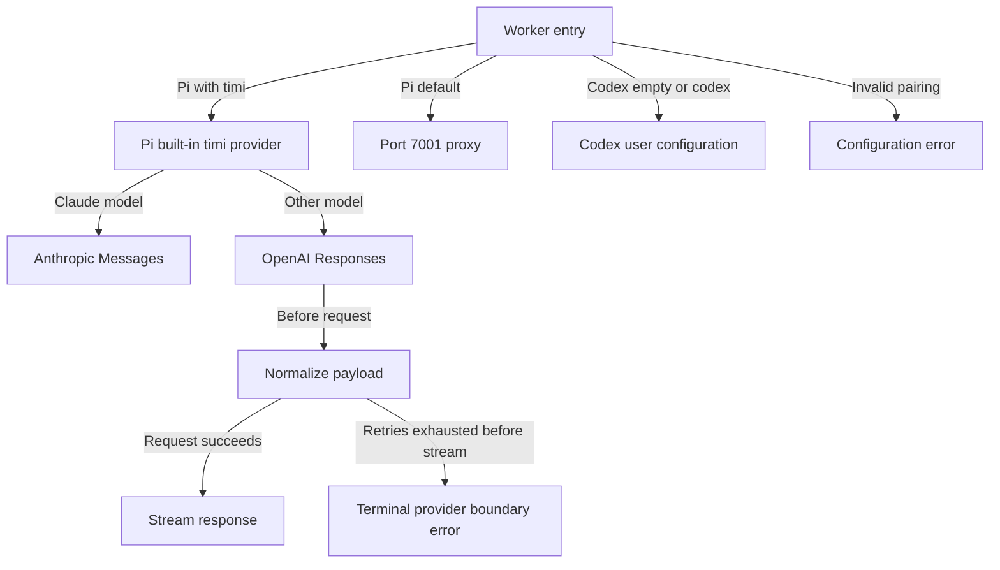
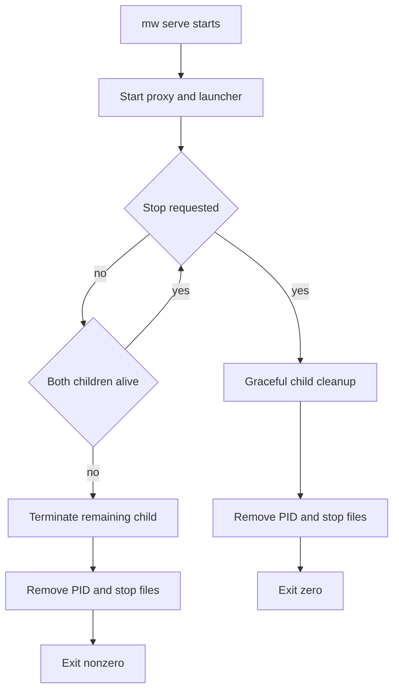

# Design: Timi GPT Pi Routing

## 0. Design Lock

- spec_path: `.agenticdoc/timi-gpt-pi-routing/spec.md`
- spec_locked_at: 2026-08-14
- ac_count: 15
- ac_ids: AC-001 through AC-015

## 1. Architecture Decisions

### D-001: Mixed-protocol Timi provider

Use one `timi` provider with API implementations keyed by each model's generated `api` value. Models beginning with `claude-` use `anthropic-messages`; all other Timi models use `openai-responses`. This keeps model switching within one provider while avoiding protocol emulation.

Rejected alternatives:

- Sharing Codex port 39875 couples Pi to a user-local process and sanitizer lifecycle.
- Separate Timi provider IDs duplicate credentials, catalogs, and user configuration.

### D-002: Separate Pi and Codex launcher boundaries

`provider=timi` is a Pi-specific selection that invokes Pi's built-in provider directly. Codex workers continue to resolve provider URL, authorization, retries, and sanitization through Codex configuration. The obsolete port-7002 path is removed rather than retained as compatibility behavior.

### D-003: Fail-closed service supervision

The `mw serve` parent monitors both proxy and launcher processes. An unexpected child exit is a service failure: terminate the sibling, return a nonzero exit code, and remove the PID file in `finally`. Intentional cross-platform shutdown uses a project-scoped `.mw/mw.stop` request file polled by the serve loop instead of relying on Windows signal semantics. PID liveness uses `os.kill(pid, 0)` only on POSIX; Windows uses `ctypes` with `OpenProcess(PROCESS_QUERY_LIMITED_INFORMATION)` and `GetExitCodeProcess` without signaling the target.

## 2. Module Responsibilities

- `packages/ai/scripts/generate-models.ts`: source of Timi model protocol, reasoning, limits, and compatibility metadata.
- `packages/ai/src/providers/timi.ts`: constructs the mixed-API provider and applies `TIMI_BASE_URL` consistently.
- `packages/ai/src/api/timi-responses.ts`: Timi-only payload normalization and retry-boundary policy around the shared Responses transport.
- Shared message converters/retry classifier: protocol-crossing history rules and outer retry eligibility.
- `packages/coding-agent/src/core/model-resolver.ts`: declares `gpt-5.6-sol` as the default model for provider `timi`.
- `packages/coding-agent/test/model-resolver.test.ts`: verifies initial-model selection for authenticated Timi.
- `packages/multi-workers/launcher.py`: validates CLI/provider combinations, constructs commands, and builds isolated child environments.
- `packages/multi-workers/proxy_multi.py`: starts only the remaining Pi, Claude CLI, and optional DeepSeek proxies.
- `packages/multi-workers/mw.py`: owns service lifecycle and child supervision.

### Interfaces and integration contracts

- `timiProvider()` returns a `Provider<"anthropic-messages" | "openai-responses">`; its public `stream`/`streamSimple` methods dispatch internally from `model.api` through the API implementation map captured by `createProvider()`.
- `timiResponsesApi()` delegates serialization and HTTP/SSE behavior to `openAIResponsesApi()` and wraps only options plus emitted stream events.
- The wrapper forwards every delegated event unchanged. It tracks whether a `start` event has been emitted. Before forwarding a terminal `error` event, it adds the retry-boundary diagnostic only when `start` has not occurred.
- Caller `onPayload` executes first. Its returned replacement, when non-`undefined`, becomes the normalization input. A JSON-compatible deep clone is normalized so stored context/tool definitions are not mutated.
- Shared Anthropic and Responses history converters compare the historical assistant message API with the target API before replaying thinking/reasoning signature data.
- Launcher validation is performed before environment construction or process spawn.
- Service supervision distinguishes intentional shutdown by an explicit stop event from unexpected child completion detected by `poll()`.
- `mw stop` writes `.mw/mw.stop` atomically and waits up to 30 seconds for graceful cleanup. If the parent remains alive, it returns nonzero and leaves PID/stop state intact; it does not force-terminate the parent because that could bypass `finally` and orphan managed children. POSIX external `SIGTERM` remains an additional intentional shutdown path for `mw serve`; Windows uses the stop-request path.
- `mw serve` removes any stale stop-request file before startup, polls it with the child processes, converts it into intentional shutdown, and deletes it during final cleanup.
- `mw status` calls the platform-specific read-only liveness helper and never sends a terminating signal on Windows.

## 3. Function Flow

## 4. Error Handling

- Authentication and validation errors remain non-retryable.
- Retryable pre-stream Timi Responses failures use the provider retry budget only.
- Partial-stream failures remain eligible for the session-level recovery layer.
- Invalid launcher provider/CLI combinations fail before spawning a child.
- Managed-child failure is surfaced by the `mw serve` exit code and PID cleanup.
- Credential values are excluded from commands, logs, generated metadata, and dry-run output.
- Startup spawn exceptions follow the same nonzero cleanup path as runtime child exits.
- If both children exit between polls, the service still records failure and performs idempotent cleanup.
- Cleanup calls `terminate()`, waits at most 10 seconds, then calls `kill()` and waits again for any child still alive.
- Windows uses `Popen.terminate()`/`Popen.kill()`; POSIX signal registration remains conditional where required.
- Parent-process liveness on Windows is checked through Win32 process-query APIs; `os.kill(pid, 0)` is forbidden on the Windows status path.
- The stop-request file is removed before startup and during final cleanup so a stale request cannot stop a future service.
- Parent termination is never used as a timeout shortcut by `mw stop`; only the parent-owned cleanup path may terminate or kill managed children.

## 5. Public command and environment contracts

| Worker | Accepted provider | Command | Environment policy |
|---|---|---|---|
| Pi | `timi` | `pi --provider timi --model gpt-5.6-sol -p <task>` | Preserve `TIMI_API_KEY` and optional `TIMI_BASE_URL`; remove unrelated known provider overrides |
| Pi | empty | `pi -p <task>` | Set `ANTHROPIC_BASE_URL=http://localhost:7001` and `ANTHROPIC_API_KEY` |
| Codex | empty or `codex` | `codex exec -m gpt-5.6-sol <task>` | Remove `OPENAI_BASE_URL` and `OPENAI_API_KEY`; use Codex user configuration |
| Codex | any other value | no spawn | Raise configuration error |

Port 7002 is removed from `providers.json`, proxy construction, CLI arguments, launcher overrides, smoke tests, and dispatch documentation.

## 6. Coverage Matrix

| Feature | Normal path | Boundary | Failure path | Level |
|---|---|---|---|---|
| Timi model protocol generation | Claude/Responses split | prefix boundary | missing API implementation | L1 |
| Timi payload normalization | empty descriptions/store | missing/non-string fields | retry exhaustion | L1 |
| Cross-protocol history | final text/tools preserved | same-protocol signatures | foreign signatures omitted | L1 |
| Pi launcher routing | explicit Timi | empty provider | invalid provider | L1 |
| Codex launcher routing | user config | empty/codex | other provider | L1 |
| Proxy lifecycle | supported proxies start | optional DeepSeek | startup/runtime/simultaneous child exit | L1/L2 |
| Runtime artifacts | generated and built | linked global CLI | stale dist detected | L0/L2 |
| Security | masked/no credential output | absent optional URL | credential leak scan | L0/L1 |

## 7. Verification Contract

VC-001: Every generated Timi model has `api=anthropic-messages` iff its ID starts with `claude-`; all other IDs have `api=openai-responses`; the three GPT-5.6 entries have `reasoning=true`. Layer: L1. Output: `[VERIFY] VC-001: models=<count> mismatches=0 gpt56_reasoning=3`. Source: AC-001.

VC-002: Calling the public provider stream path with one model from each family reaches the corresponding delegated implementation without a missing-implementation error; the test does not inspect private provider construction state. Layer: L1. Output: `[VERIFY] VC-002: dispatch_families=2 failures=0`. Source: AC-002.

VC-003: Default model resolution for provider `timi` returns exactly `gpt-5.6-sol`. Layer: L1. Output: `[VERIFY] VC-003: default_model=gpt-5.6-sol`. Source: AC-003.

VC-004: Captured normalized payload removes nested/top-level `store`, normalizes only whitespace-only string descriptions using exact name/index fallbacks, preserves missing/non-string/non-empty descriptions, composes mutation/replacement hooks, and leaves original input deep-equal. Layer: L1. Output: `[VERIFY] VC-004: normalization_cases=<count> mutations=0`. Source: AC-004.

VC-005: Retry tests cover default eight, explicit zero/nonzero, 429/500/502/503/504, non-retryable 400, cancellation during request/sleep, delay-cap terminal failure, pre-start diagnostic, and post-start eligibility. Layer: L1. Output: `[VERIFY] VC-005: retry_cases=<count> failures=0`. Source: AC-005.

VC-006: Cross-protocol converter tests preserve visible/tool history, omit foreign signatures, and replay same-API signatures. Layer: L1. Output: `[VERIFY] VC-006: history_cases=<count> failures=0`. Source: AC-006.

VC-007: Every non-Claude Timi model compatibility object deep-equals the seven exact Responses compatibility fields. Layer: L1. Output: `[VERIFY] VC-007: compat_models=<count> mismatches=0`. Source: AC-007.

VC-008: Pi Timi launcher test asserts exact argv, preservation of Timi variables, absence of localhost URL injection, and removal of unrelated provider credentials. Layer: L1. Output: `[VERIFY] VC-008: pi_timi_command=pass env=pass`. Source: AC-008.

VC-009: Default Pi launcher test asserts exact argv plus only the expected port-7001 Anthropic override/key pair. Layer: L1. Output: `[VERIFY] VC-009: pi_default_command=pass env=pass`. Source: AC-009.

VC-010: Codex launcher tests assert exact argv, absence of OpenAI overrides without requiring credentials, accepted provider values, and pre-spawn rejection of other providers. Layer: L1. Output: `[VERIFY] VC-010: codex_cases=pass`. Source: AC-010.

VC-011: Static assertions across the six named public surfaces find zero `7002`/`codex-port` proxy behavior. Layer: L0/L1. Output: `[VERIFY] VC-011: obsolete_codex_proxy_refs=0`. Source: AC-011.

VC-012: Lifecycle tests cover startup failure, one-child runtime exit, simultaneous exits, cross-platform stop-file shutdown, foreground KeyboardInterrupt, POSIX SIGTERM, stale stop-file cleanup, managed-child terminate timeout/kill fallback, PID cleanup, POSIX liveness, mocked Win32 read-only liveness, and a 30-second stop timeout that returns nonzero without parent termination. Layer: L1. Output: `[VERIFY] VC-012: lifecycle_cases=<count> failures=0`. Source: AC-012.

VC-013: Generated `dist` assertions match VC-001/VC-002 and parsed offline model-list rows show thinking `yes` for all three GPT-5.6 IDs. Layer: L2. Output: `[VERIFY] VC-013: dist=pass gpt56_thinking=3`. Source: AC-013.

VC-014: Each modified direct test command, `npm run check`, and the explicitly approved `npm run build` exits zero with clean diagnostics. Layer: L0/L1/L2. Output: `[VERIFY] VC-014: direct_tests=pass check=pass build=pass`. Source: AC-014.

VC-015: Credential-pattern scans and dry-run assertions contain no configured secret value and generated model metadata contains no credential fields. Layer: L0/L1. Output: `[VERIFY] VC-015: credential_leaks=0`. Source: AC-015.

## 8. AC to VC Mapping

| AC | VC |
|---|---|
| AC-001 | VC-001 |
| AC-002 | VC-002 |
| AC-003 | VC-003 |
| AC-004 | VC-004 |
| AC-005 | VC-005 |
| AC-006 | VC-006 |
| AC-007 | VC-007 |
| AC-008 | VC-008 |
| AC-009 | VC-009 |
| AC-010 | VC-010 |
| AC-011 | VC-011 |
| AC-012 | VC-012 |
| AC-013 | VC-013 |
| AC-014 | VC-014 |
| AC-015 | VC-015 |

## 9. Nonfunctional Implementation

- Security: credentials stay in existing config/environment stores; all diagnostic output is structural and masked.
- Reliability: provider retries remain bounded; outer retries do not duplicate exhausted pre-stream attempts; service supervision fails closed.
- Portability: Python lifecycle code uses `Popen` APIs supported on Windows and POSIX and conditionally registers signals.
- Maintainability: Timi compatibility stays in a small wrapper; shared transports/converters retain protocol-generic behavior.
- Observability: service failures identify the child name and exit code without printing its environment.

## 10. Decision Summary

| Decision | Selected | Rejected | Reason |
|---|---|---|---|
| D-001 | One mixed-API `timi` provider | Shared Codex sanitizer; split provider IDs | Correct protocol with one credential/catalog boundary |
| D-002 | Explicit Pi/Codex launcher branches | Generic provider-to-port fallback | Different CLIs have different configuration ownership |
| D-003 | Child supervision plus stop request file and platform-safe liveness | PID-only health and Windows signals | Prevent stale status without terminating a process during status checks |
| D-004 | Generate and build linked runtime | Source-only verification | Global Pi executes `dist` |

## 11. Testing Strategy

Write regressions before production changes. Provider tests use captured/faux fetch transports. Launcher and service tests invoke Python functions or subprocesses with local dummy children. After targeted tests pass, run `npm run check`, regenerate/build artifacts, then verify the linked Pi catalog without making a paid provider request.
