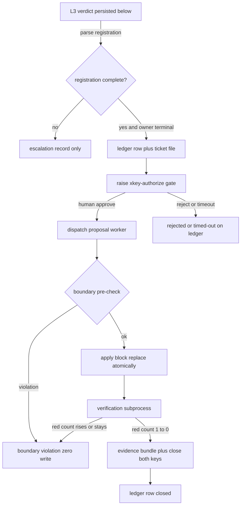

# Design: xkey-repair-mechanism

## §0 设计前提锚定

- spec_path: `.agenticdoc/xkey-repair-mechanism/spec.md`
- spec_locked_at: 2026-09-26T03:55:43Z
- ac_count: 11
- ac_ids: AC-001, AC-002, AC-003, AC-004, AC-005, AC-006, AC-007, AC-008, AC-009, AC-010, AC-011
- 设计调研留底：`evidence/research/design-registration-carrier-20260926.md`(D1) / `design-ledger-ticket-shapes-20260926.md`(D2) / `design-boundary-apply-20260926.md`(D3) / `design-human-only-answer-20260926.md`(D4)；spec 期：`spec-problem-framing-20260926.md` / `spec-code-facts-20260926.md` / `spec-incident-corpus-20260926.md` / `spec-reusable-parts-20260926.md`

---

## §1 架构选型

### D-001 交接登记的承载（写侧机器行 + 读侧并入 provenance sidecar）

**需求摘要**：AC-011 要求跨 key 交接登记从散文升级为机器可读，且对既有散文形兼容。

| 方案 | Pros | Cons |
|---|---|---|
| A. 扩 L3 prompt 要求一行机器行（落在**必含节内**），读侧解析器扫全部 sources | 单点改动（`conductor.py:1113-1127` 是 prompt 唯一构造点）；落在 deciding source ⇒ 现有读取面即可见；不改 `_l3_qualifies:1207` 判定契约 | 需要改 prompt 文本（有既有 prompt 断言测试需同步） |
| B. 让 conductor 新增读 `evidence/runs/**` 的扫描面（KV 行本就写在那里） | 不动 prompt | 扩大读面；runs 目录非"决定源"，与"判定源=deciding_source"的既有语义冲突 |
| C. 独立 sidecar 文件由 L3 worker 另写 | 与 report 解耦 | 新文件 + 新写契约；worker 写什么不由框架控 |

**选择**：`A`
**否决**：`B`（读面外扩 + 语义冲突）、`C`（新写契约且与"文件即真值"的单点相悖）
**理由**：实测 L3 prompt 是纯字符串函数、唯一构造点 `conductor.py:1113-1127`，追加一行机器行即可；且 **KV 行目前只出现在 `evidence/runs/**`，而 conductor 不读该目录**（代价最高的错配）——把机器行放进必含节，才让"写的东西 = 读得到的东西"。
**调研**：`evidence/research/design-registration-carrier-20260926.md`（Q1/Q2/Q3/Q4/Q5）

**读侧落法（同决策）**：
- 新解析器挂在 `_l3_round_verdict:1233` 内，扫**全部** sources（`sources` 构造 `:1254-1258`），沿用 `_l3_resolve_source:1215` 的 fail-closed 语义；
- 结果为**新可选参数**，并入 `_l3_provenance_record:1267`（字段区 `:1294-1305`）→ `_persist_l3_provenance:1359`，**不新增文件**；
- 三条硬约束（实测）：① sidecar 去重键是 `task_key` ⇒ **不可刷新**（`:1385-1388`），故登记是"每轮一次性快照"；② 仅在非 `no-verdict` 轮落盘；③ 跨 key 聚合仍必须新建账本（D-002）。
- **兼容解析规则**：键值对优先（`cross_key_test` / `owner` / `handoff` / `frozen_block`）→ `path::test` 与 owner 形态白名单兜底 → 跨 sources 合并去重；**缺 `(file,test_id)` 或 owner 不可解析到具体 key ⇒ 不提案、只升级**（AC-002/§2.3）；显式禁止把 `兄弟 key` / `PM` / `conductor` 当 `owner_key`，且**不猜 owner**（FM 语料 S-* 中确有这三种角色值）。
- 语料实测 **10 种字形（S-A…S-J）**，其中仅 S-A/S-B 是键值对；S-C/S-E/S-F 为纯散文，抽不出 `(file,test_id)`/`owner_key` ⇒ 按上述降级。

### D-002 跨 key 红账本载体

**需求摘要**：AC-001（幂等去重）/AC-007（重复闭合幂等）/Q9（多窗口并发）/GC-1（文件驱动）/§2.2（增量扫描）。

| 方案 | Pros | Cons |
|---|---|---|
| A. 单一 project-level JSON sidecar（append-only history，整文件 tmp+replace，锁内 RMW） | 机器真值单一；O(1) 去重；原子写简单；复用 provenance 范式 | 整文件重写（规模小时无感） |
| B. 一对象一文件 + 目录枚举 | 写冲突最小；天然 append | 跨对象查询需全目录扫；"一条红的状态"散在多文件 |
| C. 单一 markdown 账本表 | 人可读 | **机器真值不可靠**：已实测截断点 `conductor.py:1076-1089`（P-013） |

**选择**：`A`（账本）+ `B`（工单/证据包：一对象一文件）
**否决**：`C` 作机器真值（可作 render 视图）；`B` 作账本（去重与状态查询成本高）
**理由**：账本的本质是"跨 key 的唯一去重视图"，需要 O(1) 去重与单点状态；工单/证据包是"一对象一文件"的天然形状，且与 gate 目录（seq 重扫 `gates.py:243-256`）同族。
**调研**：`evidence/research/design-ledger-ticket-shapes-20260926.md`（Q1/Q2）

### D-003 工单载体与字段

- **选择**：独立机器可读文件（markdown + frontmatter 形状，仿 gate 协议），**不塞进 gate**——gate payload 承载不下（`question` 限单行、`context_refs` 限单行列表，`gates.py:209-238`），gate 仅用 `context_refs` 指路。
- 字段基线来自两份**实物**（FM XKEY 申请 + A-06 refreeze 申请）逐字提取的 30 字段，关键字段：`request_id`（**由 conductor mint，A-06 那份缺此项**）、`affected_keys`（source/owner）、`test_id`、`frozen_block{file,symbol,line_range,old_block_sha256}`、`untouchable[]`（不可触碰清单）、`拟授权边界`、反向证据要求、`decision`（追认入口）、收口登记。
- **理由**：工单必须机器可判（D-006/D-007 都消费它），又不能把复合 payload 塞进 gate 协议。
- **调研**：`design-ledger-ticket-shapes-20260926.md`（Q3）

### D-004 落点

- **选择**：`.agenticdoc/_autopilot/xkey/`（`ledger.json`、`tickets/`、`evidence/`）
- **否决**：写任何受影响 key 的 `evidence/`——DONE key 不可写、跨 key 无单 owner（实测 FM 现状把 XKEY 件放 `_autopilot/evidence/`，本决策与之一致并升级为结构化形状）
- **调研**：`design-ledger-ticket-shapes-20260926.md`（Q5）

### D-005 修复应用路径：(b) 前置校验，conductor 应用

| 方案 | Pros | Cons |
|---|---|---|
| (a) worker 直接写 + 写后校验 + 快照回滚 | worker 自带编辑能力 | worker 侧对 `write/edit/bash` **零路径强制**（`worker-mode.ts:760-768` 只拦 read 系；`implementation-gate.ts:714-717` 对 `PI_WORKER_TASK` 无条件放行；且该 gate 只认 `<root>/packages/`，**FM 无该树 ⇒ 整 gate 不触发**）；仓内**无回滚原语**（全扫仅 `mw.py:2794-2805` 的 pre-write `.bak`）；越界窗口内文件已被污染 |
| (b) worker 只产**提案文件**，conductor 校验通过后应用 | **零残留由构造保证**（没有"残留"这个状态）；与 `_done_transaction:1715` 的 check-before-write 事务同族 | 需新建行级应用器 |

**选择**：`(b)`；AC-005 的"前置校验 / 快照回滚二路径取一" ⇒ **取前置校验**
**新建件**：行级 block-replace 应用器（~20 行，范式 `mw.py:2054` `_replace_top_level_block`）+ 行集合/字节校验器（D-012 三元组）；锁与原子写现成（`closure.py:123-148`、`gates.py:198`、`mw_common.acquire_lock:1480`）
**调研**：`design-boundary-apply-20260926.md`（Q1/Q2）

### D-006 冻结块定位：混合（机器定位 + 工单声明 + 应用时复核）

- **实跑实验（已成功）**：`fail_line → regex 取 (file, test_id) → ast.FunctionDef(261-271) → 模块级引用唯一命中 TOP_LEVEL_GROUPS → Assign 行范围 243-244`——FM 样本完全机械可解。
- **10 个人造变体 → 5 类不可解**：跨文件常量 / `getattr` 动态引用 / 多常量歧义 / 条件赋值 / 局部遮蔽误判。**任一不过 ⇒ 降级"仅提案"**（R-2 的落地判据）。
- **为何单靠人工声明不够**：FM 手写申请把定位写成"定义见该文件 `:1 附近`"（实为 `:243-244`）；A-06 的 4 路径白名单只到自然语言级。
- **落法**：机器生成 `{file, frozen_symbol, line_range, old_block_sha256}` 写入工单 → 人在 gate 追认（可修正/拒绝）→ **应用时重算**该行范围字节的 sha256，不等即作废（行号漂移/文件被动过都会暴露）。
- **调研**：`design-boundary-apply-20260926.md`（Q3）

### D-007 验证执行路径：conductor 直接 subprocess

- **选择**：conductor 执行（per-project 命令落 `config.json`，P-015）；worker 仅作定位歧义时的诊断旁路。
- **否决**：worker 执行——idle 看门狗默认 10min（`worker-mode.ts:146`），而 **FM 全量套件实测 630.51s**，worker 路径不可靠。
- **落法**：`shell=False` + list argv（范式 `advance.py:164-205`）；原始 stdout/stderr 落 append-only 并自锚 sha（范式 `mw.py:957-1046` run-dir）；超时保留部分输出；红数用 pytest summary 行解析（FM `repair_r1_verify.py:96-99` 先例）；**不复用** `mw_common.scan_build_error_lines:2961`（UE 专用）。
- **边界**：跨 key vs 自身回归的分类**不由本机制做**（spec 边界），仍由 L3/人判断。
- **调研**：`design-boundary-apply-20260926.md`（Q5）

### D-008 仅人可答：入口收窄 + 工具层拦截 + 审计披露

**需求摘要**：AC-004（重写版）；现实约束：人与 PM agent 同 pid、同文件系统权限、同工具层。

| 方案 | Pros | Cons |
|---|---|---|
| (a) 入口收窄（`cmdGate` 加 `ctx.hasUI` 门；worker 模式不注册命令——已具备） | 零 schema 改动；挡 worker 窗口 / print / RPC / 派生 `pi -p` | **挡不住直写 gate 文件**（`gates.py:13-15` 明文"手工改文件也是合法作答"）⇒ 静默成功，无"可观测拒绝" |
| (b) nonce 挑战-响应 | 实现简单 | **无效**：nonce 落盘则同权限 agent 可 `read`/`grep` 取得；不落盘则违反"零私有状态"且重启失效。**零判别力，显式不采用** |
| (c) 双通道二次确认 | 对按键者多一道确认 | 与 C1 同通道；对直写完全无效；phrase 落盘退化为 (b) |
| (d) 纯审计披露 | 诚实、零误报 | 不拒绝任何东西，不能单独满足 AC-004 |
| **(a) + 新建 `tool_call` 写拦截 + (d)** | 唯一能对 agent 作答产生"可观测拒绝"的组合 | 残余面：绕开工具层的同权限进程仍可直写 |

**选择**：`(a) + tool_call 拦截 + (d)`
**否决**：`(b)`（零判别力，不为凑方案入选）、`(c)`（无净收益）
**新建件**：仿 `shared/protected-config.ts:247-269`，禁止 agent 工具层（`write`/`edit`/`bash`）写 gate 目录，fail-closed
**理由**：工具层是 agent 的唯一通道，因此拦截工具层 + 入口收窄即可让"agent 代答"变成可观测拒绝；同时如实披露"判别手段=命令通道+模式门，非密码学证明"
**调研**：`design-human-only-answer-20260926.md`（Q1/Q2/Q3）

### D-009 gate kind 扩展与部署顺序

- **改动清单**（实测最小集）：`gates.py:52`（`GATE_KINDS` 闭集）+ `autopilot/status-model.ts:467`（TS 镜像，放行 `:217/:407/:595` 自动覆盖）+ `conductor.py:274-322`（消费分支）。
- **部署顺序（硬约束）**：旧 TS 窗口遇未知 kind **仅降级显示**（`status-model.ts:663-666` 逐文件 catch；`monitor.ts:150-177` 不校验 kind；作答仍可用）；但**旧 Python conductor 会因 `GateFormatError` 每 tick skip**（`conductor.py:284-288`）⇒ **conductor 必须与 kind 同版本上线**。
- **调研**：`design-human-only-answer-20260926.md`（Q4）

### D-010 挂载点、顺序与 gate flood 守卫

- **消费 xkey 已答 gate**：挂在 `_consume_answered_gates:274`（step F，调用点 `:172`）内。**必须先于 `:211/:214`**——`_apply_stalled_*` 只认 stalled key（`:2190/:2258`），xkey approve 无法经其解冻 key（`:2168`）；两处既存冲突已列（双 pending gate `:2320`、已 stalled 幂等早退 `:2308-2309`），规避方案：消费分支排前，或改走 `timed-out`。
- **聚合扫描**：`_xkey_aggregate` 插在 `orchestrate()` 的 `:214`（`_apply_stalled_rejections`）与 `:216`（`in_flight_keys`）之间，受 `cfg["xkey_repair"]` 门控。
- **位置理由（绑控制流）**：① 在 `_consume_answered_gates`(:172) 之后 ⇒ 已答 gate 先折叠；② 在 `_apply_stalled_*`(:211/:214) 之后 ⇒ 用**本 tick 已生效的终态视图**判 owner 是否终态（AC-002/003 前提）；③ 在派发循环(:224) 之前 ⇒ 本 tick 新抬 gate/新工单可见。
- **幂等/durable/零私有状态**：禁在 `ConductorState` 加内存游标；消费与去重全部从盘重派生（范式 `_consumed_gate_ids:255-272`、`_resume_credits:2168`）。
- **gate flood 一等红线**：抬 gate **必须先 `_gate_open(request_id)` 再 create**，即 `_gate_open:2093` 需扩 **request_id 维度**（实测 6684 条/12h 洪泛的全部成因是缺 durable 消费守卫，`conductor.py:2213-2222`）。
- **调研**：`design-ledger-ticket-shapes-20260926.md`（Q4）、`design-human-only-answer-20260926.md`（Q5）

### D-011 锚定口径：字节 sha 优先于行号

- **实测依据**：`repair-r1-out-20260925-r3.txt` 是**混合换行**（118 CRLF + 106 LF）；同一 `cross_key_test` 行 Python 报 `:220`、PowerShell `Get-Content` 报 `:209`（r1/r2 各为 `:209/:239`）。
- **决策**：工单与证据的全部锚点用 **sha256(字节)**；行号仅作人读提示，不参与任何机械判定。
- **调研**：`design-boundary-apply-20260926.md`（Q4/取证修正）

### D-012 哈希口径（两个副决策之一）

- **冻结块身份** = **字节精确 sha256**（`sha256(line_range 处的原始字节)`，保持 CRLF/LF 原样）；同记录附带 `sha256_eol_normalized`（`mw_common.sha256_eol_normalized:2926`）作跨工具比对副字段。
- **应用时复核**用字节精确值；不等即作废（不尝试归一化后放行）。
- **理由**：P-010 家族（换行翻转会整体污染 diff）；账本/工单同记录两值可让"跨工具漂移"与"真实改动"可区分。
- **调研**：`design-boundary-apply-20260926.md`（Q4）、`design-ledger-ticket-shapes-20260926.md`（开放子口径）

---

## §2 核心结构

```
autopilot/xkey.py                    ← 新模块（纯函数 + 文件原语，无 UI 依赖）
  ├─ parse_registration(source_text) -> Registration | None      # D-001 兼容解析（KV 优先，散文降级）
  ├─ Registration{file, test_id, owner_key, handoff, frozen_block}
  ├─ ledger_load/save/append(row)     -> ledger.json（锁内 RMW，tmp+replace）   # D-002
  ├─ dedup_key(file, test_id, block_sha) -> str                                 # Q8
  ├─ ticket_write(ticket) / tickets_iter()                                      # D-003
  ├─ locate_frozen_block(file, test_id) -> FrozenBlock | Ambiguous               # D-006（AST）
  ├─ check_boundary(proposal, ticket) -> ok | violation                          # D-005/D-012
  ├─ apply_block_replace(file, line_range, new_bytes) -> sha256                  # D-005 新建应用器
  ├─ run_verification(cmd, cwd) -> RunResult{stdout_path, sha, red_counts}       # D-007
  └─ evidence_bundle_write(ticket, artifacts) -> path                            # AC-006

conductor.py（挂载，不搬逻辑）
  ├─ _consume_answered_gates(:274)  → +xkey 分支（先于 :211/:214）               # D-010
  ├─ _xkey_aggregate(...)           → 插在 :214/:216 之间，cfg["xkey_repair"] 门控 # D-010
  ├─ _l3_round_verdict(:1233)       → +解析登记，或参数带进 provenance           # D-001
  ├─ _l3_provenance_record(:1267)   → +新键 registration                        # D-001
  └─ _gate_open(:2093)              → +request_id 维度                          # D-010

config.py / status-model.ts         → +xkey_repair(默认 false) + kind 镜像       # AC-008 / D-009
shared/protected-config.ts 同族      → +xkey 工具层 gate-dir 写拦截              # D-008
```

## §3 模块划分

| 模块 | 职责（单一） | 依赖方向 |
|---|---|---|
| `autopilot/xkey.py` | 登记解析、账本、工单、定位、边界校验、应用、验证执行、证据包（全部纯文件操作） | → `gates.py` / `closure.py` / `mw_common` |
| `conductor.py`（挂载点） | tick 编排：消费已答 gate、聚合扫描、抬 gate；**不含**判定逻辑 | → `xkey.py` |
| `config.py` + `status-model.ts` | 开关与 kind 闭集（双侧镜像） | — |
| TS guard（`protected-config.ts` 同族） | agent 工具层 gate-dir 写拦截 | — |

**禁止**：`xkey.py` 不得 import conductor（避免循环）；conductor 只调用其纯函数。

## §4 接口与集成

### 4.1 对外接口清单（新）

| 接口 | 形状 | 消费方 |
|---|---|---|
| `ledger.json` | `{rows: [{dedup_key, source_key, owner_key, test_id, frozen_block, status, history[]}], updated_at}` | conductor、人、质检 |
| 工单文件 `tickets/xkey-<seq>.md` | frontmatter 30 字段（D-003）+ body 人读 | gate `context_refs`、人、执行器 |
| `xkey-authorize` gate | 复用 12 字段 frontmatter + `context_refs=[ticket_path]` | 人（TUI）；conductor 消费 |
| 配置 `xkey_repair` | bool，默认 false（`_autopilot/config.json`） | conductor `:168` |
| 提案文件 `evidence/<request_id>/proposal.md` | `{file, line_range, old_block_sha256, new_bytes}` 三元组 | 边界校验器 |

### 4.2 外部依赖集成

| 依赖 | 集成方式 |
|---|---|
| L3 判定链 | 只加"解析登记 + 落 sidecar 新键"，不改判定契约（`_l3_qualifies:1207` 不动） |
| gate 协议 | 复用 create/answer/consume；仅扩 kind 闭集与 `_gate_open` 维度 |
| closure 授权范式 | 三条件同族：工单授权快照 ∧ 目标文件 sha 未漂移 ∧ 改动行集合 ⊆ 声明行集合 |
| 项目测试命令 | `config.json` 声明（per-project），conductor subprocess 执行 |

## §5 Function Flow



**异常出口**：登记缺字段 → `E`（只升级）；边界越界 → `I`（零写）；验证未转绿 → `I`；reject/超时 → `G`（留账本，可重开）。

## §6 Coverage Matrix

| ID | 功能点 | 正常路径 | 边界测试 | 异常路径 | 验证层级 |
|---|---|---|---|---|---|
| F1 | 登记解析 | KV 命中（S-A/S-B） | 跨 sources 合并去重 | 纯散文/缺字段 → 升级 | L1 |
| F2 | 账本建账 | 新行写入 | N 次重复扫描幂等 | corrupt 账本不覆盖 | L1 |
| F3 | 工单生成 | 字段齐备 | owner 终态判定 | 无登记 → 0 工单 | L1 |
| F4 | gate 抬起/作答 | 人经 TUI 作答 | worker 模式无命令 | 工具层写拦截 / 无 UI 通道拒绝 | L1+L2 |
| F5 | 提案与边界校验 | 行集合 ⊆ 声明集 | 定位歧义 → 降级仅提案 | 越界（改断言主体）→ 零写 | L1 |
| F6 | 应用 | block replace | 应用前 sha 复核 | sha 漂移 → 作废 | L1 |
| F7 | 验证执行 | 定向复跑绿 | 超时保留部分输出 | 红数上升 → 作废 | L1+L2 |
| F8 | 证据包 | 五字段齐备 | 缺一 → 不闭合 | stdout 缺失 → 不闭合 | L1 |
| F9 | 闭合写回 | 两 key 标注 + closed | 重复闭合幂等 | 中途失败 → 事务重试 | L1 |
| F10 | 开关 | 开启生效 | 关闭零工件 | 未知 config 字段 fail-closed | L1 |
| F11 | flood 守卫 | 单工单单 gate | N tick gate 数不增 | 重复抬 gate 被 request_id 挡住 | L1 |

## §7 Verification Contract

```
VC-001: 当同一 (file,test_id,冻结块指纹) 被重复扫描 N 次时，ledger.json 中该 dedup_key 记录数必须等于 1
       Layer: L1
       Output: [VERIFY] VC-001: ledger_rows=1 dup_scans=N
       Source: AC-001

VC-002: 当红无登记（缺 file/test_id 或 owner 不可解析到具体 key）时，tickets 目录新增文件数必须等于 0 且 escalations 记录数必须等于 1
       Layer: L1
       Output: [VERIFY] VC-002: tickets=0 escalations=1
       Source: AC-002

VC-003: 当工单生成且尚未追认时，被涉及文件的 sha256 必须等于工单创建时记录的 sha256
       Layer: L1
       Output: [VERIFY] VC-003: target_sha_unchanged=True
       Source: AC-003

VC-004: 当 worker 模式窗口或无 UI 通道尝试作答时，gate 状态必须保持 pending；当 agent 工具层写入 gate 目录时，gate 文件 sha256 必须不变且拦截记录数必须等于 1
       Layer: L1+L2
       Output: [VERIFY] VC-004: answer_rejected=1 gate_pending=True interception=1
       Source: AC-004

VC-005: 当提案触碰行集合超出工单声明行集合时，应用次数必须等于 0、被涉及文件 sha256 必须等于工单创建时的 sha256、工单状态必须不等于 applied
       Layer: L1
       Output: [VERIFY] VC-005: applied=0 target_sha_unchanged=True status=boundary_violation
       Source: AC-005

VC-006: 当证据包缺五项中任一项时，工单 closed 必须等于 False；五项齐备时 closed 必须等于 True
       Layer: L1
       Output: [VERIFY] VC-006: evidence_fields=5 closed=True
       Source: AC-006

VC-007: 当工单闭合后，ledger 该行 status 必须等于 closed、受影响两 key 的登记标注数必须等于 2；重复闭合后 ledger 行数必须不变
       Layer: L1
       Output: [VERIFY] VC-007: ledger_status=closed closures=2 idempotent=True
       Source: AC-007

VC-008: 当 xkey_repair 关闭时，xkey 目录新增工件数必须等于 0 且既有 conductor 相关测试必须全绿
       Layer: L1
       Output: [VERIFY] VC-008: xkey_artifacts=0 existing_tests_green=True
       Source: AC-008

VC-009: 当 fixture 全链重放完成后，fixture 冻结断言红数必须由 1 变为 0 且工单状态序列必须覆盖 detected→closed
       Layer: L2
       Output: [VERIFY] VC-009: fixture_red=1->0 chain=detected>ticketed>approved>applied>verified>closed
       Source: AC-009

VC-010: 当 FM 语料 fixture 重放并人工追认后，tests/test_hitl_channel.py 红数必须由 1 变为 0、全量红数由 1 变为 0，且证据必须含 old/new sha256 与 relaxed_assertion=False
       Layer: L2
       Output: [VERIFY] VC-010: fm_replay_red=0 relaxed_assertion=False
       Source: AC-010

VC-011: 当对 10 种字形语料运行解析时，键值对字形的解析字段必须与人工判读逐字段一致、散文字形必须全部降级为 escalate
       Layer: L1
       Output: [VERIFY] VC-011: shapes=10 fields_match=True prose_escalated=3
       Source: AC-011

VC-012: 当同一个 pending 工单经过 N 个 tick 时，为该工单生成的 xkey-authorize gate 文件数必须等于 1
       Layer: L1
       Output: [VERIFY] VC-012: gates_for_ticket=1 ticks=N
       Source: AC-003
```

## §8 AC → VC 映射表

| AC ID | AC 摘要 | 对应 VC | 路径分类 |
|---|---|---|---|
| AC-001 | 账本幂等去重 | VC-001 | 正常 |
| AC-002 | 无登记只升级不提案 | VC-002 | 异常 |
| AC-003 | 工单生成 + 未授权零写 | VC-003, VC-012 | 正常 + 边界 |
| AC-004 | 仅人可答（重写版） | VC-004 | 异常 |
| AC-005 | 边界越界零残留 | VC-005 | 异常 |
| AC-006 | 证据包五项 | VC-006 | 边界 |
| AC-007 | 闭合与幂等 | VC-007 | 正常 |
| AC-008 | 开关默认关零扰动 | VC-008 | 边界 |
| AC-009 | fixture 全链重放 | VC-009 | 正常 |
| AC-010 | FM 语料重放 | VC-010 | 正常 |
| AC-011 | 登记机器可读化 + 散文兼容 | VC-011 | 边界 |

## §9 非功能实现方案

- **性能**（§2.2）：聚合只读"本 tick 未建账的 below 记录"，用账本 `dedup_key` 做 O(1) 去重 ⇒ O(新增 verdict 数)；账本 load O(行数) + 命中零写；`_gate_open` 一次 `enumerate`（O(gate 数)）。
- **安全**（§2.3）：解冻权只给人（D-008 组合实现 + 残余面披露）；无授权零写（AC-003）；越界零残留（D-005 前置校验）；无登记不提案（D-001 降级规则，显式禁止猜 owner）。
- **可观测性**：timeline 新增事件 `xkey-detected` / `xkey-ticketed` / `xkey-gate-raised` / `xkey-applied` / `xkey-boundary-violation` / `xkey-closed`；账本每行 `history[]` 记录状态迁移（时间 + 通道 + 证据引用）。
- **部署**：conductor 与 gate kind 同版本上线（D-009）；开关落 `config.json`（P-015），默认 false。

## §10 决策记录

| D-ID | 决策点 | 选择 | 否决 | 理由 |
|---|---|---|---|---|
| D-001 | 登记承载 | L3 prompt 一行机器行 + 读侧解析并入 sidecar | 新读面 / 独立 sidecar | 写的东西必须落在读得到的面上 |
| D-002 | 账本载体 | 单 JSON sidecar + 锁内 RMW | markdown 表 / 一对象一文件 | 机器真值须可靠、去重 O(1) |
| D-003 | 工单载体 | 独立文件（30 字段） | 塞进 gate payload | gate payload 单行限制承载不下 |
| D-004 | 落点 | `_autopilot/xkey/` | 受影响 key 的 evidence/ | DONE key 不可写、跨 key 无 owner |
| D-005 | 应用路径 | (b) conductor 前置校验后应用 | (a) worker 直写 + 回滚 | 写面零强制、无回滚原语；零残留由构造保证 |
| D-006 | 冻结块定位 | 混合（机器 AST + 工单声明 + 字节复核） | 纯启发式 / 纯人工声明 | 启发式有 5 类不可解；人写不出精确行范围 |
| D-007 | 验证执行 | conductor subprocess | worker 执行 | 630s 套件撞 10min idle 看门狗 |
| D-008 | 仅人可答 | 入口收窄 + tool_call 拦截 + 审计披露 | nonce / 纯审计 | nonce 零判别力；纯审计不拒绝 |
| D-009 | kind 扩展 | 两侧镜像 + conductor 同版本 | 只改一侧 | 旧 Python conductor 会每 tick skip |
| D-010 | 挂载与顺序 | step F 消费 + :214/:216 聚合 + request_id 去重 | 放宽 gate 去重 | 6684/12h 洪泛红线 |
| D-011 | 锚定口径 | 字节 sha | 行号 | 混合换行使行号漂移（:220 vs :209） |
| D-012 | 哈希口径 | 字节精确 sha + EOL 归一化副字段 | 只归一化 | 区分"跨工具漂移"与"真实改动" |

## §11 实现回填（design 与代码对齐，2026-09-26 执行期）

以下三条是实现落地时定下的口径，**不改决策**，只消歧（依据 `autopilot/xkey.py` 实码 + T-01/T-02 报告）：

1. **`apply_block_replace` 返回新块 sha**（非新文件 sha）—— 目标文件整体 sha 另存于账本/证据包（`old_sha256`/`new_sha256` 快照），二者职责不同：块 sha 管边界复核，文件 sha 管零残留判据。
2. **证据包槽位拆细**：`old_sha256` / `new_sha256` / `reason` / `relaxed_assertion` / `verify_cmd` / `stdout_path`（须存在）/ `red_before` / `red_after`，另有 `bundle.json` + `closed` + `missing[]`。AC-006 的"五项"是**语义**五项，允许槽位拆细。
3. **`locate_frozen_block` 返回额外带 `sha256_eol_normalized`**（与 D-012 一致）；实现实测：FM `tests/test_hitl_channel.py` + 正确 test_id ⇒ `{symbol: TOP_LEVEL_GROUPS, line_range: [243,244], old_block_sha256: 0d08581d…}`；test_id 不匹配 ⇒ `None`（fail-closed 降级已验证）。

另：`run_verification` 超时保留部分输出；账本损坏时 **raise 且不覆盖**（已实现，与 AC-001 的"不覆盖"一致）。

4. **T-03 形状妥协（接受）**：`_l3_round_verdict` 的 4-tuple arity 被既有测试 `test_frozen_anchors_and_criteria_unchanged` 冻结，故登记经**新的 `registration_out` sink 参数**传出（语义不变，不改 arity）；`_xkey_aggregate` 实际签名为 `(project_root, st, status_of, cfg)`（需 `status_of` 判 owner 终态）。
5. **AC-007 的"两个受影响 key 的登记标注"写进账本行本身**（`source` 的交接登记 + `owner` 的遗留登记两处标注），**不写任何受影响 key 的文件**——否则与 D-004（DONE key 不可写、跳 key 无单 owner）相抵。幂等 = 重复闭合不新增行、不重复标注。
6. **应用前快照 + 验证失败回滚（T-06 阶段）**：D-005 选的"前置校验"只能保证**边界违规**时零残留（在写盘前就拒）。写盘后的**验证未转绿**是另一条失败路径，此时采 **`pre-apply.bak` 字节快照还原**（还原后校验 sha256 == 工单创建时值）+ 状态 `verify_failed` + **不得闭合**。即：前置校验主路 + 快照回滚兼底路，AC-005 的"二路径取一"在**边界违规**上取前置校验，在**验证失败**上取快照还原。
7. **TS config 镜像缺口**（T-03 发现，已核实）：`status-model.ts:118/:122` 以 `DEFAULT_CONFIG` 键集做未知字段 fail-closed ⇒ Python 侧写入 `xkey_repair` 会让 TS 报非法并丢弃该键。已交 T-04b 补齐（三键逐字镜像 `config.py` 语义，不放宽既有校验）。
